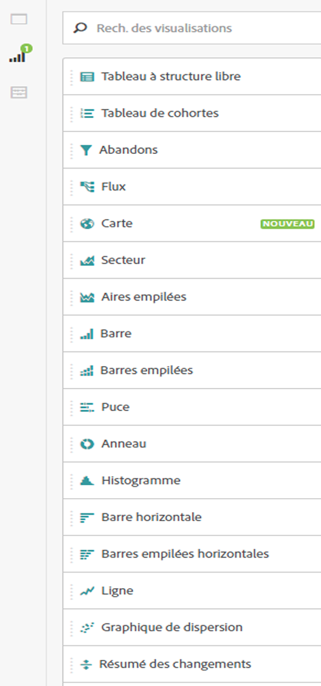
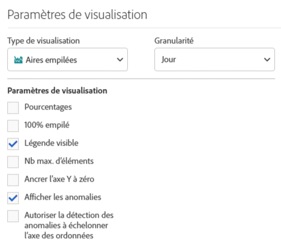
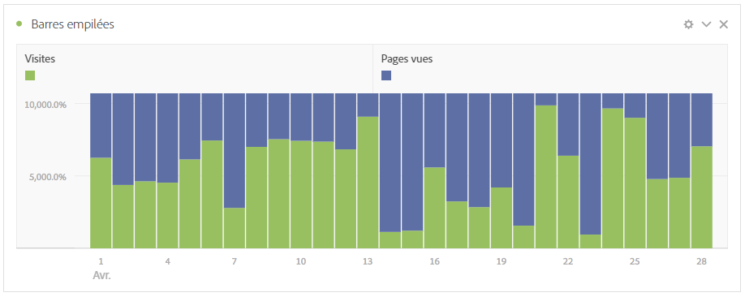
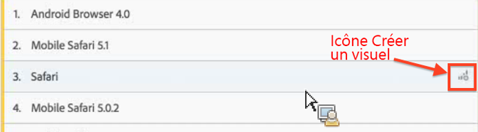
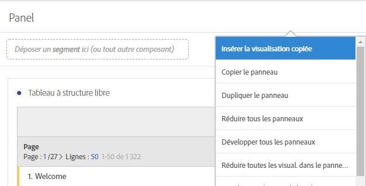
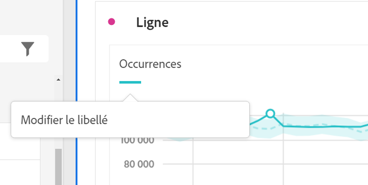

# Visualisations - Aperçu

Découvrez les visualisations et les paramètres de visualisation d’Analysis Workspace.

[Types de visualisation dans Analysis Workspace sur YouTube](https://www.youtube.com/watch?v=b1zLEywRa6w&amp;index=39&amp;list=PL2tCx83mn7GuNnQdYGOtlyCu0V5mEZ8sS) (2:57)

## Panneau Visualisations {#section_DC07F032FBEF4046A40F7B95C28DA018}

Pour afficher le panneau Visualisations, cliquez sur **[!UICONTROL Visualisations]** dans le panneau latéral.

Si vous utilisez Adobe Analytics, vous connaissez sans doute déjà la plupart des types de visualisation (les graphiques de surface, à barres, en anneau, en courbes). Néanmoins, Analysis Workspace fournit des paramètres de visualisation et de nombreux types de visualisation nouveaux ou uniques, dotés de fonctionnalités interactives.

## Paramètres de visualisation {#section_D3BB5042A92245D8BF6BCF072C66624B}

Pour accéder aux [!UICONTROL Paramètres de visualisation], faites glisser une visualisation sur le [!UICONTROL panneau Structure libre], puis cliquez sur l’icône d’engrenage [!UICONTROL Paramètres de visualisation].

>[!IMPORTANT]
>
>Les paramètres de visualisation visibles dépendent de la visualisation. Tous les paramètres ne s’appliquent pas à toutes les visualisations. En outre, certains paramètres avancés, tels les [paramètres d’histogramme](/help/analyze/analysis-workspace/visualizations/histogram.md#section_09D774C584864D4CA6B5672DC2927477), apparaissent **uniquement** pour certaines visualisations.

<table id="table_E0695243886046979EE609FAE5D6EA00"> 
 <thead> 
  <tr> 
   <th colname="col1" class="entry"> Paramètre </th> 
   <th colname="col2" class="entry"> Description </th> 
  </tr> 
 </thead>
 <tbody> 
  <tr> 
   <td colname="col1"> 
Pourcentages 
 </td> 
   <td colname="col2"> 
Affiche les valeurs en pourcentages. 
 </td> 
  </tr> 
  <tr> 
   <td colname="col1"> 
100 % empilé 
 </td> 
   <td colname="col2"> 
Ce paramètre appliqué aux graphiques à zones empilées, à barres empilées ou à barres horizontales empilées offre un aperçu « 100 % empilé » du diagramme. Exemple : 
 
 
 </td> 
  </tr> 
  <tr> 
   <td colname="col1"> 
Légende visible 
 </td> 
   <td colname="col2"> 
Permet de masquer le texte des détails du filtre pour la visualisation Synthèse des chiffres/Résumé des changements. 
 </td> 
  </tr> 
  <tr> 
   <td colname="col1"> 
Nb max. d’éléments 
 </td> 
   <td colname="col2"> 
Permet de limiter le nombre d’éléments affichés dans une visualisation. 
 </td> 
  </tr> 
  <tr> 
   <td colname="col1"> 
Axe Y de l’ancre à zéro 
 </td> 
   <td colname="col2"> 
 Si toutes les valeurs mappées dans le graphique sont considérablement supérieures à zéro, le seuil de l’axe des ordonnées est par défaut NON NUL. Si cette option est activée, l’axe des ordonnées est obligatoirement ancré à zéro (et le graphique est retracé). 
 </td> 
  </tr> 
  <tr> 
   <td colname="col1"> 
Normalisation 
 </td> 
   <td colname="col2"> 
Force les mesures en proportions égales. Voir <a href="https://marketing.adobe.com/resources/help/fr_FR/reference/normalization.html"  > Normalisation</a>. 
 </td> 
  </tr> 
  <tr> 
   <td colname="col1"> 
Afficher l’axe double 
 </td> 
   <td colname="col2"> 
S’applique seulement s’il existe deux mesures : vous pouvez afficher un axe des ordonnées sur la gauche (pour une mesure) et un sur la droite (pour l’autre mesure). 
 </td> 
  </tr> 
  <tr> 
   <td colname="col1"> 
Afficher les anomalies 
 </td> 
   <td colname="col2"> 
Affine les graphiques linéaires et les tableaux à structure libre afin d’afficher les anomalies des données. 
 </td> 
  </tr> 
 </tbody> 
</table>

## Icône Créer un visuel {#section_9C11D9DEDC42413AA53E69A71A509DFC}

Si vous ne savez pas quelle visualisation choisir, cliquez sur l’icône **[!UICONTROL Créer un visuel]** dans une ligne de tableau. Cette icône s’affiche quand vous pointez sur la ligne du tableau. Analysis Workspace s’affiche alors et détermine quelle visualisation serait la mieux adaptée à vos données. Si, par exemple, trois segments sont sélectionnés, un diagramme de Venn est créé. S’il y a plus de trois segments, un graphique à barres est créé. Pour d’autres types de données, cela peut aussi être un graphique linéaire, etc.

## Clic droit sur le menu Visualisation/Panneau {#section_05B7914D4C9E443F97E2BFFDEC70240C}

Les paramètres qui dépendent d’un graphique sont accessibles en cliquant avec le bouton droit de la souris près d’un en-tête de visualisation. Certains ou tous les paramètres suivants sont disponibles :

| Paramètre | Description |
|--- |--- |
| Insérer une visualisation/un panneau copié | Permet de coller (« insérer ») l’élément copié à un autre emplacement du projet, ou dans un tout autre projet. |
| Copier une visualisation/un panneau | Permet d’effectuer un clic droit et de copier une visualisation ou un panneau. |
| Dupliquer une visualisation/un panneau | Crée un double exact de la visualisation actuelle, que vous pouvez ensuite modifier. |
| Réduire tous les panneaux | Réduit tous les panneaux du projet. |
| Réduire toutes les visualisations dans le panneau | Réduit toutes les visualisations dans ce panneau de projet. |
| Développer tous les panneaux | Développe tous les projets du panneau. |
| Développer toutes les visualisations dans le panneau | Développe toutes les visualisations dans ce panneau de projet. |
| Modifier la description | Permet d’ajouter (ou de modifier) une description textuelle de la visualisation ou du panneau. Cette description s’affiche sous Projet > Informations et paramètres du projet. |
| Obtenir un lien vers le panneau | Permet de renvoyer un utilisateur vers un panneau spécifique dans un projet. |
| Obtenir le lien de la visualisation | Permet de copier et de partager le lien pour permettre à d’autres personnes d’accéder directement à cette visualisation. Les utilisateurs devront se connecter. |
| Recommencer | (Flux, diagramme de Venn, histogramme) Permet de supprimer la configuration de la visualisation actuelle et ouvre un nouveau panneau d’où vous pouvez la reconfigurer. |

## Modifier des étiquettes de légende {#section_94F1988CB4B9434BA1D9C6034062C3DE}

Permet de renommer les séries dans les légendes de visualisation (Abandons, Surface, Aires empilées, Barre, Barres empilées, Anneau, Histogramme, Barre horizontale, Barres empilées horizontales, Ligne, Graphique de dispersion et Venn) afin de créer un environnement plus convivial.

**Il n’est pas** possible de modifier les légendes pour les visualisations suivantes : Treemap, Puce, Résumé des changements, Synthèse des chiffres, Texte, Structure libre, Histogramme, Cohorte ou Flux.

Par exemple, pour modifier une étiquette de légende dans un graphique en ligne :

1. Effectuez un clic droit sur l’une des étiquettes de légende.
1. Cliquez sur **[!UICONTROL Modifier l’étiquette]**.

   

1. Saisissez le nouveau texte de l’étiquette.
1. Appuyez sur **[!UICONTROL Entrée]** pour enregistrer.

Suivez le [lien vers la vidéo](https://www.youtube.com/watch?v=mry3vDrTml0&amp;index=61&amp;list=PL2tCx83mn7GuNnQdYGOtlyCu0V5mEZ8sS) relative à cette rubrique.
