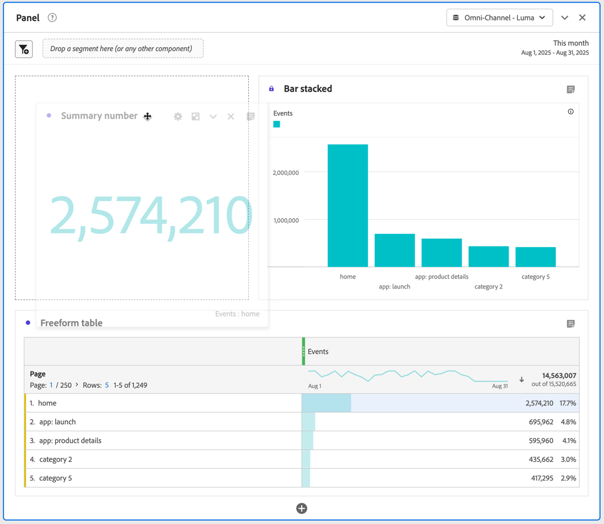

# Visualisations - Aperçu

Workspace offre une variété de visualisations pour créer des représentations visuelles de vos données. Par exemple, des graphiques à barres, des graphiques en anneau, des histogrammes, des graphiques en courbes, des cartes, des nuages de points, etc.

## Types

Voici les types de visualisation disponibles dans Analysis Workspace :

| Icône | Nom | Description |
| :---: | --- | ---| 
|  | [Surface](/help/analyze/analysis-workspace/visualizations/area.md) | Visualisation sous forme de graphique de surface. Semblable à un graphique linéaire, mais avec une zone colorée sous la ligne. Utilisez un diagramme de surface si vous avez plusieurs mesures et souhaitez visualiser la zone exprimée par l’intersection de plusieurs mesures. |
|  | [Barre](/help/analyze/analysis-workspace/visualizations/bar.md) | Visualisation Graphique à barre avec des barres verticales représentant plusieurs valeurs pour une ou plusieurs mesures. |
|  | [Barres empilées](/help/analyze/analysis-workspace/visualizations/bar.md) | Visualisation Graphique à barres empilées avec des barres verticales représentant plusieurs valeurs pour une ou plusieurs mesures. |
| 
 | [Puces](/help/analyze/analysis-workspace/visualizations/bullet-graph.md) | Visualisation Graphique à puces affichant comment comparer ou mesurer une valeur qui vous intéresse par rapport à d’autres plages de performances (objectifs). |
|  | [Table de cohorte](/help/analyze/analysis-workspace/visualizations/cohort-table/cohort-analysis.md) | Une visualisation Cohorte est un groupe de personnes partageant des caractéristiques communes au cours d’une période spécifique. Une table de cohorte est utile pour les analyses de la rétention, de lʼattrition ou de la latence. |
|  | [Combo](combo-charts.md) | Une visualisation Graphique combo facilite la création rapide d’une visualisation de comparaison sans qu’il soit nécessaire de créer un tableau au préalable. |
|  | [Anneau](/help/analyze/analysis-workspace/visualizations/donut.md) | Similaire à un graphique en secteurs, la visualisation en anneau présente les données comme des portions ou des segments d’un tout. |
|  | [Abandon](/help/analyze/analysis-workspace/visualizations/fallout/fallout-flow.md) | La visualisation Abandons indique où les personnes sont sorties (abandonné) d’une suite prédéfinie de pages et où elles ont poursuivi leur visite à travers ces pages (diminution). |
|  | [Flux](/help/analyze/analysis-workspace/visualizations/c-flow/flow.md) | La visualisation Flux présente les parcours exacts des clientes et clients sur vos sites web et dans vos applications. |
| 
 | [Tableau à structure libre](/help/analyze/analysis-workspace/visualizations/freeform-table/freeform-table.md) | Une visualisation Tableau à structure libre est une visualisation interactive. La visualisation Tableau à structure libre est la base de l’analyse des données dans Workspace. |
|  | [Histogramme](/help/analyze/analysis-workspace/visualizations/histogram.md) | Une visualisation Histogramme regroupe les personnes, les visites ou les événements en intervalles en fonction dʼun volume de mesure. |
|  | [Barre horizontale](/help/analyze/analysis-workspace/visualizations/horizontal-bar.md) | Visualisation Barres horizontales affichant des barres verticales représentant plusieurs valeurs pour une ou plusieurs mesures. |
|  | [Barres empilées horizontales](/help/analyze/analysis-workspace/visualizations/horizontal-bar.md) | Visualisation Barres horizontales empilées affichant des barres horizontales représentant plusieurs valeurs pour une ou plusieurs mesures. |
|  | [Résumé des mesures clés](/help/analyze/analysis-workspace/visualizations/key-metric.md) | Une visualisation Résumé des mesures clés combine les visualisations Ligne, Synthèse des modifications et Synthèse des chiffres. |
|  | [Ligne](/help/analyze/analysis-workspace/visualizations/line.md) | Une visualisation Ligne représente les mesures sous la forme d’une ligne afin d’indiquer l’évolution des valeurs dans le temps. Un graphique en courbes utilise le temps le long de lʼaxe X. |
|  | [Carte](/help/analyze/analysis-workspace/visualizations/map-visualization.md) | Permet de créer un mappage visuel de n’importe quelle mesure (y compris les mesures calculées) |
|  | [Dispersion](/help/analyze/analysis-workspace/visualizations/scatterplot.md) | Une visualisation Graphique de dispersion illustre la relation entre des éléments de dimension et trois mesures au maximum. |
|  | [En-tête de section](section-header.md) | Pour identifier et articuler des sections dans un panneau. |
|  | [Résumé des changements](/help/analyze/analysis-workspace/visualizations/summary-number-change.md) | Une visualisation Synthèse des modifications affiche la modification entre les cellules sélectionnées sous la forme d’un grand nombre ou d’un pourcentage. |
| 
 | [Numéro de résumé](/help/analyze/analysis-workspace/visualizations/summary-number-change.md) | Une visualisation Synthèse des chiffres affiche la cellule sélectionnée sous la forme d’un grand nombre. |
|  | [Texte](/help/analyze/analysis-workspace/visualizations/text.md) | Une visualisation Texte permet d’ajouter du texte défini par l’utilisateur ou l’utilisatrice dans Workspace. Utile pour ajouter du contexte supplémentaire à votre analyse et à vos informations, en plus de tirer parti des descriptions des panneaux/visualisations. |
|  | [Plan en arborescence](/help/analyze/analysis-workspace/visualizations/treemap.md)
 | Une visualisation Treemap présente les données hiérarchiques (structurées en arborescence) sous la forme d’un ensemble de rectangles imbriqués. |
|  | [Venn](/help/analyze/analysis-workspace/visualizations/venn.md) | Une visualisation Venn utilise des cercles pour représenter le chevauchement des mesures dʼun maximum de trois segments. |

<!--

| Name| Icon | Description |
| --- |:---: | ---|
| [Area](/help/analyze/analysis-workspace/visualizations/area.md)|
 | Like a line graph, but with a colored area below the line. Use an area graph when you have multiple metrics and want to visualize the area expressed by the intersection of two or more metrics. |
| [Bar](/help/analyze/analysis-workspace/visualizations/bar.md)|
 | Shows vertical bars representing various values across one or more metrics. |
| [Bullet graph](/help/analyze/analysis-workspace/visualizations/bullet-graph.md)|
 | Shows how a value you are interested in compares to or measures against other performance ranges (goals). |
| [Cohort table](/help/analyze/analysis-workspace/visualizations/cohort-table/cohort-analysis.md)|
 | A *`cohort`* is a group of people sharing common characteristics over a specified period. Cohort Analysis is useful for retention, churn or latency analysis. |
| [Donut](/help/analyze/analysis-workspace/visualizations/donut.md) | 
 | Similar to a pie chart, this visualization shows data as parts or segments of a whole. |
| [Fallout](/help/analyze/analysis-workspace/visualizations/fallout/fallout-flow.md) | 
 | Fallout reports show where visitors left (fell out) and continued through (fell through) a predefined sequence of pages. Can be set to eventual or exact sequences |
| [Flow](/help/analyze/analysis-workspace/visualizations/c-flow/flow.md) | 
 | Shows exact customer paths through your websites and apps. |
| [Freeform table](/help/analyze/analysis-workspace/visualizations/freeform-table/freeform-table.md) | 
 | A Freeform table is not merely a data table, but also an interactive visualization. It is the foundation for data analysis in Workspace.|
| [Histogram](/help/analyze/analysis-workspace/visualizations/histogram.md) | 
 | A histogram buckets visitors, visits or hits into buckets based on a metric volume. |
| [Horizontal bar](/help/analyze/analysis-workspace/visualizations/horizontal-bar.md) | 
 | Shows horizontal bars representing various values across one or more metrics. |
| [Key metric summary](/help/analyze/analysis-workspace/visualizations/key-metric.md) | 
 | Shows how a metric is trending within a single timeframe, or lets you compare metric performance across two timeframes. |
| [Line](/help/analyze/analysis-workspace/visualizations/line.md) | 
 | Represents metrics using a line in order to show how values change over a period of time. A line chart uses time along the x-axis. |
| [Map](/help/analyze/analysis-workspace/visualizations/map-visualization.md) | 
 | Lets you build a visual map of any metric (including calculated metrics). |
| [Scatterplot](/help/analyze/analysis-workspace/visualizations/scatterplot.md) | 
 | Shows the relationship between dimension items and up to three metrics. |
| [Summary number](/help/analyze/analysis-workspace/visualizations/summary-number-change.md) | 
 | Shows the selected cell as 1 large number. |
| [Summary change](/help/analyze/analysis-workspace/visualizations/summary-number-change.md) | 
 | Shows the change between the selected cells as 1 large number/percent. |
| [Text](/help/analyze/analysis-workspace/visualizations/text.md) | 
 | Lets you add user-defined text to your Workspace. Helpful for adding additional context to your analysis and insights, in addition to leveraging panel/visualization descriptions |
| [Treemap](/help/analyze/analysis-workspace/visualizations/treemap.md) | 
 | Displays hierarchical (tree-structured) data as a set of nested rectangles. |
| [Venn](/help/analyze/analysis-workspace/visualizations/venn.md) | 
 | Uses circles to depict the metric overlap of up to 3 segments. |

-->

## Ajouter des visualisations à un panneau

1. Ouvrez le projet Analysis Workspace auquel vous souhaitez ajouter une visualisation.

1. Utilisez l’une des méthodes suivantes pour ajouter la visualisation :

   

   * Dans le panneau de gauche, sélectionnez  **Visualisations**, puis faites glisser une visualisation vers le panneau auquel vous souhaitez l’ajouter.

   * Dans le panneau à l’emplacement duquel vous souhaitez ajouter la visualisation, sélectionnez , puis choisissez l’icône qui représente la visualisation à ajouter. Pointez sur l’icône pour chaque visualisation afin d’afficher le nom.

   * Ajoutez un [panneau vierge](/help/analyze/analysis-workspace/c-panels/blank-panel.md), puis sélectionnez la visualisation à ajouter.

   * Dans le menu contextuel d’une visualisation existante dans votre projet Analysis Workspace, sélectionnez **[!UICONTROL Dupliquer la visualisation]** ou **[!UICONTROL Copier la visualisation]**.

   * Utilisez le menu Workspace **[!UICONTROL Insérer]** pour insérer une visualisation.

   * Dans le menu contextuel d’un tableau à structure libre, sélectionnez **[!UICONTROL Visualiser]**. Sélectionnez ensuite la visualisation dans le sous-menu. En fonction de la sélection en cours dans le tableau, Workspace détermine la visualisation à proposer et interprète les données pour créer la visualisation demandée.

Lorsque vous ajoutez une visualisation simple, par exemple une visualisation [Ligne](line.md) de [Barre](bar.md), la visualisation utilise le tableau à structure libre le plus proche comme source de données. Vous pouvez toujours modifier la [source de données](#data-source) d’une de vos visualisations.

## Gestion des visualisations

Vous pouvez gérer une visualisation en pointant la souris sur la visualisation ou en la sélectionnant.

* Pour réduire une visualisation, sélectionnez .
* Pour afficher une visualisation réduite, sélectionnez .
* Pour supprimer une visualisation, sélectionnez . Pour annuler, sélectionnez **[!UICONTROL Modifier]** > **[!UICONTROL Annuler]** (**[!UICONTROL *cmd+z *]**|**[!UICONTROL * ctrl+z *]**).
* Pour rétablir la hauteur par défaut d’une visualisation, sélectionnez .
* Pour déplacer une visualisation dans un panneau, faites-la glisser et déposez-la chaque fois qu’une  est visible (généralement lorsque vous passez la souris sur l’en-tête).

## Légende

Une légende de visualisation vous permet de relier les données dʼun tableau source à une série tracée dans la visualisation. La légende est interactive : vous pouvez sélectionner un élément de légende pour afficher/masquer une série dans la visualisation, ce qui s’avère utile si vous souhaitez simplifier les données visualisées.

De plus, vous pouvez renommer les étiquettes de légende pour rendre les visuels plus exploitables. Remarque : **il nʼest pas** possible de modifier les légendes des visualisations Treemap, Puce, Résumé des changements, Synthèse des chiffres, Texte, Structure libre, Histogramme, Cohorte ou Flux.

Pour modifier une étiquette de légende :

1. Effectuez un clic droit sur l’une des étiquettes de légende.
1. Cliquez sur **[!UICONTROL Modifier l’étiquette]**.

   

1. Saisissez le nouveau texte de l’étiquette.
1. Appuyez sur **[!UICONTROL Entrée]** pour enregistrer.

## Paramètres

Chaque visualisation possède ses propres paramètres. Pour accéder aux paramètres de visualisation, sélectionnez  **[!UICONTROL Paramètres]** dans l’en-tête de visualisation pour afficher une fenêtre contextuelle.

Selon la visualisation, vous pouvez configurer :

* des détails sur la source de données de la visualisation via l’onglet [**[!UICONTROL Source de données]**](#data-source), et
* les paramètres de la visualisation via l’onglet [**[!UICONTROL Paramètres]**](#settings-1).

### Source de données

Vous pouvez contrôler la source de données et les éléments ou positions de cette source de données qui correspondent à une visualisation. Pour plus d’informations, consultez [Gérer des sources de données](t-sync-visualization.md).

### Paramètres

La disponibilité des paramètres de visualisation dépend de la visualisation. Le tableau ci-dessous résume les paramètres les plus courants. Certaines visualisations comportent des paramètres spécifiques. Pour en savoir plus, consultez la documentation sur les visualisations individuelles.

| Option | Description |
| --- | --- |
| **[!UICONTROL Type de visualisation]** | Modifiez le type de visualisation utilisée pour représenter les données. |
| **[!UICONTROL Granularité]** | Modifiez la granularité temporelle des visualisations de tendances. Cette modification sʼapplique également au tableau de source de données. |
| **[!UICONTROL Pourcentages]** | Affichez les valeurs en pourcentages. |
| **[!UICONTROL Empilé à 100 %]** | Transformez le graphique en une visualisation empilée à 100 %.  Applicable uniquement pour une visualisation empilée sous forme de surface, barre et barre horizontale. |
| **[!UICONTROL Légende visible]** | Affichez le texte de la légende. |
| **[!UICONTROL Nombre max d’éléments]** | Limitez le nombre d’éléments affichés dans une visualisation. Lorsque cette option est sélectionnée, définissez le nombre maximal d’éléments. |
| **[!UICONTROL Afficher les annotations]** | Affichez les annotations effectuées pour cette visualisation. |
| **[!UICONTROL Masquer le titre]** | Masquez le titre de la visualisation. |
| **[!UICONTROL Faire commencer l’axe Y sur zéro]** | Forcez le bas de l’axe Y à zéro. Si toutes les valeurs mappées dans le graphique sont considérablement supérieures à zéro, le seuil de l’axe Y est par défaut non nul. Si vous activez cette option, l’axe Y est forcé à zéro (et le graphique est redessiné). |
| **[!UICONTROL Afficher l’axe double]** | Affichez les axes Y gauche et droit pour deux mesures différentes. Cette option s’applique uniquement si vous disposez de deux mesures. Les axes doubles sont utiles lorsque les mesures tracées sont de magnitudes différentes. |
| **[!UICONTROL Afficher l’axe X]** | Affichez l’axe X dans la visualisation. |
| **[!UICONTROL Afficher l’axe Y]** | Affichez l’axe Y dans la visualisation. |
| **[!UICONTROL Afficher les haltères sur les lignes]** | Affichez les haltères sur la visualisation linéaire dans une visualisation Combo. |
| **[!UICONTROL Normalisation]** | Forcez les mesures en proportions égales. Les proportions égales sont utiles lorsque les mesures tracées sont de magnitudes différentes. |
| **[!UICONTROL Afficher les anomalies]** | Améliorez les graphiques linéaires et les tableaux à structure libre en affichant la détection des anomalies. La détection des anomalies dans les visualisations linéaires comprend une valeur attendue (ligne en pointillé) et une plage attendue (bande ombrée). |
| **[!UICONTROL Afficher la prévision]** | Améliorez les graphiques linéaires et les tableaux à structure libre en affichant la détection des anomalies. |
| **[!UICONTROL Afficher la valeur minimale]** | Affichez la valeur minimale dans la visualisation. |
| **[!UICONTROL Afficher la valeur maximale]** | Affichez la valeur maximale dans la visualisation. |
| **[!UICONTROL Afficher la courbe de tendance]** | Affichez une courbe de tendance dans la visualisation. Lorsque cette option est sélectionnée, vous pouvez sélectionner le type de courbe de tendance dans le menu déroulant. |

Vous pouvez personnaliser les paramètres de toutes les visualisations que vous créez. Pour plus d’informations, consultez [Préférences utilisateur](/help/analyze/analysis-workspace/user-preferences.md).

## Menu contextuel {#right-click}

Utilisez le menu contextuel (disponible par le biais d’une autre sélection, par exemple en cliquant avec le bouton droit de la souris) sur un en-tête de visualisation pour accéder à des fonctionnalités supplémentaires pour une visualisation. Certaines options ne sont pas disponibles pour certains types de graphique.

| Option | Description |
| --- | --- |
| **[!UICONTROL Insérer une visualisation copiée]** | Collez (insérez) une visualisation copiée à un autre emplacement au sein du projet, ou dans un tout autre projet. |
| **[!UICONTROL Copier les données dans le presse-papiers]** | [Copiez les données](/help/analyze/analysis-workspace/curate-share/download-send.md#copy-to-clipboard) de la visualisation dans le presse-papiers. |
| **[!UICONTROL Copier la sélection dans le presse-papiers]** | [Copiez la sélection](/help/analyze/analysis-workspace/curate-share/download-send.md#copy-to-clipboard) de la visualisation dans le presse-papiers. |
| **[!UICONTROL Télécharger les éléments au format CSV (*nom de dimension*)]** | [Téléchargez les éléments de dimension](/help/analyze/analysis-workspace/curate-share/download-send.md#download-items-as-csv) (jusqu’à 50 000 au maximum) de la visualisation sur votre appareil local. Un maximum de 50 000 éléments de dimension pour la dimension sélectionnée. |
| **[!UICONTROL Copier la visualisation]** | Copiez la visualisation pour vous permettre de l’insérer dans un autre emplacement au sein du projet, ou dans un autre projet. |
| **[!UICONTROL Télécharger les données au format CSV]** | [Téléchargez les données affichées](/help/analyze/analysis-workspace/curate-share/download-send.md#download-as-csv) de la visualisation sur votre appareil local. |
| **[!UICONTROL Dupliquer la visualisation]** | Créez un doublon exact de la visualisation. |
| **[!UICONTROL Modifier la description]** | Ajoutez (ou modifiez) une description textuelle de la visualisation. Consultez [Texte](text.md). |
| **[!UICONTROL Obtenir le lien de la visualisation]** | Copiez et partagez un lien directement vers la visualisation. Une boîte de dialogue Partager le lien affiche le lien. Sélectionnez Copier pour copier le lien dans votre presse-papiers. |
| **[!UICONTROL Recommencer]** | Supprimez la configuration de la visualisation actuelle afin que vous puissiez la reconfigurer de zéro. |

## Configuration

Certaines visualisation (comme Table de cohorte, Abandons, Flux, etc.) possèdent une boîte de dialogue de configuration pour vous aider à créer la visualisation. Utilisez  en haut de la visualisation pour accéder à la configuration et la modifier.

## Visualiser

Si vous ne savez pas quelle visualisation choisir, sélectionnez  **[!UICONTROL Visualiser]** dans une ligne de tableau à structure libre (disponible au survol de la souris). Cette sélection est la méthode la plus rapide pour ajouter une visualisation. Analysis Workspace s’affiche alors et détermine quelle visualisation serait la mieux adaptée à vos données. Par exemple, si une ligne est sélectionnée, un [graphique linéaire](line.md) à tendance est créé. Si 3 lignes de filtre sont sélectionnées, un diagramme de [Venn](venn.md) est créé.

<!--
## Settings {#settings}

| Setting | Description |
| --- | --- |
| Visualization Type | Change the type of visual used to depict the data. |
| Granularity | For trended visualizations, you can change the time granularity (day, week, month, etc.) from this drop-down list. This change also applies to the data source table. |
| Percentages | Displays values in percentages. |
| 100% Stacked | This setting on area stacked, bar stacked or horizontal bar stacked visualizations turns the chart into a "100% stacked" visualization. Example:  |
| Legend Visible | Lets you hide the detailed legend text for the Summary Number/Summary Change visualization. |
| Limit Max Items | Lets you limit the number of items that a visualization displays. |
| Anchor Y Axis at Zero | If all the values plotted on the chart are considerably above zero, the chart default will make the bottom of the y-axis NON-ZERO. If you check this box, the y-axis will be forced to zero (and it will re-draw the chart). |
| Normalization | Forces metrics to equal proportions. This is helpful when plotted metrics are of very different magnitudes. |
| Display Dual Axis | Only applies if you have two metrics - you can have a y-axis on the left (for one metric) and on the right (for the other metric). This is helpful when plotted metrics are of very different magnitudes. |
| Show Anomalies | Enhances line graphs and freeform tables by displaying anomaly detection. Anomaly detection in line visualizations includes an expected value (dashed line) and an expected range (shaded band). |

## Legend {#legend}

A visualization legend helps you to relate date in a source table to plotted series in the visualization. The legend is interactive - you can click a legend item to show/hide a series in the visualization. This is helpful if you want to simplify the data being visualized. 

Additionally, you can rename legend labels to help you make visuals more consumable. Note: legend editing does **not** apply to: Treemap, Bullet, Summary Change/Number, Text, Freeform, Histogram, Cohort or Flow visualizations.

To edit a legend label:

1. Right-click one of the legend labels.
1. Click **[!UICONTROL Edit Label]**.

   

1. Enter the new label text.
1. Press **[!UICONTROL Enter]** to save.

## Right-click menu {#right-click}

Additional functionality for a visualziation is available by right-clicking on the visualization header. Settings will vary by visualization. Some of the settings available are:

| Setting | Description |
| --- | --- |
| Insert Copied Panel/Visualization|Lets you paste ("insert") a copied panel or visualization to another place within the project, or into a completely different project. |
| Copy Visualization | Lets you right-click and copy a visualization, so that you can insert it to another place within the project, or into a completely different project. |
| [Download items as CSV](/help/analyze/analysis-workspace/curate-share/download-send.md#download-items) | Download up to 50,000 dimension items for the selected dimension as a CSV. |
| [Download data as CSV](/help/analyze/analysis-workspace/curate-share/download-send.md#download-data) | Download visualization data source as a CSV. |
| Duplicate Visualization | Makes an exact duplicate of the current visualization, which you can then modify. |
| Edit Description | Add (or edit) a text description for the visualization. |
| Get Visualization Link | Lets you direct someone to a specific visualization within a project. When the link is clicked, the recipient will be required to login before being directed to the exact visualization linked to. |
| Start Over | (Works for Flow, Venn, Histogram) Deletes the configuration for the current visualization so you can re-configure it from scratch. |

## Create Visual icon {#quick-viz}

If you are not sure which visualization to pick, click the **[!UICONTROL Create Visual]** icon in any table row (available on hover). This the the fastest way to add a visualization. Clicking it prompts Analysis Workspace to take an educated guess at which visualization would best fit your data. For example, if you have 1 row selected, it will create a trended line graph. If you have 3 segment rows selected, it will create a Venn diagram. 

## Change the scale axis on visualizations

Here is a video overview:

>[!VIDEO](https://video.tv.adobe.com/v/41446/?quality=12&captions=fre_fr)

-->
