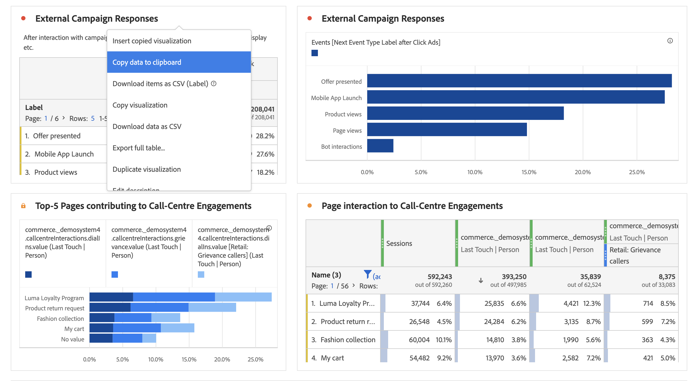

# Visualisations - Aperçu

Workspace offre un certain nombre de visualisations qui vous permettent de générer des représentations visuelles de vos données, telles que des graphiques à barres, des graphiques en anneau, des histogrammes, des graphiques en courbes, des cartes, des tracés différés, etc. La plupart des types de visualisation vous seront familiers si vous utilisez Adobe Analytics. Néanmoins, Analysis Workspace fournit des paramètres de visualisation et de nombreux types de visualisation nouveaux ou uniques, dotés de fonctionnalités interactives.

## Types de visualisation

Voici les types de visualisation disponibles dans Analysis Workspace :

| Nom de la visualisation | Description |
| --- | --- |
| [Surface](/help/analyze/analysis-workspace/visualizations/area.md)

 | Semblable à un graphique linéaire, mais avec une zone colorée sous la ligne. Utilisez un diagramme de surface si vous avez plusieurs mesures et souhaitez visualiser la zone exprimée par l’intersection de plusieurs mesures. |
| [Barre](/help/analyze/analysis-workspace/visualizations/bar.md)

 | Des barres verticales représentent plusieurs valeurs pour une ou plusieurs mesures. |
| [Graphique à puces](/help/analyze/analysis-workspace/visualizations/bullet-graph.md)

 | Permet de comparer ou de mesurer une valeur qui vous intéresse par rapport à d’autres plages de performances (objectifs). |
| [Tableau de cohortes](/help/analyze/analysis-workspace/visualizations/cohort-table/cohort-analysis.md)

 | Une *`cohort`* est un groupe de personnes partageant des caractéristiques communes au cours d’une période spécifique. Lʼanalyse des cohortes est utile pour les analyses de la rétention, de lʼattrition ou de la latence. |
| [Anneau](/help/analyze/analysis-workspace/visualizations/donut.md)

 | Semblable à un graphique circulaire, cette visualisation présente les données comme des portions ou des segments d’un tout. |
| [Abandon](/help/analyze/analysis-workspace/visualizations/fallout/fallout-flow.md)

 | Ceux-ci indiquent où les visiteurs ont quitté (abandonné) une suite prédéfinie de pages et où ils ont poursuivi leur visite à travers ces pages (diminution). Peut être défini sur des séquences éventuelles ou exactes |
| [Flux](/help/analyze/analysis-workspace/visualizations/c-flow/flow.md)

 | Présente les parcours exacts des clients sur vos sites Web et dans vos applications. |
| [Tableau à structure libre](/help/analyze/analysis-workspace/visualizations/freeform-table/freeform-table.md)

 | Un tableau à structure libre n’est pas simplement un tableau de données, mais également une visualisation interactive. Ce tableau constitue la base de lʼanalyse des données dans Workspace. |
| [Histogramme](/help/analyze/analysis-workspace/visualizations/histogram.md)

 | Un histogramme regroupe les visiteurs, les visites ou les accès en intervalles en fonction dʼun volume de mesures. |
| [Barre horizontale](/help/analyze/analysis-workspace/visualizations/horizontal-bar.md)

 | Affiche des barres horizontales qui représentent plusieurs valeurs pour une ou plusieurs mesures. |
| [Synthèse des mesures clés](/help/analyze/analysis-workspace/visualizations/key-metric.md)

 | Indique la tendance d’une mesure au cours d’une seule période ou vous permet de comparer les performances des mesures sur deux périodes. |
| [Ligne](/help/analyze/analysis-workspace/visualizations/line.md)

 | Les mesures sont représentées sous la forme d’une ligne afin d’indiquer de quelle façon changent les valeurs au fil du temps. Un graphique en courbes utilise le temps le long de lʼaxe X. |
| [Carte](/help/analyze/analysis-workspace/visualizations/map-visualization.md)

 | Permet de créer une carte visuelle de n’importe quelle mesure (y compris les mesures calculées) ; |
| [Graphique de dispersion](/help/analyze/analysis-workspace/visualizations/scatterplot.md)

 | Affiche la relation entre les éléments de dimension et trois mesures au maximum. |
| [Numéro de résumé](/help/analyze/analysis-workspace/visualizations/summary-number-change.md)

 | Affiche la cellule sélectionnée sous la forme dʼun grand nombre. |
| [Résumé des changements](/help/analyze/analysis-workspace/visualizations/summary-number-change.md)

 | Affiche la variation entre les cellules sélectionnées sous la forme dʼun grand nombre/pourcentage. |
| [Texte](/help/analyze/analysis-workspace/visualizations/text.md)

 | Permet d’ajouter du texte défini par l’utilisateur dans l’Workspace. Utile pour ajouter du contexte supplémentaire à votre analyse et à vos informations, en plus de tirer parti des descriptions des panneaux/visualisations. |
| [Plan en arborescence](/help/analyze/analysis-workspace/visualizations/treemap.md)

 | Présente les données hiérarchiques (structurées en arbre) sous la forme d’un ensemble de rectangles imbriqués. |
| [Venn](/help/analyze/analysis-workspace/visualizations/venn.md)

 | Utilise des cercles pour représenter le chevauchement des mesures dʼun maximum de 3 segments. |

## Ajouter des visualisations à un panneau

1. Ouvrez le projet Analysis Workspace auquel vous souhaitez ajouter une visualisation.

1. Utilisez l’une des méthodes suivantes pour ajouter la visualisation :

   

   * Dans le panneau de gauche, sélectionnez  **Visualisations**, puis faites glisser une visualisation vers le panneau auquel vous souhaitez l’ajouter.

   * Dans le panneau à l’emplacement duquel vous souhaitez ajouter la visualisation, sélectionnez , puis choisissez l’icône qui représente la visualisation à ajouter. Pointez sur l’icône pour chaque visualisation afin d’afficher le nom.

   * Ajoutez un [panneau vierge](/help/analyze/analysis-workspace/c-panels/blank-panel.md), puis sélectionnez la visualisation à ajouter.

   * Dans le menu contextuel d’une visualisation existante dans votre projet Analysis Workspace, sélectionnez **[!UICONTROL Dupliquer la visualisation]** ou **[!UICONTROL Copier la visualisation]**.

   * Utilisez le menu Workspace **[!UICONTROL Insérer]** pour insérer une visualisation.

   * Dans le menu contextuel d’un tableau à structure libre, sélectionnez **[!UICONTROL Visualiser]**. Sélectionnez ensuite la visualisation dans le sous-menu. En fonction de la sélection en cours dans le tableau, Workspace détermine la visualisation à proposer et interprète les données pour créer la visualisation demandée.

## Légende

Une légende de visualisation vous permet de relier les données dʼun tableau source à une série tracée dans la visualisation. La légende est interactive : vous pouvez sélectionner un élément de légende pour afficher/masquer une série dans la visualisation, ce qui s’avère utile si vous souhaitez simplifier les données visualisées.

De plus, vous pouvez renommer les étiquettes de légende pour rendre les visuels plus exploitables. Remarque : **il nʼest pas** possible de modifier les légendes des visualisations Treemap, Puce, Résumé des changements, Synthèse des chiffres, Texte, Structure libre, Histogramme, Cohorte ou Flux.

Pour modifier une étiquette de légende :

1. Effectuez un clic droit sur l’une des étiquettes de légende.
1. Cliquez sur **[!UICONTROL Modifier l’étiquette]**.

   

1. Saisissez le nouveau texte de l’étiquette.
1. Appuyez sur **[!UICONTROL Entrée]** pour enregistrer.

### Paramètres

La disponibilité des paramètres de visualisation dépend de la visualisation. Le tableau ci-dessous résume les paramètres les plus courants. Certaines visualisations comportent des paramètres spécifiques. Pour en savoir plus, consultez la documentation sur les visualisations individuelles.

| Option | Description |
| --- | --- |
| **[!UICONTROL Type de visualisation]** | Modifiez le type de visualisation utilisée pour représenter les données. |
| **[!UICONTROL Granularité]** | Modifiez la granularité temporelle des visualisations de tendances. Cette modification sʼapplique également au tableau de source de données. |
| **[!UICONTROL Pourcentages]** | Affichez les valeurs en pourcentages. |
| **[!UICONTROL Empilé à 100 %]** | Transformez le graphique en une visualisation empilée à 100 %.  Applicable uniquement pour une visualisation empilée sous forme de surface, barre et barre horizontale. |
| **[!UICONTROL Légende visible]** | Affichez le texte de la légende. |
| **[!UICONTROL Nombre max d’éléments]** | Limitez le nombre d’éléments affichés dans une visualisation. Lorsque cette option est sélectionnée, définissez le nombre maximal d’éléments. |
| **[!UICONTROL Afficher les annotations]** | Affichez les annotations effectuées pour cette visualisation. |
| **[!UICONTROL Masquer le titre]** | Masquez le titre de la visualisation. |
| **[!UICONTROL Faire commencer l’axe Y sur zéro]** | Forcez le bas de l’axe Y à zéro. Si toutes les valeurs mappées dans le graphique sont considérablement supérieures à zéro, le seuil de l’axe Y est par défaut non nul. Si vous activez cette option, l’axe Y est forcé à zéro (et le graphique est redessiné). |
| **[!UICONTROL Afficher l’axe double]** | Affichez les axes Y gauche et droit pour deux mesures différentes. Cette option s’applique uniquement si vous disposez de deux mesures. Les axes doubles sont utiles lorsque les mesures tracées sont de magnitudes différentes. |
| **[!UICONTROL Afficher l’axe X]** | Affichez l’axe X dans la visualisation. |
| **[!UICONTROL Afficher l’axe Y]** | Affichez l’axe Y dans la visualisation. |
| **[!UICONTROL Afficher les haltères sur les lignes]** | Affichez les haltères sur la visualisation linéaire dans une visualisation Combo. |
| **[!UICONTROL Normalisation]** | Forcez les mesures en proportions égales. Les proportions égales sont utiles lorsque les mesures tracées sont de magnitudes différentes. |
| **[!UICONTROL Afficher les anomalies]** | Améliorez les graphiques linéaires et les tableaux à structure libre en affichant la détection des anomalies. La détection des anomalies dans les visualisations linéaires comprend une valeur attendue (ligne en pointillé) et une plage attendue (bande ombrée). |
| **[!UICONTROL Afficher la prévision]** | Améliorez les graphiques linéaires et les tableaux à structure libre en affichant la détection des anomalies. |
| **[!UICONTROL Afficher la valeur minimale]** | Affichez la valeur minimale dans la visualisation. |
| **[!UICONTROL Afficher la valeur maximale]** | Affichez la valeur maximale dans la visualisation. |
| **[!UICONTROL Afficher la courbe de tendance]** | Affichez une courbe de tendance dans la visualisation. Lorsque cette option est sélectionnée, vous pouvez sélectionner le type de courbe de tendance dans le menu déroulant. |

Vous pouvez personnaliser les paramètres de toutes les visualisations que vous créez. Pour plus d’informations, consultez [Préférences utilisateur](/help/analyze/analysis-workspace/user-preferences.md).

## Menu contextuel {#right-click}

Utilisez le menu contextuel (disponible par le biais d’une autre sélection, par exemple en cliquant avec le bouton droit de la souris) sur un en-tête de visualisation pour accéder à des fonctionnalités supplémentaires pour une visualisation. Certaines options ne sont pas disponibles pour certains types de graphique.

| Option | Description |
| --- | --- |
| **[!UICONTROL Insérer une visualisation copiée]** | Collez (insérez) une visualisation copiée à un autre emplacement au sein du projet, ou dans un tout autre projet. |
| **[!UICONTROL Copier les données dans le presse-papiers]** | Copiez les données de la visualisation dans le presse-papiers. |
| **[!UICONTROL Copier la sélection dans le presse-papiers]** | Copiez la sélection de la visualisation dans le presse-papiers. |
| **[!UICONTROL Télécharger les éléments au format CSV (*nom de dimension*)]** | Téléchargez les éléments de dimension (jusqu’à 50 000 au maximum) de la visualisation sur votre appareil local. Un maximum de 50 000 éléments de dimension pour la dimension sélectionnée. |
| **[!UICONTROL Copier la visualisation]** | Copiez la visualisation pour vous permettre de l’insérer dans un autre emplacement au sein du projet, ou dans un autre projet. |
| **[!UICONTROL Télécharger les données au format CSV]** | Téléchargez les données affichées de la visualisation sur votre appareil local. |
| **[!UICONTROL Dupliquer la visualisation]** | Créez un doublon exact de la visualisation. |
| **[!UICONTROL Modifier la description]** | Ajoutez (ou modifiez) une description textuelle de la visualisation. Consultez [Texte](text.md). |
| **[!UICONTROL Obtenir le lien de la visualisation]** | Copiez et partagez un lien directement vers la visualisation. Une boîte de dialogue Partager le lien affiche le lien. Sélectionnez Copier pour copier le lien dans votre presse-papiers. |
| **[!UICONTROL Recommencer]** | Supprimez la configuration de la visualisation actuelle afin que vous puissiez la reconfigurer de zéro. |

## Configuration

Certaines visualisation (comme Table de cohorte, Abandons, Flux, etc.) possèdent une boîte de dialogue de configuration pour vous aider à créer la visualisation. Utilisez  en haut de la visualisation pour accéder à la configuration et la modifier.

## Visualiser

Si vous ne savez pas quelle visualisation choisir, sélectionnez  **[!UICONTROL Visualiser]** dans une ligne de tableau à structure libre (disponible au survol de la souris). Cette sélection est la méthode la plus rapide pour ajouter une visualisation. Analysis Workspace s’affiche alors et détermine quelle visualisation serait la mieux adaptée à vos données. Par exemple, si une ligne est sélectionnée, un [graphique linéaire](line.md) à tendance est créé. Si 3 lignes de filtre sont sélectionnées, un diagramme de [Venn](venn.md) est créé.

<!--
## Settings {#settings}

| Setting | Description |
| --- | --- |
| Visualization Type | Change the type of visual used to depict the data. |
| Granularity | For trended visualizations, you can change the time granularity (day, week, month, etc.) from this drop-down list. This change also applies to the data source table. |
| Percentages | Displays values in percentages. |
| 100% Stacked | This setting on area stacked, bar stacked or horizontal bar stacked visualizations turns the chart into a "100% stacked" visualization. Example:  |
| Legend Visible | Lets you hide the detailed legend text for the Summary Number/Summary Change visualization. |
| Limit Max Items | Lets you limit the number of items that a visualization displays. |
| Anchor Y Axis at Zero | If all the values plotted on the chart are considerably above zero, the chart default will make the bottom of the y-axis NON-ZERO. If you check this box, the y-axis will be forced to zero (and it will re-draw the chart). |
| Normalization | Forces metrics to equal proportions. This is helpful when plotted metrics are of very different magnitudes. |
| Display Dual Axis | Only applies if you have two metrics - you can have a y-axis on the left (for one metric) and on the right (for the other metric). This is helpful when plotted metrics are of very different magnitudes. |
| Show Anomalies | Enhances line graphs and freeform tables by displaying anomaly detection. Anomaly detection in line visualizations includes an expected value (dashed line) and an expected range (shaded band). |

## Legend {#legend}

A visualization legend helps you to relate date in a source table to plotted series in the visualization. The legend is interactive - you can click a legend item to show/hide a series in the visualization. This is helpful if you want to simplify the data being visualized. 

Additionally, you can rename legend labels to help you make visuals more consumable. Note: legend editing does **not** apply to: Treemap, Bullet, Summary Change/Number, Text, Freeform, Histogram, Cohort or Flow visualizations.

To edit a legend label:

1. Right-click one of the legend labels.
1. Click **[!UICONTROL Edit Label]**.

   

1. Enter the new label text.
1. Press **[!UICONTROL Enter]** to save.

## Right-click menu {#right-click}

Additional functionality for a visualziation is available by right-clicking on the visualization header. Settings will vary by visualization. Some of the settings available are:

| Setting | Description |
| --- | --- |
| Insert Copied Panel/Visualization|Lets you paste ("insert") a copied panel or visualization to another place within the project, or into a completely different project. |
| Copy Visualization | Lets you right-click and copy a visualization, so that you can insert it to another place within the project, or into a completely different project. |
| [Download items as CSV](https://experienceleague.adobe.com/docs/analytics/analyze/analysis-workspace/curate-share/download-send.html?#download-items) | Download up to 50,000 dimension items for the selected dimension as a CSV. |
| [Download data as CSV](https://experienceleague.adobe.com/docs/analytics/analyze/analysis-workspace/curate-share/download-send.html?#download-data) | Download visualization data source as a CSV. |
| Duplicate Visualization | Makes an exact duplicate of the current visualization, which you can then modify. |
| Edit Description | Add (or edit) a text description for the visualization. |
| Get Visualization Link | Lets you direct someone to a specific visualization within a project. When the link is clicked, the recipient will be required to login before being directed to the exact visualization linked to. |
| Start Over | (Works for Flow, Venn, Histogram) Deletes the configuration for the current visualization so you can re-configure it from scratch. |

## Create Visual icon {#quick-viz}

If you are not sure which visualization to pick, click the **[!UICONTROL Create Visual]** icon in any table row (available on hover). This the the fastest way to add a visualization. Clicking it prompts Analysis Workspace to take an educated guess at which visualization would best fit your data. For example, if you have 1 row selected, it will create a trended line graph. If you have 3 segment rows selected, it will create a Venn diagram. 

## Change the scale axis on visualizations

Here is a video overview:

>[!VIDEO](https://video.tv.adobe.com/v/24708/?quality=12)

-->
