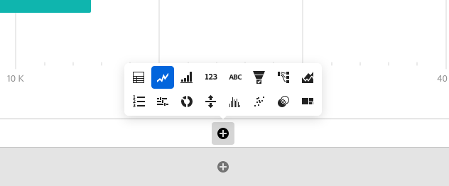

# Visualisations - Aperçu

Workspace offre un certain nombre de visualisations qui vous permettent de générer des représentations visuelles de vos données, telles que des graphiques à barres, des graphiques en anneau, des histogrammes, des graphiques en courbes, des cartes, des tracés différés, etc. La plupart des types de visualisation vous seront familiers si vous utilisez Adobe Analytics. Néanmoins, Analysis Workspace fournit des paramètres de visualisation et de nombreux types de visualisation nouveaux ou uniques, dotés de fonctionnalités interactives.

## Types de visualisation

Voici les types de visualisation disponibles dans Analysis Workspace :

| Nom de la visualisation | Description |
| --- | --- |
| [Surface](/help/analyze/analysis-workspace/visualizations/area.md)

 | Semblable à un graphique linéaire, mais avec une zone colorée sous la ligne. Utilisez un diagramme de surface si vous avez plusieurs mesures et souhaitez visualiser la zone exprimée par l’intersection de plusieurs mesures. |
| [Barre](/help/analyze/analysis-workspace/visualizations/bar.md)

 | Des barres verticales représentent plusieurs valeurs pour une ou plusieurs mesures. |
| [Graphique à puces](/help/analyze/analysis-workspace/visualizations/bullet-graph.md)

 | Permet de comparer ou de mesurer une valeur qui vous intéresse par rapport à d’autres plages de performances (objectifs). |
| [Tableau de cohortes](/help/analyze/analysis-workspace/visualizations/cohort-table/cohort-analysis.md)

 | Une *`cohort`* est un groupe de personnes partageant des caractéristiques communes au cours d’une période spécifique. Lʼanalyse des cohortes est utile pour les analyses de la rétention, de lʼattrition ou de la latence. |
| [Anneau](/help/analyze/analysis-workspace/visualizations/donut.md)

 | Semblable à un graphique circulaire, cette visualisation présente les données comme des portions ou des segments d’un tout. |
| [Abandon](/help/analyze/analysis-workspace/visualizations/fallout/fallout-flow.md)

 | Ceux-ci indiquent où les visiteurs ont quitté (abandonné) une suite prédéfinie de pages et où ils ont poursuivi leur visite à travers ces pages (diminution). Peut être défini sur des séquences éventuelles ou exactes |
| [Flux](/help/analyze/analysis-workspace/visualizations/c-flow/flow.md)

 | Présente les parcours exacts des clients sur vos sites Web et dans vos applications. |
| [Tableau à structure libre](/help/analyze/analysis-workspace/visualizations/freeform-table/freeform-table.md)

 | Un tableau à structure libre n’est pas simplement un tableau de données, mais également une visualisation interactive. Ce tableau constitue la base de lʼanalyse des données dans Workspace. |
| [Histogramme](/help/analyze/analysis-workspace/visualizations/histogram.md)

 | Un histogramme regroupe les visiteurs, les visites ou les accès en intervalles en fonction dʼun volume de mesures. |
| [Barre horizontale](/help/analyze/analysis-workspace/visualizations/horizontal-bar.md)

 | Des barres horizontales représentent plusieurs valeurs pour une ou plusieurs mesures. |
| [Synthèse des mesures clés](/help/analyze/analysis-workspace/visualizations/key-metric.md)

 | Affiche les tendances d’une mesure sur une seule période ou vous permet de comparer les performances des mesures sur deux périodes. |
| [Ligne](/help/analyze/analysis-workspace/visualizations/line.md)

 | Les mesures sont représentées sous la forme d’une ligne afin d’indiquer de quelle façon changent les valeurs au fil du temps. Un graphique en courbes utilise le temps le long de lʼaxe X. |
| [Carte](/help/analyze/analysis-workspace/visualizations/map-visualization.md)

 | Permet de créer une carte visuelle de n’importe quelle mesure (y compris les mesures calculées) ; |
| [Graphique de dispersion](/help/analyze/analysis-workspace/visualizations/scatterplot.md)

 | Affiche la relation entre les éléments de dimension et trois mesures au maximum. |
| [Numéro de résumé](/help/analyze/analysis-workspace/visualizations/summary-number-change.md)

 | Affiche la cellule sélectionnée sous la forme dʼun grand nombre. |
| [Résumé des changements](/help/analyze/analysis-workspace/visualizations/summary-number-change.md)

 | Affiche la variation entre les cellules sélectionnées sous la forme dʼun grand nombre/pourcentage. |
| [Texte](/help/analyze/analysis-workspace/visualizations/text.md)

 | Permet d’ajouter du texte défini par l’utilisateur dans l’Workspace. Utile pour ajouter du contexte supplémentaire à votre analyse et à vos informations, en plus de tirer parti des descriptions des panneaux/visualisations. |
| [Treemap](/help/analyze/analysis-workspace/visualizations/treemap.md)

 | Présente les données hiérarchiques (structurées en arbre) sous la forme d’un ensemble de rectangles imbriqués. |
| [Venn](/help/analyze/analysis-workspace/visualizations/venn.md)

 | Utilise des cercles pour représenter le chevauchement des mesures dʼun maximum de 3 segments. |

## Ajout de visualisations à un panneau

1. Ouvrez le projet Analysis Workspace dans lequel vous souhaitez ajouter une visualisation.

1. Utilisez l’une des méthodes suivantes pour ajouter la visualisation :

   * Dans le rail de gauche, sélectionnez l’icône **Visualisations** <!-- add icon -->, puis faites glisser une visualisation sur le panneau dans lequel vous souhaitez l’ajouter.

     

   * Dans le panneau où vous souhaitez ajouter la visualisation, sélectionnez l’icône **Plus** , puis choisissez l’icône représentant la visualisation que vous souhaitez ajouter. Passez la souris sur l’icône de chaque visualisation pour afficher son nom.

     

   * Ajoutez un [panneau vierge](https://experienceleague.adobe.com/docs/analytics/analyze/analysis-workspace/panels/blank-panel.html?lang=fr), puis sélectionnez la visualisation que vous souhaitez ajouter.

     

   * Cliquez avec le bouton droit de la souris sur un panneau existant de votre projet Analysis Workspace, puis sélectionnez [!UICONTROL **Dupliquer la visualisation**] ou [!UICONTROL **Copier la visualisation**].

## Personnaliser les paramètres de visualisation

Vous pouvez personnaliser les paramètres de visualisation pour une visualisation individuelle ou pour toutes les visualisations que vous créez.

### Personnaliser les paramètres de visualisation pour une seule visualisation

Accéder aux [!UICONTROL Paramètres de visualisation] pour une visualisation individuelle :

1. Dans Analysis Workspace, passez la souris sur la visualisation dont vous souhaitez personnaliser les paramètres.

1. Cliquez sur l’icône en forme d’engrenage.

   Chaque type de visualisation comporte des paramètres uniques que vous pouvez personnaliser. Pour plus d’informations sur les paramètres disponibles, consultez [Paramètres](#settings).

### Personnaliser les paramètres de visualisation pour toutes les visualisations que vous créez

Vous pouvez personnaliser les paramètres de toutes les visualisations que vous créez. Pour plus d’informations, consultez [Préférences utilisateur](/help/analyze/analysis-workspace/user-preferences.md).

## Paramètres {#settings}

| Paramètre | Description |
| --- | --- |
| Type de visualisation | Modifiez le type de visuel utilisé pour représenter les données. |
| Granularité | Pour les visualisations de tendances, vous pouvez modifier la granularité temporelle (jour, semaine, mois, etc.) dans cette liste déroulante. Cette modification sʼapplique également au tableau de source de données. |
| Pourcentages | Affiche les valeurs en pourcentages. |
| 100 % empilé | Ce paramètre appliqué aux graphiques à zones empilées, à barres empilées ou à barres horizontales empilées offre un aperçu « 100 % empilé » du diagramme. Exemple :  |
| Légende visible | Vous permet de masquer le texte de légende détaillé pour la visualisation Synthèse des chiffres/Résumé des changements. |
| Nombre max d’éléments | Permet de limiter le nombre d’éléments affichés dans une visualisation. |
| Axe Y de l’ancre à zéro | Si toutes les valeurs mappées dans le graphique sont considérablement supérieures à zéro, le seuil de l’axe des ordonnées est par défaut NON NUL. Si cette option est activée, l’axe des ordonnées est obligatoirement ancré à zéro (et le graphique est retracé). |
| Normalisation | Force les mesures en proportions égales. Cela sʼavère utile lorsque les mesures tracées présentent des dimensions très différentes. |
| Afficher l’axe double | S’applique seulement s’il existe deux mesures : vous pouvez afficher un axe des ordonnées sur la gauche (pour une mesure) et un sur la droite (pour l’autre mesure). Cela sʼavère utile lorsque les mesures tracées présentent des dimensions très différentes. |
| Afficher les anomalies | Améliore les graphiques linéaires et les tableaux à structure libre en affichant la détection des anomalies. La détection des anomalies dans les visualisations linéaires comprend une valeur attendue (ligne en pointillé) et une plage attendue (bande ombrée). |

## Légende {#legend}

Une légende de visualisation vous permet de relier les données dʼun tableau source à une série tracée dans la visualisation. La légende est interactive. Vous pouvez cliquer sur un élément de légende pour afficher/masquer une série dans la visualisation. Cela sʼavère utile si vous souhaitez simplifier les données visualisées.

De plus, vous pouvez renommer les étiquettes de légende pour rendre les visuels plus exploitables. Remarque : **il nʼest pas** possible de modifier les légendes des visualisations Treemap, Puce, Résumé des changements, Synthèse des chiffres, Texte, Structure libre, Histogramme, Cohorte ou Flux.

Pour modifier une étiquette de légende :

1. Effectuez un clic droit sur l’une des étiquettes de légende.
1. Cliquez sur **[!UICONTROL Modifier l’étiquette]**.

   

1. Saisissez le nouveau texte de l’étiquette.
1. Appuyez sur **[!UICONTROL Entrée]** pour enregistrer.

## Menu contextuel {#right-click}

Pour accéder à dʼautres fonctionnalités dʼun panneau, faites un clic droit sur lʼen-tête de la visualisation. Les paramètres varient selon la visualisation. Certains des paramètres disponibles sont les suivants :

| Paramètre | Description |
| --- | --- |
| Insérer la copie du panneau/de la visualisation | Permet de coller (« insérer ») la copie d’un panneau ou d’une visualisation à un autre emplacement au sein du projet, ou dans un tout autre projet. |
| Copier la visualisation | Permet de faire un clic droit et de copier une visualisation de sorte que vous puissiez lʼinsérer à un autre emplacement du projet, ou dans un tout autre projet. |
| [Télécharger les éléments au format CSV](https://experienceleague.adobe.com/docs/analytics/analyze/analysis-workspace/curate-share/download-send.html?lang=fr#download-items) | Téléchargez jusquʼà 50 000 éléments de dimension au format CSV pour la dimension sélectionnée. |
| [Télécharger les données au format CSV](https://experienceleague.adobe.com/docs/analytics/analyze/analysis-workspace/curate-share/download-send.html?lang=fr#download-data) | Téléchargez la source de données de visualisation au format CSV. |
| Dupliquer la visualisation | Crée un double exact de la visualisation actuelle, que vous pouvez ensuite modifier. |
| Modifier la description | Permet dʼajouter (ou de modifier) une description textuelle de la visualisation. |
| Obtenir le lien de la visualisation | Permet de renvoyer un utilisateur vers une visualisation spécifique dans un projet. Lorsque lʼutilisateur clique sur le lien, le destinataire doit se connecter avant dʼêtre dirigé vers la visualisation exacte à laquelle il est lié. |
| Recommencer | (Fonctionne pour les visualisations suivantes : Flux, Venn, Histogramme.) Supprime la configuration de la visualisation actuelle afin que vous puissiez la reconfigurer de zéro. |

## Icône Créer un visuel {#quick-viz}

Si vous ne savez pas quelle visualisation choisir, cliquez sur lʼicône **[!UICONTROL Créer un visuel]** dans une ligne de tableau (disponible au survol de la souris). Il sʼagit de la méthode la plus rapide pour ajouter une visualisation. Analysis Workspace s’affiche alors et détermine quelle visualisation serait la mieux adaptée à vos données. Par exemple, si une ligne est sélectionnée, un graphique linéaire à tendance est créé. Si 3 lignes de segment sont sélectionnées, un diagramme de Venn est créé.

## Modification de l’échelle/l’axe sur les visualisations

Voici une présentation vidéo :

>[!VIDEO](https://video.tv.adobe.com/v/24708/?quality=12)
