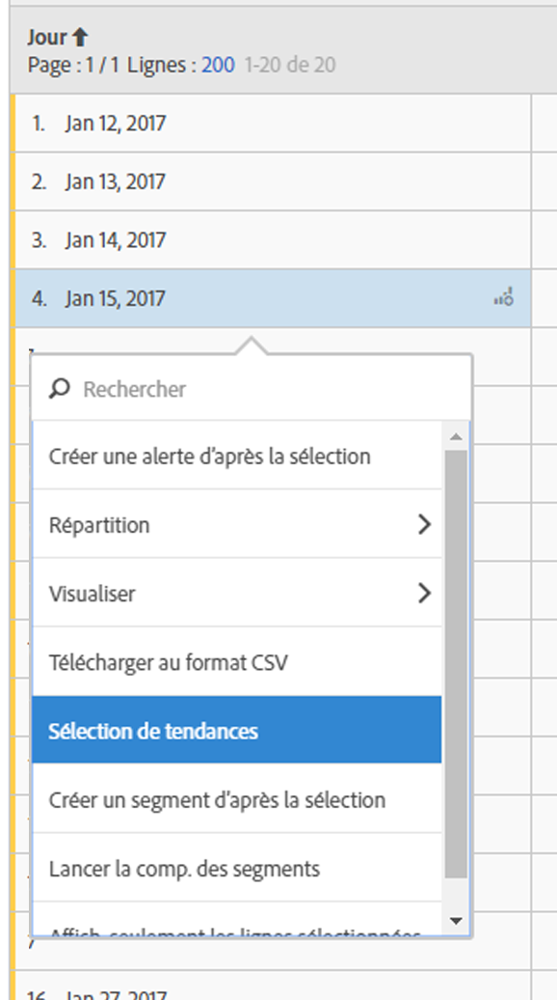

# Tableau à structure libre

Dans Analysis Workspace, un tableau de données (tableau à structure libre) n’est pas simplement un tableau de rapport, mais également une visualisation interactive. Interagissez avec des lignes individuelles, un groupe de plusieurs lignes ou le tableau entier.

Vous pouvez afficher jusqu’à 400 lignes dans une table.

Vous pouvez interagir avec le tableau de différentes façons :

* [Créez une alerte](/help/components/c-alerts/alert-builder.md) d’après une sélection d’un tableau
* Exécutez [des ventilations](../../../analyze/analysis-workspace/components/dimensions/t-breakdown-fa.md#task_B594DA2476E84DFDA8279E831F0BD9C4) et créez des segments incorporés (clic droit)
* Run [visualizations](../../../analyze/analysis-workspace/visualizations/freeform-analysis-visualizations.md#concept_09242627629147A88A68F1506954C276) on specific cells
* Export rows to [CSV](../../../analyze/analysis-workspace/curate-share/download-send.md#concept_BB548979F47F45739679B830428C3025)
* Générez des visualisations de [tendances](../../../analyze/analysis-workspace/analysis-workspace-features.md#section_34930C967C104C2B9092BA8DCF2BF81A) d’après les cellules sélectionnées
* Créez     [des segments](../../../analyze/analysis-workspace/components/t-freeform-project-segment.md#task_11C6A2C7717B48049E5750B9D20FEC80) depuis la sélection
* Perform a [segment comparison](../../../analyze/analysis-workspace/c-panels/c-segment-comparison/segment-comparison.md#concept_74FAC1C6D0204F9190A110B0D9005793)
* Affichage uniquement des lignes sélectionnées

See [Create an Analysis Workspace project](../../../analyze/analysis-workspace/build-workspace-project/t-freeform-project.md#task_C2C698ACC7954062A28E4784911E6CF2) for more information.
