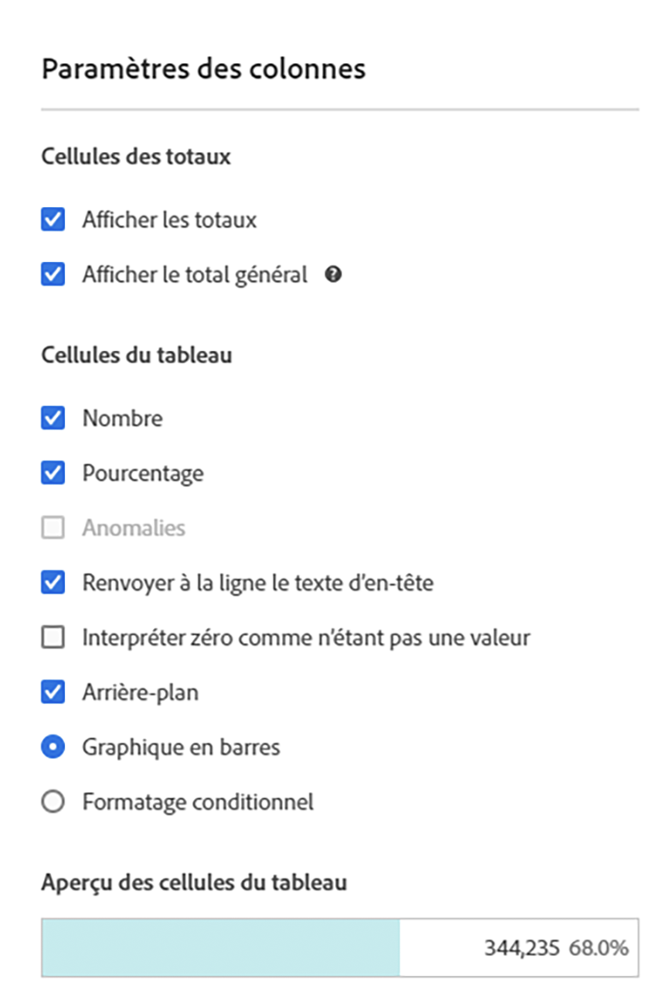
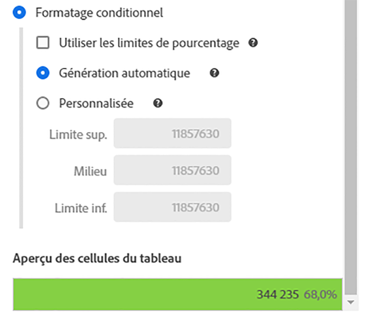
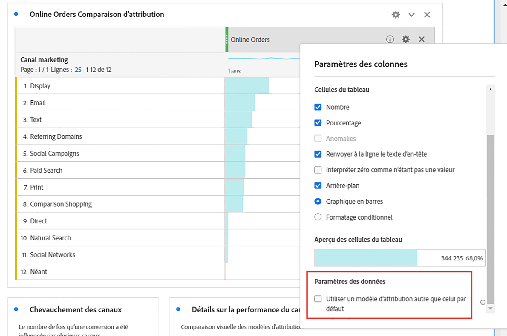
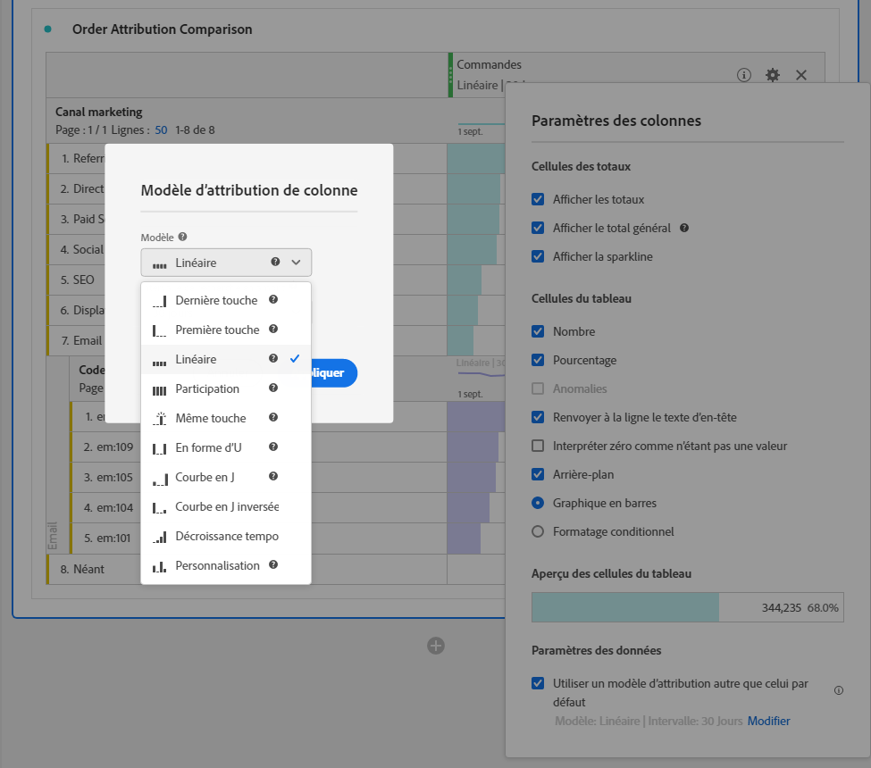

# [!UICONTROL Paramètres des colonnes]

Grâce aux [!UICONTROL paramètres de colonne], vous pouvez configurer la mise en forme des colonnes, dont certains éléments peuvent être conditionnels.

## Modifier les [!UICONTROL paramètres de colonne] {#edit-column-settings}

Vous pouvez modifier les paramètres de colonne d’une colonne individuelle ou de plusieurs colonnes simultanément.

1. Dans Analysis Workspace, faites glisser un tableau à structure libre vers votre projet.

1. (Conditionnel) Pour modifier plusieurs colonnes simultanément, sélectionnez chaque colonne à modifier en maintenant la touche Maj enfoncée.

1. Pointez sur la colonne à modifier, puis sélectionnez l’icône en forme d’engrenage.

   Si vous avez sélectionné plusieurs colonnes, cliquez sur l’icône en forme d’engrenage pour l’une des colonnes sélectionnées. Toutes les modifications que vous apportez s’appliquent à l’ensemble des colonnes sélectionnées.

   

1. Continuez avec les [Paramètres des colonnes](#column-settings).

## Paramètres des colonnes

Vous pouvez mettre à jour les paramètres de colonne suivants pour des tableaux individuels dans Analysis Workspace, comme décrit dans la section [Modifier les paramètres de colonne](#edit-uicontrol-column-settings).

Certains de ces paramètres peuvent également être gérés pour tous les nouveaux projets que vous créez dans Analysis Workspace, comme décrit dans la section [Préférences utilisateur](/help/analyze/analysis-workspace/user-preferences.md).

| Élément | Description |
| --- | --- |
| **Cellules des totaux** |  |
| Afficher les totaux | Ce total est généralement égal au [!UICONTROL Total général] ou est un sous-ensemble de ce dernier. Il reflète les filtres de tableau appliqués dans le tableau à structure libre, y compris l’option [!UICONTROL Inclure aucun]. |
| Afficher le total général | Ce total représente tous les accès qui ont été collectés. Il est parfois appelé « total de la suite de rapports ». Lorsqu’un segment est appliqué au niveau du panneau ou dans le tableau à structure libre, ce total s’ajuste pour refléter tous les accès qui correspondent aux critères de segment. Le total général n’est pas pris en charge pour les tableaux ou les répartitions avec des [lignes statiques](/help/analyze/analysis-workspace/visualizations/freeform-table/workspace-totals.md). |
| **Cellules du tableau** |   |
| Nombre | Détermine si une cellule affiche/masque la valeur numérique pour la mesure. Par exemple, si la mesure est Pages vues, la valeur numérique correspond au nombre de pages vues pour l’élément de ligne. |
| Pourcentage | Détermine si une cellule affiche/masque la valeur de pourcentage pour la mesure. Par exemple, si la mesure est Pages vues, la valeur de pourcentage correspond au nombre de pages vues pour l’élément de ligne, divisé par le nombre total de pages vues pour la colonne.  Remarque : Nous pouvons désormais afficher les pourcentages supérieurs à 100 %, pour plus de précision. Nous avons également rehaussé le plafond supérieur à 1 000 % afin de garantir que les colonnes puissent s’adapter à une largeur trop importante. |
| Anomalies | Détermine si la détection des anomalies est exécutée sur les valeurs de cette colonne. Pour plus d’informations, consultez [Affichage des anomalies dans Analysis Workspace](/help/analyze/analysis-workspace/c-anomaly-detection/view-anomalies.md). |
| Renvoyer à la ligne le texte d’en-tête | Permet de renvoyer à la ligne le texte de l’en-tête dans les tableaux à structure libre afin de rendre les en-têtes plus lisibles et les tableaux plus faciles à partager. Cette option est utile pour le rendu .pdf et pour les mesures dont le nom est long. Activé par défaut. |
| Interpréter zéro comme n’étant pas une valeur | Pour les cellules dont la valeur est 0, détermine s’il convient d’afficher un 0 ou une cellule vierge. Ce paramètre est utile lorsque vous examinez les données pour chaque jour d’un mois et que certains jours n’ont pas encore eu lieu.  Des cellules vierges peuvent être affichées au lieu de 0 pour les dates futures. Les diagrammes respectent également ce paramètre (c.-à-d. qu’ils n’affichent pas une ligne ou une barre avec des valeurs 0 lorsque ce paramètre est activé). |
| Contexte | Détermine si une cellule affiche/masque toute la mise en forme de cellule, y compris le graphique en barres et la mise en forme conditionnelle. |
| Graphique en barres | Affiche un graphique en barres horizontal représentant la valeur de la cellule par rapport au total de la colonne. |
| Mise en forme conditionnelle | Voir la section suivante. |
| Aperçu des cellules de tableau | Affiche un aperçu de l’aspect de chaque cellule après application des options de mise en forme actuellement sélectionnées. |

## Mise en forme conditionnelle {#conditional-formatting}

La mise en forme conditionnelle applique la mise en forme aux limites supérieure, moyenne et inférieure que vous pouvez définir. L’application d’une mise en forme conditionnelle (couleurs, par exemple) dans les tableaux à structure libre est également activée automatiquement sur les répartitions, sauf si des limites « personnalisées » sont sélectionnées.

| Élément | Description |
| --- | --- |
| Mise en forme conditionnelle | Applique aux cellules un jeu de couleurs préconfiguré de votre choix. En fonction des 4 modèles de couleurs disponibles que vous sélectionnez, différentes couleurs sont attribuées aux valeurs élevées, aux valeurs intermédiaires et aux valeurs faibles.   Le remplacement d’une dimension du tableau réinitialise les limites de la mise en forme conditionnelle. Le remplacement d’une mesure recalcule les limites de cette colonne (lorsqu’une mesure se trouve sur l’axe des abscisses et une dimension sur l’axe des ordonnées). |
| Utiliser des limites en pourcentage | Modifier la plage de limites pour qu’elle soit basée sur des pourcentages plutôt que sur des valeurs absolues. Cette option fonctionne avec les mesures qui reposent uniquement sur des pourcentages (comme Taux de rebond) et celles qui reposent sur un nombre et un pourcentage (comme Pages vues). |
| Génération automatique | Calculer automatiquement les limites hautes/moyennes/basses en fonction des données. La limite supérieure est la valeur la plus élevée de cette colonne. La limite inférieure est la valeur la plus faible et la valeur moyenne est la moyenne entre les limites supérieure et inférieure. |
| Personnalisé | Attribuer manuellement les limites hautes/inférieures/basses. Vous disposez ainsi de la flexibilité nécessaire pour déterminer si la valeur d’une colonne devient bonne, moyenne ou mauvaise. |
| Palette de mise en forme conditionnelle | Sélectionnez l’un des 4 modèles de couleurs disponibles à utiliser pour votre mise en forme conditionnelle. |

## Utilisation d’un modèle d’attribution différent du modèle par défaut {#attribution}

Analysis Workspace prend en charge l’[attribution](/help/analyze/analysis-workspace/attribution/overview.md) pour presque toutes les mesures.

1. Cliquez sur l’icône Paramètres (en forme d’engrenage) dans une colonne d’un tableau à structure libre.

   

1. Sous **[!UICONTROL Paramètres des données]**, cochez **[!UICONTROL Utiliser un modèle d’attribution autre que celui par défaut]**. Pour plus d’informations sur les différents modèles d’attribution, reportez-vous à la section [Modèles d’attribution](/help/analyze/analysis-workspace/attribution/models.md).

   

>[!MORELIKETHIS]
>
>* [Gestion des sources de données](/help/analyze/analysis-workspace/visualizations/t-sync-visualization.md)

## Colonnes dynamiques

Voici une vidéo sur lʼutilisation des colonnes dynamiques dans Analysis Workspace :

>[!VIDEO](https://video.tv.adobe.com/v/23138/?quality=12)
