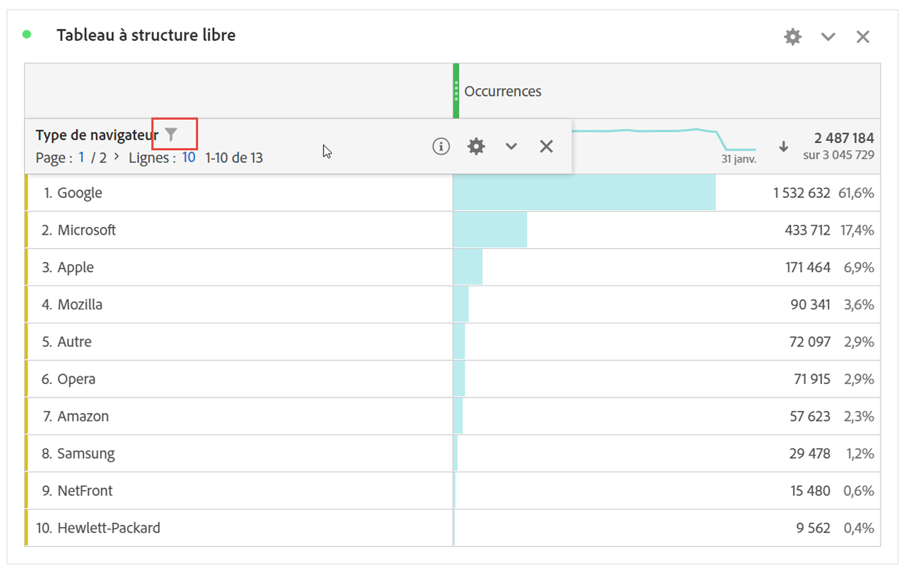
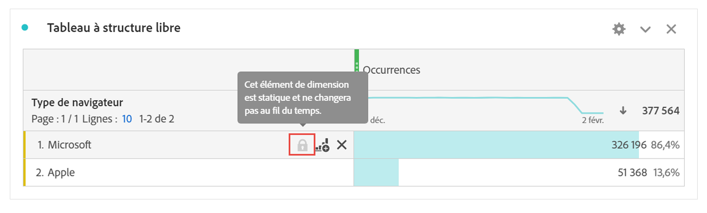
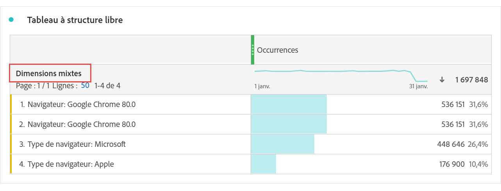

# Éléments de dimension dynamiques et statiques

Dans les tableaux à structure libre, les lignes et les colonnes peuvent contenir différentes valeurs de composant. Ces valeurs peuvent être dynamiques (changent avec le temps) ou statiques (ne changent pas avec le temps), selon l’analyse que vous souhaitez créer.

## Éléments de dimension dynamiques

Les éléments de dimension dynamiques changent avec le temps et dépendent de la mesure de tri dans le tableau à structure libre. Les éléments de dimension dynamiques sont recommandés lorsque vous souhaitez analyser les éléments principaux d’une période donnée.

Lorsque vous déposez une dimension dans un tableau à structure libre, des lignes dynamiques sont renvoyées. Elles représentent les éléments principaux qui correspondent à la dimension pour une mesure et une période données. Vous pouvez également déposer une dimension dans des colonnes de tableau à structure libre et la dimension se développe automatiquement dans les 5 premiers éléments de dimension.

Par exemple, lorsque vous faites glisser la dimension Type de navigateur dans le tableau, les principaux éléments de dimension Type de navigateur (par exemple, Microsoft, Apple, Google, etc.) revenir dynamiquement aux lignes du tableau. Si vous les déposez dans une colonne, les 5 premiers éléments de la dimension Type de navigateur sont dynamiquement renvoyés.

Les éléments de dimension dynamiques comportent l’option de filtre de ligne  et un , et ne comportent **pas** de verrou . <!--do they have the lock icon? --> Lorsque vous cliquez sur  en regard d’un élément de dimension dynamique, un filtre est automatiquement appliqué. Pour plus d’informations sur l’application de filtres aux tableaux, voir [Filtrer et trier des tableaux](/help/analyze/analysis-workspace/visualizations/freeform-table/filter-and-sort.md).

## Éléments de dimension statiques

Les éléments de dimension statiques ne changent pas avec le temps. Il s’agit de composants fixes toujours renvoyés dans un tableau à structure libre. Les éléments de dimension statiques sont recommandés lorsque vous souhaitez toujours analyser le même élément, qu’il s’agisse de campagnes spécifiques ou de jours précis de la semaine.

Chaque fois que vous sélectionnez et déposez manuellement des valeurs de composant spécifiques (dimension, mesure, filtre, période) dans un tableau, le résultat se présente sous la forme dʼune liste statique de lignes ou de colonnes.

Par exemple, lorsque vous faites glisser des éléments Type de navigateur spécifiques tels que Microsoft et Apple, ces deux éléments spécifiques sont toujours extraits dans le tableau.

Les éléments de dimension statiques peuvent également être créés si vous choisissez de sélectionner **[!UICONTROL Afficher uniquement les lignes sélectionnées]** dans le menu contextuel des lignes sélectionnées.

Les éléments de dimension statiques **ne disposent pas** de l’option de filtre de ligne. Au lieu de cela, des éléments  et  sont présents sur chaque élément. Sélectionnez  pour supprimer cet élément de dimension du tableau.

## Éléments de dimension mixtes

Vous pouvez ajouter des éléments de dimension de différentes dimensions au même tableau. Dans ces cas, l’en-tête de ligne indique **[!UICONTROL Dimensions mixtes]**. Ces éléments de dimension sont statiques. Par exemple, l’ajout d’éléments de dimension spécifiques de la dimension du groupe Navigateur et d’autres éléments de dimension de la dimension du nom Navigateur.

## Lignes totales à structure libre

Les lignes dynamiques et statiques se comportent différemment dans la ligne de total à structure libre. Par défaut :

* Les lignes dynamiques sont additionnées côté serveur et dédupliquent les mesures, telles que les visites ou les personnes.
* Les lignes statiques sont additionnées côté client et ne dédupliquent **pas** les mesures. Pour calculer la ligne de total côté serveur, définissez le paramètre des lignes sur **Afficher le total général**. [En savoir plus](/help/analyze/analysis-workspace/visualizations/freeform-table/workspace-totals.md)

>[!BEGINSHADEBOX]

Voir  [Réorganiser des lignes statiques](https://experienceleague.adobe.com/en/docs/analytics-learn/tutorials/analysis-workspace/building-freeform-tables/reordering-static-rows-in-analysis-workspace){target="_blank"} pour une vidéo de démonstration.

>[!ENDSHADEBOX]

