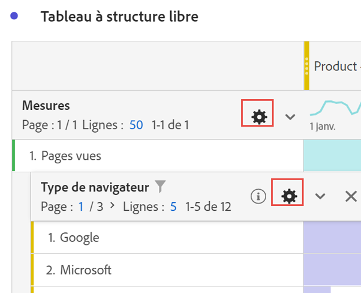

# Paramètres des lignes

>[!BEGINSHADEBOX]

Voir  [Paramètres de ligne et de colonne dans un tableau à structure libre](https://video.tv.adobe.com/v/40382/?quality=12&learn=on){target="_blank"} pour une vidéo de démonstration.

>[!ENDSHADEBOX]

Les configurations des lignes varient selon le composant déposé dans le tableau. Pour accéder aux paramètres des lignes du tableau, sélectionnez  **[!UICONTROL Paramètres]** en regard d’une dimension, d’un filtre, d’une mesure, d’une période ou d’une répartition dans chacun de ces objets.

| Paramètre | Description |
| --- | --- |
| **[!UICONTROL Répartition par position]** | Par défaut, ce paramètre est désactivé et les répartitions sont fixées aux éléments de la ligne statique. Imaginez, par exemple, que vous répartissiez les 3 principaux éléments de dimension Page (Page d’accueil, Résultats de la recherche, Passage en caisse) par canal marketing. Ensuite, vous quittez le projet et revenez deux semaines plus tard. Lors de la réouverture du projet, les 3 premières pages ont changé. Désormais, la page d’accueil, les résultats de recherche et le passage en caisse figurent sur les 4 à 6 premières pages. Par défaut, vos répartitions de canal marketing apparaissent toujours sous Page d’accueil, Résultats de la recherche et Passage en caisse, même si elles se trouvent désormais dans les lignes 4 à 6.  En revanche, la **répartition par position** répartit toujours les 3 premiers éléments, quelle que soit leur nature. Pour revenir à l’exemple, lorsque vous rouvrez votre projet, les répartitions des canaux marketing sont liées aux 3 premières pages du tableau. Et non sur la page d’accueil, les résultats de recherche et le passage en caisse, qui se trouvent désormais dans les lignes 4 à 6. |
| **[!UICONTROL Pourcentages]** | **Calculer les pourcentages par colonne** (par défaut) : les pourcentages visibles dans une cellule sont calculés par rapport au total de la colonne.  **Calculer les pourcentages par ligne** : les pourcentages des cellules sont calculés sur toute la ligne, et non pas en bas de la colonne, avec le total général comme dénominateur. Ce calcul est utile pour les pourcentages de tendance. |
| **[!UICONTROL Totaux des colonnes]** | Ces paramètres sont uniquement disponibles pour les lignes [statiques](/help/analyze/analysis-workspace/visualizations/freeform-table/column-row-settings/manual-vs-dynamic-rows.md).   **Afficher en tant que somme des lignes actives** affiche une somme côté client des lignes du tableau, ce qui signifie que le total ne déduplique *pas* des mesures telles que les visites ou les personnes.   **Afficher le total général** affiche une somme côté serveur, ce qui signifie le total des mesures dédupliquées. |

## Modification du nombre de lignes

Pour modifier le nombre de lignes affichées, procédez comme suit :

1. Cliquez sur le nombre en regard de **[!UICONTROL Lignes]** en haut de la première colonne du tableau.

   

1. Dans la liste déroulante, sélectionnez le nombre de lignes à afficher dans le tableau.

## Menu contextuel

Les options de menu contextuel suivantes sont disponibles lors de la sélection de l’en-tête de dimension.

| Option | Description |
| --- | --- |
| **[!UICONTROL Copier la sélection dans le presse-papiers]** | Copiez la sélection de la visualisation dans le presse-papiers. |
| **[!UICONTROL Télécharger les éléments au format CSV (*nom de dimension*)]** | Téléchargez immédiatement les éléments de dimension (jusqu’à 50 000 au maximum) de la visualisation sur votre appareil local. Un maximum de 50 000 éléments de dimension pour la dimension sélectionnée. |
| **[!UICONTROL Télécharger la sélection au format CSV]** | Téléchargez immédiatement les éléments de dimension de la visualisation sur votre appareil local. |
| **[!UICONTROL Créer un lien hypertexte pour tous les éléments de dimension]** | Créer des liens hypertexte pour tous les éléments de dimension. Voir [Hyperliens pour les dimensions dans un tableau à structure libre](../freeform-table-hyperlinks.md) |
| **[!UICONTROL Modifier le lien hypertexte pour tous les éléments de dimension]** | Modifier les liens hypertexte pour tous les éléments de dimension. Voir [Hyperliens pour les dimensions dans un tableau à structure libre](../freeform-table-hyperlinks.md) |
| **[!UICONTROL Supprimer le lien hypertexte de tous les éléments de dimension]** | Supprimez les liens hypertexte de tous les éléments de dimension. Voir [Hyperliens pour les dimensions dans un tableau à structure libre](../freeform-table-hyperlinks.md) |
| **[!UICONTROL Supprimer]** | Supprime la dimension du tableau. |
| **[!UICONTROL Visualisation]** | Visualisez la dimension à l’aide de l’une des visualisations disponibles. |
| **[!UICONTROL Afficher uniquement les lignes sélectionnées]** | Afficher uniquement les éléments sélectionnés dans la visualisation. |
| **[!UICONTROL Créer une annotation à partir de la sélection]** | Ouvrez le **[!UICONTROL Détails de l’annotation]** pour ajouter une annotation. |

Les options de menu contextuel supplémentaires suivantes sont disponibles lors de la sélection d’un ou de plusieurs éléments de dimension (première colonne) ou d’une ou de plusieurs cellules individuelles dans le tableau à structure libre.

| Option | Description |
| --- | --- |
| **[!UICONTROL Créer un lien hypertexte]** | Créez un lien hypertexte pour l’élément. Voir [Hyperliens pour les dimensions dans un tableau à structure libre](../freeform-table-hyperlinks.md) |
| **[!UICONTROL Modifier le lien hypertexte]** | Modifiez un lien hypertexte pour l’élément. Voir [Hyperliens pour les dimensions dans un tableau à structure libre](../freeform-table-hyperlinks.md) |
| **[!UICONTROL Supprimer le lien hypertexte]** | Supprimez un lien hypertexte pour l’élément. Voir [Hyperliens pour les dimensions dans un tableau à structure libre](../freeform-table-hyperlinks.md) |
| **[!UICONTROL Répartition]** | Ventilez l’élément de dimension. Faites votre choix dans la liste de **[!UICONTROL Dimensions]**, **[!UICONTROL Mesures]**, **[!UICONTROL Filtres]** ou **[!UICONTROL Périodes]**. Recherche alternative d’un composant à l’aide de *Recherche*. |
| **[!UICONTROL Supprimer la sélection]** | Supprimez les lignes (éléments) sélectionnées. |
| **[!UICONTROL Sélection de tendances]** | Créez une visualisation sous forme de graphique en courbes de tendance pour la sélection. |
| **[!UICONTROL Afficher uniquement les lignes sélectionnées]** | Afficher uniquement les lignes sélectionnées dans la visualisation. |
| **[!UICONTROL Afficher toutes les lignes]** | Afficher toutes les lignes de la visualisation. |
| **[!UICONTROL Créer un filtre à partir de la sélection]** | Ouvrez le **[!UICONTROL Créateur de filtres]** pour créer un filtre à partir de la sélection. |
| **[!UICONTROL Créer une audience à partir de la sélection]** | Ouvrez la boîte de dialogue **[!UICONTROL Créer une audience]** pour créer une audience à partir de la sélection. |

Les options de menu contextuel supplémentaires suivantes sont disponibles lors de la sélection d’un en-tête de colonne de mesure.

| Option | Description |
|---|---|
| **[!UICONTROL Créer une mesure à partir de la sélection]** | Créez une mesure à partir de la mesure sélectionnée. La mesure peut être Moyenne, Média, Colonne max, Colonne min, Colonne somme. Vous pouvez également sélectionner Ouvrir dans le créateur de mesures calculées pour créer une mesure calculée. |
| **[!UICONTROL Ajout d’une colonne de période]** | Ajoutez une colonne de périodes. Plusieurs options s’offrent à vous, où la période du panneau détermine la *période* : <li>**[!UICONTROL Période antérieure *période* à cette période]**</li><li>**[!UICONTROL Ces *périodes* à cette période]**.</li><li>**[!UICONTROL Période personnalisée à cette période]**. Ouvre le **[!UICONTROL Créateur de périodes]** pour spécifier la période.</li>Voir [Comparaison des dates](/help/analyze/analysis-workspace/components/calendar-date-ranges/time-comparison.md) pour plus d’informations. |
| **[!UICONTROL Comparaison de périodes]** | Ajoute des colonnes de périodes de comparaison. Disponible uniquement lorsque la dimension n’est pas basée sur le temps. Plusieurs options permettent de déterminer la *période* : <li>**[!UICONTROL Période antérieure *période* à cette période]**</li><li>**[!UICONTROL Période personnalisée à cette période]**. Ouvre le **[!UICONTROL Créateur de périodes]** pour spécifier la période.</li>Voir [Comparaison des dates](/help/analyze/analysis-workspace/components/calendar-date-ranges/time-comparison.md) pour plus d’informations. |
| **[!UICONTROL Modification des modèles d’attribution]** | Modifiez le modèle d’attribution de la colonne. |
| **[!UICONTROL Comparer le modèle d’attribution]** | Spécifiez un nouveau modèle d’attribution et comparez-le au modèle d’attribution de la colonne sélectionnée. Une nouvelle colonne est ajoutée avec les nouvelles mesures de modèle d’attribution. Une colonne Changement en pourcentage est également ajoutée à des fins de comparaison. |
| **[!UICONTROL Réinitialiser les largeurs de colonne]** | Réinitialisez les largeurs de colonne à la largeur par défaut. |
| **[!UICONTROL Créer une annotation à partir de la sélection]** | Ouvrez le **[!UICONTROL Détails de l’annotation]** pour ajouter une annotation. |
| **[!UICONTROL Créer un filtre à partir de la sélection]** | Ouvrez le **[!UICONTROL Créateur de filtres]** pour créer un filtre à partir de la sélection. |
| **[!UICONTROL Créer une audience à partir de la sélection]** | Ouvrez la boîte de dialogue **[!UICONTROL Créer une audience]** pour créer une audience à partir de la sélection. |
