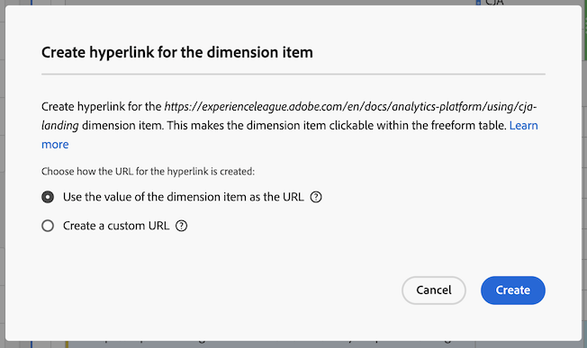
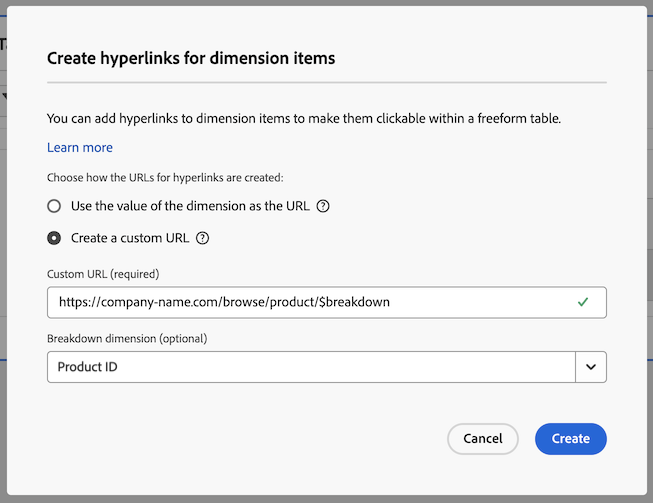

# Créer des liens hypertextes

Vous pouvez créer des liens hypertextes pour des éléments de dimension afin de les rendre cliquables dans un tableau à structure libre d’Analysis Workspace.

Cette fonctionnalité est particulièrement utile lors de la création de liens hypertextes pour les types d’éléments de dimension suivants :

* Éléments de dimension possédant des valeurs d’URL (par exemple, une dimension URL de page).

* Éléments de dimension contenant des répartitions ayant des valeurs d’URL (par exemple, une dimension Nom de page qui comporte une répartition d’une dimension URL de page).

* Éléments de dimension ou répartitions dont les valeurs font partie d’une URL (par exemple, une dimension Nom de page qui fait partie d’une URL).

>[!BEGINSHADEBOX]

Consultez  [Hyperlinks pour la dimension](https://video.tv.adobe.com/v/3445782?quality=12&learn=on&captions=fre_fr){target="_blank"} pour une vidéo de démonstration.

>[!ENDSHADEBOX]

## Créer des liens hypertextes

Tenez compte des points suivants lorsque vous créez des liens hypertextes pour un ou plusieurs éléments de dimension :

* Les liens hypertextes créés sont stockés dans le tableau à structure libre du projet Analysis Workspace. Les liens hypertextes ne sont pas conservés lorsque vous utilisez la même dimension ou les mêmes éléments de dimension dans un autre tableau ou dans un autre projet.

* Si vous modifiez la vue de données du tableau à structure libre, tous les liens hypertextes créés pour les dimensions ou les éléments de dimension du tableau restent disponibles. Cette fonctionnalité suppose que la dimension existe toujours dans la vue de données.

* La validité des URL n’est pas vérifiée lors de la création du lien hypertexte. Si vous

   * Créez un lien hypertexte dont l’URL n’est pas valide, ou
   * créez un lien hypertexte qui fait référence à un élément de dimension qui n’a pas de valeur d’URL (en référençant directement l’élément de dimension ou en utilisant les variables `$value` ou `$breakdown`),

  ensuite, les utilisateurs et utilisatrices qui cliquent sur le lien hypertexte voient un message d’erreur indiquant que l’URL n’est pas valide.

* Les liens hypertextes créés pour un seul élément de dimension remplacent les liens hypertextes créés sur la dimension.

* Les liens hypertextes ne sont pas fonctionnels dans les [fichiers PDF téléchargés](/help/analyze/analysis-workspace/curate-share/download-send.md).

Pour créer des liens hypertexte pour un ou plusieurs éléments de dimension :

1. Dans un tableau à structure libre d’Analysis Workspace, effectuez l’une des opérations suivantes :

   * **Créez un lien hypertexte pour un seul élément de dimension :** cliquez avec le bouton droit sur l’élément de dimension dans le tableau pour lequel vous souhaitez créer le lien hypertexte, puis sélectionnez [!UICONTROL **Créer un lien hypertexte**].

      1. Ouvrez le menu contextuel de l’élément de dimension.
      1. Sélectionnez [!UICONTROL **Créer un lien hypertexte**] dans le menu contextuel.

         La boîte de dialogue [!UICONTROL **Créer un lien hypertexte**] s’affiche. Le nom de l’élément de dimension pour lequel vous créez un lien hypertexte s’affiche dans la boîte de dialogue.

         

   * **Créez des liens hypertextes pour tous les éléments de dimension d’une colonne de dimension :** cliquez avec le bouton droit sur le nom de la dimension dans l’en-tête de colonne de dimension, puis sélectionnez [!UICONTROL **Créer des liens hypertextes pour tous les éléments de dimension**].

      1. Ouvrez le menu contextuel à partir de l’en-tête de colonne de dimension.
      1. Sélectionnez [!UICONTROL **Créer des liens hypertextes pour tous les éléments de dimension**] dans le menu contextuel.

         <!-- Do we really need a screenshot  -->

         La boîte de dialogue [!UICONTROL **Créer des liens hypertextes pour tous les éléments de dimension**] s’affiche. Le nom de la dimension pour laquelle vous créez des liens hypertextes s’affiche dans la boîte de dialogue.

         

1. Choisissez l’une des options suivantes :

   * [!UICONTROL **Utilisez la valeur de l’élément de dimension comme URL**] : sélectionnez cette option pour les éléments de dimension comportant des valeurs d’URL, tels qu’une dimension URL de page.

     Par exemple, si vous utilisez une dimension URL de page où la valeur de chaque élément de dimension est une URL, la sélection de cette option crée un lien hypertexte vers l’URL.

   * [!UICONTROL **Créez une URL personnalisée**] : spécifiez une URL personnalisée statique ou dynamique. Sélectionnez cette option pour créer des liens hypertextes pour les éléments de dimension qui ne possèdent pas de valeurs d’URL.

     Par exemple : vous utilisez une dimension Nom de page où la valeur de chaque élément de dimension correspond au nom d’une page (et non à une URL complète). Sélectionnez ensuite cette option pour spécifier un lien hypertexte à utiliser comme lien pour l’élément de dimension.

     Si vous souhaitez créer des URL dynamiques pour plusieurs éléments de dimension, vous pouvez utiliser les variables `$value` et `$breakdown` dans votre URL personnalisée. Pour plus d’informations, consultez le tableau ci-dessous.

     Pour créer une URL personnalisée, spécifiez les informations suivantes :

     | Champ | Description |
     |---------|----------|
     | [!UICONTROL **URL personnalisée**] | Spécifiez une URL personnalisée que vous souhaitez utiliser pour le lien hypertexte. Les URL doivent être saisies en tant qu’URL complètes. Par exemple : <https://www.example.com>
L’URL personnalisée que vous créez peut être statique ou dynamique.
 <ul><li>**URL statiques :** vous pouvez spécifier une URL statique pour un seul élément de dimension ou pour tous les éléments de dimension lorsque vous souhaitez que les éléments soient tous liés à la même URL. Par exemple : `https://wiki.internal.company_name/page_name#item_definition`
</li><li>**URL dynamiques :** vous pouvez créer une URL dynamique si vous souhaitez créer des liens hypertextes uniques pour plusieurs éléments de dimension ou pour tous les éléments de dimension d’une colonne de dimension.
Pour rendre les URL personnalisées dynamiques, vous incluez une variable dans l’URL pour modifier l’URL en fonction de la valeur de la dimension ou de la valeur de la dimension de répartition.

Lors de l’utilisation de variables, tous les éléments de dimension contenant des caractères non valides dans les URL (tels que des espaces) sont encodés en URL.

Les variables suivantes sont disponibles : (**Note** : bien que vous puissiez utiliser ces variables dans la même URL, il est plus courant de les utiliser séparément.)
 <ul><li>**`$value` :** permet d’insérer la valeur de l’élément de dimension dans l’URL que vous spécifiez. 
Supposons que vous souhaitiez créer des liens hypertextes pour tous les éléments de dimension Nom de page dans un tableau à structure libre, où la valeur de chaque élément de dimension fait partie de l’URL d’une page web. Dans ce cas, vous pouvez construire une seule URL personnalisée qui s’ajuste dynamiquement pour chaque élément de dimension.  Par exemple : `https://company-name.com/browse/product#\$value`

Lorsque cette URL personnalisée est appliquée à vos éléments de dimension Nom de page dont les valeurs sont « ProductY » et « ProductZ », les liens hypertextes générés devraient ressembler à ceci :  `https://company-name.com/browse/product#ProductY` et  `https://company-name.com/browse/product#ProductZ`. 

**Conseil** : l’ajout de la variable `$value` uniquement dans le champ URL personnalisée équivaut à sélectionner l’option [!UICONTROL **Utiliser la valeur de l’élément de dimension**] lors de la création de l’URL.
</li><li>**`$breakdown` :** permet d’insérer la valeur de l’élément de dimension de répartition dans l’URL que vous spécifiez. Avec `$breakdown`, vous pouvez utiliser une dimension dotée d’un nom convivial dans votre rapport (par exemple, une dimension Nom du produit). Générez ensuite un lien hypertexte en fonction d’une dimension de répartition qui peut être moins conviviale (comme une dimension ID de produit ou URL de page).
Lors du référencement d’une dimension de répartition, il est courant de n’avoir qu’un seul élément de répartition pour un élément de dimension donné. S’il existe plusieurs éléments de répartition pour un élément de dimension donné, la valeur du premier élément de répartition est utilisée dans l’URL. Si aucun élément de répartition n’est répertorié, l’URL n’est pas valide. L’ordre de tri appliqué aux éléments de répartition est le même que celui appliqué au tableau.

Vous spécifiez la dimension de répartition dans le champ [!UICONTROL **Dimension de répartition**] ci-dessous.
 
Examinons l’exemple de scénario décrit pour le champ [!UICONTROL **Dimension de répartition**] ci-dessous.
</li></ul> |
     | [!UICONTROL **Dimension de répartition (facultatif)**] | Commencez à saisir le nom de la dimension de répartition à utiliser, puis sélectionnez-la dans la liste déroulante. 
Si vous sélectionnez une dimension de répartition dans ce champ, vous devez la référencer à l’aide de la variable `$breakdown` dans l’URL que vous spécifiez dans le champ [!UICONTROL **URL personnalisée**].

Supposons que vous souhaitiez créer des liens hypertextes pour tous les éléments de dimension Nom du produit dans un tableau à structure libre. Chaque élément de dimension Nom du produit contient une répartition d’une dimension ID de produit.

Dans ce cas, vous pouvez créer des liens hypertextes pour chaque dimension Nom du produit qui dirige les utilisateurs et utilisatrices vers la page du produit à l’aide de la valeur de la dimension de répartition ID de produit. 

Ajoutez la variable `$breakdown` à la fin de l’URL personnalisée que vous spécifiez dans le champ [!UICONTROL **URL personnalisée**]. Par exemple :

`https://company-name.com/browse/product/$breakdown`
Lorsque cette URL personnalisée est appliquée à vos éléments de dimension Nom du produit (qui comportent des éléments de dimension de répartition dont les valeurs sont « ProductY » et « ProductZ »), les liens hypertextes générés ressemblent à  `https://company-name.com/browse/product/ProductY` et  `https://company-name.com/browse/product/ProductZ`.

Sélectionnez ensuite la dimension ID de produit dans le champ [!UICONTROL **Dimension de répartition**]. 

 |

1. Sélectionnez [!UICONTROL **Créer**].

   Les utilisateurs et utilisatrices qui consultent le tableau à structure libre voient les éléments de dimension liés par un lien hypertexte. Lorsque les utilisateurs et utilisatrices cliquent sur un élément de dimension, ils sont redirigés vers les pages contenant des liens hypertextes dans un onglet de navigateur distinct.

   <!-- add screenshot of a table with hyperlinks.-->

1. [Enregistrez le projet](/help/analyze/analysis-workspace/build-workspace-project/save-projects.md) pour enregistrer vos modifications.

## Modifier des liens hypertextes

Vous pouvez modifier les liens hypertextes qui ont été créés sur des dimensions ou des éléments de dimension dans un tableau à structure libre.

1. Dans un tableau à structure libre d’Analysis Workspace, effectuez l’une des opérations suivantes :

   * **Modifier un lien hypertexte pour un seul élément de dimension :**

      1. Ouvrez le menu contextuel de l’élément de dimension.
      1. Sélectionnez [!UICONTROL **Modifier le lien hypertexte**] dans le menu contextuel.

     <!-- Do we really need a screenshot? -->

   * **Modifier les liens hypertextes pour tous les éléments de dimension d’une colonne de dimension :**

      1. Ouvrez le menu contextuel à partir de l’en-tête de colonne de dimension.
      1. Sélectionnez **[!UICONTROL Modifier le lien hypertexte pour tous les éléments de dimension]** dans le menu contextuel.

     <!-- Do we really need a screenshot? -->

1. Sélectionnez [!UICONTROL **Modifier les liens hypertextes pour tous les éléments de dimension**] dans le menu de clic droit.

   La boîte de dialogue [!UICONTROL **Modifier les liens hypertextes des éléments de dimension**] s’affiche.

1. Pour plus d’informations sur les options de configuration de la modification du lien hypertexte, reportez-vous à l’Étape 3 de la section [Créer des liens hypertextes pour un ou plusieurs éléments de dimension](#create-hyperlinks-for-one-or-more-dimension-items) ci-dessus, puis sélectionnez [!UICONTROL **Appliquer**] lorsque vous avez terminé vos mises à jour.

1. [Enregistrez le projet](/help/analyze/analysis-workspace/build-workspace-project/save-projects.md) pour enregistrer vos modifications.

## Supprimer des liens hypertextes

Vous pouvez supprimer des liens hypertextes créés pour des éléments de dimension dans un tableau à structure libre.

>[!NOTE]
>
>Dans un tableau à structure libre, si vous supprimez une dimension contenant des liens hypertextes, les liens hypertextes ne sont pas conservés si vous rajoutez la même dimension au tableau à structure libre.

Pour supprimer des liens hypertextes d’éléments de dimension, procédez comme suit :

1. Dans un tableau à structure libre d’Analysis Workspace, effectuez l’une des opérations suivantes :

   * **Supprimer un lien hypertexte d’un seul élément de dimension :**

      1. Ouvrez le menu contextuel de l’élément de dimension.
      1. Sélectionnez [!UICONTROL **Supprimer le lien hypertexte**] dans le menu contextuel.
         <!-- Do we really need a screenshot? -->

   * **Supprimer les liens hypertextes de tous les éléments de dimension dans une colonne de dimension :**

      1. Ouvrez le menu contextuel à partir de l’en-tête de colonne de dimension.
      1. Sélectionnez **[!UICONTROL Supprimer le lien hypertexte de tous les éléments de dimension]** dans le menu contextuel.

     <!-- Do we really need a screenshot? [Remove hyperlink from a dimension](assets/hyperlink-dimension-remove.png)-->

   Le lien hypertexte est supprimé de l’élément de dimension unique si vous avez sélectionné un seul élément de dimension. Ou de tous les éléments de dimension si vous avez sélectionné le nom de la dimension dans l’en-tête de colonne de dimension.

1. [Enregistrez le projet](/help/analyze/analysis-workspace/build-workspace-project/save-projects.md) pour enregistrer vos modifications.
