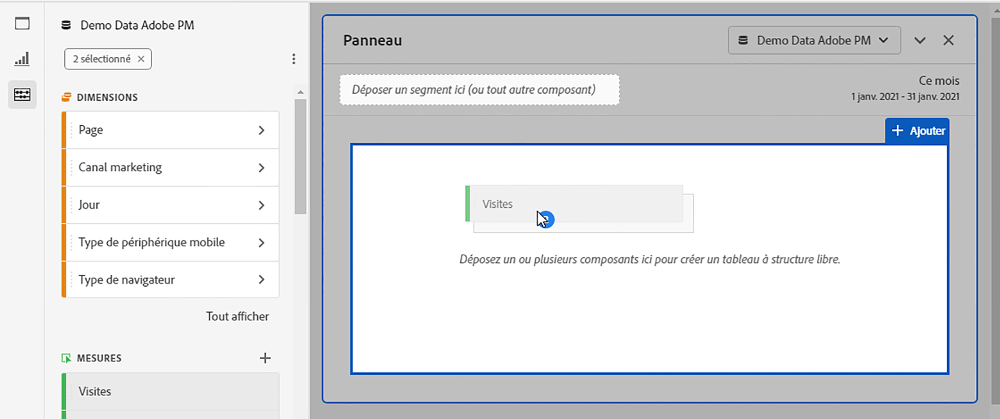
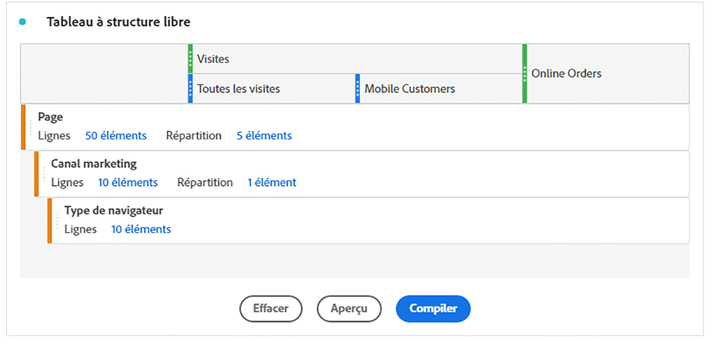
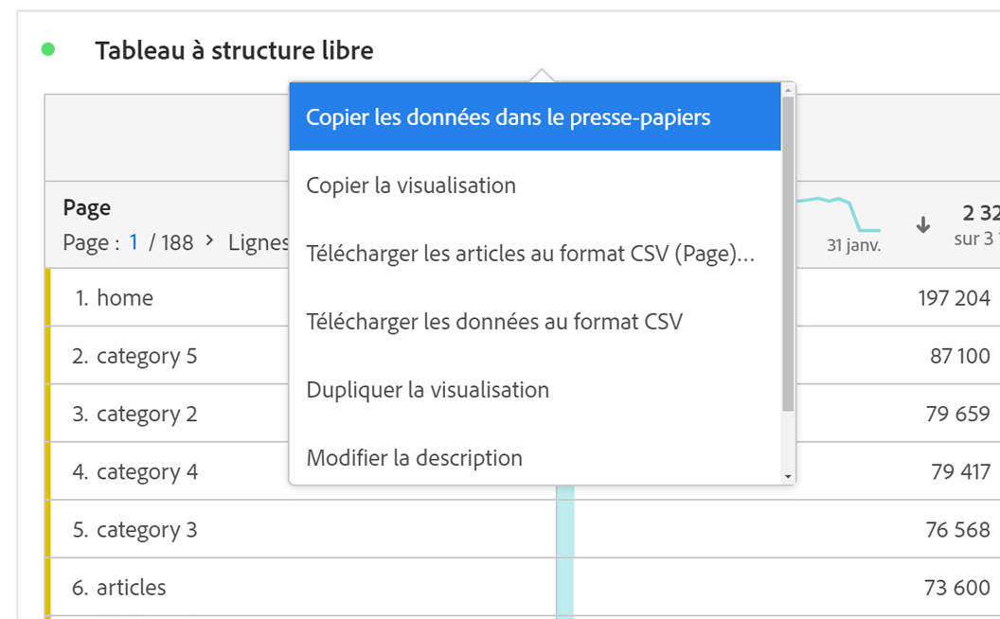

# Tableau à structure libre {#freeform-table-overview}

<!-- markdownlint-disable MD034 -->

>[!CONTEXTUALHELP]
>id="workspace_freeformtable_button"
>title="Tableau à structure libre"
>abstract="Créez une visualisation sous forme de tableau à structure libre vide à l’aide de dimensions, de segments, de mesures et de périodes. Vous pouvez utiliser le tableau à structure libre comme base pour d’autres visualisations."

<!-- markdownlint-enable MD034 -->

>[!BEGINSHADEBOX]

_Cet article présente la visualisation des tableaux à structure libre dans_  _**Adobe Analytics**._ _Voir [Tableau à structure libre](https://experienceleague.adobe.com/en/docs/analytics-platform/using/cja-workspace/visualizations/freeform-table/freeform-table) pour la version_  _**Customer Journey Analytics** de cet article._

>[!ENDSHADEBOX]

Dans Analysis Workspace, un tableau à structure libre est la base de l’analyse de données interactive. Vous pouvez faire glisser et déposer un ensemble de [composants](https://experienceleague.adobe.com/docs/analytics/analyze/analysis-workspace/components/analysis-workspace-components.html?lang=fr) dans les lignes et les colonnes afin de créer un tableau personnalisé pour votre analyse. Chaque composant étant déposé, le tableau se met immédiatement à jour, ce qui vous permet d’effectuer rapidement une analyse et d’approfondir vos connaissances.

## Créer un tableau à structure libre simple

Commencez avec un tableau à structure libre vide.

Si vous déposez la mesure **[!UICONTROL ** Visites **]** sur l’**[!UICONTROL ** Déposez une mesure ici (ou tout autre composant)**]** le tableau à structure libre est automatiquement renseigné avec des visites par jour pour la période calendaire que vous avez sélectionnée.

Si vous déposez ensuite la dimension **[!UICONTROL ** Page **]** pour remplacer la colonne de dimension **[!UICONTROL ** Jour **]**, le tableau à structure libre reflète automatiquement les visites pour chaque page.

Vous pouvez ensuite répartir, par exemple, la page **[!UICONTROL ** catégorie:5 **]** en déposant la dimension **[!UICONTROL ** Canal marketing **]** sur la ligne **[!UICONTROL ** catégorie:5 **]**.

## Tableaux automatisés

Comme illustré ci-dessus, le moyen le plus rapide de créer un tableau consiste à déposer directement les composants dans un projet vierge, un panneau ou un tableau à structure libre. Un tableau à structure libre sera automatiquement créé pour vous dans un format recommandé. [Regarder le tutoriel](https://experienceleague.adobe.com/docs/analytics-learn/tutorials/analysis-workspace/building-freeform-tables/auto-build-freeform-tables-in-analysis-workspace.html?lang=fr).

## Créateur de tableau à structure libre

Si vous préférez d’abord ajouter plusieurs composants à votre tableau, puis effectuer le rendu des données, vous pouvez activer le Créateur de tableau à structure libre. Lorsque le créateur est activé, vous pouvez faire glisser et déposer de nombreuses dimensions, répartitions, mesures et segments afin de créer des tableaux qui répondent à des questions plus complexes. Les données ne sont pas mises à jour à la volée, elles le sont une fois que vous avez cliqué sur **[!UICONTROL Créer]**.

## Interactions avec un tableau

Vous pouvez interagir et personnaliser un tableau à structure libre de différentes manières :

* **Lignes**
   * Vous pouvez afficher davantage de lignes sur un seul écran en réglant la [densité d’affichage](https://experienceleague.adobe.com/docs/analytics/analyze/analysis-workspace/build-workspace-project/view-density.html?lang=fr) du projet.
   * Chaque ligne de dimension peut afficher jusqu’à 400 lignes avant la pagination. Cliquez sur le numéro en regard de « Lignes » pour afficher d’autres lignes sur une page. Accédez à une autre page à l’aide de la flèche de page dans l’en-tête.
   * Les lignes peuvent être ventilées par composants supplémentaires. Pour répartir plusieurs lignes à la fois, sélectionnez simplement plusieurs lignes, puis faites glisser le composant suivant sur les lignes sélectionnées. En savoir plus sur la [répartition](https://experienceleague.adobe.com/docs/analytics/analyze/analysis-workspace/components/dimensions/t-breakdown-fa.html?lang=fr).
   * Les lignes peuvent être [filtrées](https://experienceleague.adobe.com/docs/analytics/analyze/analysis-workspace/visualizations/freeform-table/filter-and-sort.html) pour n’afficher que certains éléments. D’autres paramètres sont disponibles dans les [Paramètres des lignes](https://experienceleague.adobe.com/docs/analytics/analyze/analysis-workspace/visualizations/freeform-table/column-row-settings/table-settings.html?lang=fr).

* **Colonnes**
   * Les composants peuvent être empilés dans des colonnes afin de créer des mesures segmentées, des analyses sur plusieurs onglets, etc.
   * La vue de chaque colonne peut être ajustée dans les [Paramètres des colonnes](https://experienceleague.adobe.com/docs/analytics/analyze/analysis-workspace/build-workspace-project/column-row-settings/column-settings.html?lang=fr).
   * Plusieurs actions sont disponibles dans le [menu contextuel (clic droit)](https://experienceleague.adobe.com/docs/analytics-learn/tutorials/analysis-workspace/building-freeform-tables/using-the-right-click-menu.html?lang=fr). Ce menu propose différentes actions selon que vous cliquez sur l’en-tête, les lignes ou les colonnes du tableau.

## Exportation des données de tableau à structure libre

Découvrez-en plus sur toutes les [options dʼexportation](https://experienceleague.adobe.com/docs/analytics/analyze/analysis-workspace/curate-share/download-send.html?lang=fr) de données pour Analysis Workspace.

* Cliquer avec le bouton droit de la souris sur > **[!UICONTROL Copier les données dans le presse-papiers]** exporte les données du tableau affiché. Si une sélection de tableau est effectuée, cette option indique **[!UICONTROL Copier la sélection dans le presse-papiers]**. La touche dʼaccès rapide **Ctrl + C** copie également les données sélectionnées.
* Cliquer avec le bouton droit de la souris sur > **[!UICONTROL Télécharger les données au format CSV]** télécharge les données de tableau affichées au format CSV. Si une sélection de tableau est effectuée, cette option indique **[!UICONTROL Télécharger la sélection au format CSV]**.
* Cliquez avec le bouton droit de la souris > **[!UICONTROL Projet > Télécharger les éléments au format CSV]** pour exporter jusqu’à 50 000 éléments de dimension pour la dimension sélectionnée.

Découvrez-en plus sur toutes les [options dʼexportation](https://experienceleague.adobe.com/docs/analytics/analyze/analysis-workspace/curate-share/download-send.html?lang=fr) de données pour Analysis Workspace.

## Vidéos

Présentation du Créateur de tableaux à structure libre :

>[!VIDEO](https://video.tv.adobe.com/v/31318/?quality=12)

Filtres des tableaux à structure libre :

>[!VIDEO](https://video.tv.adobe.com/v/23232/?quality=12)

Totaux des tableaux à structure libre :

>[!VIDEO](https://video.tv.adobe.com/v/29273/?quality=12)
