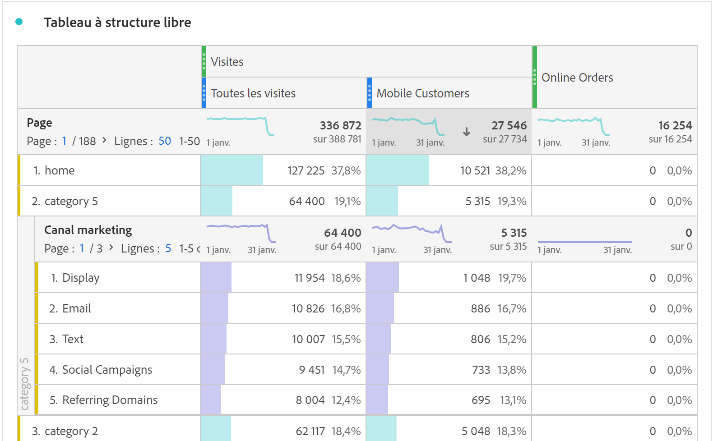

# Vue d’ensemble du tableau à structure libre {#freeform-table-overview}

<!-- markdownlint-disable MD034 -->

>[!CONTEXTUALHELP]
>id="workspace_freeformtable_button"
>title="Tableau à structure libre"
>abstract="Créez une visualisation sous forme de tableau à structure libre vide à l’aide de dimensions, de segments, de mesures et de périodes. Vous pouvez utiliser le tableau à structure libre comme base pour d’autres visualisations."

<!-- markdownlint-enable MD034 -->

>[!BEGINSHADEBOX]

_Cet article présente la visualisation Tableau à structure libre dans_  _&#x200B;**Adobe Analytics**._ _Voir [Tableau à structure libre](https://experienceleague.adobe.com/fr/docs/analytics-platform/using/cja-workspace/visualizations/freeform-table/freeform-table) pour la_ version  _&#x200B;**Customer Journey Analytics** de cet article._

>[!ENDSHADEBOX]

Dans Analysis Workspace, une visualisation  **[!UICONTROL Tableau à structure libre]** est la base de l’analyse de données interactive. Vous pouvez faire glisser et déposer un ensemble de [composants](/help/analyze/analysis-workspace/components/analysis-workspace-components.md) dans les lignes et les colonnes afin de créer un tableau personnalisé pour votre analyse. Lorsque chaque composant est déposé, le tableau est mis à jour immédiatement afin que vous puissiez effectuer rapidement une analyse en profondeur.

Pour créer et configurer un [!UICONTROL tableau à structure libre], procédez comme suit :

* Ajoutez une visualisation  **[!UICONTROL Tableau à structure libre]**. Consultez [Ajouter une visualisation à un panneau](../freeform-analysis-visualizations.md#add-visualizations-to-a-panel).

## Tableaux automatisés

Le moyen le plus rapide de créer un tableau consiste à déposer les composants directement dans un projet, un panneau ou un tableau à structure libre vierge. Un tableau à structure libre est automatiquement créé pour vous dans un format recommandé. [Regarder le tutoriel](https://experienceleague.adobe.com/fr/docs/analytics-learn/tutorials/analysis-workspace/building-freeform-tables/auto-build-freeform-tables-in-analysis-workspace).

## Créateur de tableau à structure libre

Si vous préférez d’abord ajouter plusieurs composants à votre tableau, puis effectuer le rendu des données, vous pouvez **[!UICONTROL activer le créateur de tableau]**. Une fois le créateur activé, vous pouvez faire glisser et déposer des dimensions, répartitions, mesures et filtres afin de créer des tableaux qui répondent à des problématiques plus complexes. Les données sont mises à jour une fois que vous avez sélectionné **[!UICONTROL Créer]**.

## Interactions

Vous pouvez interagir et personnaliser un tableau à structure libre de différentes manières :

### Filtrer et trier

* Vous pouvez [filtrer et trier](filter-and-sort.md) les données dans un tableau.

### Lignes

* Vous pouvez rapidement [créer une visualisation](../freeform-analysis-visualizations.md#visualize) à partir d’une ou de plusieurs lignes avec .
* Vous pouvez afficher davantage de lignes sur un seul écran en réglant la [densité d’affichage](/help/analyze/analysis-workspace/build-workspace-project/view-density.md) du projet.
* Chaque ligne de dimension peut afficher jusqu’à 400 lignes avant la pagination. Sélectionnez le nombre en regard de **[!UICONTROL Lignes]** dans le premier en-tête de colonne, pour afficher davantage de lignes sur une page. Accédez à une autre page à l’aide de  dans le premier en-tête de colonne.
* Vous pouvez répartir les lignes en fonction de composants supplémentaires. Pour répartir plusieurs lignes à la fois, sélectionnez plusieurs lignes, puis faites glisser le composant suivant sur les lignes sélectionnées. En savoir plus sur les [répartitions](/help/analyze/analysis-workspace/components/dimensions/t-breakdown-fa.md).
* Les lignes peuvent être [filtrées](/help/analyze/analysis-workspace/visualizations/freeform-table/filter-and-sort.md) pour n’afficher que certains éléments. D’autres paramètres sont disponibles dans les [Paramètres des lignes](/help/analyze/analysis-workspace/visualizations/freeform-table/column-row-settings/table-settings.md).

### Colonnes

* Les composants peuvent être empilés dans des colonnes afin de créer des mesures filtrées, des analyses sur plusieurs onglets, etc.
* La vue de chaque colonne peut être ajustée dans les [Paramètres des colonnes](/help/analyze/analysis-workspace/visualizations/freeform-table/column-row-settings/column-settings.md).
* Plusieurs actions sont disponibles dans le [menu contextuel](/help/analyze/analysis-workspace/visualizations/freeform-analysis-visualizations.md#context-menu). Ce menu propose différentes actions selon que vous sélectionnez l’en-tête, les lignes ou les colonnes du tableau.

## Paramètres

Sélectionnez  pour afficher **[!UICONTROL Paramètres du tableau]**. Les [paramètres](../freeform-analysis-visualizations.md#settings) de visualisation spécifiques suivants sont disponibles :

### Source de données

| Option | Description |
|---|---|
| **[!UICONTROL Visualisations liées]**. | Répertorie toutes les visualisations liées. |
| **[!UICONTROL Afficher la source de données]** | Lorsque cette option n’est pas cochée, le tableau à structure libre qui fonctionne comme source de données pour la visualisation est masqué dans Workspace. |

### Paramètres

| Option | Description |
|---|---|
| **[!UICONTROL Harmonisez les dates de chaque colonne afin qu’elles commencent toutes à la même ligne.]** | Pour harmoniser ou différencier les dates de chaque colonne afin qu’elles commencent toutes à partir de la même ligne. |

## Menu contextuel

Les options de [menu contextuel](../freeform-analysis-visualizations.md#context-menu) suivantes sont disponibles à partir de l’en-tête de la visualisation :

| Option | Description |
| --- | --- |
| **[!UICONTROL Insérer une visualisation copiée]** | Collez (insérez) une visualisation copiée à un autre emplacement au sein du projet, ou dans un tout autre projet. |
| **[!UICONTROL Copier les données dans le presse-papiers]** | Copiez les données de la visualisation dans le presse-papiers. |
| **[!UICONTROL Copier la sélection dans le presse-papiers]** | Copiez la sélection de la visualisation dans le presse-papiers. |
| **[!UICONTROL Télécharger les éléments au format CSV (*nom de dimension*)]** | Téléchargez immédiatement les éléments de dimension (jusqu’à 50 000 au maximum) de la visualisation sur votre appareil local. Un maximum de 50 000 éléments de dimension pour la dimension sélectionnée. |
| **[!UICONTROL Copier la visualisation]** | Copiez la visualisation pour vous permettre de l’insérer dans un autre emplacement au sein du projet, ou dans un autre projet. |
| **[!UICONTROL Télécharger les données au format CSV]** | Téléchargez immédiatement les données affichées de la visualisation sur votre appareil local. |
| **[!UICONTROL Dupliquer la visualisation]** | Créez un doublon exact de la visualisation. |
| **[!UICONTROL Modifier la description]** | Ajoutez (ou modifiez) une description textuelle de la visualisation. Consultez [Texte](../text.md). |
| **[!UICONTROL Obtenir le lien de la visualisation]** | Copiez et partagez un lien directement vers la visualisation. Une boîte de dialogue Partager le lien affiche le lien. Sélectionnez Copier pour copier le lien dans votre presse-papiers. |
| **[!UICONTROL Recommencer]** | Supprimez la configuration de la visualisation actuelle afin de pouvoir la reconfigurer entièrement. |

## Vidéos

>[!BEGINSHADEBOX]

Voir  [Vue d’ensemble du créateur de tableau à structure libre](https://video.tv.adobe.com/v/35892?quality=12&learn=on&captions=fre_fr){target="_blank"} pour une vidéo de démonstration.

>[!ENDSHADEBOX]

>[!BEGINSHADEBOX]

Voir  [Filtres de tableau à structure libre](https://video.tv.adobe.com/v/327356?quality=12&learn=on&captions=fre_fr){target="_blank"} pour une vidéo de démonstration.

>[!ENDSHADEBOX]

>[!BEGINSHADEBOX]

Voir  [Totaux de tableaux à structure libre](https://video.tv.adobe.com/v/33199?quality=12&learn=on&captions=fre_fr){target="_blank"} pour une vidéo de démonstration.

>[!ENDSHADEBOX]

>[!MORELIKETHIS]
>
>[Ajouter une visualisation à un panneau](/help/analyze/analysis-workspace/visualizations/freeform-analysis-visualizations.md#add-visualizations-to-a-panel)
>&#x200B;>[Paramètres de visualisation](/help/analyze/analysis-workspace/visualizations/freeform-analysis-visualizations.md#settings)
>&#x200B;>[Menu contextuel de visualisation](/help/analyze/analysis-workspace/visualizations/freeform-analysis-visualizations.md#context-menu)
>

