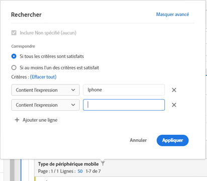

# Pagination, filtrage et tri des tables

Pour obtenir un aperçu, regardez ce tutoriel vidéo :

[Pagination, filtrage, et tri des tables dans Analysis Workspace](https://docs.adobe.com/help/fr-FR/analytics-learn/tutorials/analysis-workspace/building-freeform-tables/pagination-filtering-sorting-tables.html)

## Options de filtrage avancé {#section_36E92E31442B4EBCB052073590C1F025}

Cliquer sur l’icône de filtrage, puis sur Afficher les options avancées, en regard d’une dimension dans une table à structure libre permet de filtrer les informations selon les critères suivants :

* Contient
* Ne contient pas
* Contient tous les termes
* Contient n’importe quel terme
* Contient l’expression
* Ne contient aucun terme
* Ne contient pas l’expression
* Est égal à
* N’est pas égal à
* Commence par
* Se termine par

