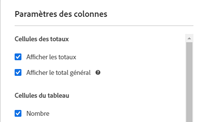
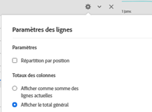

# Totaux de Workspace

Dans les tableaux à structure libre, une ligne de total s’affiche à chaque niveau de répartition et peut afficher deux totaux :

* **[!UICONTROL Total général]** (nombre en gris) : ce total représente tous les accès qui ont été collectés. Il est parfois appelé « total de la suite de rapports ». Lorsqu’un segment est appliqué au niveau du panneau ou dans le tableau à structure libre, ce total s’ajuste pour refléter tous les accès qui correspondent aux critères de segment.
* **[!UICONTROL Total du tableau]** (nombre en noir) : ce total est généralement égal au [!UICONTROL total général] ou est un sous-ensemble de ce dernier. Elle reflète les filtres de tableau appliqués dans le tableau à structure libre, y compris l’option [!UICONTROL Inclure aucun].

## Paramètre Afficher le total {#display-total}

Sous **[!UICONTROL Paramètres de colonne]**, vous pouvez sélectionner les options **[!UICONTROL Afficher les totaux]** et **[!UICONTROL Afficher le total général]**. Si ces paramètres sont désactivés, les totaux sont supprimés du tableau. Cela peut être souhaitable dans les cas où les totaux n’ont pas de sens, par exemple, dans certains [scénarios de mesure calculée](https://experienceleague.adobe.com/docs/analytics/components/calculated-metrics/calcmetrics-reference/cm-totals.html?lang=fr).

## Paramètres Total de ligne statique {#static-row-total}

Les totaux de [ligne statique](https://experienceleague.adobe.com/docs/analytics/analyze/analysis-workspace/visualizations/freeform-table/column-row-settings/manual-vs-dynamic-rows.html?lang=fr) se comportent différemment et peuvent être contrôlés sous **[!UICONTROL Paramètres de la ligne]**.

* **[!UICONTROL Afficher la somme des lignes actuelles en tant que total]** : affiche la somme des lignes du tableau côté client, ce qui signifie que le total ne dédupliquera **pas** de mesures telles que les visites ou les visiteurs.
* **[!UICONTROL Afficher le total général]** : indique une somme côté serveur, ce qui signifie que le total dédupliquera les mesures telles que les visites ou les visiteurs.

## Questions fréquentes

| Questions | Réponse |
|---|---|
| Sur quel « total » sont basés les pourcentages de la colonne grise ? | Cela dépend de la sélection du paramètre **[!UICONTROL Pourcentages]** sous **[!UICONTROL Paramètres de la ligne]** :<ul><li>Calculer les pourcentages par colonne : il s’agit du paramètre par défaut. Les pourcentages seront basés sur le total du tableau.</li><li>Calculer les pourcentages par ligne : les pourcentages seront basés sur le total général.</li></ul> |
| De quelle manière le paramètre **[!UICONTROL y compris Non spécifié (Aucun)]** affecte-t-il les totaux ? | Si le paramètre **[!UICONTROL y compris Non spécifié (Aucun)]** n’est pas coché, la ligne Aucun/Non spécifié sera supprimée du tableau, le Total du tableau, et sera répercutée sur toutes les mesures calculées qui utilisent les [types de mesures « Total »](https://experienceleague.adobe.com/docs/analytics/components/calculated-metrics/calcmetric-workflow/m-metric-type-alloc.html?lang=fr). |
| Lorsque des filtres de tableau personnalisés sont appliqués à un tableau à structure libre, est-ce que toutes mes mesures calculées et mon compte de mise en forme conditionnelle sont associés au filtre ? | Pas pour le moment. Le paramètre **[!UICONTROL y compris Non spécifié (Aucun)]** sera pris en compte, mais les filtres du tableau personnalisés n’auront aucun impact sur les éléments suivants :<ul><li>La plage max./min. de la colonne utilisée par la mise en forme conditionnelle s’appliquera à toutes les données.</li><li>Mesures calculées qui utilisent les types de mesures **[!UICONTROL Total général]**.</li><li>Mesures calculées avec des fonctions qui effectuent des calculs sur les lignes d’un tableau à structure libre, c’est-à-dire Somme de la colonne, Max. de la colonne, Min. de la colonne, Nombre, Moyenne, Médian, Percentile, Quartile, Nombre de lignes, Écart type, Variance, Cumulative, Moyenne cumulée, Variantes de régression, Score normalisé, Test en T, Score centré réduit, Test Z.</li></ul> |
| Dans les mesures calculées, que reflète le type de mesure **[!UICONTROL Total général]** ? | **[!UICONTROL Total général]** continue de faire référence au **[!UICONTROL total général]** et ne reflète pas les filtres appliqués à un tableau ou au **[!UICONTROL total du tableau]**. |
| Quel est le total affiché lorsque les données sont copiées et collées à partir d’un tableau à structure libre ou téléchargées via le format CSV ? | La ligne de total reflète uniquement le **[!UICONTROL total du tableau]** et respecte le paramètre **[!UICONTROL Afficher les totaux]** de la colonne. |
