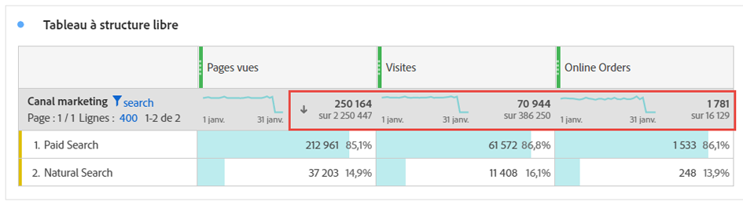

# Totaux {#workspace-totals}

>[!CONTEXTUALHELP]
>id="workspace_freeformtable_grandtotal"
>title="Total général"
>abstract="Le total général n’est pas pris en charge pour les tableaux ou les ventilations avec des lignes statiques."

Dans les tableaux à structure libre, une ligne de total s’affiche à chaque niveau de répartition et peut afficher deux totaux :

* **[!UICONTROL Total du tableau]** ➊ - Ce total est généralement égal à ou à un sous-ensemble du [!UICONTROL Total général]. Le total reflète les filtres de tableau appliqués dans le tableau à structure libre, y compris l’option [!UICONTROL Ne rien inclure].
* **[!UICONTROL Total général]** (**[!UICONTROL sur]** *nombre*) ➋ - Ce total représente tous les événements qui ont été collectés. Lorsquʼun filtre est appliqué au niveau du panneau ou dans le tableau à structure libre, ce total sʼajuste pour refléter tous les événements qui correspondent aux critères de filtre.

## Afficher les totaux

Sous  **[!UICONTROL Paramètres de colonne]**, vous pouvez trouver les options **[!UICONTROL Afficher les totaux]** et **[!UICONTROL Afficher le total général]**. Si ces paramètres ne sont pas cochés, les totaux sont supprimés du tableau, ce qui peut être souhaitable dans les cas où les totaux n’ont pas de sens.

Dans un tableau à structure libre contenant des [lignes statiques](/help/analyze/analysis-workspace/visualizations/freeform-table/column-row-settings/manual-vs-dynamic-rows.md), les totaux se comportent différemment. Et sont contrôlés à l’aide de  **[!UICONTROL Paramètres de ligne]**.

| Option | Description |
|---|---|
| **[!UICONTROL Afficher la somme des lignes actives comme total]** | Affichez une somme côté client des lignes du tableau. Ce total ne déduplique **pas** les mesures telles que les sessions ou les personnes. |
| **[!UICONTROL Afficher le total général]** | Affichez une somme côté serveur. Ce total déduplique les mesures telles que les sessions ou les personnes. |

Consultez [Éléments de dimension dynamiques ou statiques dans les tableaux à structure libre](column-row-settings/manual-vs-dynamic-rows.md).

## Questions fréquentes

| Questions | Réponse |
|---|---|
| Sur quel *total* sont basés les pourcentages de la colonne grise ? | Ce *total* dépend de la sélection du paramètre **[!UICONTROL Pourcentages]** sous **[!UICONTROL Paramètres de la ligne]** :<ul><li>Calculer les pourcentages par colonne : ce paramètre est la valeur par défaut. Les pourcentages sont basés sur le total du tableau.</li><li>Calculer les pourcentages par ligne : les pourcentages sont basés sur le total général.</li></ul> |
| De quelle manière le paramètre **[!UICONTROL y compris Non spécifié (Aucun)]** affecte-t-il les totaux ? | Si le paramètre Inclure non spécifié (Aucun) n’est pas coché, la ligne Aucun/Non spécifié est supprimée du tableau, du Total du tableau et est appliquée à toutes les mesures calculées qui utilisent [ types de mesures « Total »](/help/components/c-calcmetrics/c-workflow/cm-workflow/c-build-metrics/m-metric-type-alloc.md). |
| Lorsque des filtres de tableau personnalisés sont appliqués à un tableau à structure libre, est-ce que toutes mes mesures calculées et mon compte de mise en forme conditionnelle sont associés au filtre ? | Pas pour le moment. Le compte **[!UICONTROL Inclure non spécifié (Aucun)]** est pris en compte, mais les filtres de tableau personnalisés n’ont aucune incidence sur les éléments suivants :<ul><li>La plage max/min de la colonne utilisée par la mise en forme conditionnelle s’applique à toutes les données.</li><li>Mesures calculées qui utilisent les types de mesures **[!UICONTROL Total général]**.</li><li>Mesures calculées avec des fonctions qui effectuent des calculs sur les lignes d’un tableau à structure libre, c’est-à-dire Somme de la colonne, Colonne max, Colonne min, Nombre, Moyenne, Médiane, Percentile, Quartile, Nombre de lignes, Écart type, Variance, Cumulatif, Moyenne cumulée, Variantes de régression, Score normalisé, Test en T, Score centré réduit, Test Z.</li></ul> |
| Dans les mesures calculées, que signifie le type de mesure **[!UICONTROL Total général]** ? | **[!UICONTROL Total général]** continue de faire référence au **[!UICONTROL total général]** et ne reflète pas les filtres appliqués à un tableau ou au **[!UICONTROL total du tableau]**. |
| Quel est le total affiché lorsque les données sont copiées et collées à partir d’un tableau à structure libre ou téléchargées via le format CSV ? | La ligne de total reflète uniquement le **[!UICONTROL total du tableau]** et respecte le paramètre **[!UICONTROL Afficher les totaux]** de la colonne. |
