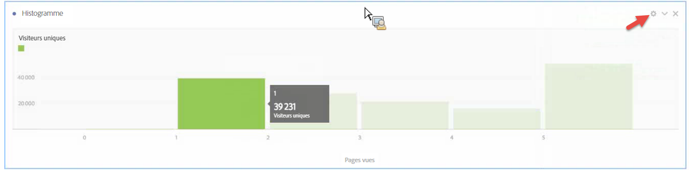
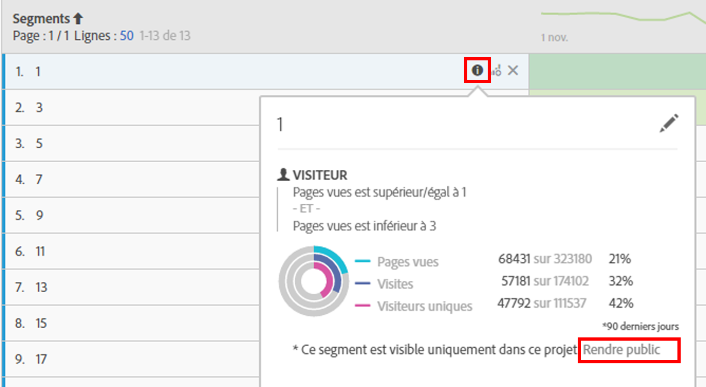

# Histogramme {#histogram}

arkdownlint-disable MD034 —>

>[!CONTEXTUALHELP]
>id="workspace_histogram_button"
>title="Histogramme"
>abstract="Créez une visualisation sous forme d’histogramme représentant la distribution des données numériques en groupes de plages."

<!-- markdownlint-enable MD034 -->

>[!BEGINSHADEBOX]

*Cet article présente la visualisation de l’histogramme dans **Adobe Analytics**. Voir [Histogramme](https://experienceleague.adobe.com/en/docs/analytics-platform/using/cja-workspace/visualizations/histogram) pour la version **Customer Journey Analytics**de cet article.*

>[!ENDSHADEBOX]

Un histogramme est semblable à un graphique à barres, à ceci près qu’il regroupe les chiffres par classes (intervalles). Analytics automatise la classification des chiffres. Vous pouvez toutefois modifier les paramètres dans les [Paramètres avancés](#section_09D774C584864D4CA6B5672DC2927477).

Regardez cette vidéo sur lʼutilisation des histogrammes :

>[!VIDEO](https://video.tv.adobe.com/v/23725/?quality=12)

## Création d’un histogramme {#section_74647707CC984A1CB6D3097F43A30B45}

Pour créer un histogramme, procédez comme suit :

1. Cliquez sur **[!UICONTROL Visualisations]** dans le rail de gauche.
1. Faites glisser **[!UICONTROL Histogramme]** sur le panneau.
1. Faites glisser une mesure sur la visualisation Histogramme, puis cliquez sur **[!UICONTROL Créer]**.

>[!NOTE]
>
>Les histogrammes prennent seulement en charge les mesures standard, et non les mesures calculées.

Ici, nous avons utilisé la mesure Pages vues par visiteurs uniques. La première classe (à gauche) correspond à une page vue par visiteur unique, la deuxième à deux pages vues, etc.

## Paramètres avancés {#section_09D774C584864D4CA6B5672DC2927477}

Pour régler les paramètres de l’histogramme, cliquez sur l’icône d’engrenage Paramètres dans le coin supérieur droit. Voici les paramètres que vous pouvez modifier :

| Paramètres de l’histogramme | Description |
|---|---|
| Intervalle de début | Détermine par quel intervalle commence l’histogramme. « 1 » par défaut. Peut être défini sur 0 à l’infini (aucun nombre négatif). |
| Intervalles de mesures | Permet d’augmenter ou de réduire le nombre de plages de données (intervalles). Le nombre maximal d’intervalles est de 50. |
| Taille de l’intervalle de mesures | Permet de définir la taille de chaque intervalle. Vous pouvez par exemple modifier la taille de l’intervalle d’une page vue à deux pages vues. |
| Méthode de comptage | Permet de choisir parmi [Visiteur](/help/components/metrics/unique-visitors.md), [Visite](/help/components/metrics/visits.md) ou [Type d’accès](/help/components/dimensions/hit-type.md). Par exemple, pages vues par visite ou pages vues par visiteur ou pages vues par accès. Pour l’accès, la mesure « Occurrences » est utilisée comme mesure de l’axe Y dans un tableau à structure libre. |

<!--Russ or Meike - Check Hit Type link above. -->

**Exemples** :

* Intervalle de début : 1 ; Intervalles de mesures : 5 ; Taille de l’intervalle de mesures : 2 générera cet histogramme : 1-2, 3-4, 5-6, 7-8, 9-10.
* Intervalle de début : 0 ; Intervalles de mesures : 3 ; Taille de l’intervalle de mesures : 5 générera cet histogramme : 0-4, 5-9, 10-14.

## Affichage et modification des données de l’histogramme {#section_B2CD7CDF0F6B432F928103AE7AAA3617}

Pour afficher ou modifier la source de données de l’histogramme, cliquez sur le point en regard de l’en-tête Histogramme pour accéder à **[!UICONTROL Paramètres de source de données]** > **[!UICONTROL Afficher la source de données]**.

Les segments prédéfinis du tableau sont des segments internes ; ils n’apparaîtront pas dans le sélecteur de segments. Cliquez sur l’icône « i » en regard du nom du segment, puis, pour le rendre public, cliquez sur **[!UICONTROL Rendre public]**.

Pour découvrir d’autres façons de générer des tableaux de données à structure libre et d’autres visualisations (répartitions de données, par exemple), cliquez [ici](https://experienceleague.adobe.com/docs/analytics/analyze/analysis-workspace/visualizations/freeform-analysis-visualizations.html?lang=fr).
