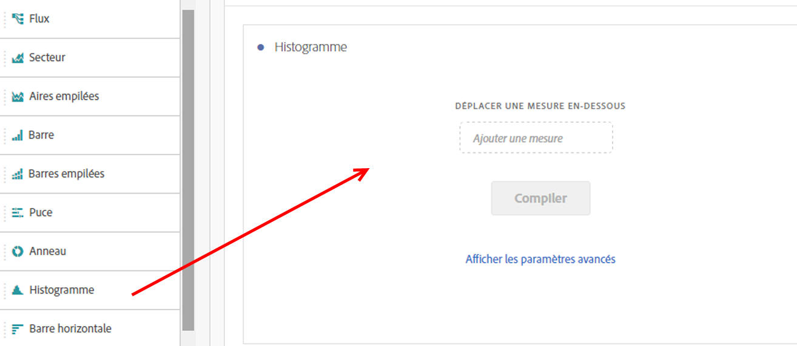

# Histogramme {#histogram}

>[!CONTEXTUALHELP]
>id="workspace_histogram_button"
>title="Histogramme"
>abstract="Créez une visualisation sous forme d’histogramme représentant la distribution des données numériques en groupes de plages."

>[!BEGINSHADEBOX]

_Cet article présente la visualisation de l’histogramme dans_  _&#x200B;**Adobe Analytics**._ _Voir [Histogramme](https://experienceleague.adobe.com/fr/docs/analytics-platform/using/cja-workspace/visualizations/histogram) pour la version_  _&#x200B;**Customer Journey Analytics** de cet article._

>[!ENDSHADEBOX]

La visualisation  **[!UICONTROL Histogramme]** est semblable à un graphique [!UICONTROL Barres], à ceci près qu’elle regroupe les chiffres par classes (compartiments). Analytics automatise la classification des chiffres. Vous pouvez toutefois modifier les paramètres dans les [Paramètres avancés](#advanced-settings).

## Utilisation

Pour créer un histogramme, procédez comme suit :

1. Ajoutez une visualisation  **[!UICONTROL Histogramme]**. Consultez [Ajouter une visualisation à un panneau](freeform-analysis-visualizations.md#add-visualizations-to-a-panel).
1. Faites glisser une mesure à partir de la liste des composants **[!UICONTROL Mesures]** ou sélectionnez une mesure dans le menu déroulant [!UICONTROL *Ajouter une mesure*].
1. (Facultatif) Sélectionnez **[!UICONTROL Afficher les paramètres avancés]**. Consultez [Paramètres avancés](#advanced-settings).
1. Sélectionnez la **[!UICONTROL Version]**.

>[!NOTE]
>
>Les histogrammes prennent seulement en charge les mesures standard, et non les mesures calculées.

Dans l’exemple ci-dessous, un histogramme est utilisé pour regrouper les sessions pour le nombre de personnes. L’histogramme indique que la plupart des personnes disposent de 16 à 21 sessions pour la période sélectionnée.

## Paramètres avancés

Dans le cadre de la visualisation, des paramètres d’histogramme spécifiques sont disponibles.

| Paramètres de l’histogramme | Description |
|---|---|
| **[!UICONTROL Compartiment de début]** | Détermine par quel intervalle commence l’histogramme. « 1 » par défaut. Peut être défini sur 0 à l’infini (aucun nombre négatif). |
| **[!UICONTROL Compartiments de mesure]** | Permet d’augmenter ou de réduire le nombre de plages de données (intervalles). Il ne peut pas y avoir plus de 50 intervalles. |
| **[!UICONTROL Taille du compartiment de mesure]** | Permet de définir la taille de chaque intervalle. Vous pouvez par exemple modifier la taille de l’intervalle d’une page vue à deux pages vues. |
| **[!UICONTROL Méthode de comptage]** | Faites votre choix entre **[!UICONTROL Personne]**, **[!UICONTROL Session]** ou **[!UICONTROL Événement]**. Par exemple, pages vues par session ou pages vues par personne ou pages vues par événement. |

<!--Russ or Meike - Check Hit Type link above. -->

**Exemples** :

| Compartiment de début | Compartiments de mesure | Taille du compartiment de mesure | Résultats |
|:----:|:--:|:--:|:--|
| 1 | 5 | 2 |  |
| 0 | 3 | 5 |  |

>[!MORELIKETHIS]
>
>[Ajouter une visualisation à un panneau](/help/analyze/analysis-workspace/visualizations/freeform-analysis-visualizations.md#add-visualizations-to-a-panel)
>[Paramètres de visualisation](/help/analyze/analysis-workspace/visualizations/freeform-analysis-visualizations.md#settings)
>[Menu contextuel de visualisation](/help/analyze/analysis-workspace/visualizations/freeform-analysis-visualizations.md#context-menu)
>[Utiliser des histogrammes pour identifier les valeurs de données inattendues](https://experienceleaguecommunities.adobe.com/t5/adobe-analytics-blogs/using-histograms-to-identify-unexpected-data-values/ba-p/596168)

