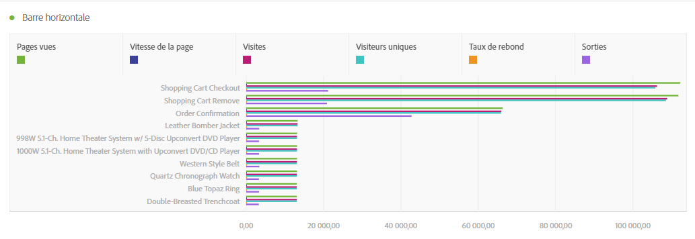
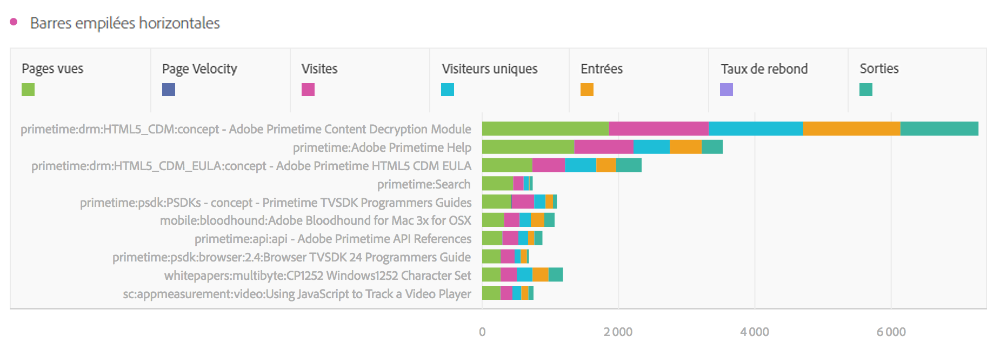
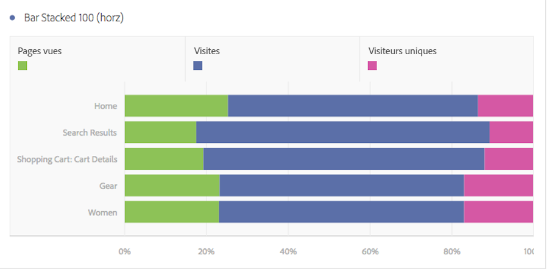

# Barres horizontales et barres empilées horizontales

## Barre horizontale {#section_73A4D6F6C8864045A97B0B32B5FFFEDB}

Dans cette visualisation, des barres horizontales représentent plusieurs valeurs pour une ou plusieurs mesures.

## Barres empilées horizontales  {#section_50C08E9E20A94024A6553BC352ADB597}

Cette visualisation ressemble au [!UICONTROL graphique à barres horizontales], mais les barres de chaque série semblent être empilées.

Un nouveau paramètre d’affichage [!UICONTROL Barres empilées horizontales] appliqué aux graphiques à barres empilées offre un aperçu « 100 % empilé » du diagramme :

