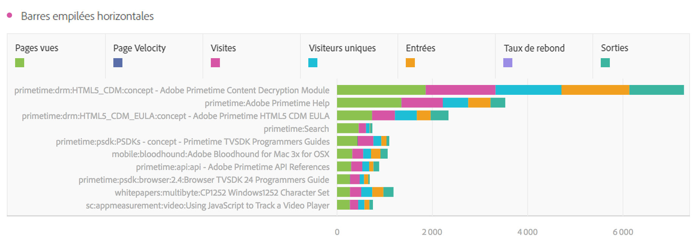

# Barres horizontales (empilées)

>[!BEGINSHADEBOX]

_Cet article présente les visualisations Barre horizontale et Barre horizontale empilée dans_  _**Adobe Analytics**._ _Voir [Barre horizontale et barre horizontale empilée](https://experienceleague.adobe.com/fr/docs/analytics-platform/using/cja-workspace/visualizations/horizontal-bar) pour la version_ CustomerJourneyAnalytics de cet article.** _

>[!ENDSHADEBOX]

La visualisation Barres horizontales comporte une option standard et une option empilée.

## Barre horizontale {#horizontal-bar}

<!-- markdownlint-disable MD034 -->

>[!CONTEXTUALHELP]
>id="workspace_horizontalbar_button"
>title="Barres horizontales"
>abstract="Créez une visualisation à barres horizontales pour représenter différentes valeurs pour une ou plusieurs mesures."

<!-- markdownlint-enable MD034 -->

La visualisation  **[!UICONTROL Barres horizontales]** affiche des barres horizontales représentant plusieurs valeurs pour une ou plusieurs mesures.

## Barres empilées horizontales {#horizontal-bar-stacked}

<!-- markdownlint-disable MD034 -->

>[!CONTEXTUALHELP]
>id="workspace_horizontalbarstacked_button"
>title="Barres empilées horizontales"
>abstract="Créez une visualisation à barres horizontales pour représenter différentes valeurs pour une ou plusieurs mesures empilées."

<!-- markdownlint-enable MD034 -->

La visualisation  **[!UICONTROL Barres horizontales empilées]** est semblable à la visualisation [!UICONTROL Barre horizontale], mais les barres de la série apparaissent empilées.

Utilisez l’option **[!UICONTROL Empilé à 100 %]** dans  **[!UICONTROL Paramètres]** pour transformer le graphique en visualisation empilée à 100 %.

>[!MORELIKETHIS]
>
>[Ajouter une visualisation à un panneau](/help/analyze/analysis-workspace/visualizations/freeform-analysis-visualizations.md#add-visualizations-to-a-panel)
>[Paramètres de visualisation](/help/analyze/analysis-workspace/visualizations/freeform-analysis-visualizations.md#settings)
>[Menu contextuel de visualisation](/help/analyze/analysis-workspace/visualizations/freeform-analysis-visualizations.md#context-menu)
>

