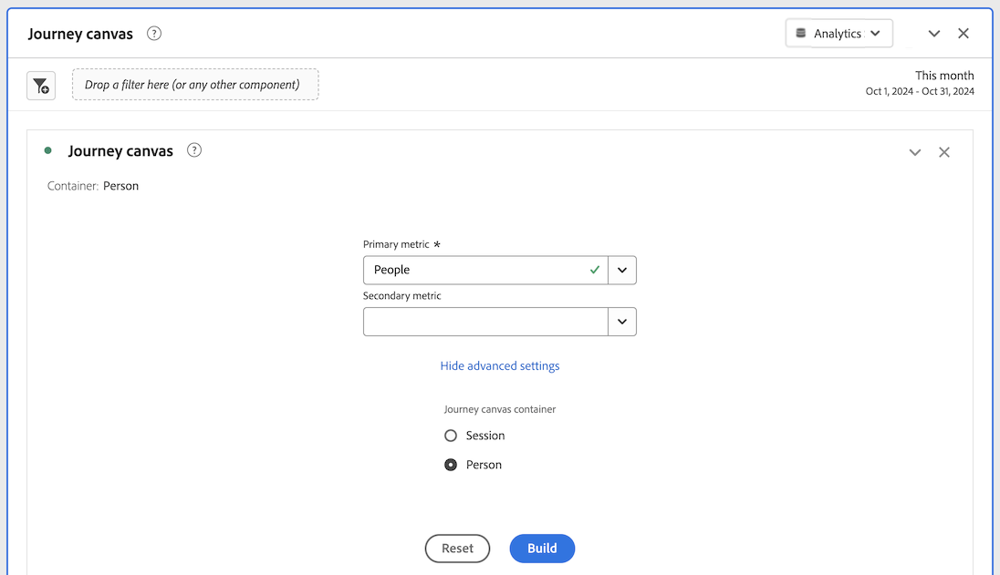
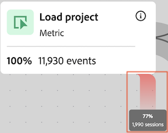

# Configurer une visualisation de zone de travail de parcours {#configure-journey-canvas}

>[!BEGINSHADEBOX]

_Cet article présente la visualisation de la zone de travail de Parcours dans_  _&#x200B;**Adobe Analytics**.  _ Voir [Configurer une visualisation de la zone de travail de Parcours &#x200B;](https://experienceleague.adobe.com/fr/docs/analytics-platform/using/cja-workspace/visualizations/journey-canvas/configure-journey-canvas) pour la version __&#x200B;**Customer Journey Analytics**&#x200B;de cet article._

>[!ENDSHADEBOX]

{{release-limited-testing}}

La visualisation Zone de travail de parcours vous permet d’analyser les parcours que vous fournissez à vos utilisateurs et utilisatrices et à votre clientèle, et d’obtenir des informations détaillées à leur sujet.

## Vue d’ensemble de la zone de travail de parcours

Voir [Vue d’ensemble de la zone de travail de parcours](/help/analyze/analysis-workspace/visualizations/journey-canvas/journey-canvas.md) pour en savoir plus sur la zone de travail de parcours, notamment :

* Principales fonctionnalités

* Informations potentielles

* Différences entre la zone de travail de parcours et l’abandon

* Et bien plus encore.

## Commencer à créer une visualisation de zone de travail de parcours

1. Ajoutez un panneau vierge à votre projet, sélectionnez l’icône [!UICONTROL **Visualisations**] dans le rail de gauche, puis faites glisser la visualisation  [!UICONTROL **Zone de travail du parcours**] dans le panneau.

   Ou

   Ajoutez une visualisation de zone de travail de parcours de l’une des manières décrites dans la section [Ajouter des visualisations à un panneau](/help/analyze/analysis-workspace/visualizations/freeform-analysis-visualizations.md#add-visualizations-to-a-panel) de l’article [Vue d’ensemble des visualisations](/help/analyze/analysis-workspace/visualizations/freeform-analysis-visualizations.md).

   

1. Spécifiez les informations de base suivantes pour configurer la zone de travail du parcours :

   | Champ | Fonction |
   |---------|----------|
   | [!UICONTROL **Mesure principale**] | Détermine la mesure utilisée lors du calcul des valeurs de pourcentage et de nombre sur chaque nœud du parcours.
**Remarque** : la portée des données incluses dans chaque valeur de pourcentage et de nombre est déterminée par la mesure que vous choisissez dans le champ **[!UICONTROL Conteneur de zone de travail de parcours]**. Par exemple, si l’élément **[!UICONTROL Personne]** est défini comme conteneur, les statistiques affichées dans le parcours s’étendent sur plusieurs sessions pour une personne donnée. Si l’élément **[!UICONTROL Session]** est défini comme conteneur, les statistiques affichées dans le parcours sont limitées à une seule session définie pour une personne donnée.

Examinons les exemples suivants illustrant l’impact de la mesure principale sur les valeurs de pourcentage et de nombre de chaque nœud :
<ul><li>Si l’élément _Personnes_ est la mesure principale et que l’élément _Personne_ est le conteneur, alors seules les personnes disposant d’un événement correspondant aux critères de chaque nœud successif du parcours se déplacent dans le parcours. L’abandon se produit sur un nœud lorsqu’une personne n’est jamais arrivée aux nœuds suivants immédiats du parcours. Il se peut qu’elle ait effectué d’autres actions sur le site, mais cela ne répondait aux critères définis par les nœuds venant juste après.</li><li>Si l’élément _Personnes_ est la mesure principale et que l’élément _Session_ est le conteneur, alors seules les personnes disposant d’un événement correspondant aux critères de chaque nœud du parcours dans une seule session se déplacent dans le parcours. L’abandon se produit sur un nœud lorsqu’une personne n’est jamais arrivée à un nœud suivant immédiat du parcours au cours d’une seule session. Il se peut qu’elle ait effectué d’autres actions sur le site au cours de la session, mais cela ne répondait pas aux critères définis par les nœuds venant juste après.</li></ul> 
La mesure principale influe sur les aspects suivants de la visualisation de la zone de travail de parcours :
<ul><li>Nombre total affiché sur chaque nœud.  
Par exemple, si la mesure principale est Événements, chaque nœud indique le nombre de personnes qui ont eu un événement correspondant aux critères de ce nœud (et de chaque nœud précédent qui y mène dans le parcours).
</li><li>Pourcentage affiché sur chaque nœud. (Une fois la visualisation créée, vous pouvez utiliser le menu déroulant **[!UICONTROL Valeur de pourcentage]** pour choisir d’afficher le pourcentage du total, le pourcentage du nœud précédent ou le pourcentage du nœud de départ.)
Par exemple, si la mesure principale est Événements, chaque nœud affiche le pourcentage de personnes qui ont eu un événement correspondant aux critères de ce nœud (et de chaque nœud précédent qui y mène dans le parcours).
</li><li>Lorsqu’une dimension est ajoutée à la visualisation, les 3 premiers nœuds de la visualisation sont ajoutés, en fonction de la mesure principale.</li></ul> |
   | [!UICONTROL **Mesure secondaire**] | Détermine la mesure secondaire utilisée lors du calcul des valeurs de pourcentage et de nombre sur chaque nœud du parcours. La mesure secondaire est facultative. 
**Remarque** : la portée des données incluses dans chaque valeur de pourcentage et de nombre est déterminée par la mesure que vous choisissez dans le champ **[!UICONTROL Conteneur de zone de travail de parcours]**. Par exemple, si l’élément **[!UICONTROL Personne]** est défini comme conteneur, les statistiques affichées dans le parcours s’étendent sur plusieurs sessions pour une personne donnée. Si l’élément **[!UICONTROL Session]** est défini comme conteneur, les statistiques affichées dans le parcours sont limitées à une seule session définie pour une personne donnée.

Lorsqu’une mesure secondaire est configurée, elle influe sur les aspects suivants de la visualisation de la zone de travail de parcours :
<ul><li>Nombre total affiché sur chaque nœud sous la mesure principale. 
Par exemple, si l’élément Comptes est la mesure secondaire, le nombre de comptes s’affiche sur le nœud pour toutes les personnes qui ont atteint ce nœud dans le parcours.
</li><li>Pourcentage affiché sur chaque nœud sous la mesure principale. (Une fois la visualisation créée, vous pouvez choisir d’afficher le pourcentage du total ou du nœud de départ.)</li>
Par exemple, si Sessions est la mesure secondaire, chaque nœud affiche le pourcentage de sessions ayant atteint ce nœud dans le parcours (soit le pourcentage du total, soit celui du nœud de départ).
</li></ul> |

1. (Facultatif) Sélectionnez [!UICONTROL **Afficher les paramètres avancés**], puis spécifiez les informations suivantes :

   | Champ | Fonction |
   |---------|----------|
   | [!UICONTROL **Conteneur de la zone de travail de parcours**] | Sélectionnez le conteneur sur lequel vous souhaitez placer le focus tout au long du parcours. Le conteneur que vous choisissez détermine la portée des données capturées dans le parcours. Cela affecte les statistiques affichées dans la visualisation. (Si les noms de vos conteneurs diffèrent des noms par défaut affichés ci-dessous, ils ont été personnalisés dans votre suite de rapports.)<ul><li>**Session :** limite les statistiques de la visualisation à une seule session définie pour une personne donnée. Cela signifie que les nombres et les pourcentages qui apparaissent sur chaque nœud (en fonction des mesures principales et secondaires) doivent se produire au cours d’une seule session pour chaque personne. En d’autres termes, une personne peut être représentée plusieurs fois dans un seul parcours.
Ce conteneur utilise la mesure Sessions.
</li><li>**Personne :** (par défaut) permet aux statistiques de la visualisation d’étendre plusieurs sessions pour une personne donnée. Cela signifie que les nombres et les pourcentages qui apparaissent sur chaque nœud (qui sont basés sur les mesures principales et secondaires) peuvent survenir sur un nombre illimité de sessions, à condition que celles-ci appartiennent à la même personne. En d’autres termes, une personne ne peut être représentée qu’une seule fois dans un seul parcours.
Ce conteneur utilise la mesure Personnes.
</li></ul> |

1. Sélectionnez le [!UICONTROL **build**].

1. Configurez le parcours comme décrit dans [Configuration des paramètres de visualisation](#configure-visualization-settings).

## Configurer les paramètres de visualisation {#configure-visualization-settings}

<!-- markdownlint-disable MD034 -->

>[!CONTEXTUALHELP]
>id="aa_journeycanvas_percentage_value"
>title="Choisir le mode de calcul des pourcentages"
>abstract="Les pourcentages affichés sur chaque nœud sont basés sur les mesures principales et secondaires que vous configurez. Vous pouvez choisir si les pourcentages se rapportent au nœud de départ, au nœud précédent ou à toutes les données de la suite de rapports."

<!-- markdownlint-enable MD034 -->

Plusieurs options de configuration sont disponibles dans l’en-tête de la zone de travail de parcours.

Pour configurer les paramètres de la visualisation de la zone de travail de parcours :

1. Dans Analysis Workspace, ouvrez une visualisation de zone de travail de parcours existante ou [commencez à en créer une nouvelle](#begin-building-a-journey-canvas-visualization).

   Les options permettant de configurer la visualisation de la zone de travail de parcours sont disponibles dans l’en-tête :

   

1. Configurez l’un des paramètres suivants qui s’affichent en haut de la visualisation :

   | Paramètre | Fonction |
   |---------|----------|
   | [!UICONTROL **Valeur en pourcentage**] | Valeur de pourcentage affichée sur chaque nœud du parcours.

 
Tenez compte des points suivants lors de la configuration des valeurs de pourcentage affichées sur les nœuds du parcours :
<ul><li>Un pourcentage est affiché sur chaque nœud pour la mesure principale. Un pourcentage s’affiche également pour la mesure secondaire si l’une d’elles est configurée. (Pour plus d’informations sur les paramètres des mesures principales et secondaires, voir [Commencer à créer une visualisation de zone de travail de parcours](#begin-building-a-journey-canvas-visualization).)</li><li>Les pourcentages incluent toutes les personnes ou sessions incluses dans la suite de rapports au cours de la période du panneau. L’utilisation de _personnes_ ou _sessions_ dépend du paramètre de conteneur. (Pour plus d’informations sur le paramètre de conteneur, voir [Commencer à créer une visualisation de zone de travail de parcours](#begin-building-a-journey-canvas-visualization).)</li></ul> 
Choisissez l’une des options suivantes :
 <ul><li>[!UICONTROL **Pourcentage du nœud de départ**] : calcule les pourcentages affichés sur chaque nœud par rapport au nœud de départ. Les pourcentages sont basés sur les mesures principale et secondaire que vous avez sélectionnées. 
Un _nœud de départ_ est un nœud qui n’est précédé d’aucun nœud connecté.

Un parcours peut contenir plusieurs nœuds de départ. Cependant, le paramètre [!UICONTROL **Pourcentage du total**] est utilisé si le parcours contient 2 nœuds de début ou plus menant à un nœud commun. Si vous souhaitez utiliser le paramètre [!UICONTROL **Pourcentage du nœud de départ**], mettez à jour le parcours de sorte que chaque nœud du parcours puisse être retracé jusqu’à un seul nœud de départ.
</li><li>[!UICONTROL **Pourcentage du nœud précédent**] : calcule les pourcentages affichés sur chaque nœud par rapport au nœud précédent. Les pourcentages sont basés sur les mesures principale et secondaire que vous avez sélectionnées.</li><li>[!UICONTROL **Pourcentage du total**] : calcule les pourcentages affichés sur chaque nœud par rapport à toutes les données de la suite de rapports. Les pourcentages sont basés sur les mesures principale et secondaire que vous avez sélectionnées.</li></ul> |
   | [!UICONTROL **Paramètres des flèches**] | Les flèches qui s’affichent entre les nœuds dans la zone de travail de parcours peuvent être configurées pour afficher des libellés et des valeurs personnalisés. 

Les _libellés_ sont des noms personnalisés que vous pouvez ajouter dans la zone de travail du Parcours, comme décrit dans la section [Ajouter ou mettre à jour un libellé sur une flèche](#add-or-update-a-label-on-an-arrow).</li></ol>
Les _valeurs_ correspondent aux nombres et aux pourcentages qui apparaissent sur les flèches et elles indiquent les personnes ou les sessions qui sont passées d’un nœud au suivant dans le parcours. (En d’autres termes, celles qui n’ont pas quitté le parcours à une étape donnée.) 

Les options disponibles sont les suivantes :
<ul><li>[!UICONTROL **Aucun libellé**] : aucun libellé n’est affiché sur les flèches du parcours.   Cette option est disponible uniquement si le parcours a été modifié dans </li><li>[!UICONTROL **Libellés uniquement**] : les libellés sont affichés sur les flèches du parcours.</li></ul> |
   | [!UICONTROL **Afficher les abandons**] | Les données d’abandons affichent un pourcentage et un nombre d’abandons de chaque nœud du parcours. Les données d’abandons sont basées sur la mesure associée aux paramètres du conteneur du parcours. Elles ne sont pas basées sur la mesure principale ou secondaire. 

Par défaut, le conteneur est _Personne_, la mesure utilisée pour les données d’abandons est donc _Personnes_. Si le conteneur est défini sur _Session_, la mesure utilisée pour les données d’abandons est _Sessions_, et ainsi de suite.

Par exemple, avec le paramètre de conteneur _Personne_, les abandons affichent le pourcentage et le nombre de personnes sur chaque nœud du parcours qui ne sont jamais parvenues aux nœuds suivants immédiats. Il se peut qu’elle ait effectué d’autres actions sur le site, mais cela ne répondait aux critères définis par les nœuds venant juste après.
 
Pour plus d’informations sur le paramètre du conteneur de zone de travail de parcours, consultez [Commencer à créer une visualisation de zone de travail de parcours](#begin-building-a-journey-canvas-visualization). |
   | **Contrôles de zoom** | Les contrôles de zoom suivants sont disponibles dans le coin supérieur droit de la zone de travail :<ul><li>**Zoom avant**  : permet d’agrandir des zones spécifiques de la visualisation.
Vous pouvez également utiliser les contrôles de la souris, comme le pincement sur un pavé tactile.</li><li>**Zoom arrière**  : permet de réduire la visualisation pour laisser plus de place à la zone de travail.
Vous pouvez également utiliser les contrôles de la souris, comme le pincement sur un pavé tactile.
</li><li>**Ajuster à l’écran**  : permet d’ajuster les paramètres de zoom et de panoramique actuels pour remplir l’écran avec la visualisation complète.</li></ul>
Pour effectuer un panoramique sur la zone de travail après un zoom avant ou arrière, cliquez avec la souris et faites glisser jusqu’à l’emplacement souhaité.
 |

1. Continuez avec [Ajouter des nœuds](#add-nodes).

## Ajouter des nœuds

Les nœuds dans une visualisation de zone de travail de parcours représentent les événements ou les actions d’un parcours utilisateur.

Pour créer des nœuds, procédez comme suit : en faisant glisser des composants de Workspace du rail de gauche vers la zone de travail, en laissant la zone de travail de parcours choisir les nœuds supérieurs suivants ou précédents en fonction des nœuds existants ou en dupliquant des nœuds existants.

### Faire glisser des composants à partir du rail de gauche

1. Dans Analysis Workspace, ouvrez une visualisation de zone de travail de parcours existante ou [commencez à en créer une nouvelle](#begin-building-a-journey-canvas-visualization).

1. Faites glisser des mesures, des dimensions, des éléments de dimension, des segments ou des périodes du rail de gauche vers la zone de travail. Toutefois, les mesures calculées ne sont pas prises en charge.

   Vous pouvez sélectionner plusieurs composants dans le rail de gauche en maintenant la touche Maj enfoncée ou en maintenant la touche Commande (sur Mac) ou Ctrl (sur Windows) enfoncée.

   La visualisation est mise à jour en fonction de la mesure principale comme suit (selon le type de composant et la zone de travail où vous le placez) :

   | Type de composant | Placement du composant | La visualisation est mise à jour après l’ajout du nœud. |
   |---------|----------|----------|
   | Mesure | Zone vierge de la zone de travail | Le nœud affiche l’emplacement où le composant a été déposé, déconnecté de tout nœud existant. |
   | Mesure | Un nœud existant | Le composant est automatiquement combiné avec le nœud existant. (Consultez [Combiner des nœuds](#combine-nodes) pour plus d’informations.) |
   | Mesure | Une flèche entre 2 nœuds existants | Le nœud s’affiche entre les deux nœuds existants sur lesquels le composant a été déposé et il est connecté aux deux nœuds existants. (Consultez [Connecter des nœuds](#connect-nodes) pour plus d’informations.) |
   | Dimension | Zone vierge de la zone de travail | 3 nœuds sont créés pour les 3 éléments de dimension supérieurs où le composant a été déposé, déconnectés des nœuds existants. (**Remarque :** si 1 ou 2 nœuds seulement s’affichent, cela signifie que des données ne sont disponibles que pour 1 ou 2 des éléments de dimension. Si aucun nœud ne s’affiche, cela signifie que des données ne sont disponibles pour aucun des éléments de dimension. Dans ce cas, essayez de l’ajouter à un autre point du parcours, d’ajuster la période de la visualisation ou de choisir une autre dimension.)
Maintenez la touche Maj enfoncée lorsque vous déposez la dimension sur la zone de travail pour l’ajouter en tant que nœud unique avec 3 éléments de dimension.
 |
   | Dimension | Un nœud existant | Une répartition est automatiquement appliquée au nœud dans lequel les 5 éléments de dimension supérieurs sont affichés.<!--what happens if you hold Shift?-->
Pour afficher la répartition dans une nouvelle visualisation de tableau à structure libre, sélectionnez le lien [!UICONTROL **Ouvrir dans un tableau à structure libre**] sur le nœud.
 |
   | Dimension | Une flèche qui connecte 2 nœuds existants | 3 nœuds sont créés pour les 3 éléments de dimension supérieurs qui suivent le premier événement après le premier nœud (de personnes/sessions qui parviennent finalement au deuxième nœud). Les nœuds s’affichent entre les deux nœuds existants sur lesquels le composant a été déposé et chaque nœud est connecté aux deux nœuds existants. (**Remarque :** si 1 ou 2 nœuds seulement s’affichent, cela signifie que des données ne sont disponibles que pour 1 ou 2 des éléments de dimension. Si aucun nœud ne s’affiche, cela signifie que des données ne sont disponibles pour aucun des éléments de dimension. Dans ce cas, essayez de l’ajouter à un autre point du parcours, d’ajuster la période de la visualisation ou de choisir une autre dimension.)
Maintenez la touche Maj enfoncée lorsque vous déposez la dimension sur la zone de travail pour l’ajouter en tant que nœud unique avec 3 éléments de dimension. (Consultez [Connecter des nœuds](#connect-nodes) pour plus d’informations.)
 |
   | Élément de dimension | Zone vierge de la zone de travail | Le nœud affiche l’emplacement où le composant a été déposé, déconnecté de tout nœud existant. |
   | Élément de dimension | Un nœud existant | Le composant est automatiquement combiné avec le nœud existant. |
   | Élément de dimension | Une flèche qui connecte 2 nœuds existants | Le nœud s’affiche entre les deux nœuds existants sur lesquels le composant a été déposé et il est connecté aux deux nœuds existants. (Consultez [Connecter des nœuds](#connect-nodes) pour plus d’informations.) |
   | Segment | Zone vierge de la zone de travail | Le nœud affiche l’emplacement où le composant a été déposé, déconnecté de tout autre nœud.
Le nombre et le pourcentage qui apparaissent sur le nœud incluent le total de la mesure principale, segmentée en fonction du segment que vous avez sélectionné.
 
Par exemple, si Personnes est sélectionné comme mesure principale pour le parcours, l’ajout d’un segment Aujourd’hui à une zone vierge de la zone de travail affiche toutes les personnes qui ont rencontré un événement aujourd’hui.
 |
   | Segment | Un nœud existant | Applique le segment au nœud existant. |
   | Segment | Une flèche qui connecte 2 nœuds | Le nœud s’affiche entre les deux nœuds existants sur lesquels le composant a été déposé et il est connecté aux deux nœuds existants. (Consultez [Connecter des nœuds](#connect-nodes) pour plus d’informations.)
Applique le segment au point sur le chemin où le composant a été déposé.
 |
   | Période | Zone vierge de la zone de travail | Le nœud affiche l’emplacement où le composant a été déposé, déconnecté de tout autre nœud.
Le nombre et le pourcentage qui apparaissent sur le nœud incluent le total de la mesure principale, segmentée en fonction de la période que vous avez sélectionnée.
 
Par exemple, si Personnes est sélectionné comme mesure principale pour le parcours, l’ajout d’une période Ce mois-ci à une zone vierge de la zone de travail affiche toutes les personnes qui ont rencontré un événement pendant le mois en cours.
 |
   | Période | Un nœud existant | Applique la période au nœud existant. |
   | Période | Une flèche qui connecte 2 nœuds | Le nœud s’affiche entre les deux nœuds existants sur lesquels le composant a été déposé et il est connecté aux deux nœuds existants. (Consultez [Connecter des nœuds](#connect-nodes) pour plus d’informations.)
Applique la période au point sur le chemin où le composant a été déposé.
 |
   | Composants multiples | Une zone vierge de la zone de travail | **Si aucun des composants n’est une dimension :**
Chaque composant s’affiche sous la forme d’un nœud distinct où les composants ont été déposés, déconnectés de tout nœud existant.

Maintenez la touche Maj enfoncée lorsque vous déposez les composants sur la zone de travail pour les ajouter en tant que nœud combiné. 

**Si l’un des composants que vous ajoutez est une dimension :**

Chaque composant s’affiche sous la forme d’un nœud distinct où les composants ont été déposés, déconnectés de tout nœud existant.

Une seule dimension peut être ajoutée à la fois. Lorsque la dimension est ajoutée, 3 nœuds sont créés pour les 3 éléments de dimension supérieurs où le composant a été déposé.

Maintenez la touche Maj enfoncée lorsque vous déposez les composants sur la zone de travail pour les ajouter en tant que nœud combiné. Les 3 éléments de dimension supérieurs sont combinés avec chaque nœud. (Consultez [Combiner des nœuds](#combine-nodes) pour plus d’informations.)
 |
   | Composants multiples | Un nœud existant | Tous les composants sont combinés avec le nœud existant.
Si l’un des composants que vous ajoutez est une dimension, les 3 éléments de dimension supérieurs sont combinés avec le nœud.
 
Une seule dimension peut être ajoutée à la fois.
 |
   | Composants multiples | Une flèche qui connecte 2 nœuds existants | **Si aucun des composants n’est une dimension :**
Chaque composant s’affiche sous la forme d’un nœud distinct où les composants ont été déposés et chaque nœud est connecté aux deux nœuds existants. (Consultez [Connecter des nœuds](#connect-nodes) pour plus d’informations.)
Maintenez la touche Maj enfoncée lorsque vous déposez les composants sur la zone de travail pour les ajouter en tant que nœud combiné. (Les composants doivent être du même type pour être combinés en un seul nœud.) (Consultez [Combiner des nœuds](#combine-nodes) pour plus d’informations.)

**Si l’un des composants que vous ajoutez est une dimension :**

Chaque composant s’affiche sous la forme d’un nœud distinct où les composants ont été déposés et chaque nœud est connecté aux deux nœuds existants.

Une seule dimension peut être ajoutée à la fois. Lorsque la dimension est ajoutée, 3 nœuds sont créés pour les 3 éléments supérieurs de la dimension qui suivent le premier événement après le premier nœud (de personnes ou de sessions qui parviennent finalement au deuxième nœud). Chaque nœud est connecté aux deux nœuds existants. (Consultez [Connecter des nœuds](#connect-nodes) pour plus d’informations.)

Maintenez la touche Maj enfoncée lorsque vous déposez les composants sur la zone de travail pour les ajouter en tant que nœud combiné. Les 3 éléments de dimension supérieurs sont combinés avec chaque nœud, et chaque nœud est connecté aux deux nœuds existants. (Consultez [Combiner des nœuds](#combine-nodes) pour plus d’informations.)
 |

   Les nœuds s’affichent sous la forme d’une zone rectangulaire avec les informations suivantes :

   * Nom du composant

   * Le type de composant (mesure ou dimension, par exemple)

   * Statistiques de mesure principale (total et pourcentage)

   * Statistiques de mesure secondaire (total et pourcentage)

   Un nœud clignotant ou brillant indique que des données sont en cours de chargement pour ce nœud.

1. Répétez ce processus pour continuer à ajouter des nœuds afin de créer votre parcours.

1. Continuez à personnaliser le parcours comme décrit dans les sections ci-dessous. Vous pouvez connecter des nœuds, renommer des nœuds, appliquer des répartitions, créer des audiences, ajouter des contraintes temporelles, et bien d’autres encore.

### Afficher les nœuds supérieurs en fonction des nœuds existants

Vous pouvez afficher automatiquement les nœuds supérieurs immédiats en fonction des nœuds qui se trouvent déjà sur la zone de travail. Vous pouvez ajouter les nœuds supérieurs à la zone de travail de parcours ou les afficher dans un tableau à structure libre.

La zone de travail de parcours utilise la mesure principale lors de la détermination des nœuds à afficher.

Cette option est disponible pour les objets suivants sur la zone de travail :

* Nœuds individuels

* Flèche entre des nœuds

#### Afficher les nœuds supérieurs après un nœud existant

Vous pouvez sélectionner un nœud et afficher les éléments de dimension supérieurs qui le suivent immédiatement dans le parcours. Vous pouvez ajouter les 3 éléments de dimension supérieurs à la zone de travail de parcours sous la forme de nœuds distincts ou afficher tous les éléments de dimension supérieurs dans un tableau à structure libre.

1. Cliquez avec le bouton droit sur le nœud où vous souhaitez afficher les éléments de dimension supérieurs qui le suivent dans le parcours.

   Le nœud ne peut pas comporter de nœuds existants qui en sortent dans le parcours.

1. Sélectionnez [!UICONTROL **Afficher les nœuds supérieurs après ce nœud**].

1. Sélectionnez l’emplacement où vous souhaitez afficher les éléments de dimension :

   * [!UICONTROL **Dans la zone de travail de parcours**] : permet d’ajouter à la zone de travail les 3 nœuds supérieurs qui suivent ce nœud dans le parcours. Chaque nœud est connecté au nœud que vous avez sélectionné en tant que branche distincte sur la zone de travail.

   * [!UICONTROL **Dans un tableau à structure libre**] : permet de créer une visualisation de tableau à structure libre présentant tous les éléments de dimension supérieurs qui suivent ce nœud dans le parcours.

1. Sélectionnez la dimension souhaitée dans la liste des dimensions.

   Selon ce que vous avez choisi à l’étape précédente, les 3 éléments de dimension supérieurs sont ajoutés à la zone de travail sous la forme de 3 nœuds distincts, ou tous les éléments de dimension supérieurs sont affichés dans un tableau à structure libre.

#### Afficher les nœuds supérieurs avant un nœud existant

Vous pouvez sélectionner un nœud et afficher les éléments de dimension supérieurs qui le précèdent immédiatement dans le parcours. Vous pouvez ajouter les 3 éléments de dimension supérieurs à la zone de travail de parcours sous la forme de nœuds distincts ou afficher tous les éléments de dimension supérieurs dans un tableau à structure libre.

1. Cliquez avec le bouton droit sur le nœud où vous souhaitez afficher les éléments de dimension supérieurs qui le précèdent dans le parcours.

   Le nœud ne peut pas comporter de nœuds existants qui y entrent dans le parcours.

1. Sélectionnez [!UICONTROL **Afficher les nœuds supérieurs avant ce nœud**].

1. Sélectionnez l’emplacement où vous souhaitez afficher les éléments de dimension :

   * [!UICONTROL **Dans la zone de travail de parcours**] : permet d’ajouter à la zone de travail les 3 nœuds supérieurs qui précèdent ce nœud dans le parcours. Chaque nœud est connecté au nœud que vous avez sélectionné en tant que branche distincte sur la zone de travail.

   * [!UICONTROL **Dans un tableau à structure libre**] : permet de créer une visualisation de tableau à structure libre présentant tous les éléments de dimension supérieurs qui précèdent ce nœud dans le parcours.

1. Sélectionnez la dimension souhaitée dans la liste des dimensions.

   Selon ce que vous avez choisi à l’étape précédente, les 3 éléments de dimension supérieurs sont ajoutés à la zone de travail sous la forme de 3 nœuds distincts, ou tous les éléments de dimension supérieurs sont affichés dans un tableau à structure libre.

#### Afficher les nœuds supérieurs entre les nœuds existants

Vous pouvez sélectionner une flèche et afficher les éléments de dimension supérieurs qui se trouvent entre 2 nœuds existants dans le parcours. Vous pouvez ajouter les 3 éléments de dimension supérieurs à la zone de travail de parcours sous la forme de nœuds distincts ou afficher tous les éléments de dimension supérieurs dans un tableau à structure libre.

1. Cliquez avec le bouton droit sur la flèche entre les 2 nœuds où vous souhaitez afficher les éléments de dimension supérieurs.

1. Sélectionnez [!UICONTROL **Afficher les nœuds supérieurs entre ces nœuds**].

1. Sélectionnez l’emplacement où vous souhaitez afficher les éléments de dimension :

   * [!UICONTROL **Dans la zone de travail de parcours**] : permet d’ajouter à la zone de travail les 3 nœuds supérieurs qui se trouvent entre les 2 nœuds existants. Chaque nœud est connecté aux nœuds environnants en tant que branche distincte sur la zone de travail.

   * [!UICONTROL **Dans un tableau à structure libre**] : permet de créer une visualisation de tableau à structure libre présentant tous les éléments de dimension supérieurs qui se trouvent entre les 2 nœuds existants.

1. Sélectionnez la dimension souhaitée dans la liste des dimensions.

   Selon ce que vous avez choisi à l’étape précédente, les 3 éléments de dimension supérieurs sont ajoutés à la zone de travail sous la forme de 3 nœuds distincts, ou tous les éléments de dimension supérieurs sont affichés dans un tableau à structure libre.

### Dupliquer des nœuds

L’option de duplication est disponible pour les objets suivants sur la zone de travail :

* Nœuds individuels

* Plusieurs nœuds

Pour dupliquer des nœuds :

1. Sélectionnez un ou plusieurs nœuds que vous souhaitez dupliquer.

   Pour sélectionner plusieurs nœuds, maintenez la touche Commande (sur Mac) ou Ctrl (sur Windows) enfoncée.

1. Cliquez avec le bouton droit sur l’un des nœuds sélectionnés, puis sélectionnez [!UICONTROL **Dupliquer**].

## Concevoir le parcours

L’ordre des nœuds et les connexions entre eux affectent les données de la zone de travail de parcours. Les parcours doivent refléter visuellement et précisément la séquence d’événements sur laquelle vous souhaitez créer un rapport.

Une fois les nœuds ajoutés à la zone de travail, vous pouvez les réorganiser, les combiner, les connecter et ajouter des contraintes temporelles entre eux.

### Réorganiser les nœuds

Les parcours dans la zone de travail de parcours comprennent un graphique flexible de nœuds et de flèches représentant n’importe quelle combinaison d’événements, d’éléments de dimension et de segments.

Vous pouvez faire glisser des nœuds sur la zone de travail pour réorganiser les événements et les conditions du parcours.

À mesure que vous réorganisez l’ordre des nœuds dans le parcours, les données sont mises à jour en conséquence.

### Combiner des nœuds

Un nœud combiné dans la zone de travail de parcours est un point unique dans le parcours utilisateur (nœud) qui contient 2 composants ou plus reliés entre eux par une logique.

#### Créer des nœuds combinés

Vous pouvez effectuer l’une des opérations suivantes pour combiner des nœuds dans la zone de travail de parcours :

* Dans le rail de gauche, faites glisser un composant sur un nœud de la zone de travail.

* Dans le rail de gauche, faites glisser plusieurs composants simultanément sur un nœud de la zone de travail.

* Dans le rail de gauche, faites glisser plusieurs composants simultanément sur une zone vierge de la zone de travail tout en maintenant la touche Maj enfoncée.

<!-- * On the canvas, select the nodes that you want to combine, right-click one of the selected nodes, then select **Combine**. Is there a limit on how many you can combine? -->

#### Logique lors de la combinaison de nœuds

La logique appliquée aux nœuds lorsqu’ils sont combinés diffère selon les types de composants que vous combinez, comme suit :

>[!TIP]
>
>Vous pouvez afficher la logique d’un nœud combiné en cliquant avec le bouton droit sur le nœud, puis en sélectionnant [!UICONTROL **Créer un segment depuis le nœud**]. La logique est affichée dans la section [!UICONTROL **Définition**].

| Types de composants à combiner | Logique (opérateur) utilisée |
|---------|----------|
| Mesure + mesure | Jonction avec OR |
| Élément de dimension + élément de dimension (de la même dimension parente) | Jonction avec OR |
| Élément de dimension + élément de dimension (de différentes dimensions parentes) | Jonction avec AND |
| Segment + segment | Jonction avec AND |
| Dimension + mesure, période ou segment | Jonction avec AND |
| Période + mesure, segment ou dimension | Jonction avec AND |
| Segment + mesure, période ou dimension | Jonction avec AND |

### Connecter des nœuds

Vous pouvez connecter des nœuds qui se trouvent déjà sur la zone de travail ou connecter un nœud lors de son ajout à la zone de travail.

Connectez des nœuds pour définir la séquence d’événements du parcours.

#### Flèches entre les nœuds

Les nœuds sont connectés par une flèche. La direction et la largeur de la flèche sont toutes deux importantes :

* **Direction** : indique la séquence des événements du parcours

* **Largeur** : indique le volume en pourcentage d’un nœud par rapport à un autre

  

#### Logique lors de la connexion de nœuds

Lorsque vous connectez des nœuds dans la zone de travail de parcours, ils sont connectés à l’aide de l’opérateur THEN. C’est ce qu’on appelle également la [segmentation séquentielle](/help/components/segmentation/segmentation-workflow/seg-sequential-build.md).

Les nœuds sont connectés en tant que « chemin définitif », ce qui signifie que les visiteurs et visiteuses sont comptabilisés tant qu’ils passent finalement d’un nœud à l’autre, quels que soient les événements qui se produisent entre les 2 nœuds. Le temps imparti aux utilisateurs et utilisatrices pour se déplacer sur le chemin est déterminé par le paramètre du conteneur.<!-- It can also be controlled by [adding a time constraint](#add-a-time-constraint-between-nodes). -->

Vous pouvez afficher la logique de nœuds connectés en cliquant avec le bouton droit sur le nœud, puis en sélectionnant [!UICONTROL **Créer un segment depuis le nœud**]. La logique est affichée dans la section [!UICONTROL **Définition**].

#### Connecter des nœuds existants

Les parcours ne peuvent pas être circulaires, en revenant vers des nœuds précédemment connectés.

Pour connecter des nœuds dans la zone de travail de parcours :

1. Dans une visualisation de zone de travail de parcours, pointez sur le nœud se trouvant en premier dans la séquence de parcours que vous souhaitez connecter à un autre nœud.

   4 points bleus apparaissent de chaque côté du nœud sélectionné.

1. Faites glisser l’un des 4 points bleus vers l’un des 4 côtés du nœud auquel vous souhaitez le connecter.

   Une flèche s’affiche, connectant les 2 nœuds. Consultez [Flèches entre les nœuds](#arrows-between-nodes) pour plus d’informations.

#### Connecter des nœuds lors de l’ajout d’un nœud

Lors de l’ajout d’un nœud à la zone de travail, vous pouvez le placer entre deux nœuds connectés. Le nœud est ajouté au flux du parcours entre les 2 nœuds existants.

Pour plus d’informations, voir [Ajouter des nœuds](#add-nodes).

<!--

### Add a time constraint between nodes

>[!AVAILABILITY]
>
>This feature is not yet available.

You can set a time constraint between nodes. When a time constraint is in place, people are considered to have fallen out of the journey if they follow the defined journey but take longer than the allotted time period to move between the nodes.

The option to add a time constraint is available for the following objects on the canvas:

* The arrow between nodes

To add a time constraint:

1. In a Journey canvas visualization, right-click the arrow between 2 nodes, then select [!UICONTROL **Add time constraint**].

from Travis: You can set time to be within X amount of time or after X amount of time (those are the only two options I think, but we can check with Brandon). 
1. Choose from the following options: 

-->

## Gérer des nœuds ou des flèches

<!--

### Change the color of a node or arrow

>[!AVAILABILITY]
>
>This feature is not yet available.

You can visually customize a journey by changing the color of any node or arrow on the canvas. For example, you could adjust colors to indicate a desirable or undesirable event.

The option to change the color is available for the following objects on the canvas:

* Individual nodes

* The arrow between nodes

To change the color of a node or arrow:

1. In a Journey canvas visualization, right-click the node or arrow whose color you want to change.

1. Select [!UICONTROL **Change color**]. 

1. Select the desired color. 

   The following colors are available: 

-->

### Renommer un nœud

Lorsque vous faites glisser un composant vers une visualisation de zone de travail de parcours, un nœud portant le même nom que le composant est créé. Vous pouvez renommer le nœud pour qu’il corresponde mieux à l’étape du parcours qu’il représente.

L’option de renommage est disponible pour les objets suivants sur la zone de travail :

* Nœuds individuels

Pour renommer un nœud :

1. Dans une visualisation de zone de travail de parcours, cliquez avec le bouton droit sur le nœud que vous souhaitez renommer.

1. Sélectionnez [!UICONTROL **Renommer**].

1. Spécifiez un nouveau nom, puis appuyez sur Entrée.<!--is that right?-->

### Ajouter ou mettre à jour un libellé sur une flèche

Les flèches qui s’affichent entre les nœuds dans la zone de travail de parcours peuvent être configurées pour afficher des libellés et des valeurs personnalisés.

Les libellés sont des noms personnalisés qui apparaissent sur les flèches. Une flèche donnée n’affiche qu’un seul libellé.

Pour plus d’informations sur les libellés et les valeurs qui apparaissent sur les flèches, consultez « Paramètres des flèches » dans [Configurer les paramètres de visualisation](#configure-visualization-settings).

L’option permettant d’ajouter ou de mettre à jour un libellé est disponible pour les objets suivants sur la zone de travail :

* Flèche entre des nœuds

Pour ajouter un libellé à une flèche :

1. Dans une visualisation de la zone de travail de parcours, cliquez avec le bouton droit sur la flèche à l’endroit où ajouter un libellé.

1. Sélectionnez **[!UICONTROL Ajouter un libellé]**.

1. Indiquez un nom pour le libellé, puis appuyez sur Entrée.

   Si les paramètres de flèche sont actuellement configurés pour masquer les libellés, un message s’affiche, vous invitant à afficher les libellés.

Pour mettre à jour un libellé existant sur une flèche :

1. Dans une visualisation de la zone de travail de parcours, cliquez avec le bouton droit sur la flèche à l’endroit où ajouter un libellé.

1. Sélectionnez **[!UICONTROL Mettre à jour le libellé]**.

1. Indiquez un nom pour le libellé, puis appuyez sur Entrée.

   Si les paramètres de flèche sont actuellement configurés pour masquer les libellés, un message s’affiche, vous invitant à afficher les libellés.

### Appliquer une répartition

L’option permettant d’appliquer une répartition à vos données est disponible pour les objets suivants sur la zone de travail :

* Nœuds individuels

* Plusieurs nœuds

* Flèche entre des nœuds

* Plusieurs flèches entre les nœuds

Tenez compte des points suivants lors de l’application d’une répartition :

* Les répartitions sont appliquées à la mesure principale. Le projet secondaire ne sera pas affecté.

* L’application d’une répartition ne modifie pas le parcours. Elle affiche simplement une répartition des données pour le nœud sur lequel elle est appliquée.

* Si un nœud comporte déjà une répartition, l’application d’une nouvelle répartition remplace la répartition existante.

* Les données de répartition sont mises à jour si des modifications sont apportées plus tôt dans le parcours.

#### Appliquer une répartition à un ou plusieurs nœuds ou flèches

1. Dans une visualisation de la zone de travail de parcours, sélectionnez un ou plusieurs nœuds auxquels appliquer une répartition, puis cliquez avec le bouton droit sur l’un des nœuds sélectionnés.

   Ou

   Dans une visualisation de la zone de travail de parcours, sélectionnez une ou plusieurs flèches comprises entre 2 nœuds auxquels vous souhaitez appliquer la répartition, puis cliquez avec le bouton droit sur l’une des flèches sélectionnées.

   Pour sélectionner plusieurs nœuds ou flèches, maintenez la touche Commande (sous Mac) ou Ctrl (sous Windows) enfoncée.

1. Sélectionnez [!UICONTROL **Répartition**].

1. Sélectionnez l’emplacement où vous souhaitez afficher la répartition :

   * [!UICONTROL **Dans la zone de travail du parcours**]

   * [!UICONTROL **Dans un tableau à structure libre**]

1. Sélectionnez la dimension à utiliser pour la répartition.

   Si vous choisissez d’afficher la répartition dans la zone de travail de parcours, les 5 principaux éléments de dimension s’affichent sur le nœud. Une option est disponible sur le nœud pour ouvrir la répartition dans un tableau à structure libre.

   Si vous choisissez d’afficher la répartition dans un tableau à structure libre, les principaux éléments de dimension s’affichent dans un nouveau tableau à structure libre immédiatement au-dessus de la visualisation de la zone de travail du parcours.

#### Appliquer une répartition à un nœud individuel

Vous pouvez faire glisser une dimension du rail de gauche sur le nœud de la zone de travail où appliquer la répartition.

Pour plus d’informations, voir [Ajouter des nœuds](#add-nodes).

#### Supprimer une répartition

Pour supprimer une répartition qui a été appliquée :

1. Cliquez avec le bouton droit sur le nœud sur lequel la répartition est appliquée.

1. Sélectionnez **[!UICONTROL Supprimer la répartition]**.

### Afficher les données de tendance

Vous pouvez afficher les données de tendance dans un graphique linéaire pour les objets dans la zone de travail du parcours. <!--, with some prebuilt anomaly detection data (this is the definition in Fallout) -->

L’option Tendance est disponible pour les objets suivants sur la zone de travail :

* Nœuds individuels

* Plusieurs nœuds

* Flèches entre les nœuds

* Plusieurs flèches entre les nœuds

Pour afficher les données de tendance :

1. Dans une visualisation de zone de travail de parcours, sélectionnez un ou plusieurs nœuds pour lesquels afficher les données de tendance, puis cliquez avec le bouton droit sur l’un des nœuds sélectionnés.

   Ou

   Dans une visualisation de la zone de travail de parcours, sélectionnez une ou plusieurs flèches entre 2 nœuds pour lesquels afficher les données de tendance, puis cliquez avec le bouton droit sur l’une des flèches sélectionnées.

   Pour sélectionner plusieurs nœuds ou flèches, maintenez la touche Commande (sous Mac) ou Ctrl (sous Windows) enfoncée.

1. Sélectionnez [!UICONTROL **Tendance**].

### Créer un segment en fonction d’un nœud ou d’une flèche

Vous pouvez créer un segment à partir d’un nœud ou d’une flèche dans un parcours. Une fois le segment créé, vous pouvez l’utiliser n’importe où dans Analysis Workspace.

Les segments créés à partir de la zone de travail de parcours utilisent la [segmentation séquentielle](/help/components/segmentation/segmentation-workflow/seg-sequential-build.md). Cela signifie que le segment utilise l’opérateur THEN pour lier la séquence d’événements (le parcours) par laquelle les personnes ont transité, menant au nœud ou à la flèche sélectionné(e). Tous les événements correspondant au nœud ou à la flèche sélectionné sont inclus dans le segment.

Si vous créez un segment basé sur un nœud qui contient plusieurs chemins d’accès, tous les chemins d’accès sont inclus dans le segment. Des chemins distincts sont associés à l’opérateur OR.

Pour créer un segment, procédez comme suit :

1. Dans une visualisation de zone de travail de parcours, cliquez avec le bouton droit sur le nœud ou la flèche que vous souhaitez utiliser pour créer le segment.

1. Sélectionnez [!UICONTROL **Créer un segment à partir du nœud**] ou [!UICONTROL **Créer un segment à partir de la flèche**].

   Le créateur de segment s’affiche. Dans la section [!UICONTROL **Définition**], la définition de segment est créée en fonction du nœud ou de la flèche que vous avez sélectionné(e) et de son contexte dans le parcours.

1. Indiquez un titre pour le segment et apportez toute autre modification. Pour plus d’informations sur la création d’un segment, voir [Créateur de segments](/help/components/segmentation/segmentation-workflow/seg-build.md).

1. Sélectionnez [!UICONTROL **Enregistrer**] pour enregistrer le segment.

### Supprimer des nœuds

Vous pouvez supprimer un ou plusieurs nœuds à la fois dans un parcours. Lorsque vous supprimez un nœud connecté entre 2 nœuds dans le parcours, les 2 nœuds restants deviennent directement connectés.

Pour supprimer des nœuds dans la zone de travail du parcours :

1. Dans une visualisation de la zone de travail de parcours, sélectionnez un ou plusieurs nœuds à supprimer, puis cliquez avec le bouton droit sur l’un des nœuds sélectionnés.

1. Sélectionnez [!UICONTROL **Supprimer**].

### Supprimer les flèches entre les nœuds

Vous pouvez supprimer une ou plusieurs flèches à la fois dans un parcours. Lorsque vous supprimez une flèche entre 2 nœuds, ceux-ci ne sont plus connectés. Si la flèche faisait partie d’un chemin plus long, le chemin est alors déconnecté.

Pour supprimer des flèches entre les nœuds dans la zone de travail du parcours :

1. Dans une visualisation de la zone de travail de parcours, sélectionnez une ou plusieurs flèches comprises entre 2 nœuds à supprimer, puis cliquez avec le bouton droit sur l’une des flèches sélectionnées.

1. Sélectionnez [!UICONTROL **Supprimer**].
