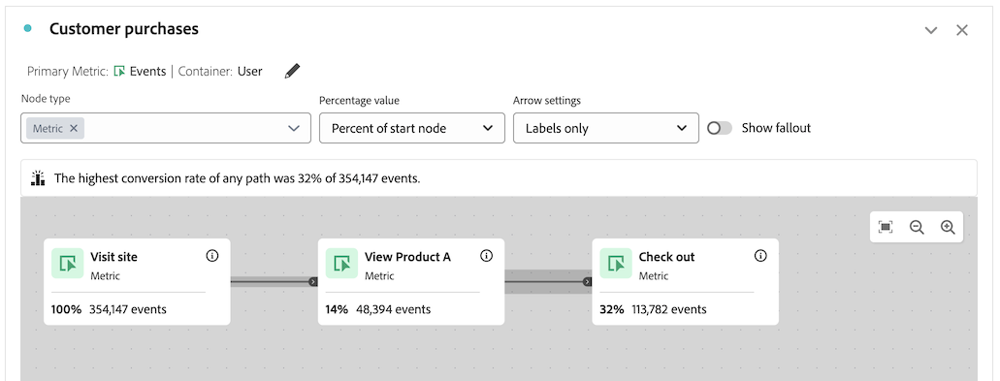
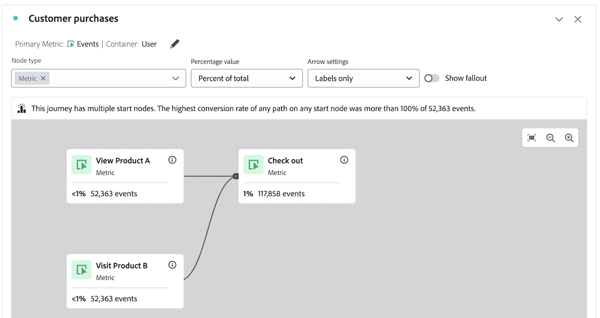
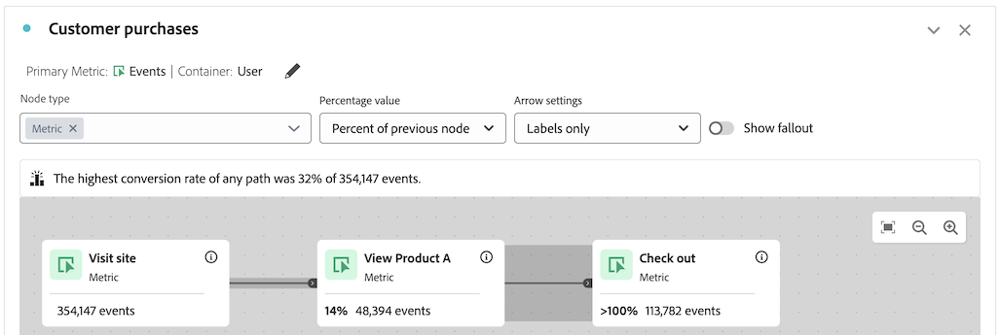
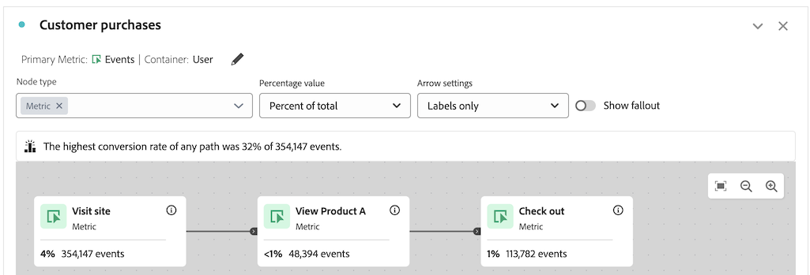

# Résolution des problèmes liés à la zone de travail de parcours

>[!BEGINSHADEBOX]

_Cet article présente la visualisation de la zone de travail de Parcours dans_  _&#x200B;**Adobe Analytics**.  _ Voir la [présentation de la zone de travail de Parcours &#x200B;](https://experienceleague.adobe.com/en/docs/analytics-platform/using/cja-workspace/visualizations/journey-canvas/journey-canvas-troubleshooting) pour la __&#x200B;**Customer Journey Analytics**&#x200B;version de cet article._

>[!ENDSHADEBOX]

La visualisation Zone de travail de parcours vous permet d’analyser les parcours que vous fournissez à vos utilisateurs et utilisatrices et à votre clientèle, et d’obtenir des informations détaillées à leur sujet.

Pour en savoir plus sur la zone de travail de parcours, consultez [Vue d’ensemble de la zone de travail de parcours](/help/analyze/analysis-workspace/visualizations/journey-canvas/configure-journey-canvas.md) et [Configurer une visualisation de la zone de travail de parcours](/help/analyze/analysis-workspace/visualizations/journey-canvas/configure-journey-canvas.md).

Les informations suivantes peuvent vous aider à résoudre les problèmes liés à des résultats inattendus, tels que des nœuds situés plus loin dans le parcours affichant un pourcentage ou un nombre plus élevé que ceux situés plus tôt dans le parcours.

## Nœuds avec un pourcentage ou une valeur plus élevé(e) que les nœuds précédents

Dans le canevas de parcours, il est possible que des nœuds situés à une étape ultérieure du parcours affichent un pourcentage ou un nombre supérieur à des nœuds situés plus tôt dans le parcours.

En d’autres termes, contrairement aux visualisations Abandon, qui se présentent toujours sous la forme d’un entonnoir dans lequel la participation diminue à chaque étape, les visualisations Canevas de parcours peuvent présenter une participation plus élevée aux étapes ultérieures du parcours qu’aux étapes précédentes.

Cela peut se produire dans les scénarios suivants :

* Lors de l’utilisation d’une mesure principale autre que Personnes ou Sessions

* Lorsque plusieurs chemins convergent en un seul nœud

### Le parcours utilise une mesure principale autre que Personnes ou Sessions

Étant donné que le canevas de parcours vous permet d’utiliser n’importe quelle mesure comme mesure principale, des nœuds situés à une étape ultérieure du parcours peuvent afficher un pourcentage ou un nombre supérieur à des nœuds situés plus tôt dans le parcours.

Le parcours utilisé dans les scénarios suivants est configuré avec les paramètres ci-après :

* **[!UICONTROL Personne]** est défini comme conteneur.

* **[!UICONTROL Événement]** est défini comme mesure principale.

#### Scénario 1 : l’utilisateur A suit le chemin du parcours dans la première session. Lors d’une session ultérieure, l’utilisateur effectue un événement qui correspond uniquement à un nœud situé plus loin.

Supposons que l’utilisateur A visite le site et termine le parcours (Nœud 1 : « Visiter le site » > Nœud 2 : « Consulter le produit A » > nœud 3 : « Passage en caisse »). Comme l’utilisateur A a généré un événement correspondant à chaque nœud du parcours dans l’ordre, un événement est comptabilisé pour chaque nœud.

Supposons maintenant que l’utilisateur A visite à nouveau le site au cours d’une session ultérieure. Comme l’utilisateur A a déjà terminé le parcours lors d’une session précédente en suivant le chemin du parcours, cela signifie que chaque fois qu’il génère un événement correspondant à un nœud du parcours, un événement est comptabilisé sur le nœud concerné, même s’il n’a pas suivi le chemin du parcours lors de la session actuelle. Par exemple, si l’utilisateur A effectue le passage en caisse, un événement est comptabilisé sur le nœud « Passage en caisse ». Cela peut se traduire par un pourcentage et un nombre plus élevés pour le nœud « Passage en caisse » que sur le nœud précédent « Afficher le produit A ».

Dans cet exemple, le paramètre de conteneur du parcours « Personne » joue un rôle essentiel pour déterminer si l’événement sur le troisième nœud (« Passage en caisse ») est comptabilisé lors de la session suivante.

Si le paramètre du conteneur avait été défini sur « Session », l’événement qui s’était produit uniquement sur le troisième nœud lors de la visite suivante n’aurait pas été comptabilisé dans le parcours, car les statistiques affichées dans le parcours seraient limitées à une seule session définie pour une personne donnée. Pour en savoir plus sur le paramètre de conteneur, consultez [Commencer à créer une visualisation de zone de travail de Parcours &#x200B;](/help/analyze/analysis-workspace/visualizations/journey-canvas/configure-journey-canvas.md#begin-building-a-journey-canvas-visualization) dans l’article [Configurer une visualisation de zone de travail de Parcours &#x200B;](/help/analyze/analysis-workspace/visualizations/journey-canvas/configure-journey-canvas.md).

<!-- The time allotted for users to move along the path is determined by the container setting. Because "Person" is selected as the container setting in this example, people who followed the journey's path in one session (moving from Node 1 to Node 2 and to Node 3) met the criteria of the journey. On any subsequent visits to the site, any event they have that matches any node on the journey is counted on that node. -->

#### Scénario 2 : l’utilisateur B abandonne le parcours.

Supposons que l’utilisateur B visite le site et ne termine pas le parcours (il visite le site, consulte le produit B, puis effectue le paiement). Dans ce cas, un événement est comptabilisé pour le nœud de départ du parcours, « Visiter le site », mais aucun événement n’est comptabilisé pour les nœuds restants, et l’utilisateur B abandonne le parcours. Même si l’utilisateur B est passé au paiement, aucun événement n’est comptabilisé pour le troisième nœud (« Passage en caisse »), car l’utilisateur B n’a pas terminé le parcours en consultant le produit A avant le passage en caisse.

Cela s’explique par le fait que les événements ne sont comptabilisés pour chaque nœud que lorsque les personnes suivent le « chemin final » du parcours. Cela signifie que les événements ne sont comptabilisés que si la personne a finalement passé d’un nœud à l’autre, quels que soient les événements qui se produisent entre les deux nœuds.

### Le parcours comporte plusieurs chemins convergeant en un seul nœud.

Le canevas de parcours permet d’inclure plusieurs nœuds de départ dans un même parcours, créant ainsi plusieurs chemins. Ces chemins d’accès peuvent converger en un nœud commun. Ainsi, les nœuds qui apparaissent plus tard dans le parcours affichent un pourcentage ou un nombre plus élevé que les nœuds qui apparaissent plus tôt dans le parcours.

<!--

The journey used in the following scenarios is configured with the following settings:

* **[!UICONTROL Person]** is set as the container

* **[!UICONTROL Event]** is set as the primary metric

#### Scenario 

When a journey contains multiple paths that converge into a single node, the two paths are combined into the single node using the OR operator. This can result in the

-->

### Pourcentages de parcours

Bien que les nombres affichés sur chaque nœud d’un parcours restent constants, quelle que soit la valeur sélectionnée dans le champ **[!UICONTROL Valeur de pourcentage]**, les pourcentages eux-mêmes peuvent changer.

Les sections ci-dessous montrent comment les pourcentages peuvent changer pour le même parcours, selon l’option sélectionnée dans le champ **[!UICONTROL Valeur de pourcentage]** :

+++Pourcentage du nœud de départ

Les nœuds de ce parcours contiennent les statistiques suivantes lorsque le champ **[!UICONTROL Valeur de pourcentage]** est défini sur **[!UICONTROL Pourcentage du nœud de départ]** :

| Nœud | Statistiques |
|---------|----------|
| Nœud 1 - « Consulter le site » | Dans ce parcours, 354 147 événements se sont produits sur le site au cours de la période de reporting, comme indiqué dans le nœud de début du parcours, « Consulter le site ». |
| Nœud 2 - « Afficher le produit A » | Sur le nombre total d’événements affichés dans le nœud de départ, 14 % (48 394) d’entre eux correspondaient aux critères du deuxième nœud du parcours, « Afficher le produit A ». |
| Nœud 3 - « Passage en caisse » | Sur le nombre total d’événements affichés dans le nœud de départ, 32 % (113 782) correspondaient aux critères du troisième nœud du parcours, « Passage en caisse ». |

+++

+++Pourcentage du nœud précédent

Les nœuds de ce parcours contiennent les statistiques suivantes lorsque le champ **[!UICONTROL Valeur de pourcentage]** est défini sur **[!UICONTROL Pourcentage du nœud précédent]** :

| Nœud | Statistiques |
|---------|----------|
| Nœud 1 - « Consulter le site » | Dans ce parcours, 354 147 événements se sont produits sur le site au cours de la période de reporting, comme indiqué dans le nœud de début du parcours, « Consulter le site ». |
| Nœud 2 - « Afficher le produit A » | Sur le nombre total d’événements affichés dans le nœud précédent, 14 % (48 394) d’entre eux correspondaient aux critères du deuxième nœud du parcours, « Afficher le produit A ». |
| Nœud 3 - « Passage en caisse » | Sur le nombre total d’événements affichés dans le nœud précédent, plus de 100 % (113 782) correspondaient aux critères du troisième nœud du parcours, « Passage en caisse ». |

+++

+++Pourcentage du total

Les nœuds de ce parcours contiennent les statistiques suivantes lorsque le champ **[!UICONTROL Valeur de pourcentage]** est défini sur **[!UICONTROL Pourcentage du total]** :

| Nœud | Statistiques |
|---------|----------|
| Nœud 1 - « Consulter le site » | Dans ce parcours, 354 147 événements se sont produits sur le site au cours de la période de reporting, comme indiqué dans le nœud de début du parcours, « Consulter le site ». |
| Nœud 2 - « Consulter le produit A » | Sur le nombre total d’événements, moins de 1 % (48 394) correspondaient aux critères du deuxième nœud du parcours, « Afficher le produit A ». |
| Nœud 3 - « Passage en caisse » | Sur le nombre total d’événements, 1 % (113 782) correspondaient aux critères du troisième nœud du parcours, « Passage en caisse ». |

+++

## Compatibilité entre la mesure du conteneur et la mesure principale

Vous pouvez configurer le conteneur du canevas de parcours sur Personne (qui utilise la mesure Personnes) ou Session (qui utilise la mesure Sessions).

Veillez à choisir une mesure principale compatible avec la mesure de conteneur actuellement sélectionnée. La plupart des mesures sont compatibles avec les mesures de conteneur disponibles. Toutefois, certaines combinaisons de mesures de conteneur et de mesures principales doivent être évitées.

Par exemple, l’utilisation de Personne comme conteneur avec Session comme mesure principale peut entraîner des résultats inattendus.

<!--

## Percentages that exceed 100%

The following configurations can result in nodes that show percentages that exceed 100%:

* When the **[!UICONTROL Percentage value]** field is set to **[!UICONTROL Percent of total]** or **[!UICONTROL Percent of start node]**, and a primary metric is selected that results in less data for the start node than on subsequent nodes.

  For example, if Revenue is selected as the primary metric, and no revenue is being realized on the primary metric, then on any node where revenue is being realized will show as exceeding 100%. 
-->
