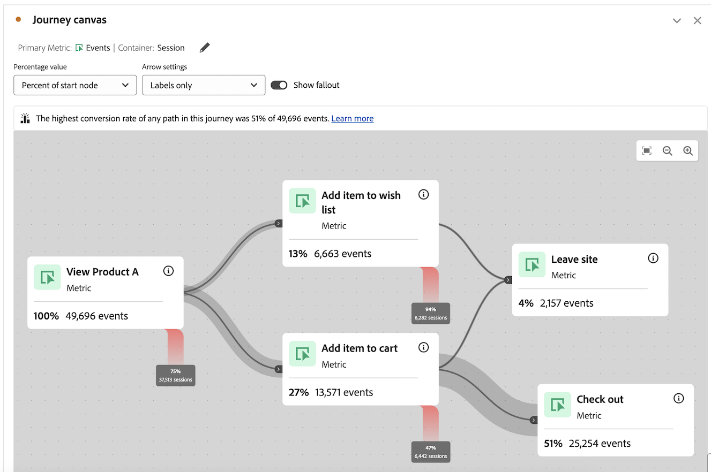
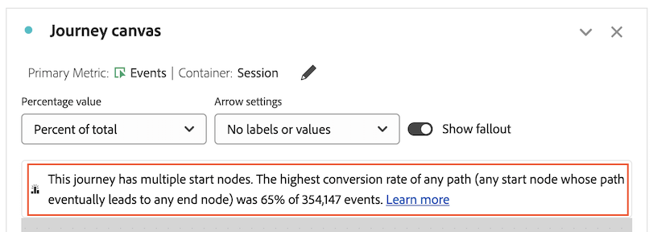
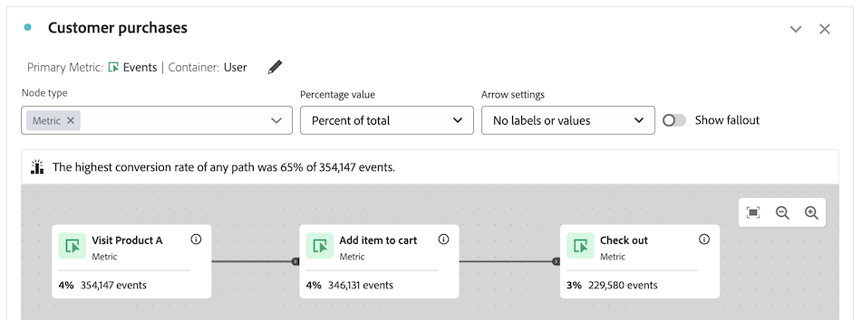

# Vue d’ensemble de la zone de travail de parcours {#journey-canvas-overview}

<!-- markdownlint-disable MD034 -->

>[!CONTEXTUALHELP]
>id="aa_journeycanvas_button"
>title="Zone de travail de parcours"
>abstract="Indique comment les personnes passent par une série de points de contact ou en sortent. Utilisez cette option pour les parcours comportant plusieurs points d’entrée et chemins d’accès."

>[!CONTEXTUALHELP]
>id="aa_journeycanvas_panel"
>title="Zone de travail de parcours"
>abstract="Analysez la façon dont les personnes passent par un parcours défini ou en sortent. Créez des analyses de parcours d’utilisation en créant un graphique flexible de nœuds et de flèches représentant n’importe quelle combinaison d’événements, d’éléments de dimension et de segments. Faites glisser des nœuds sur la zone de travail pour réorganiser les événements et les conditions du parcours. Les données sont mises à jour en conséquence."

>[!CONTEXTUALHELP]
>id="journeycanvas_button2"
>title="Zone de travail de parcours"
>abstract="Indique comment les personnes passent par une série de points de contact ou en sortent. Utilisez cette option pour les parcours comportant plusieurs points d’entrée et chemins d’accès."

>[!CONTEXTUALHELP]
>id="journeycanvas_panel2"
>title="Zone de travail de parcours"
>abstract="Analysez la façon dont les personnes passent par un parcours défini ou en sortent. Créez des analyses de parcours d’utilisation en créant un graphique flexible de nœuds et de flèches représentant n’importe quelle combinaison d’événements, d’éléments de dimension et de segments. Faites glisser des nœuds sur la zone de travail pour réorganiser les événements et les conditions du parcours. Les données sont mises à jour en conséquence."

<!-- markdownlint-enable MD034 -->

>[!BEGINSHADEBOX]

_Cet article présente la visualisation de la zone de travail de Parcours dans_  _&#x200B;**Adobe Analytics**&#x200B;_.  _Consultez la [présentation de la zone de travail de Parcours &#x200B;](https://experienceleague.adobe.com/fr/docs/analytics-platform/using/cja-workspace/visualizations/journey-canvas/journey-canvas) pour la_  _&#x200B;**Customer Journey Analytics** version de cet article._

>[!ENDSHADEBOX]

La visualisation Zone de travail de parcours vous permet d’analyser les parcours que vous fournissez à vos utilisateurs et utilisatrices et à votre clientèle, et d’obtenir des informations détaillées à leur sujet. Il vous permet de définir un parcours, puis de voir comment les personnes ont quitté (abandonné) le parcours ou comment elles l’ont traversé.

Vous pouvez [créer des analyses de parcours d’utilisation](/help/analyze/analysis-workspace/visualizations/journey-canvas/configure-journey-canvas.md) en utilisant n’importe quelle combinaison d’événements, d’éléments de dimension, de segments et de périodes pour créer des nœuds de parcours. Connectez les nœuds pour créer le flux du parcours et inclure plusieurs chemins et points de décision. Faites glisser des nœuds sur la zone de travail pour réorganiser les événements et les conditions du parcours. Les données sont mises à jour en temps réel au fur et à mesure des modifications.

[&#x200B; Les nœuds sont connectés &#x200B;](/help/analyze/analysis-workspace/visualizations/journey-canvas/configure-journey-canvas.md#logic-when-connecting-nodes) en tant que « chemin éventuel », ce qui signifie que les visiteurs sont comptabilisés tant qu’ils passent finalement d’un nœud à l’autre, quels que soient les événements qui se produisent entre les deux nœuds. Le temps imparti aux utilisateurs et utilisatrices pour se déplacer sur le chemin est déterminé par le paramètre du conteneur.

## Exigences d’accès

La zone de travail de parcours est disponible pour les clients Adobe Analytics [Prime](https://www.adobe.com/fr/data-analytics-cloud/analytics/prime.html) et [Ultimate](https://www.adobe.com/fr/data-analytics-cloud/analytics/ultimate.html).

## Principales fonctionnalités

Les principales fonctionnalités de la visualisation Canevas de parcours sont les suivantes :

* Analyse approfondie des abandons et de la progression, adaptée aux parcours utilisateur les plus complexes.

* Canevas permettant le mappage et la visualisation des différents points d’entrée, nœuds et chemins d’un parcours utilisateur.

* Interactions par glisser-déposer pour l’ajout de composants à la zone de travail et le repositionnement de nœuds existants.

## Informations potentielles

La visualisation Canevas de parcours fournit des informations exploitables pour les parcours les plus complexes.

### Chemin avec le taux de conversion le plus élevé {#conversion-rate-caption}

Les informations les plus importantes de la visualisation Canevas de parcours s’affichent sous la forme d’une légende en haut du canevas.

Cette légende récapitule les chemins du parcours qui ont le taux de conversion le plus élevé.

Lorsque le parcours contient plusieurs nœuds de début, la légende ressemble à ceci :

Lorsque le parcours contient un seul nœud de début, la légende est la suivante :

Tenez compte des points suivants lorsque vous interprétez cette légende :

* Un _chemin_ est défini comme un nœud de début connecté par des flèches à un nœud de fin, avec un nombre illimité de nœuds connectés entre eux.

* Le calcul du taux de conversion dépend du type de parcours (le nombre de nœuds de début et de fin contenus dans le parcours, et si les chemins d’accès comportent des intersections).

  Le tableau suivant décrit le mode de calcul des taux de conversion en fonction du type de parcours :

  | Type de parcours | Calcul du taux de conversion | Exemple |
  |---------|----------|---------|
  | **Un seul nœud de début et un seul nœud de fin** | Le taux de conversion est calculé en divisant le nombre du nœud de fin par celui du nœud de début. |  |
  | **Un seul nœud de début et plusieurs nœuds de fin** | Le taux de conversion est calculé en recherchant le nœud de fin avec le nombre le plus élevé et en divisant ce nombre par celui du nœud de début. |  |
  | **Plusieurs chemins d’accès autonomes, chaque chemin contenant un seul nœud de début et un seul nœud de fin** | Le taux de conversion est calculé en divisant le nombre du nœud de fin par celui du nœud de début. Le chemin présentant le taux de conversion le plus élevé est décrit dans la légende. |  |
  | **Plusieurs nœuds de début convergeant à tout moment dans le parcours vers un nœud commun** | Le taux de conversion est calculé en recherchant le nœud de fin ayant le nombre le plus élevé et en divisant ce nombre par celui du nœud de début ayant le nombre le plus bas. |  |

### Progression, abandon et plus encore

Voici quelques exemples d’autres informations que le canevas de parcours peut vous aider à obtenir. Vous pouvez choisir si ces informations sont basées sur toutes les personnes de la suite de rapports, sur toutes les personnes qui ont démarré le parcours ou sur toutes les personnes du nœud précédent du parcours.

#### Diminution

* Nombre et pourcentage de personnes ayant terminé le parcours (arrivées au nœud de fin)

* Nombre et pourcentage de personnes arrivées à un nœud donné du parcours

* Étape la plus courante qui s’est produite après ou avant un nœud donné du parcours

#### Abandons

* Nœuds du parcours ayant provoqué le plus d’abandons du parcours par les personnes (jamais d’accès aux nœuds suivants immédiats)

#### Données supplémentaires pour chaque nœud

* Ajouter une dimension de répartition sur n’importe quel nœud du parcours pour afficher les données supplémentaires pour ce nœud spécifique

## Choisir entre les visualisations Canevas de parcours, Abandon ou Flux

La visualisation Zone de travail de parcours présente des similitudes avec la [visualisation Abandons](/help/analyze/analysis-workspace/visualizations/fallout/fallout-flow.md) et la [visualisation Flux](/help/analyze/analysis-workspace/visualizations/c-flow/flow.md), mais avec des différences importantes.

### Comprendre les différences

<!-- Information in this snippet is shared between Journey canvas, Fallout, and Flow visualization docs -->

{{journey-visualization-comparisons}}

### Quand utiliser le canevas de parcours

Le canevas de parcours est particulièrement indiqué pour les cas suivants :

* Analyse des abandons dans les parcours comportant plusieurs points d’entrée et chemins.

* Parcours non linéaires avec plusieurs points d’entrée et chemins d’accès, avec une séquence prédéfinie de pages.

* Analyse exploratoire ad hoc basée sur un parcours prédéfini.

* Analyse qui nécessite une mesure principale autre que Session, Personne ou Occurrences.

Utilisez [le tableau ci-dessus](#understand-the-differences) pour comprendre les différences entre les visualisations Zone de travail de parcours, Abandons et Flux.

## Créer des analyses dans le canevas de parcours

Vous pouvez créer dans le canevas de parcours des analyses basées sur n’importe quelle dimension ou mesure disponible dans Analysis Workspace. Pour plus d’informations, consultez [Configuration d’une visualisation Zone de travail de parcours](/help/analyze/analysis-workspace/visualizations/journey-canvas/configure-journey-canvas.md).

>[!MORELIKETHIS]
>
> * [Guide pour la visualisation de la zone de travail de parcours dans Adobe Customer Journey Analytics](https://experienceleaguecommunities.adobe.com/t5/adobe-analytics-blogs/a-guide-to-journey-canvas-visualization-in-adobe-customer/ba-p/737857?profile.language=fr)
