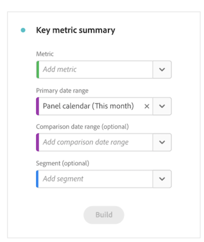
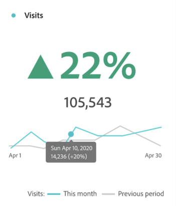

# Synthèse des mesures clés {#key-metric-summary}

<!-- markdownlint-disable MD034 -->

>[!CONTEXTUALHELP]
>id="workspace_keymetricsummary_button"
>title="Synthèse des mesures clés"
>abstract="Créez une visualisation qui combine les graphes à courbes, de changements de résumé et de nombres de résumé. Utilisez cette visualisation pour comparer les tendances des mesures importantes entre deux périodes."

<!-- markdownlint-enable MD034 -->

>[!BEGINSHADEBOX]

*Cet article présente la visualisation du résumé des mesures clés dans **Adobe Analytics**. Voir [Résumé des mesures clés](https://experienceleague.adobe.com/en/docs/analytics-platform/using/cja-workspace/visualizations/key-metric) pour la version **Customer Journey Analytics**de cet article.*

>[!ENDSHADEBOX]

La visualisation [!UICONTROL de synthèse des mesures clés] vous permet de visualiser le niveau de tendance d’une mesure importante au cours d’une seule période. Il vous permet également de comparer les performances des mesures sur deux périodes. Il offre les avantages de plusieurs visualisations en une seule visualisation :

* Visualisations **[!UICONTROL en ligne]** qui montrent les tendances de la mesure pour les périodes principales et de comparaison

* **[!UICONTROL Synthèse des modifications de pourcentage]** qui affiche une augmentation ou une diminution de la mesure entre les périodes Principale et de comparaison

* Valeur totale actuelle ([!UICONTROL **numéro de synthèse**]) pour la mesure

## Cas d’utilisation

Cette visualisation aborde divers cas d’utilisation courants, notamment :

* Un analyste qui essaie de comprendre à quoi ressemblait la création d’opportunités ce mois-ci par rapport à la même période l’an dernier.

* Un spécialiste du marketing qui explore la manière dont la génération de pistes pour un type de piste spécifique a changé de ce mois-ci au mois dernier.

* Un administrateur qui veut comprendre comment de nouvelles réservations ont changé de ce trimestre au dernier.

## Configuration de la synthèse des mesures clés

1. Faites glisser la visualisation de la **[!UICONTROL synthèse des mesures clés]** du menu **[!UICONTROL Visualisations]** se trouvant dans le rail gauche d’un panneau.

   

1. Configurez la visualisation avec les options suivantes :

   | Paramètre de configuration | Définition |
   | --- | --- |
   | **[!UICONTROL Mesure]** | Sélectionnez la mesure à analyser. Toutes les mesures sont prises en charge. |
   | **[!UICONTROL Période principale]** | La période actuelle du tableau à structure libre.
Effectuez un choix parmi toutes les périodes disponibles dans votre suite de rapports.
 
Choisissez [!UICONTROL **Période du panneau**] si vous souhaitez utiliser la même période que celle utilisée sur le panneau où se trouve la visualisation.
 |
   | **[!UICONTROL Période de comparaison]** | La période que vous souhaitez comparer à la période principale. |
   | **[!UICONTROL Segment (facultatif)]** | Tout segment qui vous intéresse pour ce résumé. |

   {style="table-layout:auto"}

   >[!NOTE]
   >
   >Lorsque le champ [!UICONTROL **Période du Principal**] est défini sur [!UICONTROL **Période du panneau**], l’option **[!UICONTROL Période de comparaison]** peut être automatiquement mise à jour, selon que l’option **[!UICONTROL Période de comparaison]** que vous choisissez est relative à la période principale ou fixe.
   >
   >* **Relatif :** si le champ **[!UICONTROL Période de comparaison]** est défini sur une option relative à la période principale (par exemple [!UICONTROL **Jour précédent**], [!UICONTROL **Même jour de la semaine dernière**], [!UICONTROL **Même jour 4 semaines avant**], etc.), toutes les mises à jour du champ [!UICONTROL **Période de Principal**] **** entraînent la mise à jour automatique de la période qui suit immédiatement la période du panneau.
   >* **Fixe :** si le champ [!UICONTROL **Période de comparaison**] est défini sur une période fixe (par exemple, le **3 février 2023**), les modifications apportées au champ [!UICONTROL **Période de Principal**] ou à la période du panneau n’ont aucun effet sur la [!UICONTROL **Période de comparaison**]. Toutefois, toute mise à jour de la période du panneau entraîne la mise à jour automatique de la période du Principal [!UICONTROL ****].

1. Sélectionnez la **[!UICONTROL Version]**.

## Afficher la sortie

La sortie doit ressembler à ce qui suit :

Tenez compte des points suivants lors de l’affichage de la sortie :

* Le graphique linéaire **[!UICONTROL Période précédente]** (toujours affiché en gris) correspond à la **[!UICONTROL Période de comparaison]** de l’étape de configuration.

* Si aucune période de comparaison n’est spécifiée lors de la configuration ou si elle est masquée dans les paramètres de visualisation, seul le graphique linéaire correspondant à la période principale s’affiche. La synthèse des modifications est masquée.

* À partir de là, vous pouvez placer le pointeur de la souris sur les graphiques linéaires pour afficher les statistiques pour chaque jour :

## Paramètres de visualisation

La synthèse des mesures clés offre plusieurs paramètres flexibles pour une meilleure communication et création de rapports sur les mesures importantes. Les paramètres sont accessibles par le biais de l’icône d’engrenage dans le coin supérieur droit de la visualisation.

| Paramètre | Description |
| --- | --- |
| **[!UICONTROL Mettre en gras le pourcentage de modification]** | Afficher la synthèse des modifications dans le style gras au centre de la visualisation |
| **[!UICONTROL Mettre en gras la valeur numérique]** | Afficher le numéro de synthèse en caractères gras au centre de la visualisation |
| **[!UICONTROL Légende visible]** | Afficher ou masquer la légende au bas de la visualisation |
| **[!UICONTROL Afficher les annotations]** | Afficher ou masquer les annotations ajoutées par un administrateur |
| **[!UICONTROL Afficher les graphiques sparkline]** | Afficher ou masquer les graphiques en courbes au bas du graphique. Lorsqu’elle est masquée, la légende ne référence plus visuellement les lignes |
| **[!UICONTROL Afficher les min. et max. sur les graphiques sparkline]** | Afficher ou masquer les valeurs minimales et maximales sur les graphiques en courbes Principal et de comparaison |
| **[!UICONTROL Afficher la comparaison]** | Afficher ou masquer les données de comparaison. Lorsqu’ils sont masqués, les objets de modification de graphique en courbes de comparaison et de synthèse ne sont pas visibles. |
| **[!UICONTROL Afficher le nombre total]** | Afficher ou masquer la synthèse des chiffres |
| **[!UICONTROL Afficher la différence brute]** | Afficher ou masquer la différence brute entre la valeur totale de la mesure dans la période Principale et la période secondaire |
| **[!UICONTROL Abréger la valeur]** | Abréger les valeurs numériques pour simplifier les informations communiquées (par exemple, 20 000 -> 20K) |

## Modifier la visualisation

Après avoir créé la visualisation, vous pouvez toujours modifier la configuration d’origine.

1. Cliquez sur l’icône en forme de crayon dans le coin supérieur droit de la visualisation (en regard de l’icône d’engrenage des paramètres).

   

   Vous revenez maintenant à la vue de configuration d’origine.

1. Modifiez la mesure, la période Principale, la période de comparaison ou le segment selon vos préférences.
