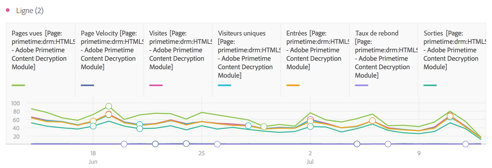
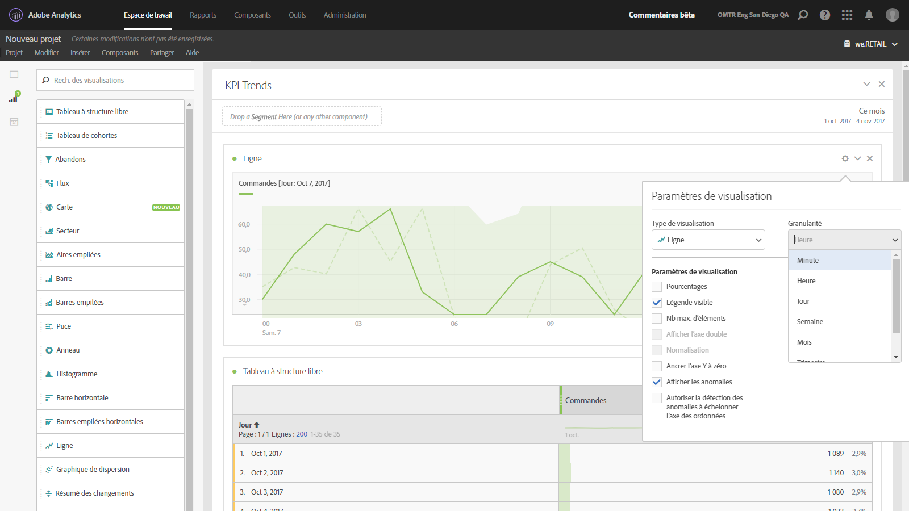

# Ligne

Dans cette visualisation, les mesures sont représentées sous la forme d’une ligne afin d’indiquer de quelle façon changent les valeurs au fil du temps. Pour pouvoir utiliser un graphique en courbes, le temps doit être défini comme une dimension.

Une liste déroulante de granularité accessible dans les [paramètres de visualisation](../../../analyze/analysis-workspace/visualizations/freeform-analysis-visualizations.md#section_D3BB5042A92245D8BF6BCF072C66624B) permet de modifier une visualisation avec suivi des tendances (ex. ligne, barre) de chaque jour à chaque mois, etc.

