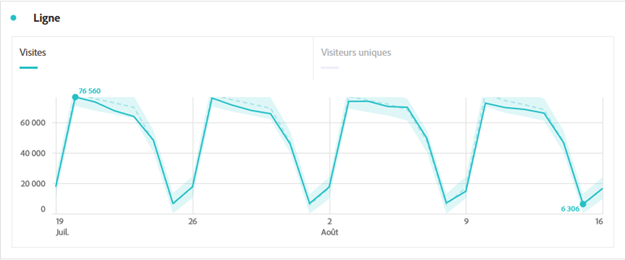
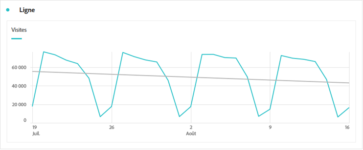

# Ligne {#line}

<!-- markdownlint-disable MD034 -->

>[!CONTEXTUALHELP]
>id="workspace_line_button"
>title="Ligne"
>abstract="Créez une visualisation sous forme de graphe à courbes qui montre l’évolution des valeurs. Pour pouvoir utiliser un graphe à courbes, le temps doit être défini comme une dimension."

<!-- markdownlint-enable MD034 -->

>[!BEGINSHADEBOX]

_Cet article présente la visualisation Graphique linéaire dans_  _**Adobe Analytics**._ _Voir [Graphique linéaire](https://experienceleague.adobe.com/fr/docs/analytics-platform/using/cja-workspace/visualizations/line) pour la_ version  _**Customer Journey Analytics** de cet article._

>[!ENDSHADEBOX]

La visualisation  **[!UICONTROL Grahique linéaire]** représente les mesures sous la forme d’une ligne afin d’indiquer l’évolution des valeurs sur une période donnée. Pour pouvoir utiliser une visualisation Ligne, le temps doit être défini comme une dimension.

## Paramètres

Dans le cadre des [paramètres de visualisation](freeform-analysis-visualizations.md#settings), des paramètres de visualisation Ligne spécifiques sont disponibles.

| Paramètre | Description |
|---|---|
| **[!UICONTROL Granularité]** | Faites votre choix dans le menu déroulant de granularité pour modifier une visualisation des tendances de quotidienne à hebdomadaire en mensuelle, etc. La granularité est également mise à jour dans le tableau de la source de données. |
| **[!UICONTROL Affichage min]**  **[!UICONTROL Affichage max ]** | Vous pouvez superposer un libellé de valeur minimale et maximale pour mettre en surbrillance les valeurs minimale et maximale d’une mesure. Les valeurs min/max sont dérivées des points de données visibles dans la visualisation, et non du jeu complet de valeurs dans une dimension.  |
| **[!UICONTROL Afficher la courbe de tendance]** | Vous pouvez choisir d’ajouter une régression ou une courbe de tendance de moyenne glissante à votre série de lignes. Les courbes de tendance permettent d’illustrer plus clairement un schéma dans les données. Lorsque cette option est sélectionnée, sélectionnez un modèle dans la liste. Consultez [Modèles](#models) pour obtenir une vue d’ensemble et une description des modèles disponibles. .
**CONSEIL** Il est recommandé d’appliquer des tendances aux données qui n’incluent pas les dates d’aujourd’hui (données partielles) ou de demain. Les dates d’aujourd’hui ou futures biaisent la courbe de tendance. Toutefois, si vous devez inclure des dates futures, supprimez les zéros des données afin dʼéviter que ces jours ne soient faussés. Accédez au tableau de la source de données de la visualisation, choisissez votre colonne de mesures et activez **[!UICONTROL Paramètres des colonnes]** > **[!UICONTROL Interpréter zéro comme n’étant pas une valeur]**.
 |

### Modèles

Toutes les courbes de tendance des modèles de régression sont ajustées à lʼaide des moindres carrés ordinaires :

| Modèle | Description |
| --- | --- |
| **[!UICONTROL Linéaire]** | Créez une ligne droite adaptée aux jeux de données linéaires simples. Utile lorsque les données augmentent ou diminuent à un rythme régulier. Équation : `y = a + b * x` |
| **[!UICONTROL Logarithmique]** | Créez une courbe adaptée. Utile lorsque le taux de changement des données augmente ou diminue rapidement, puis s’équilibre. Une courbe de tendance logarithmique peut utiliser des valeurs négatives et positives. Équation : `y = a + b * log(x)` |
| **[!UICONTROL Exponentiel]** | Créez une courbe. Utile lorsque les données augmentent ou diminuent à un rythme constamment croissant. Cette option ne doit pas être utilisée si vos données contiennent des valeurs nulles ou négatives. Équation : `y = a + e^(b * x)` |
| **[!UICONTROL Puissance]** | Créez une courbe. Utile pour les jeux de données comparant des mesures qui augmentent à un rythme spécifique. Cette option ne doit pas être utilisée si vos données contiennent des valeurs nulles ou négatives. Équation : `y = a * x^b` |
| **[!UICONTROL Quadratique]** | Trouve la courbe la plus adaptée pour un jeu de données en forme de parabole (concave vers le haut ou vers le bas). Équation : `y = a + b * x + c * x^2` |
| **[!UICONTROL Moyenne glissante]** | Créez une courbe de tendance lisse basée sur un ensemble de moyennes. Connue également sous le nom de moyenne mobile, une moyenne glissante utilise un nombre spécifique de points de données (déterminé par votre sélection de [!UICONTROL Granularité]), calcule leur moyenne et utilise cette moyenne comme point dans la ligne. Par exemple, une moyenne glissante de 7 jours ou de 4 semaines. |

>[!MORELIKETHIS]
>
>[Ajouter une visualisation à un panneau](/help/analyze/analysis-workspace/visualizations/freeform-analysis-visualizations.md#add-visualizations-to-a-panel)
>[Paramètres de visualisation](/help/analyze/analysis-workspace/visualizations/freeform-analysis-visualizations.md#settings)
>[Menu contextuel de visualisation](/help/analyze/analysis-workspace/visualizations/freeform-analysis-visualizations.md#context-menu)
>

