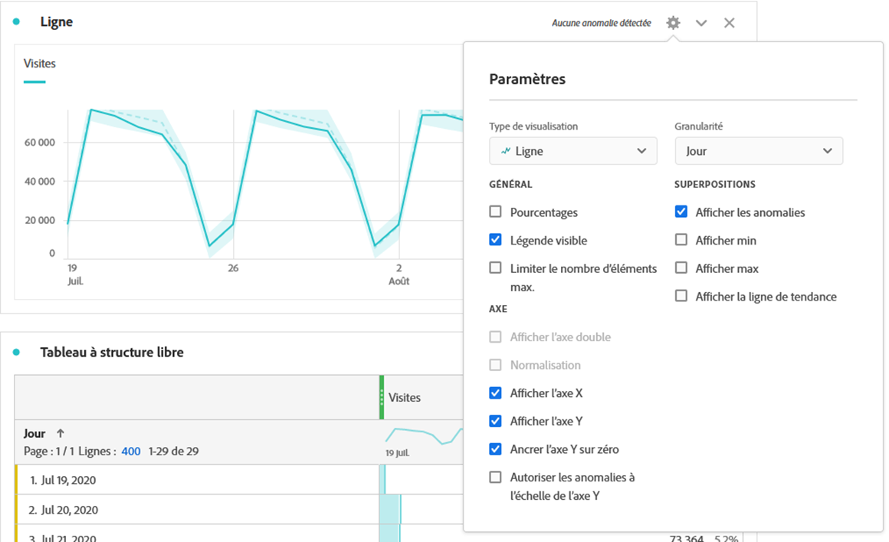

# Ligne {#line}

<!-- markdownlint-disable MD034 -->

>[!CONTEXTUALHELP]
>id="workspace_line_button"
>title="Ligne"
>abstract="Créez une visualisation sous forme de graphe à courbes qui montre l’évolution des valeurs. Pour pouvoir utiliser un graphe à courbes, le temps doit être défini comme une dimension."

<!-- markdownlint-enable MD034 -->

>[!BEGINSHADEBOX]

_Cet article présente la visualisation Ligne dans_  _**Adobe Analytics**._ _Voir [Ligne](https://experienceleague.adobe.com/en/docs/analytics-platform/using/cja-workspace/visualizations/line) pour la version_  _**Customer Journey Analytics** de cet article._

>[!ENDSHADEBOX]

Dans la visualisation de [!UICONTROL ligne], les mesures sont représentées sous la forme dʼune ligne afin dʼindiquer lʼévolution des valeurs dans le temps. Pour pouvoir utiliser un graphique en [!UICONTROL courbes], le temps doit être défini comme une dimension.

Cliquez sur lʼicône en forme dʼengrenage en haut à droite de la visualisation de [!UICONTROL ligne] pour accéder aux [**paramètres de visualisation**](freeform-analysis-visualizations.md) disponibles. Les paramètres sont classés comme suit :

* **Général** : paramètres communs à tous les types de visualisation
* **Axes** : paramètres qui affectent l’axe x ou y de la visualisation en ligne
* **Superpositions** : options permettant d’ajouter du contexte à la série affichée dans la visualisation en ligne.

## Modification de la granularité

Une liste déroulante de granularité accessible dans les [paramètres de visualisation](freeform-analysis-visualizations.md) permet de modifier une visualisation avec suivi des tendances (ex. ligne, barre) de chaque jour à chaque mois, etc. La granularité est également mise à jour dans le tableau de la source de données.

## Affichage des min. et max.

Sous **[!UICONTROL Paramètres de visualisation]** > **[!UICONTROL Superpositions]** > **[!UICONTROL Afficher les min./max.]**, vous pouvez superposer une étiquette de valeur minimale et maximale pour rapidement mettre en relief les pics et les creux d’une mesure. Remarque : les valeurs min/max sont dérivées des points de données visibles dans la visualisation, et non du jeu complet de valeurs dans une dimension.

## Affichage de courbes de tendance superposées

Sous **[!UICONTROL Paramètres de visualisation]** > **[!UICONTROL Superpositions]** > **[!UICONTROL Afficher la courbe de tendance]**, vous pouvez choisir dʼajouter une régression ou une courbe de tendance de moyenne glissante à votre série de lignes. Les courbes de tendance permettent d’illustrer plus clairement un schéma dans les données.

Pour plus dʼinformations, regardez cette vidéo sur lʼajout de lignes de tendance aux visualisations de ligne :

>[!VIDEO](https://video.tv.adobe.com/v/330176/?quality=12)

>[!TIP]
>
>Il est recommandé dʼappliquer les courbes de tendance à des données qui nʼincluent pas les dates du jour (données partielles) ou futures, car celles-ci fausseront la courbe de tendance. Toutefois, si vous devez inclure des dates futures, supprimez les zéros des données afin dʼéviter que ces jours ne soient faussés. Pour ce faire, accédez au tableau de la source de données de la visualisation, choisissez votre colonne de mesures et activez **[!UICONTROL Paramètres des colonnes]** > **[!UICONTROL Interpréter zéro comme n’étant pas une valeur]**.

Toutes les courbes de tendance des modèles de régression sont ajustées à lʼaide des moindres carrés ordinaires :

| Modèle | Description |
| --- | --- |
| Linéaire | Crée une ligne droite adaptée aux jeux de données linéaires simples. Utile lorsque les données augmentent ou diminuent à un rythme régulier. Équation : `y = a + b * x` |
| Logarithmique | Crée une courbe adaptée. Utile lorsque le taux de changement des données augmente ou diminue rapidement, puis s’équilibre. Une courbe de tendance logarithmique peut utiliser des valeurs négatives et positives. Équation : `y = a + b * log(x)` |
| Exponentiel | Crée une courbe. Utile lorsque les données augmentent ou diminuent à un rythme constamment croissant. Cette option ne doit pas être utilisée si vos données contiennent des valeurs nulles ou négatives. Équation : `y = a + e^(b * x)` |
| Puissance | Crée une courbe. Utile pour les jeux de données comparant des mesures qui augmentent à un rythme spécifique. Cette option ne doit pas être utilisée si vos données contiennent des valeurs nulles ou négatives. Équation : `y = a * x^b` |
| Quadratique | Trouve la courbe la plus adaptée pour un jeu de données en forme de parabole (concave vers le haut ou vers le bas). Équation : `y = a + b * x + c * x^2` |
| Moyenne glissante | Crée une courbe de tendance lisse basée sur un ensemble de moyennes. Connue également sous le nom de moyenne mobile, une moyenne glissante utilise un nombre spécifique de points de données (déterminé par votre sélection de « Périodes »), calcule leur moyenne et utilise cette moyenne comme point dans la ligne. Par exemple, une moyenne glissante de 7 jours ou de 4 semaines. |
