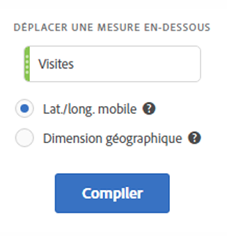
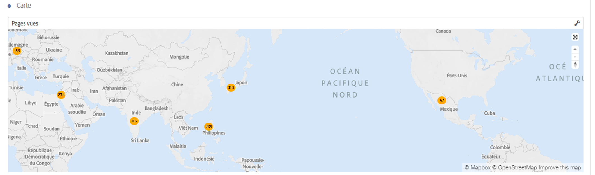
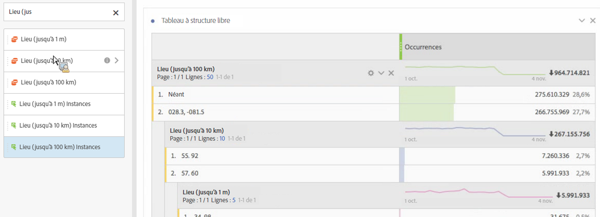
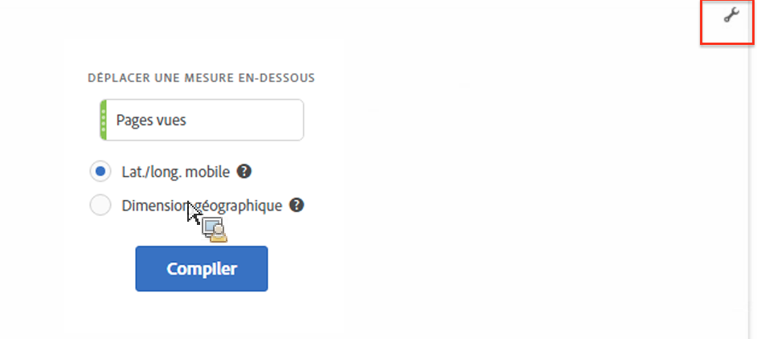

# Carte

## Aperçu {#section_19F740FAF08D47B1AF1EF239A74FC75C}

La visualisation des cartes dans Analysis Workspace :

* permet de créer une carte visuelle de n’importe quelle mesure (y compris les mesures calculées) ;
* est pratique pour identifier et comparer les données de mesure de différentes régions géographiques ;
* peut prendre en charge 2 sources de données : la latitude et la longitude à partir de l’utilisation mobile ou la dimension géographique à partir de l’utilisation du web ;
* prend en charge l’exportation au format PDF ;
* tire parti de WebGL pour l’affichage des graphiques. Si vos pilotes graphiques ne prennent pas en charge le rendu WebGL, il se peut que vous deviez les mettre à jour.

## Génération d’une visualisation des cartes {#section_61BBFA3A7BFD48DA8D305A69D9416299}

1. Dans la liste des visualisations, faites glisser la **[!UICONTROL Carte]** vers le panneau à structure libre :

   

1. Faites glisser une mesure depuis la liste des mesures (mesures calculées comprises).
1. Spécifiez la source de données à partir de laquelle le tracé doit être effectué. (Cette boîte de dialogue apparaît uniquement si le suivi de l’emplacement est activé pour les données des applications mobiles.)

<table id="table_CD54B433464B4282A7524FB187016C47"> 
 <tbody> 
  <tr> 
   <td colname="col1"> 
<b>Lat/Long mobiles</b> 
 </td> 
   <td colname="col2"> 
Cette option représente les données des applications mobiles. 
 
Cette option apparaît uniquement si vous l’avez activée pour votre suite de rapports sous  Analytics  &gt;  Administration  &gt;  Suites de rapports  &gt;  &lt;sélectionnez la suite de rapports&gt;  &gt;  Modifier les paramètres  &gt;  Gestion mobile  &gt;  Activer le suivi de l’emplacement. 
 
Il s’agit du paramètre par défaut (si le suivi de l’emplacement est activé). 
 </td> 
  </tr> 
  <tr> 
   <td colname="col1"> 
<b>Dimension géographique</b> 
 </td> 
   <td colname="col2"> 
Cette option représente les données de segmentation géographique relatives à l’emplacement du visiteur sur la base de son adresse IP. Ces données sont transformées en pays, région et ville. Notez toutefois qu’elles ne vont pas jusqu’au niveau de la zone de marché ou du code postal. 
 
Cette dimension est activée pour pratiquement toutes les suites de rapports. Si ce n’est pas le cas pour la vôtre, contactez l’assistance clientèle Adobe pour faire activer les rapports géographiques. 
 </td> 
  </tr> 
 </tbody> 
</table>

1. Cliquez sur **[!UICONTROL Créer]**.

   La première vue qui s’affiche est une vue mondiale avec une carte à bulles, similaire à celle-ci.

   

1. Vous pouvez désormais :

   * **Zoomer** sur cette carte pour agrandir certaines zones en double-cliquant sur la carte ou en utilisant la molette de défilement. La carte s’agrandit en fonction de l’endroit où se trouve le curseur. Lors de l’agrandissement, la dimension requise (pays > état > ville) est automatiquement mise à jour en fonction du niveau de zoom.
   * **Comparer** deux visualisations de cartes ou plus dans le même projet en les plaçant côte à côte.
   * **Afficher les comparaisons d’une période à l’autre (par exemple, d’une année à l’autre)** :

      * Afficher des nombres négatifs : par exemple, si vous tracez une mesure d’une année à l’autre, la carte peut afficher -33 % sur New York.
      * Avec les mesures de type « pourcentage », le regroupement effectue la moyenne des pourcentages.
      * Un jeu de couleurs vert/rouge : positif/négatif.
   * **Faire pivoter** la carte en 2D ou en 3D en maintenant la touche [!UICONTROL Ctrl] et en déplaçant la carte.

   * **Basculer** vers une autre vue, comme une carte thermique, en utilisant les [paramètres](/help/analyze/analysis-workspace/visualizations/map-visualization.md#section_5F89C620A6AA42BC8E0955478B3A427E) décrits ci-dessous. La vue à bulles est la vue par défaut.

1. **Enregistrer** le projet pour enregistrer tous les paramètres des cartes (coordonnées, zoom, rotation).
1. Le tableau à structure libre, sous la visualisation, peut être rempli en faisant glisser en place des dimensions et des mesures depuis le rail de gauche :

   

## Paramètres de visualisation des cartes {#section_5F89C620A6AA42BC8E0955478B3A427E}

Il existe deux ensembles de paramètres pour les cartes :

L’**icône de clé** en haut à droite affiche la boîte de dialogue initiale dans laquelle vous pouvez modifier la mesure et la source de données :

Cliquez sur l’**icône d’engrenage** pour afficher ces paramètres de visualisation :

| Paramètre | Description |
|--- |--- |
| Bulles | Représente les événements à l’aide de bulles. Un graphique en bulles est un graphique à plusieurs variables à mi-chemin entre un graphique de dispersion et un graphique à zones proportionnelles. Il s’agit du mode par défaut. |
| Carte thermique | Représente les événements à l’aide d’une carte thermique. Une carte thermique est une représentation graphique des données où les valeurs individuelles contenues dans une matrice sont représentées sous la forme de couleurs. |
| Styles : Thème de couleur | Affiche le jeu de couleurs pour la carte thermique et les bulles. Vous avez le choix entre Corail, Rouges, Verts ou Bleus. La valeur par défaut est Corail. |
| Styles : Style de carte | Vous avez le choix entre De base, Rues, Lumineux, Clair, Foncé et Satellite. |
| Rayon du groupe | Regroupe les points de données qui se trouvent dans le nombre spécifié de pixels. La valeur par défaut est 50. |
| Valeur max. par défaut | Permet de modifier le seuil de la valeur maximale pour la carte. Le fait de modifier cette valeur ajuste l’échelle des valeurs de bulles/de la carte thermique (couleur et taille) en fonction de la valeur maximale personnalisée définie. |
