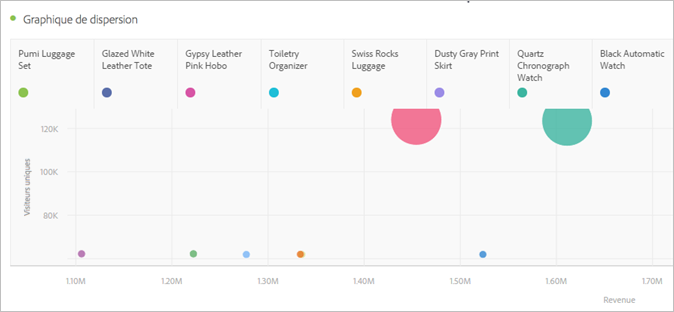

# Graphique de dispersion

La visualisation à dispersion montre la relation entre les valeurs de dimension et trois mesures au maximum. Il nécessite trois composants et prend en charge la visualisation de jusqu’à quatre composants.

* Le composant de ligne (généralement une dimension) représente chaque point du graphique. Différentes rangées s’affichent sous forme de points de couleur différents.
* La colonne la plus à gauche (généralement une mesure) trace la position du point sur l’axe Y (vertical).
* La deuxième colonne trace la position du point sur l’axe X (horizontal).
* La troisième colonne détermine le rayon du point.
* Toutes les colonnes suivantes d’un tableau à structure libre sont ignorées par la visualisation du graphique de dispersion.

