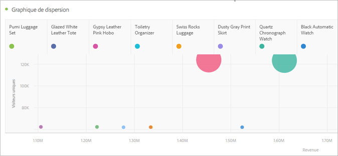

# Dispersion {#scatter}

<!-- markdownlint-disable MD034 -->

>[!CONTEXTUALHELP]
>id="workspace_scatter_button"
>title="Dispersion"
>abstract="Créez une visualisation sous forme de graphique de dispersion qui illustre la relation entre des éléments de dimension et trois mesures au maximum."

<!-- markdownlint-enable MD034 -->

>[!BEGINSHADEBOX]

_Cet article présente la visualisation Dispersion dans_  _**Adobe Analytics**._ _Voir [Dispersion](https://experienceleague.adobe.com/fr/docs/analytics-platform/using/cja-workspace/visualizations/scatterplot) pour la version_  _**Customer Journey Analytics** de cet article._

>[!ENDSHADEBOX]

La visualisation  **[!UICONTROL Scatter]** vous permet d’identifier les corrélations et les modèles entre différentes mesures dans vos données. La visualisation montre la relation entre les éléments de dimension et jusqu’à trois mesures. La visualisation nécessite trois composants et prend en charge la visualisation de quatre composants au maximum.

* Le composant de ligne (généralement une dimension) représente chaque point du graphique. Différentes lignes s’affichent sous forme de points de différentes couleurs.
* La colonne la plus à gauche (généralement une mesure) trace la position du point sur l’axe Y (vertical).
* La deuxième colonne trace la position du point sur l’axe X (horizontal).
* La troisième colonne détermine le rayon du point.
* Toutes les colonnes suivantes d’un tableau à structure libre sont ignorées par la visualisation en graphique de dispersion.

>[!BEGINSHADEBOX]

Consultez  [Visualisation Dispersion](https://experienceleague.adobe.com/en/docs/analytics-learn/tutorials/analysis-workspace/visualizations/scatterplot-visualization){target="_blank"} pour une vidéo de démonstration.

>[!ENDSHADEBOX]

>[!NOTE]
>
>Lorsque vous [configurez la légende pour qu’elle soit visible](/help/analyze/analysis-workspace/visualizations/freeform-analysis-visualizations.md#settings) dans la dispersion, elle n’est affichée que lorsque la source de données contient un nombre limité d’éléments de dimension (sélectionnés).

>[!MORELIKETHIS]
>
>[Ajouter une visualisation à un panneau](/help/analyze/analysis-workspace/visualizations/freeform-analysis-visualizations.md#add-visualizations-to-a-panel)
>[Paramètres de visualisation](/help/analyze/analysis-workspace/visualizations/freeform-analysis-visualizations.md#settings)
>[Menu contextuel de visualisation](/help/analyze/analysis-workspace/visualizations/freeform-analysis-visualizations.md#context-menu)
>
