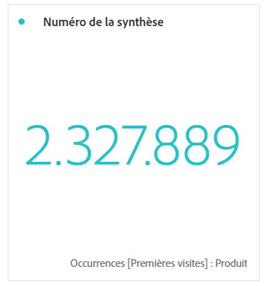

# Synthèse de nombres et de variations

>[!BEGINSHADEBOX]

_Cet article documente les visualisations Synthèse des chiffres et Synthèse des modifications dans_  _&#x200B;**Adobe Analytics**._ _Voir [Synthèse des chiffres et Synthèse des modifications](https://experienceleague.adobe.com/fr/docs/analytics-platform/using/cja-workspace/visualizations/summary-number-change) pour la version_  _&#x200B;**Customer Journey Analytics** de cet article._

>[!ENDSHADEBOX]

>[!BEGINSHADEBOX]

Consultez  [Visualisations Synthèse des chiffres et Synthèse des modifications](https://video.tv.adobe.com/v/3416888/?quality=12&learn=on&captions=fre_fr){target="_blank"} pour une vidéo de démonstration.

>[!ENDSHADEBOX]

## Synthèse des chiffres {#summary-number}

<!-- markdownlint-disable MD034 -->

>[!CONTEXTUALHELP]
>id="workspace_summarynumber_button"
>title="Synthèse des chiffres"
>abstract="Créez une visualisation qui affiche les totaux et les sous-totaux."

<!-- markdownlint-enable MD034 -->

Utilisez la visualisation  **[!UICONTROL Synthèse des chiffres]** pour mettre en évidence un grand nombre d’éléments importants dans un projet. Cette visualisation se comporte comme suit, en utilisant la source de données associée :

* Sélectionne toutes les colonnes si aucune cellule n’est sélectionnée.
* Si une seule cellule est sélectionnée, son résumé s’affiche.
* Si plusieurs cellules sont sélectionnées, la première cellule sélectionnée s’affiche.
* Si la colonne est sélectionnée, la valeur de la première cellule de la colonne est affichée.

Dans le cadre des paramètres de visualisation, des options Synthèse des chiffres spécifiques sont disponibles.

| Option | Définition |
|--- |--- |
| **[!UICONTROL Abréger la valeur]** | Sélectionnez **[!UICONTROL Abréger la valeur]** pour abréger intelligemment la valeur numérique. Lorsque cette option est sélectionnée, saisissez un nombre pour définir le montant de l’abréviation. Par exemple : <table><tr><td>**Valeur d’origine**</td><td>**Valeur de l’abréviation**</td><td>**Résultat**</td></tr><tr><td>12 011 141,25 $</td><td>Non sélectionné</td><td  align="right">12 011 141,25 $</td></tr><tr><td>12 011 141,25 $</td><td>Sélectionné, défini sur `0`</td><td align="right">12 M $</td></tr><tr><td>12 011 141,25 $</td><td> Sélectionné, défini sur `1`</td><td  align="right">12,0 M $</td></tr><tr><td>12 011 141,25 $</td><td>Sélectionné, défini sur `2`</td><td align="right">12,01 M $</td></tr><tr><td>12 011 141,25 $</td><td>Sélectionné, défini sur `3`</td><td align="right">12,011 M $</td></tr></table> |
| **[!UICONTROL Résumer la valeur par]** | Affiche le maximum, le minimum, la moyenne, la médiane ou la somme pour une sélection de données. |

## Changement de résumé {#summary-change}

<!-- markdownlint-disable MD034 -->

>[!CONTEXTUALHELP]
>id="workspace_summarychange_button"
>title="Changement de résumé"
>abstract="Création d’une visualisation affichant le delta (changement) entre deux nombres"

<!-- markdownlint-enable MD034 -->

Utilisez la visualisation  **[!UICONTROL Synthèse des modifications]** pour afficher le delta (modification) entre deux chiffres. <!-- This is applicable for AA, not CJA: The green and red color of the Summary Change can be controlled through [custom event polarity](https://experienceleague.adobe.com/docs/analytics/admin/admin-tools/success-events/success-event.html?lang=fr) or a calculated metric's [Show Upward Trend As](https://experienceleague.adobe.com/docs/analytics/components/calculated-metrics/calcmetric-workflow/cm-build-metrics.html?lang=fr) option.-->

<!--
The green and red color of the Summary Change can be controlled through [custom event polarity](https://experienceleague.adobe.com/docs/analytics/admin/admin/c-manage-report-suites/c-edit-report-suites/conversion-var-admin/c-success-events/success-event.md) or a calculated metric's [Show Upward Trend As](https://experienceleague.adobe.com/docs/analytics/components/calculated-metrics/calcmetric-workflow/cm-build-metrics.html?lang=fr) option.
-->

Cette visualisation fonctionne comme suit :

* Si aucune cellule n’est sélectionnée, les valeurs de deux premières cellules de la colonne sont comparées.
* Si une seule cellule est sélectionnée, 0 s’affiche, car la valeur de la cellule est comparée à elle-même.
* Si deux cellules sont sélectionnées, la première cellule sélectionnée sert de numérateur, la deuxième de dénominateur.
* Si plus de deux cellules sont sélectionnées, seules les deux premières sont prises en compte pour la comparaison.
* Si une rangée de cellules est sélectionnée, la première et la dernière cellules de la rangée sont comparées.
* Si la colonne est sélectionnée, la première valeur est comparée à elle-même ; 0 s’affiche.

Dans le cadre des paramètres de visualisation, des options spécifiques **[!UICONTROL Synthèse des modifications]** sont disponibles.

| Option | Définition |
|--- |--- |
| **[!UICONTROL Afficher le pourcentage de modification]** | Affichez le pourcentage de modification entre les 2 chiffres. |
| **[!UICONTROL Afficher la différence brute]** | Affichez la différence brute entre 2 nombres. Vous pouvez également abréger des valeurs et afficher jusqu’à 3 chiffres après la virgule avec cette option. |
| **[!UICONTROL Abréger la valeur]** | Sélectionnez **[!UICONTROL Abréger la valeur]** pour abréger intelligemment la valeur modifiée. Lorsque cette option est sélectionnée, saisissez un nombre pour définir le montant de l’abréviation. Par exemple : <table><tr><td>**Valeur d’origine**</td><td>**Valeur de l’abréviation**</td><td>**Résultat**</td></tr><tr><td>12 011 141,25 $</td><td>Non sélectionné</td><td  align="right">12 011 141,25 $</td></tr><tr><td>12 011 141,25 $</td><td>Sélectionné, défini sur `0`</td><td align="right">12 M $</td></tr><tr><td>12 011 141,25 $</td><td> Sélectionné, défini sur `1`</td><td  align="right">12,0 M $</td></tr><tr><td>12 011 141,25 $</td><td>Sélectionné, défini sur `2`</td><td align="right">12,01 M $</td></tr><tr><td>12 011 141,25 $</td><td>Sélectionné, défini sur `3`</td><td align="right">12,011 M $</td></tr></table> |

>[!MORELIKETHIS]
>
>[Ajouter une visualisation à un panneau](/help/analyze/analysis-workspace/visualizations/freeform-analysis-visualizations.md#add-visualizations-to-a-panel)
>&#x200B;>[Paramètres de visualisation](/help/analyze/analysis-workspace/visualizations/freeform-analysis-visualizations.md#settings)
>&#x200B;>[Menu contextuel de visualisation](/help/analyze/analysis-workspace/visualizations/freeform-analysis-visualizations.md#context-menu)
>
