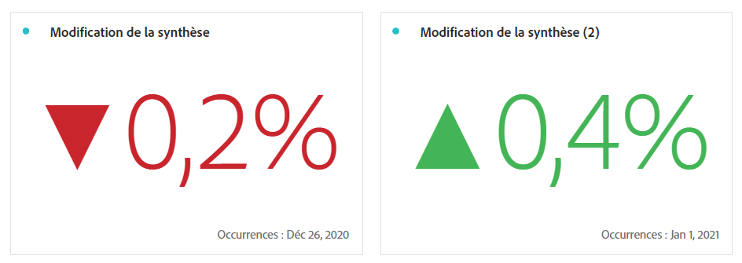

# [!UICONTROL Synthèse des chiffres] et [!UICONTROL Synthèse des modifications]

*Cet article présente la visualisation Synthèse des chiffres et Synthèse des modifications dans **Adobe Analytics**. Voir [Synthèse des chiffres et Synthèse des modifications](https://experienceleague.adobe.com/en/docs/analytics-platform/using/cja-workspace/visualizations/summary-number-change) pour la version **Customer Journey Analytics**de cet article.*

Regardez une vidéo sur ces deux visualisations :

>[!VIDEO](https://video.tv.adobe.com/v/335564/?quality=12)

## Visualisation [!UICONTROL Synthèse des chiffres] {#summary-number}

<!-- markdownlint-disable MD034 -->

>[!CONTEXTUALHELP]
>id="workspace_summarynumber_button"
>title="Nombre de résumés"
>abstract="Créez une visualisation qui affiche les totaux et les sous-totaux."

<!-- markdownlint-enable MD034 -->

Utilisez la visualisation [!UICONTROL Synthèse des chiffres] pour mettre en évidence un grand nombre d’éléments importants dans un projet. Cette visualisation fonctionne comme suit :

* Sélectionne toutes les colonnes si aucune cellule n’est sélectionnée.
* Si une seule cellule est sélectionnée, son résumé s’affiche.
* Si plusieurs cellules sont sélectionnées, la première cellule sélectionnée s’affiche.
* Si la colonne est sélectionnée, la valeur de la première cellule de la colonne est affichée.

Cliquez sur l’engrenage **Paramètres de visualisation** dans le coin supérieur droit pour configurer les paramètres de Synthèse des chiffres :

| Paramètre | Définition |
|--- |--- |
| [!UICONTROL Pourcentages] | Affichent des pourcentages plutôt que des chiffres bruts. |
| [!UICONTROL Légende visible] | Affiche des informations sur la mesure affichée. |
| [!UICONTROL Abréger la valeur] | Abrège les valeurs et affiche jusqu’à 3 chiffres après la virgule. |
| [!UICONTROL Résumer la valeur par] | Affiche le maximum, le minimum, la moyenne, la médiane ou la somme pour une sélection de données. |

## Visualisation [!UICONTROL Synthèse des modifications] {#summary-change}

<!-- markdownlint-disable MD034 -->

>[!CONTEXTUALHELP]
>id="workspace_summarychange_button"
>title="Changement de résumé"
>abstract="Création d’une visualisation affichant le delta (changement) entre deux nombres"

<!-- markdownlint-enable MD034 -->

Utilisez la visualisation [!UICONTROL Synthèse des modifications] pour afficher le delta (modification) entre deux chiffres. La couleur verte et la couleur rouge de la [!UICONTROL Synthèse des modifications] peuvent être contrôlées par [polarité d’événement personnalisé](/help/admin/admin/c-manage-report-suites/c-edit-report-suites/conversion-var-admin/c-success-events/success-event.md) ou par l’option [Tendance à la hausse affichée](https://experienceleague.adobe.com/docs/analytics/components/calculated-metrics/calcmetric-workflow/cm-build-metrics.html?lang=fr) dʼune mesure calculée.

Cette visualisation fonctionne comme suit :

* Si aucune cellule n’est sélectionnée, les valeurs de deux premières cellules de la colonne sont comparées.
* Si une seule cellule est sélectionnée, 0 s’affiche, car la valeur de la cellule est comparée à elle-même.
* Si deux cellules sont sélectionnées, la première cellule sélectionnée sert de numérateur, la deuxième de dénominateur.
* Si plus de deux cellules sont sélectionnées, seules les deux premières sont prises en compte pour la comparaison.
* Si une rangée de cellules est sélectionnée, la première et la dernière cellules de la rangée sont comparées.
* Si la colonne est sélectionnée, la première valeur est comparée à elle-même ; 0 s’affiche.

Cliquez sur l’engrenage **Paramètres de visualisation** dans le coin supérieur droit pour configurer les paramètres de Synthèse des changements :

| Paramètre | Définition |
| --- | --- |
| [!UICONTROL Pourcentages] | Affichent des pourcentages plutôt que des chiffres bruts. |
| [!UICONTROL Légende visible] | Affiche des informations sur la mesure affichée. |
| [!UICONTROL Afficher le pourcentage de modification] | Affiche le pourcentage de modification entre les 2 chiffres. |
| [!UICONTROL Afficher la différence brute] | Affiche la différence brute entre 2 nombres. Vous pouvez également abréger des valeurs et afficher jusqu’à 3 chiffres après la virgule avec cette option. |
