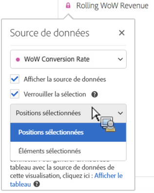
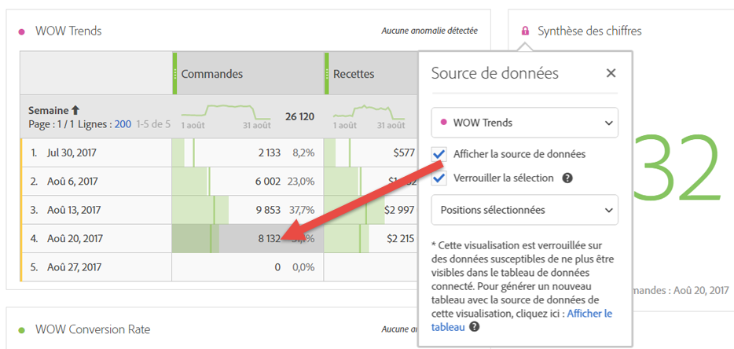
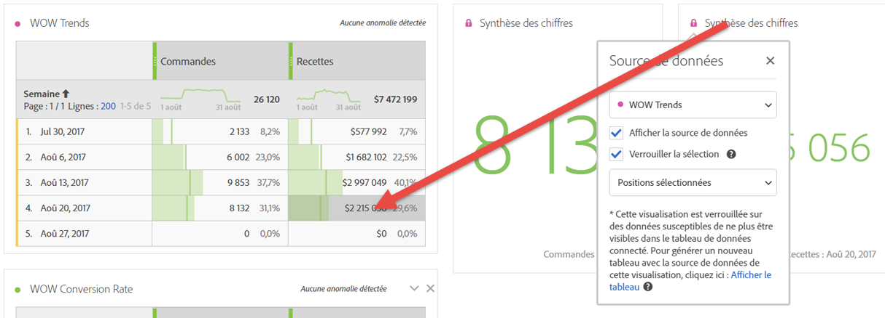
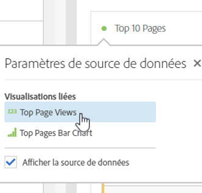

# Gestion des sources de données

Synchronisez les visualisations pour contrôler quel tableau de données ou source de données correspond à une visualisation.

**Conseil :** Vous pouvez savoir quelles visualisations sont liées d’après la couleur du point près du titre. Les mêmes couleurs signifient que les visualisations reposent sur la même source de données.

La gestion d’une source de données permet d’afficher la source de données ou de verrouiller la sélection. Ces paramètres déterminent de quelle façon la visualisation change (si elle change) lorsque de nouvelles données se présentent.

1. [Créez un projet](/help/analyze/analysis-workspace/build-workspace-project/t-freeform-project.md) avec un tableau de données et une [visualisation](/help/analyze/analysis-workspace/visualizations/freeform-analysis-visualizations.md).
1. Dans le tableau de données, sélectionnez les cellules (source de données) à associer à la visualisation.
1. Dans la visualisation, cliquez sur le point en regard du titre pour ouvrir la boîte de dialogue **[!UICONTROL Source de données]**. Sélectionnez **[!UICONTROL Afficher la source de données]** ou **[!UICONTROL Verrouiller la sélection]**.

   

   Le fait de synchroniser une visualisation sur une cellule de tableau crée un tableau (masqué) et code par couleurs la visualisation synchronisée avec ce tableau.

| Élément | Description |
|--- |--- |
| Visualisations associées | Si des visualisations sont connectées à un tableau à structure libre ou de cohortes, le point supérieur gauche répertorie les visualisations connectées, accompagnées d’une case à cocher « Afficher » qui permet d’afficher ou de masquer le tableau.  Le passage du curseur met en surbrillance la visualisation associée à laquelle vous pourrez accéder d’un simple clic. |
| Afficher la source de données | Permet d’afficher (case à cocher activée) ou de masquer (case à cocher désactivée) le tableau de données qui correspond à la visualisation. |
| Verrouiller la sélection | Activez ce paramètre pour verrouiller la visualisation sur les données actuellement sélectionnées dans le tableau de données correspondant. Ensuite, sélectionnez l’une des options ci-après :  <ul><li>**Positions sélectionnées** : choisissez cette option pour que la visualisation reste verrouillée sur les positions sélectionnées dans le tableau de données correspondant. Ces positions resteront visibles, même si les éléments spécifiques à ces positions changent. Par exemple, choisissez cette option si vous souhaitez afficher les cinq premiers noms de campagne en tout temps dans cette visualisation, quels que soient ces cinq premiers noms de campagne.</li> <li>**Éléments sélectionnés** : choisissez cette option pour que la visualisation reste verrouillée sur les éléments spécifiques actuellement sélectionnés dans le tableau de données correspondant. Ces éléments resteront visibles, même si leur classement change parmi les éléments du tableau. Par exemple, choisissez cette option si vous souhaitez afficher les cinq mêmes noms de campagne spécifiques en tout temps dans cette visualisation, quel que soit le classement de ces noms de campagne.</li></ul> |

Cette nouvelle architecture diffère de la précédente du fait qu’Analysis Workspace ne crée plus de tableau masqué en double où est automatiquement stockée la sélection verrouillée. Désormais, la source de données pointe vers le tableau à partir duquel vous avez créé la visualisation.

**Exemples de cas d’utilisation :**

* Créez une visualisation de synthèse et verrouillez-la sur une cellule du tableau à partir duquel elle a été créée. Si l’option Afficher la source de données est activée, vous savez exactement d’où proviennent ces informations dans le tableau. Les données sources seront grisées :

   >
* Vous pouvez ajouter de nombreuses visualisations dont les données sont issues de différentes cellules du même tableau, comme illustré ici. Il s’agit du même tableau que dans l’exemple ci-dessus, mais la cellule source (et la mesure) est différente :

   >
* Pour voir si des visualisations sont connectées à un tableau à structure libre ou de cohortes, cliquez sur le point supérieur gauche (paramètres de source de données). Le passage du curseur mettra en surbrillance la visualisation associée à laquelle vous pourrez accéder par un simple clic.

   >
