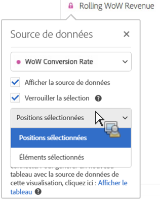

# Gérer des sources de données {#manage-data-sources}

>[!CONTEXTUALHELP]
>id="workspace_freeformtable_lockselection"
>title="Verrouiller la sélection"
>abstract="Activez ce paramètre pour verrouiller la visualisation sur les positions ou les éléments sélectionnés dans la source de données."

>[!CONTEXTUALHELP]
>id="workspace_freeformtable_lockselection_showtable"
>title="Afficher le tableau"
>abstract="Sélectionnez **[!UICONTROL Afficher le tableau]** pour générer une nouvelle source de données pour votre visualisation actuelle, distincte de la source de données d’origine."

>[!CONTEXTUALHELP]
>id="workspace_freeformtable_showtable"
>title="Afficher le tableau"
>abstract="Sélectionnez **[!UICONTROL Afficher le tableau]** pour générer une nouvelle source de données pour votre visualisation actuelle, distincte de la source de données d’origine."

La synchronisation des visualisations vous permet de contrôler le tableau à structure libre ou la source de données qui correspond à une visualisation.

>[!TIP]
>
>Vous pouvez savoir quelles visualisations sont liées d’après la couleur de l’icône  à côté du titre des visualisations. Les mêmes couleurs signifient que les visualisations reposent sur la même source de données.
>

Vous pouvez afficher ou masquer la source de données. Vous pouvez également verrouiller la sélection à des positions ou à des éléments sélectionnés. Ces paramètres déterminent de quelle façon la visualisation change (si elle change) lorsque de nouvelles données se présentent.

<!--
**Tip:** You can tell which visualizations are related by the color of the dot next to the title. Matching colors mean that visualizations are based on the same data source.

Managing a data source lets you show the data source or lock the selection. These settings determine how the visualization changes (or doesn't change) when new data comes in.

1. [Create a project](/help/analyze/analysis-workspace/home.md) with a data table and a [visualization](/help/analyze/analysis-workspace/visualizations/freeform-analysis-visualizations.md).
1. In the data table, select the cells (data source) you want to associate with the visualization.
1. In the visualization, click the dot next to the title to bring up the **[!UICONTROL Data Source]** dialog. Select **[!UICONTROL Show Data Source]** or **[!UICONTROL Lock Selection]**.

   

   Synchronizing a visualization to a table cell creates a new (hidden) table and color-codes the synchronized visualization with that table.

>[!BEGINSHADEBOX]

See  [Data source settings](https://video.tv.adobe.com/v/328077?captions=fre_fr&quality=12&learn=on){target="_blank"} for a demo video.

>[!ENDSHADEBOX]

-->

| Option | Description |
|--- |--- |
| **[!UICONTROL Source de données]** | Sélectionnez la source de données sur laquelle est basée la visualisation dans le menu déroulant. |
| **[!UICONTROL Visualisations liées]** | Répertorie toutes les visualisations liées. S’applique à la source de données (tableau à structure libre). |
| **[!UICONTROL Afficher la source de données]** | Permet d’afficher ou de masquer la source de données (tableau à structure libre) correspondant à la visualisation. |
| **[!UICONTROL Verrouiller la sélection]** | Sélectionnez cette option pour verrouiller la visualisation  sur les données actuellement sélectionnées dans le tableau de données correspondant. Une foi l’activation effectuée, sélectionnez l’une des options ci-après :  <ul><li>**Positions sélectionnées** : la visualisation est verrouillée sur les **positions** sélectionnées dans le tableau de données correspondant. Ces positions continuent à être visualisées, même si les éléments spécifiques de ces positions changent (par exemple en raison d’un tri ou d’un filtrage). Sélectionnez cette option, par exemple, si vous souhaitez afficher en permanence dans cette visualisation les noms des cinq campagnes principales répertoriés dans la source de données. Quels que soient les noms de campagne qui s’affichent.</li> <li>**Éléments sélectionnés** : la visualisation est verrouillée sur les **éléments** spécifiques actuellement sélectionnés dans le tableau de données correspondant. Ces éléments resteront visibles, même si leur classement change parmi les éléments du tableau. Sélectionnez cette option, par exemple, si vous souhaitez afficher en permanence dans cette visualisation les noms des cinq mêmes campagnes spécifiques répertoriés dans la source de données. Quel que soit le classement de ces noms de campagne.</li></ul>Si la visualisation est verrouillée sur des données qui ne sont plus visibles dans le tableau de données connecté, vous pouvez générer un nouveau tableau. Sélectionnez **[!UICONTROL Afficher le tableau]** pour générer une nouvelle source de données pour votre visualisation actuelle, distincte de la source de données d’origine. |
