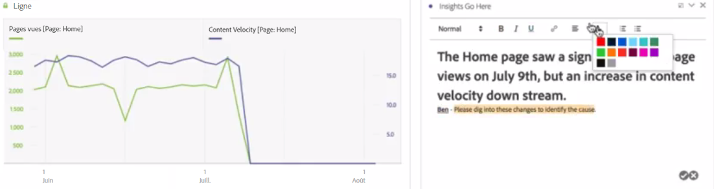
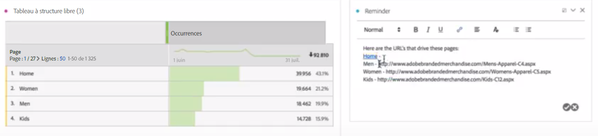

# Texte

Permet d’ajouter du texte défini par l’utilisateur dans l’espace de travail.

Vous pouvez modifier la mise en forme de la police (gras, italique, etc.) et ajouter des liens hypertextes dans les visualisations de zone de texte et les descriptions de panneaux/visualisations.

## Change font settings {#section_32727EE03FD04A8EB1D1B387DCAF6537}

Après avoir fait glisser une visualisation de texte dans un panneau puis ajouté du texte, vous pouvez mettre en forme le texte en ajoutant des niveaux de titre, en changeant la mise en forme (gras, italique, souligné), en changeant la couleur du texte, etc.

## Add hyperlinks {#section_D55B857188A74A06B49006DF3511DC7C}

Surlignez le texte et cliquez sur l’icône de lien hypertexte dans le menu de mise en forme pour ajouter des liens hypertextes.
