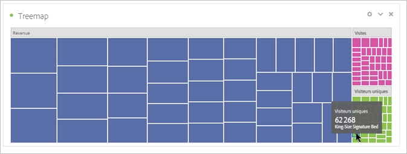

# [!UICONTROL Plan en arborescence] {#treemap}

<!-- markdownlint-disable MD034 -->

>[!CONTEXTUALHELP]
>id="workspace_treemap_button"
>title="Treemap"
>abstract="Créez une visualisation de graphique de compartimentage pour afficher des données hiérarchiques (structurées en arborescence) avec des rectangles imbriqués."

<!-- markdownlint-enable MD034 -->

>[!BEGINSHADEBOX]

_Cet article présente la visualisation Treemap dans_  _**Adobe Analytics**._ _Voir [Treemap](https://experienceleague.adobe.com/en/docs/analytics-platform/using/cja-workspace/visualizations/treemap) pour la version_  _**Customer Journey Analytics** de cet article._

>[!ENDSHADEBOX]

Utilisez une visualisation  **[!UICONTROL Treemap]** pour afficher des données hiérarchiques (structurées en arborescence) sous la forme d’un ensemble de rectangles imbriqués.

Chaque branche de l’arbre se voit affectée d’un rectangle qui est découpé en une mosaïque de plus petits rectangles représentant les sous-branches.

Avec un treemap, vous pouvez voir des motifs qui seraient difficiles à repérer d&#39;une autre manière. En utilisant la couleur et la taille des dimensions, vous pouvez découvrir comment les dimensions sont corrélées et si une certaine dimension est particulièrement pertinente. Un deuxième avantage des treemaps est que, par construction, les treemaps utilisent efficacement l&#39;espace.

>[!BEGINSHADEBOX]

Voir  [Visualisation Treemap](https://video.tv.adobe.com/v/334458/?quality=12){target="_blank"} pour une vidéo de démonstration.

>[!ENDSHADEBOX]

>[!MORELIKETHIS]
>
>[Ajouter une visualisation à un panneau](/help/analyze/analysis-workspace/visualizations/freeform-analysis-visualizations.md#add-visualizations-to-a-panel)
>[Paramètres de visualisation ](/help/analyze/analysis-workspace/visualizations/freeform-analysis-visualizations.md#settings)
>[Menu contextuel de visualisation](/help/analyze/analysis-workspace/visualizations/freeform-analysis-visualizations.md#context-menu)
>
