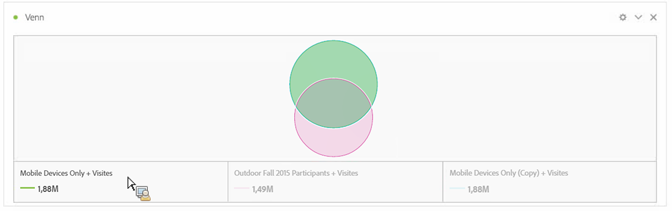
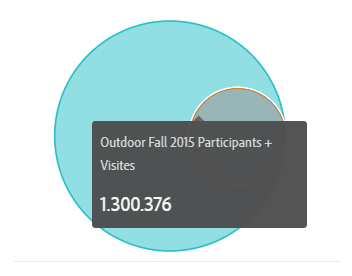
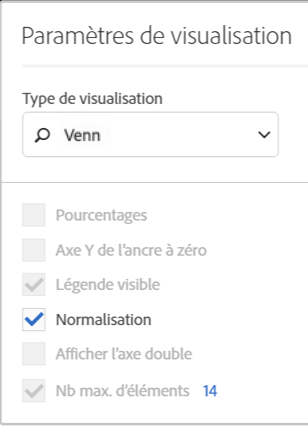

# Venn

Dans la visualisation de [!UICONTROL Venn], vous pouvez faire glisser jusqu’à trois segments (depuis les [!UICONTROL composants]) et une mesure afin de générer un diagramme de [!UICONTROL Venn].

Vous pouvez ensuite pointer sur les segments afin d’afficher davantage d’informations sur les pourcentages, etc.

## Transformation du diagramme de [!UICONTROL Venn] en tableau à [!UICONTROL structure libre]

Pour transformer le diagramme de Venn en tableau à structure libre, cliquez sur le point coloré en regard de l’en-tête de **[!UICONTROL Venn]** et sélectionnez **[!UICONTROL Gérer les sources de données]** > **[!UICONTROL Sources de données disponibles]** > **[!UICONTROL Tableau à structure libre]**.

## Normalisation du diagramme de [!UICONTROL Venn]

Pour normaliser le diagramme de [!UICONTROL Venn] (sa taille), cliquez sur son icône Paramètres de visualisation et sélectionnez **[!UICONTROL Normalisation]**.

## Vidéo

Voici un aperçu vidéo du diagramme de [!UICONTROL Venn] :

>[!VIDEO](https://video.tv.adobe.com/v/335798/?quality=12)
