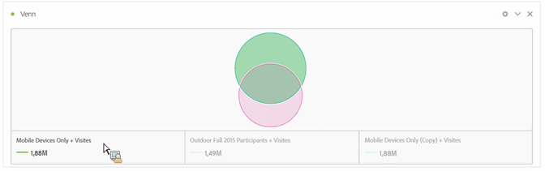
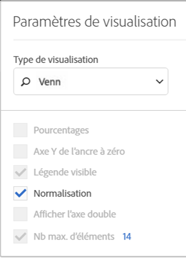

# Venn {#venn}

<!-- markdownlint-disable MD034 -->

>[!CONTEXTUALHELP]
>id="workspace_venn_button"
>title="Venn"
>abstract="Créez une visualisation de diagramme de Venn afin de comparer visuellement deux éléments ainsi que la taille du chevauchement."

<!-- markdownlint-enable MD034 -->

>[!BEGINSHADEBOX]

_Cet article présente la visualisation de Venn dans_  _**Adobe Analytics**._ _Voir [Venn](https://experienceleague.adobe.com/fr/docs/analytics-platform/using/cja-workspace/visualizations/venn) pour la version_  _**Customer Journey Analytics** de cet article._

>[!ENDSHADEBOX]

La visualisation  **[!UICONTROL Venn]** vous permet de faire glisser jusqu’à 3 filtres et une mesure (à partir du panneau Composants) pour créer un diagramme de Venn.

>[!NOTE]
>
>Analysis Workspace utilise des diagrammes de Venn proportionnels à la surface. Les diagrammes de Venn avec trois cercles ou plus représentés en deux dimensions ne peuvent pas toujours être dessinés avec des proportions parfaites.
> 
>Workspace tente d’obtenir le Venn le plus proche, mais les résultats peuvent ne pas toujours être précis visuellement.

Vous pouvez ensuite pointer sur les filtres afin d’afficher davantage d’informations sur les pourcentages, etc.

Pour générer un [!UICONTROL Tableau à structure libre] à partir de la visualisation [!UICONTROL Venn], sélectionnez l’icône colorée  à côté de l’en-tête **[!UICONTROL Venn]** et sélectionnez **[!UICONTROL Afficher la source de données]**. Un tableau à structure libre **[!UICONTROL Données de Venn]** contenant les données utilisées pour créer la visualisation [!UICONTROL Venn] s’affiche.

<!--
To normalize the Venn diagram (take the size out of it), go select  and select **[!UICONTROL Normalization]**.

-->

>[!BEGINSHADEBOX]

Consultez  [Visualisation Venn](https://experienceleague.adobe.com/en/docs/analytics-learn/tutorials/analysis-workspace/visualizations/venn-diagram-visualization){target="_blank"} pour une vidéo de démonstration.

>[!ENDSHADEBOX]

>[!MORELIKETHIS]
>
>[Ajouter une visualisation à un panneau](/help/analyze/analysis-workspace/visualizations/freeform-analysis-visualizations.md#add-visualizations-to-a-panel)
>[Paramètres de visualisation](/help/analyze/analysis-workspace/visualizations/freeform-analysis-visualizations.md#settings)
>[Menu contextuel de visualisation](/help/analyze/analysis-workspace/visualizations/freeform-analysis-visualizations.md#context-menu)
>

