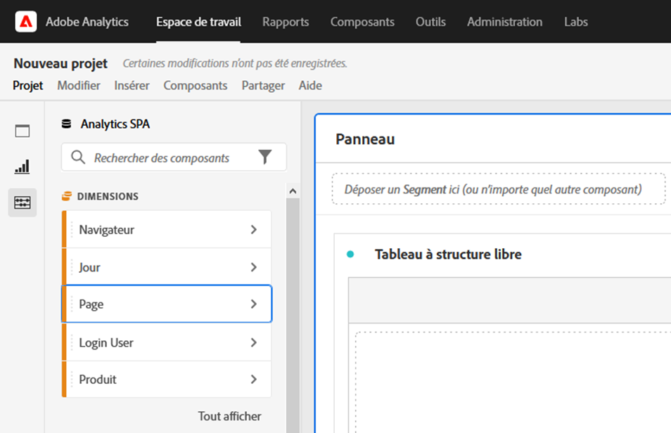
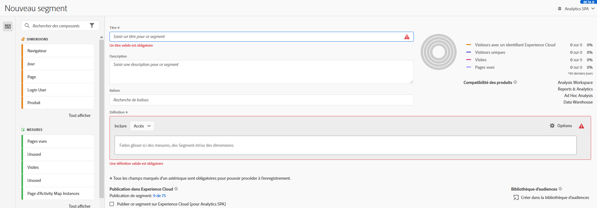

# Accessibilité dans Analysis Workspace

Découvrez la prise en charge de l’accessibilité dans [!UICONTROL Analysis Workspace], le principal outil d’analyse de Customer Journey Analytics.

L’accessibilité consiste à rendre les produits utilisables pour les personnes souffrant de déficiences visuelles, auditives, cognitives, motrices et autres. Voici quelques exemples de fonctionnalités d’accessibilité pour les produits logiciels :

* prise en charge des lecteurs d’écran,
* équivalents textuels pour les images,
* raccourcis clavier,
* contraste élevé pour les couleurs d’affichage,
* etc.

[!UICONTROL Analysis Workspace] fournit quelques outils qui le rendent accessible, notamment :

## Navigation au clavier

La navigation dans [!UICONTROL Analysis Workspace] s’effectue de haut en bas et de gauche à droite. Les éléments de navigation suivants facilitent l’accessibilité :

* La touche **[!UICONTROL Tab]** active des raccourcis de repère, pour se déplacer entre des sections plus grandes dans Workspace. Dans le panneau de gauche, la touche **[!UICONTROL Tab]** vous permet également de passer d’une option déplaçable à la suivante.
* Les touches ◀ et ▶ permettent de se déplacer entre les éléments individuels après que la touche **[!UICONTROL Tab]** a mis en surbrillance un élément.
* La touche **[!UICONTROL F6]** permet d’accéder au premier panneau du projet et de se déplacer parmi les visualisations de ce panneau. Puis, il passe au panneau suivant du projet et répète la même opération.
* Des indicateurs d’élément actif sont présents afin que les utilisateurs et les utilisatrices malvoyants disposent d’une indication claire mettant en évidence l’élément de l’interface utilisateur actuellement actif. L’indicateur est une bordure bleue pour le panneau actif. Et un arrière-plan gris pour la fonctionnalité sélectionnée récemment et la sélection dans la fonctionnalité. Dans cet exemple, [!UICONTROL Composants] et la dimension Page ont été récemment sélectionnés.

  

### Navigation au clavier pour la barre de menu

1. Appuyez sur la touche de tabulation jusqu’à ce que vous ayez atteint la barre de menu.
1. Utilisez les touches directionnelles pour naviguer entre les menus et les éléments de menu.
1. Appuyez sur **[!UICONTROL Entrée]** pour ouvrir un menu ou sélectionner un élément de menu.
1. Utilisez la touche **[!UICONTROL Echap]** pour fermer un menu.

### Navigation au clavier pour les interactions de glisser-déposer

[!UICONTROL Analysis Workspace] est une interface utilisateur avec glisser-déposer. Cependant, les utilisateurs et les utilisatrices peuvent également ajouter des composants à l’aide du clavier :

1. Appuyez sur la touche de tabulation pour atteindre un composant dans le panneau de gauche.
1. Appuyez sur **[!UICONTROL Entrée]** pour le sélectionner.
1. Utilisez les touches de direction pour accéder à la zone où vous souhaitez déposer le composant.
1. Appuyez sur **[!UICONTROL Entrée]** pour déposer le composant.

### Raccourcis clavier (touches de raccourci)

[!UICONTROL Analysis Workspace] offre un vaste ensemble de [raccourcis clavier (touches de raccourci)](/help/analyze/analysis-workspace/build-workspace-project/fa-shortcut-keys.md) pour un workflow plus fluide.

## Prise en charge des lecteurs d’écran et des loupes

Un lecteur d’écran lit le texte qui s’affiche sur l’écran de l’ordinateur. Il lit également les informations non textuelles, telles que les libellés des boutons ou les descriptions d’image dans l’application.

## Palettes et contraste des couleurs

[!UICONTROL Analysis Workspace] s’efforce de respecter la norme WCAG 2.1 AA, y compris les exigences en matière de contraste des couleurs.

En outre, les utilisateurs peuvent définir leur propre palette de couleurs préférée pour un projet sous **[!UICONTROL Projet]** > **[!UICONTROL Paramètres du projet]** > [Palette de couleurs du projet](/help/analyze/analysis-workspace/build-workspace-project/color-palettes.md).

## Validation requise

Lors de la création d’un composant, d’une visualisation ou d’un panneau, les champs obligatoires sont validés lors de l’enregistrement. Si un champ obligatoire n’est pas validé, il est entouré en rouge avec une icône d’erreur. Une description écrite explique ce qui doit être corrigé.

## Prise en charge des fonctionnalités d’accessibilité du système d’exploitation

Analysis Workspace prend en charge les fonctionnalités d’accessibilité intégrées à Windows et macOS, telles que le mode de contraste élevé, les touches rémanentes et les touches lentes/filtres. Il fournit également des informations sur l’interface utilisateur du système d’exploitation pour permettre l’interaction avec les technologies d’assistance, y compris les lecteurs d’écran tels que VoiceOver pour macOS et NVDA sous Windows.

<!--

# Accessibility in Analysis Workspace

Learn about accessibility support in [!UICONTROL Analysis Workspace], the premier analysis tool for Adobe Analytics. 

Accessibility refers to making products usable for people with visual, auditory, cognitive, motor, and other disabilities. Examples of accessibility features for software products include screen reader support, text equivalents for graphics, keyboard shortcuts, change of display colors to high contrast, and so on. 

[!UICONTROL Analysis Workspace] provides some tools that make it accessible to use, including:

## Navigate [!UICONTROL Workspace] using the keyboard

Navigation in [!UICONTROL Analysis Workspace] works top > down, and left > right. The following navigational elements facilitate accessibility:

* The `Tab` key enables landmark shortcuts, moving between larger sections within Workspace. In the left rail, `Tab` also enables you to move from one draggable option to the next.
* The `left/right arrows` move between individual elements after `Tab` has highlighted it. 
* The `F6` navigates to the first panel in the project and  moves between the visualizations within that panel. Then, it moves to the next panel in the project and repeats. 
* We apply focus indicators so that sighted keyboard users have a clear indication of which UI element currently has focus. The indicator is a blue border around the selected element.

    

### Keyboard navigation for the menu bar 

1. Tab until you have reached the menu bar.
1. Use left/right arrow keys to navigate to the menu you want.
1. Press `Enter` to select the menu and show its options.
1. Use up/down arrow keys to navigate to the menu option you want.
1. Press `Enter` to select the option.

### Keyboard navigation for drag & drop interactions 

[!UICONTROL Analysis Workspace] is a drag & drop user interface. However, users can add components using the keyboard instead:

1. Tab to a component in the left rail.
1. Press `Enter` to select.
1. Use arrow keys to navigate to the area where you want to drop the component.
1. Press `Enter` to place the component.

### Keyboard shortcuts (hotkeys) 

[!UICONTROL Analysis Workspace] offers a rich set of [keyboard shortcuts](/help/analyze/analysis-workspace/build-workspace-project/fa-shortcut-keys.md) for a more seamless workflow. Some common shortcuts for navigation, analysis creation, and insight democratization are listed below. 

#### Navigation

| Shortcut | Action |
| --- | --- |
| `[Alt + Shift + 1 / 2 / 3]` | Jump to different rails: [!UICONTROL Panels], [!UICONTROL Visualizations], or [!UICONTROL Components] |
| `[Alt + Left / Right]` | Navigate between panels |
| `[Alt + M]` | Collapse/expand all panels |
| `[Alt + Ctrl + M]` | Collapse/expand active panel |
| `[Ctrl + /]` | Search left rail |

#### Analysis creation

| Shortcut | Action |
| --- | --- |
| `[Alt + 1]` | New freeform table |
| `[Ctrl + Shift + C]` | New calculated metric |
| `[Ctrl + Shift + D]` | New date range |
| `[Ctrl + Shift + E]` | New segment |
| `[Ctrl + Z]` | Undo |
| `[Component drag + Shift]` | Create a drop-down filter |

#### Democratization

| Shortcut | Action |
| --- | --- |
| `[Ctrl + S]` | Save |
| `[Ctrl + Shift + G]` | Curate |
| `[Ctrl + G]` | Share |
| `[Alt + Shift + S]` | Schedule |
| `[Alt + L]` | Get link to project |
| `[Ctrl + Shift + B]` | Download PDF |

## Support for screen readers and screen magnifiers

A screen reader reads text that appears on the computer screen. It also reads non-textual information, such as button labels or image descriptions in the application, provided in accessibility tags or attributes.  

## Color palettes & contrast  

[!UICONTROL Analysis Workspace] strives for WCAG 2.1 AA conformance, including requirements for color contrast. 

In addition, users can set their own preferred color palette for a project under **[!UICONTROL Project]** > **[!UICONTROL Project settings]** > [Project color palette](/help/analyze/analysis-workspace/build-workspace-project/color-palettes.md). 

## Required field validation in component builders 

When building a component, required fields are validated when you save. If a required field does not pass validation, it will be outlined in red with an error icon. A written description appears of the issue that needs to be fixed.  

Once a component is fully validated, pressing `Save` closes the builder. 

## Support for operating system accessibility features  

Analysis Workspace supports built-in MS Windows and macOS accessibility features like high-contrast mode, sticky keys, and slow keys/filter keys. It also provides information about the user interface to the operating system to enable interaction with assistive technologies, including screen readers such as VoiceOver for macOS and NVDA on Windows.

-->