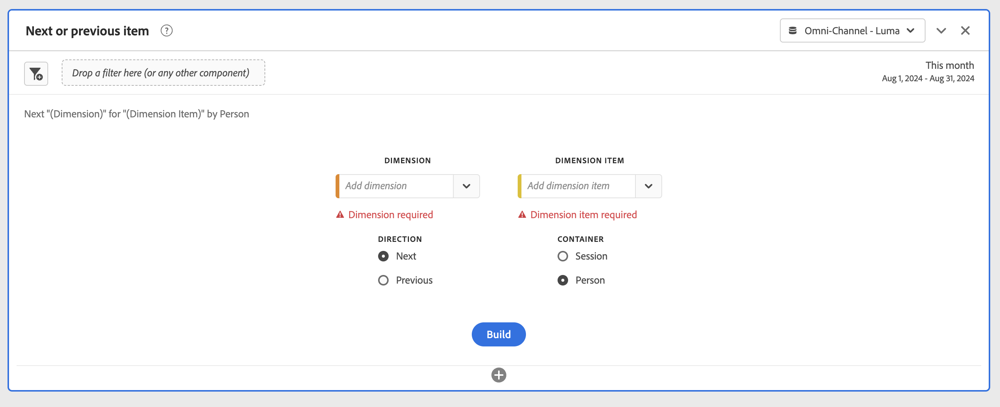

# Accessibilité dans l’espace de travail des Analyses

Découvrez la prise en charge de l’accessibilité dans [!UICONTROL Analyse Workspace], le principal outil d’analyse pour Adobe Analytics.

L&#39;accessibilité se rapporte à rendre des produits utilisables par les personnes ayant des déficiences visuelles, auditives, cognitives, motrices et autres. Parmi les exemples de fonctionnalités d’accessibilité pour les logiciels, citons la prise en charge des lecteurs d’écran, les équivalents de texte pour les graphiques, les raccourcis clavier, le changement des couleurs d’affichage en contraste élevé, etc.

[!UICONTROL Analyse Workspace] fournit quelques outils qui le rendent accessible à l’utilisation, notamment :

## Navigation dans [!UICONTROL Workspace] à l’aide du clavier

La navigation dans [!UICONTROL Analyse Workspace] fonctionne en haut > bas, puis à gauche > à droite. Les éléments de navigation suivants facilitent l&#39;accessibilité :

* La `F6` clé active des raccourcis marquants
* La `Tab` touche se déplace entre des éléments individuels.
* Nous appliquons des indicateurs de ciblage afin que les utilisateurs de clavier voyants aient une indication claire de l’élément d’interface qui a actuellement le focus. L’indicateur est une bordure bleue autour de l’élément sélectionné.

   

### Navigation au clavier pour les interactions glisser-déposer

[!UICONTROL Analyse Workspace] est une interface utilisateur par glisser-déposer. Cependant, les utilisateurs peuvent ajouter des composants à l’aide du clavier à la place :

1. Appuyez sur un composant dans le rail de gauche.
1. Appuyez sur `Enter` pour sélectionner.
1. Utilisez les touches fléchées pour accéder à la zone où vous souhaitez déposer le composant.
1. Appuyez sur `Enter` pour placer le composant.

### Raccourcis clavier

[!UICONTROL Analyse Workspace] offre un riche ensemble de raccourcis  clavier pour un flux de travail plus fluide. Voici quelques raccourcis courants pour la navigation, la création d&#39;analyses et la démocratisation des connaissances.

#### Navigation

| Raccourci | Action |
|---|---|
| Alt + Maj + 1 / 2 / 3 | Accédez à différents rails : [!UICONTROL Panneaux], [!UICONTROL visualisations]ou [!UICONTROL composants] |
| Alt + flèche gauche/droite | Navigation entre les panneaux |
| Alt + M | Réduire/développer tous les panneaux |
| Alt+ Ctrl + M | Réduire/développer le panneau actif |
| Ctrl + / | Rechercher le rail gauche |

#### Création d’Analyses

| Raccourci | Action |
|---|---|
| Alt + 1 | Nouveau tableau à structure libre |
| Ctrl + Maj + C | Nouvelle mesure calculée |
| Ctrl + Maj + D | Nouvelle plage de dates |
| Ctrl + Maj + E | Nouveau segment |
| Ctrl + Z | Annuler |
| Maintenir la touche Maj enfoncée (dans la zone de dépôt des segments du panneau) | Création d’un filtre [déroulant](https://docs.adobe.com/content/help/en/analytics-learn/tutorials/analysis-workspace/using-panels/using-drop-down-filters.html) |

#### Démocratisation

| Raccourci | Action |
|---|---|
| Ctrl + S | Enregistrer |
| Ctrl + Maj + G | Traiter |
| Ctrl + G | Partager |
| Alt + Maj + S | Planification |
| Alt + L | Lien vers le projet |
| Ctrl + Maj + B | Télécharger un PDF |

## Prise en charge des lecteurs d’écran et des agrandisseurs d’écran

Un lecteur d’écran lit le texte qui s’affiche sur l’écran de l’ordinateur. Il lit également les informations non textuelles, telles que les étiquettes de bouton ou les descriptions d’image dans l’application, fournies dans les balises ou attributs d’accessibilité.

## Palettes de couleurs et contraste

[!UICONTROL Analyse Workspace] recherche la conformité WCAG 2.1 AA, y compris les exigences de contraste de couleur.

En outre, les utilisateurs peuvent définir leur propre palette de couleurs préférée pour un projet sous **[!UICONTROL Projet]** > Paramètres **** du projet > palette [de couleurs](https://docs.adobe.com/content/help/en/analytics/analyze/analysis-workspace/build-workspace-project/color-palettes.html)Projet.

## Validation de champ requise dans les créateurs de composants

Lors de la création d’un composant, les champs obligatoires sont validés lors de l’enregistrement. Si un champ obligatoire n’est pas validé, il est signalé en rouge avec une icône d’erreur. Une description écrite du problème qui doit être corrigé s’affiche.

Une fois qu’un composant est entièrement validé, appuyez sur `Save` pour fermer le générateur.

## Prise en charge des fonctions d’accessibilité du système d’exploitation

Analyse Workspace prend en charge les fonctions d&#39;accessibilité intégrées à MS Windows et à macOS, telles que le mode contraste élevé, les touches collantes et les touches lentes/clés de filtre. Il fournit également des informations sur l’interface utilisateur du système d’exploitation pour permettre l’interaction avec les technologies d’assistance, y compris les lecteurs d’écran tels que VoiceOver pour macOS et NVDA sous Windows.