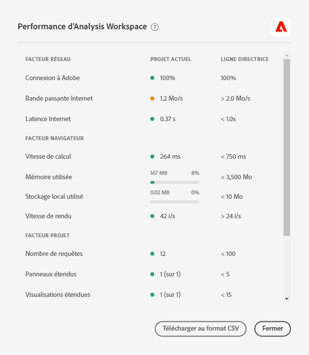

# Facteurs de performances et optimisation Analysis Workspace

Divers facteurs peuvent influencer la performance d&#39;un projet à l&#39;intérieur de l&#39;Analysis Workspace. Il est important de savoir quels sont ces contributeurs avant que vous ne début de créer un projet afin que vous puissiez planifier et construire le projet de la manière la plus optimale. Cette page comprend une liste de facteurs qui aura un impact sur les performances et les optimisations recommandées que vous pouvez effectuer pour garantir des performances optimales dans Analysis Workspace.

>[!IMPORTANT]
>
>La page Performances d’Analysis Workspace est en version limitée. [En savoir plus](https://docs.adobe.com/content/help/fr-FR/analytics/landing/an-releases.html)

## Aide > Performances en Analysis Workspace

Sous **[!UICONTROL Analysis Workspace > Aide > Performances]**, vous pouvez voir les facteurs qui affectent les performances de votre projet, notamment les facteurs réseau, de navigateur et de projet. Pour obtenir des résultats plus précis, autorisez le projet à se charger complètement avant d’ouvrir la page Performances. En outre, vous pouvez **télécharger en tant que fichier CSV** le contenu des performances à partager facilement avec le service à la clientèle d’Adobe ou vos équipes informatiques internes.

>[!NOTE]
>
>Les informations de la page Performances varient chaque fois que le mode est ouvert, car les facteurs peuvent changer. En outre, l&#39;Adobe continuera à affiner les seuils recommandés à mesure que davantage de données seront disponibles.

## Facteurs réseau

**[!UICONTROL Aide > Les facteurs de performances]** du réseau sont les suivants :

| Facteur | Définition | Influencé par | Optimisation |
|---|---|---|---|
| Connexion à Adobe | adobe envoie 10 appels de test lorsque la page de performances est ouverte. Ceci représente le pourcentage de ces appels à l&#39;Adobe qui réussissent. | Les problèmes de réseau local ou d&#39;Adobe influeront sur ce facteur. | Consultez status.adobe.com pour vérifier s’il existe des problèmes de service connus. Ensuite, validez votre connexion réseau locale. |
| Bande passante Internet | Estimation de la bande passante de votre navigateur à votre emplacement, testée uniquement pour Google Chrome. Le seuil recommandé est de 2,0 Mo/s. | Votre connexion réseau locale aura un impact sur ce facteur. | Validez votre connexion réseau locale. |
| Latence Internet | adobe envoie 10 appels de test lorsque la page de performances est ouverte. Cela représente le temps moyen nécessaire pour que chaque demande soit envoyée à l’Adobe et renvoyée. En d&#39;autres termes, il s&#39;agit d&#39;une mesure de la vitesse à laquelle Internet se trouve entre votre lieu et votre Adobe. Le seuil recommandé est de &lt; 1 seconde. | Des problèmes de réseau local, de nombreux onglets de navigateur ouverts ou des problèmes d&#39;Adobe auront un impact sur ce facteur. | Consultez status.adobe.com pour vérifier s’il existe des problèmes de service connus. Ensuite, validez votre connexion réseau locale et fermez les onglets inutilisés du navigateur. |

## Facteurs du navigateur

**[!UICONTROL Aide > Performances]** des navigateurs :

| Facteur | Définition | Influencé par | Optimisation |
|---|---|---|---|
| Vitesse de calcul | La vitesse à laquelle votre ordinateur effectue un test de traitement. Le seuil recommandé est de &lt; 750 ms. | Votre matériel ainsi que vos programmes simultanés auront un impact sur ce facteur. | Ouvrez Tâche Manager (PC) ou Activité Monitor (Mac) de votre ordinateur pour déterminer si des programmes peuvent être fermés. Fermez ensuite les onglets inutilisés du navigateur ou d’autres programmes.   Si ces actions n&#39;aident pas, discutez des détails matériels avec votre équipe informatique. |
| Mémoire utilisée | Chaque onglet Workspace d’un navigateur Google Chrome partage 4 Go de mémoire au total (Firefox a un seuil plus élevé). Ceci représente le pourcentage de cette mémoire allouée par le projet actuel. Le seuil recommandé est de 3 500 Mo, c’est-à-dire que Workspace commence à afficher les erreurs de mémoire. | L’utilisation de plusieurs onglets ou le téléchargement de 5 000 lignes de données contribueront à une utilisation accrue de la mémoire. | Si vous recevez une erreur de mémoire, il est recommandé de fermer les autres onglets de Workspace et/ou d’exécuter les téléchargements de ligne de 5 000 lignes une par une. |
| Stockage local utilisé | Données stockées localement sur votre ordinateur en vue de leur utilisation dans le navigateur. Chaque origine (ex. : experience.adobe.com) a une capacité de 10 Mo. | analysis workspace utilise l’enregistrement local pour plusieurs fonctions, notamment pour stocker des projets enregistrés automatiquement (existants), des paramètres utilisateur et des indicateurs de fonctionnalité. | Pour éviter toute perturbation des fonctions Analysis Workspace, effacez l’enregistrement local du domaine experience.adobe.com. |
| Vitesse de rendu | FPS signifie Images par seconde, c’est-à-dire le nombre de fois par seconde que le navigateur trace la page sur votre écran. 24 FPS est généralement ce que l&#39;oeil humain peut observer ; si FPS est inférieur à cela, vous constaterez les problèmes de rendu dans Workspace. | La FPS est affectée par le multitâche dans de nombreux projets Workspace à la fois et la taille du projet affiché. D’autres programmes exécutés sur votre ordinateur peuvent avoir un impact, comme la diffusion en continu, les scanneurs d’arrière-plan, etc. De plus, votre matériel aura un impact sur ce facteur. | Ouvrez Tâche Manager (PC) ou Activité Monitor (Mac) de votre ordinateur pour déterminer si des programmes peuvent être fermés. Fermez ensuite les onglets inutilisés du navigateur ou d’autres programmes.   Si ces actions n&#39;aident pas, discutez des détails matériels avec votre équipe informatique. |

## Facteurs du projet

**[!UICONTROL Aide > Facteurs du projet Performance]** :

| Facteur | Définition | Optimisation |
|---|---|---|
| Nombre de requêtes | Nombre total de requêtes (demandes) effectuées à l&#39;Adobe pour récupérer les données affichées dans le projet. Les requêtes comprennent les demandes avec classement de tableaux, la détection des anomalies, les graphiques sparkline, les composants affichés dans le rail de gauche, etc. Exclut les panneaux réduits et les visualisations. Le seuil recommandé est de 100. | Simplifiez votre projet lorsque cela est possible en divisant les données en plusieurs projets qui répondent à un objectif spécifique ou à un groupe de parties prenantes. Utilisez les balises pour organiser les projets en thèmes et utilisez les liens  directs pour créer une table des matières interne afin que les parties prenantes puissent trouver plus facilement ce dont elles ont besoin. |
| Panneaux développés (sur le total des panneaux) | Nombre de panneaux développés sur le nombre total de panneaux du projet. Le seuil recommandé est de 5. | Après avoir pris des mesures pour simplifier votre projet, réduisez les panneaux de votre projet qui n’ont pas besoin d’être affichés au chargement. Lorsque le projet est ouvert, seuls les panneaux développés sont traités. Les panneaux réduits ne seront pas traités tant que l’utilisateur ne les aura pas développés. |
| Visualisations étendues (sur le total des visualisations) | Nombre de tableaux et de visualisations développés par rapport au total du projet. Exclut les sources de données masquées. Le seuil recommandé est de 15. | Après avoir pris des mesures pour simplifier votre projet, réduisez les visualisations de votre projet qui n’ont pas besoin d’être affichées au chargement. Organisez en priorité les éléments visuels les plus importants pour le consommateur du rapport et répartissez les éléments visuels annexes dans un panneau ou projet distinct, plus détaillé si nécessaire. |
| Nombre de cellules à structure libre | Nombre total de cellules de tableau à structure libre dans le projet, calculé par lignes * colonnes sur tous les tableaux. Exclut les sources de données masquées. Le seuil recommandé est de 4 000. | Réduisez le nombre de colonnes dans votre tableau à seulement les points de données les plus pertinents. Réduisez le nombre de rangées du tableau en ajustant le nombre de rangées affichées, en appliquant un filtre de tableau ou en appliquant un segment. |
| Composants disponibles | Nombre total de composants récupérés dans le rail gauche du projet, dans toutes les suites de rapports du projet. Le seuil recommandé est 2000. | Contactez l’administrateur de votre produit au sujet de la création d’une suite de rapports virtuelle organisée dotée d’un ensemble de composants plus personnalisés. |
| Composants utilisés | Nombre total de composants utilisés dans le projet. Le seuil recommandé est de 100. | Le nombre de composants utilisés n&#39;influe pas directement sur les performances. Toutefois, la complexité de ces composantes contribuera à la réalisation du projet. Voir les optimisations recommandées dans la section &quot;Facteurs supplémentaires&quot; ci-dessous. |
| Période la plus longue | Ce facteur affiche la plage de dates la plus longue utilisée pour le projet. Le seuil recommandé est de 1 an. | Si possible, n’extrayez que les données dont vous avez besoin. Limitez le calendrier du panneau aux dates appropriées pour votre analyse ou utilisez des composants de plage de dates (composants violets) dans vos tableaux à structure libre. Les périodes utilisées dans un tableau remplacent les périodes du panneau. Par exemple, vous pouvez ajouter le mois dernier, la semaine dernière et hier aux colonnes du tableau pour demander ces périodes spécifiques. Pour en savoir plus sur l’utilisation des plages de dates dans Analysis Workspace, [regardez cette vidéo](https://docs.adobe.com/content/help/en/analytics-learn/tutorials/analysis-workspace/calendar-and-date-ranges/date-ranges-and-calendar-in-analysis-workspace.html).   De plus, minimisez le nombre de comparaisons d&#39;une année à l&#39;autre utilisées dans le projet. Lorsqu’une comparaison d’une année à l’autre est calculée, elle examine l’ensemble des données des 13 mois concernés. Cette action a le même impact que de définir la période du panneau sur les 13 derniers mois. |

## Facteurs supplémentaires

Les autres facteurs qui ne sont pas inclus dans Aide > Performances sont les suivants :

| Facteur | Définition | Influencé par | Optimisation |
|---|---|---|---|
| Complexité des segments | Des segments complexes peuvent avoir un impact significatif sur la performance des projets. | Les facteurs qui ajoutent de la complexité à un segment (dans l’ordre décroissant d’impact) incluent les éléments suivants : <ul><li>Les opérateurs de type « contains », « contains any of », « matches », « starts with » ou « ends with » </li><li>La segmentation séquentielle, en particulier lorsque des restrictions dimensionnelles (Within/After) sont utilisées </li><li>Le nombre d’éléments de dimensions uniques dans les dimensions utilisées dans le segment (par exemple, Page = ’A’ lorsque Page comporte 10 éléments uniques sera plus rapide que Page = ’A’ lorsque la page a 100 000 éléments uniques) </li><li>Le nombre de dimensions différentes utilisées (par exemple, Page = ’Home’ et Page = ’Search results’ seront plus rapides que eVar 1 = ’red’ et eVar 2 = ’blue’)</li><li>Beaucoup d’opérateurs OR (au lieu de AND)</li><li>Des contenants imbriqués dont la portée varie (par ex., « Hit inside of Visit inside of Visitor »)</li></ul> | Bien que certains facteurs de complexité ne puissent pas être évités, recherchez des opportunités pour réduire la complexité de vos segments. En général, plus vous pouvez être précis dans vos critères de segment, mieux c’est. Par exemple :<ul><li>Avec les conteneurs, l’utilisation d’un seul conteneur en haut du segment sera plus rapide qu’une série de conteneurs imbriqués</li><li>Avec les opérateurs, « equals » sera plus rapide que « contains » et « equals any of » sera plus rapide que « contains any of »</li><li>Avec de nombreux critères, les opérateurs AND seront plus rapides qu’une série d’opérateurs OR.</li></ul> Recherchez des opportunités pour réduire plusieurs instructions OU en une seule instruction &quot;est égal à n’importe laquelle&quot;.  [Les classifications](/help/components/classifications/c-classifications.md) peuvent également aider à consolider de nombreuses valeurs en groupes concis à partir desquels vous pouvez ensuite créer des segments. La segmentation appliquée aux groupes de classifications optimise les performances par rapport aux segments qui contiennent de nombreuses instructions OR ou de critères « contains ». |
| Complexité de la visualisation (segments, mesures, filtres) | Le type de visualisation (abandons ou tableau à structure libre) ajouté à un projet n’a pas de réelle incidence sur les performances du projet. Le temps de traitement dépend de la complexité de la visualisation. | Voici quelques-uns des facteurs qui rendent une visualisation plus complexe :<ul><li>Plage de données demandée</li><li>Nombre de segments appliqués ; par exemple, les segments utilisés comme des lignes d’un tableau à structure libre</li><li>Utilisation de segments complexes</li><li>[Lignes ou colonnes de postes statiques dans les tableaux de forme libre](https://docs.adobe.com/content/help/fr-FR/analytics/analyze/analysis-workspace/build-workspace-project/column-row-settings/manual-vs-dynamic-rows.html)</li><li>Filtres appliqués aux lignes des tableaux à structure libre</li><li>Nombre de mesures incluses, en particulier les mesures calculées qui utilisent des segments</li></ul> | Si vos projets ne se chargent pas aussi rapidement que prévu, remplacez si possible certains segments par des eVars et des filtres.  Si vous utilisez en permanence des segments et des mesures calculées pour les points de données importants pour votre entreprise, pensez à améliorer votre mise en oeuvre afin de capturer ces points de données plus directement. L’utilisation d’un gestionnaire de balises tel que les règles de traitement de l’Adobe Experience Platform Launch et de l’Adobe permet de modifier rapidement et facilement l’implémentation. |
| Taille de la suite de rapports | Quantité de données collectées dans votre suite de rapports. La taille de la suite de rapports joue un rôle mineur dans les performances du projet en raison de la manière dont l’Adobe traite le traitement des données. | S.O. | Consultez votre équipe de mise en oeuvre ou un expert en Adobe pour déterminer si des améliorations peuvent être apportées à l’implémentation afin d’améliorer l’expérience globale dans Adobe Analytics. |

## Messages d’erreur courants

Vous pouvez rencontrer des erreurs lors de l’interaction avec Analysis Workspace qui influenceront également les performances. Les types d&#39;erreur les plus courants sont répertoriés ci-dessous, les raisons pour lesquelles ils se produisent et les optimisations qui peuvent être effectuées.

| Message d’erreur | Quelle en est la raison ? | Optimisation |
| --- | --- | --- |
| [!UICONTROL Établissement de rapports inhabituellement lourd pour la suite de rapports. Réessayez ultérieurement.] | Votre entreprise essaie d’exécuter trop de requêtes simultanées sur une suite de rapports spécifique. Les facteurs à l’origine de cette erreur sont les demandes d’API, les projets planifiés, les rapports planifiés, les alertes planifiées et les utilisateurs qui effectuent simultanément des demandes de création de rapports. | Diffusez vos requêtes et planifications pour la suite de rapports de manière plus uniforme tout au long de la journée. |
| [!UICONTROL Une erreur système s&#39;est produite. Veuillez enregistrer une demande du service d’assistance clientèle sous Aide > Envoyer le ticket d’assistance et inclure votre code d’erreur.] | Adobe rencontre un problème qui doit être résolu. | Envoyez le code d’erreur au service à la clientèle. |
| [!UICONTROL La demande est trop complexe.] | Votre requête de création de rapports est trop volumineuse et ne peut pas être exécutée. Les facteurs à l’origine de cette erreur sont les dépassements de délai en raison de la taille de la requête, du nombre trop élevé d’éléments correspondants dans un segment ou un filtre de recherche, du nombre trop élevé de mesures incluses, des combinaisons de dimensions et de mesures incompatibles, etc. | Simplifiez votre requête en supprimant certaines colonnes ou lignes du tableau ou en divisant le tableau en plusieurs requêtes distinctes. |
| [!UICONTROL L’un des segments ou la recherche de cette visualisation contient une recherche de texte qui a renvoyé trop de résultats.] | Les critères de segment ou le filtre de rapport sont trop larges. | Affinez vos critères de recherche de texte et tentez de nouveau la requête. |
| [!UICONTROL Actuellement, cette dimension ne prend pas en charge les modèles d’attribution autres que ceux par défaut.] | L’attribution autre que l’attribution par défaut n’est pas prise en charge pour la dimension que vous utilisez. | Replace the dimension in your table with one that is compatible with [Attribution IQ](../attribution/overview.md). |
| [!UICONTROL Votre requête a échoué en raison d&#39;un trop grand nombre de colonnes ou de lignes préconfigurées.] | Votre tableau comporte trop de cellules à structure libre (ligne * colonnes). | Supprimez les colonnes ou les lignes du tableau ou envisagez de les diviser en requêtes distinctes. |
