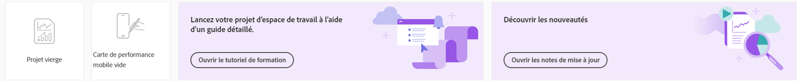
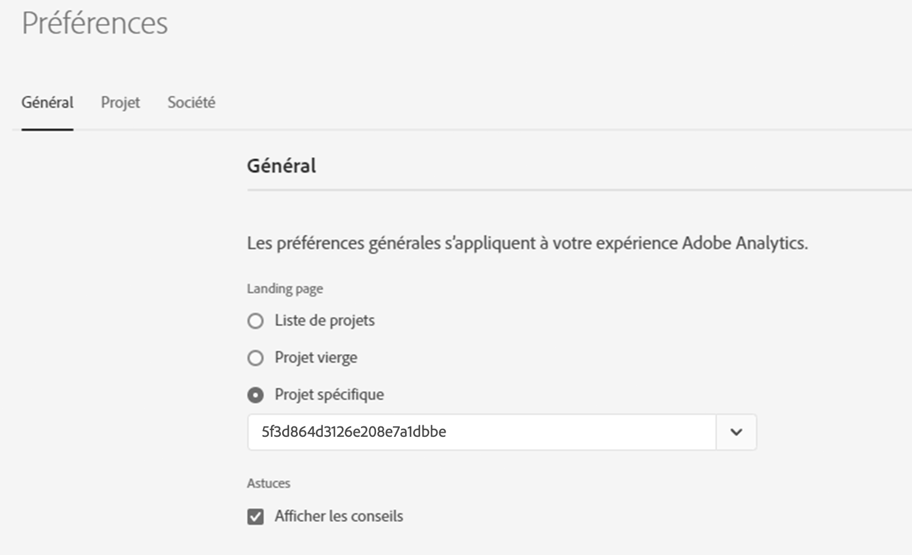

# Page de destination dʼAdobe Analytics

La page de destination dʼAdobe Analytics rassemble [!DNL Analysis Workspace] et [!DNL Reports & Analytics] (devenus obsolètes) en une interface et un point dʼaccès uniques sous la bannière [!DNL Workspace]. Elle comprend une page dʼaccueil pour la gestion de projet, une section de modèles et une section de formation pour faciliter la prise en main.

>[!BEGINSHADEBOX]

Voir  [Page de destination d’Adobe Analysis](https://video.tv.adobe.com/v/334278/?quality=12&learn=on){target="_blank"} pour une vidéo de démonstration.

>[!ENDSHADEBOX]

La page de destination Adobe Analytics se compose des sous-onglets suivants : Projets, Modèles et Formation.

Les **[!UICONTROL projets]** sont des conceptions personnalisées qui combinent les composants de données, les tableaux et les visualisations que vous avez créés ou que quelqu’un d’autre a créés et partagés avec vous. Les [!UICONTROL projets] font également référence aux projets vierges et aux fiches dʼévaluation mobiles vierges.

**[!UICONTROL Modèles]** inclut les modèles fournis par Adobe et tous les modèles spécifiques à votre organisation.

L’onglet **[!UICONTROL Formation]** contient des visites guidées vidéo et des tutoriels pratiques, ainsi que des liens vers la documentation.

## Accédez à lʼonglet [!UICONTROL Projets]. {#navigate-projects}

L’onglet [!UICONTROL Projets] fait office de page d’accueil de [!UICONTROL l’espace de travail]. L’onglet Projets affiche le dossier Entreprise, les dossiers personnels que vous avez créés, vos projets et vos cartes de performance mobiles. Utilisez cette page pour afficher, créer et modifier des dossiers, des projets et des cartes de performance mobiles. Pour plus d’informations, consultez [À propos des dossiers dans Analytics](/help/analyze/analysis-workspace/build-workspace-project/workspace-folders/about-folders.md).

>[!NOTE]
>
>Plusieurs des paramètres suivants sont conservés pendant la session et entre les sessions. Par exemple, l’onglet que vous avez sélectionné, les filtres sélectionnés, les colonnes sélectionnées et l’ordre de tri des colonnes. Les résultats de recherche ne sont pas persistants.

### Personnaliser les colonnes d’un tableau

Pour personnaliser les largeurs de colonne, faites glisser la barre verticale qui sépare chaque colonne.

Pour ajouter ou supprimer des colonnes de la liste des projets, cliquez sur l’icône de colonne () dans le coin supérieur droit, puis sélectionnez ou désélectionnez les titres des colonnes.

Les colonnes disponibles sont les suivantes :

| Nom de la colonne | Description |
|---------|----------|
| [!UICONTROL **Nom**] | Indique le nom du projet. |
| [!UICONTROL **Type**] | Indique le type : un projet Workspace, une carte de performance mobile ou un dossier. |
| [!UICONTROL **Balises**] | Ajoute des balises aux projets pour les organiser en groupes. |
| [!UICONTROL **Planifié**] | Choisissez [!UICONTROL Activé] si un projet est planifié, ou [!UICONTROL Désactivé] dans le cas contraire. Le fait de cliquer sur le lien [!UICONTROL Activé] vous renvoie aux informations du projet planifié. Vous pouvez également [modifier le planning du projet](/help/analyze/analysis-workspace/curate-share/t-schedule-report.md) si vous êtes son propriétaire. |
| [!UICONTROL **Rôle de projet**] | Indique les rôles de projet : si vous êtes le propriétaire du projet et si vous disposez des autorisations pour modifier ou dupliquer le projet. |
| [!UICONTROL **Suite de rapports**] | Indique les suites de rapports associées au projet. Les tableaux et les visualisations au sein d’un panneau obtiennent des données de la suite de rapports sélectionnée en haut à droite du panneau. La suite de rapports détermine également les composants disponibles dans le rail de gauche. Dans un projet, vous pouvez utiliser une ou plusieurs suites de rapports selon les cas pratiques de votre analyse. La liste des suites de rapports est triée selon la pertinence. Adobe définit la pertinence en fonction de la fréquence dʼutilisation récente de la suite par lʼutilisateur ou lʼutilisatrice actuel et de la fréquence dʼutilisation de la suite au sein de lʼentreprise. |
| [!UICONTROL **Propriétaire**] | Indique la personne qui a créé le projet. |
| [!UICONTROL **Partagé avec**] | Indique avec qui le projet est actuellement partagé. |
| [!UICONTROL **Dernière modification**] | Date et heure de dernière modification du projet. |
| [!UICONTROL **Dernière ouverture**] | Identifie la date à laquelle un projet a été ouvert pour la dernière fois par la personne qui consulte la page Projets. |
| [!UICONTROL **Dernière utilisation**] | Permet de déterminer si un projet est utile aux utilisateurs et utilisatrices de votre entreprise en indiquant la date et l’heure de la dernière ouverture du projet par une personne de l’entreprise.
Tenez compte des points suivants lorsque vous affichez cette colonne :
<ul><li>Les informations d’utilisation sont disponibles à partir de septembre 2023.</li><li>Cette colonne est réservée aux administrateurs et administratrices système.</li></ul> |
| [!UICONTROL **Identifiant du projet**] | Peut être utilisé pour le dépannage de projets. |
| [!UICONTROL **Période la plus longue**] | Des périodes plus longues peuvent compliquer le projet et augmenter le temps de traitement et de chargement. |
| [!UICONTROL **Nombre de requêtes**] | Le nombre total de requêtes envoyées à Analytics lors du chargement du projet. Un nombre plus élevé de requêtes peut compliquer le projet et augmenter le temps de traitement et de chargement. Ces données ne sont disponibles qu’une fois qu’un projet a été chargé ou qu’un projet planifié a été envoyé. |
| [!UICONTROL **Emplacement**] | Affiche le dossier contenant le projet. |

### Autres éléments de l’interface utilisateur de la page Projets

| Élément de lʼinterface utilisateur | Définition |
| --- | --- |
| Modifier les préférences | Permet dʼ[!UICONTROL afficher les tutoriels] et de [Modifier les préférences utilisateur](/help/analyze/analysis-workspace/user-preferences.md). |
| [!UICONTROL Créer] | Ouvre la fenêtre modale du projet dans laquelle vous pouvez créer un projet Workspace ou une carte de performance mobile ou ouvrir un modèle d’entreprise. |
| [!UICONTROL Afficher moins  Afficher plus] | Active/désactive lʼaffichage de la . |
| [!UICONTROL Projet Espace de travail] | Crée un [projet Workspace](/help/analyze/analysis-workspace/home.md) vierge que vous pouvez concevoir et développer. |
| [!UICONTROL Carte de performance mobile] | Crée une [carte de performance mobile](/help/analyze/mobile-app/curator.md) vierge que vous pouvez concevoir et développer. |
| [!UICONTROL Ouvrir le tutoriel de formation] | Ouvre le tutoriel de formation Workspace qui vous guide tout au long du processus de création d’un projet de démarrage dans un tutoriel détaillé. |
| [!UICONTROL Ouvrir les notes de mise à jour] | Affiche la section Adobe Analytics des dernières notes de mise à jour dʼAdobe Experience Cloud. |
| Icône Filtrer | Filtre par balises, suites de rapports, propriétaires, types et autres filtres (À moi, Partagés avec moi, Favoris et Approuvés). |
| Barre de recherche | Recherche toutes les colonnes du tableau. |
| Zone de sélection | Sélectionne un ou plusieurs projets pour afficher les actions de gestion de projet que vous pouvez effectuer : **Supprimer**, **Partager**, **Renommer**, **Copier**, **Désépingler**, **Déplacer vers le haut**, **Déplacer vers le bas**, **Balise**, **Approuver**, **Exporter au format CSV** et **Déplacer vers**. Vous ne disposez peut-être pas des autorisations nécessaires pour effectuer toutes les actions répertoriées. |
| [!UICONTROL Favoris] | Ajoute une étoile en regard d’un projet ou d’un dossier favori pouvant être utilisé comme filtre. |
| [!UICONTROL Nom] | Indique le nom du projet. |
| Icône Épingler | Épingle les éléments afin qu’ils apparaissent toujours en haut de la liste. Vous pouvez toutefois modifier l’ordre en les déplaçant vers le haut ou le bas de la liste. Utilisez le menu d’option représenté par des points de suspension et sélectionnez **Déplacer vers le haut** ou **Déplacer vers le bas** dans la liste. |
| Icône Infos (i) | Affiche les informations suivantes sur un projet : Type, Rôle de projet, Propriétaire, Description et avec qui il est partagé. Cette icône indique également qui peut [modifier ou dupliquer](/help/analyze/analysis-workspace/curate-share/share-projects.md) ce projet. |
| Points de suspension (…) | Affiche les actions de gestion de projet que vous pouvez effectuer : **Supprimer**, **Partager**, **Renommer**, **Copier**, **Désépingler**, **Déplacer vers le haut**, **Déplacer vers le bas**, **Balise**, **Approuver**, **Exporter au format CSV** et **Déplacer vers**. Vous ne disposez peut-être pas des autorisations nécessaires pour effectuer toutes les actions répertoriées. |
| AFFICHER : Dossiers et projets ou Tous les projets | Modifie le paramètre d’affichage du tableau pour afficher les dossiers et les projets en fonction de l’organisation des dossiers **ou** affiche tous les projets dans une liste non organisée. |
| &lt; (bouton Précédent) | Vous renvoie à la configuration de page de destination la plus récente dans un projet Workspace ou un rapport. La configuration de page que vous aviez lorsque vous avez quitté la page de destination persiste à votre retour. |

## Parcourir lʼonglet [!UICONTROL Modèles] {#navigate-reports}

Pour plus d’informations sur l’utilisation de modèles dans Adobe Analytics, consultez les ressources suivantes :

* [Utiliser des modèles](/help/analyze/analysis-workspace/templates/use-templates.md)

* [Créer et gérer des modèles](/help/analyze/analysis-workspace/templates/create-templates.md)

## Utiliser l’onglet Formation {#navigate-learning}

La page Formation contient des visites guidées vidéo et des tutoriels pratiques, ainsi que des liens vers la documentation.

Utilisez la page Formation d’Adobe Analytics pour découvrir des fonctionnalités et des cas pratiques pour les niveaux débutant, intermédiaire ou avancé dans Adobe Analytics.

### Accéder à la page Formation

1. Dans Adobe Analytics, sélectionnez [!UICONTROL **Workspace**] > [!UICONTROL **Formation**].

### Fonctionnalités de la page Formation

* **Filtrer le contenu :** l’icône Filtrer dans le rail de gauche permet de filtrer le contenu de formation par niveau d’expérience (débutant, intermédiaire ou avancé) et par type de contenu (document, vidéo ou visites guidées et tutoriels).
* **Suivi de la progression :** après avoir sélectionné un élément de contenu, une balise **[!UICONTROL Consulté]** s’affiche. Cette balise vous permet de suivre votre progression au fil du contenu de formation. Vous pouvez sélectionner la balise **[!UICONTROL Consulté]** pour la supprimer d’un élément de contenu.
* **Afficher le contenu supplémentaire :** pendant la lecture d’une vidéo, sélectionnez le bouton **[!UICONTROL En savoir plus]** pour afficher le contenu de la documentation associée sur Experience League. Ou, sur la page Formation, sélectionnez l’une des options suivantes pour afficher du contenu supplémentaire :
   * **[!UICONTROL Visiter YouTube] :** affichez la playlist YouTube complète d’Analysis Workspace.
   * [!UICONTROL **Visiter Experience League**] : consultez la suite complète de la documentation Adobe Analytics sur Experience League.
* **Principes fondamentaux pour les nouveaux utilisateurs et les nouvelles utilisatrices :** la visite guidée sur les [!UICONTROL Principes fondamentaux de Workspace] est recommandée pour les nouveaux utilisateurs et les nouvelles utilisatrices. Cette visite guidée vous emmène directement dans Workspace et vous guide tout au long des actions les plus courantes. Cette visite guidée peut également être relancée à tout moment, et ce, directement dans Espace de travail, via la fenêtre pop-over de l’infobulle qui se trouve dans l’en-tête du panneau.

## Définir la page de destination {#set-landing}

Les utilisateurs peuvent définir la page de destination de leur choix.

1. Accédez à Analytics > [!UICONTROL Composants] > [!UICONTROL Préférences] > [!UICONTROL Général].
1. Sélectionnez la page de destination souhaitée :

   

## FAQ sur la page de destination {#landing-faq}

| Question | Réponse |
| --- | --- |
| Où sont les modèles que je suis habitué à voir dans l’[!UICONTROL espace de travail] ? | Ces modèles sont regroupés sous lʼonglet [!UICONTROL Modèles]. |
| Le travail effectué dans lʼinterface utilisateur du programme bêta est-il transposé dans lʼexpérience de production de l’[!UICONTROL espace de travail] ? | Oui, tout travail effectué dans le programme bêta est transposé dans lʼancienne/actuelle expérience de l’[!UICONTROL espace de travail]. |
| Mes favoris Reports &amp; Analytics précédents sont-ils conservés ? | Non, ils ne sont PAS conservés. Toutefois, les favoris de projets de l’[!UICONTROL espace de travail] sont conservés. |
| Existe-t-il un nombre maximal de projets que je peux épingler ? | Non, il nʼy a pas de limite au nombre de projets que vous pouvez épingler. |
| Les administrateurs peuvent-ils désigner cette page de destination pour leurs utilisateurs ? | Non, les administrateurs ne peuvent pas désigner la page de destination au nom des utilisateurs. Les utilisateurs individuels doivent activer eux-mêmes le bouton bascule. |
