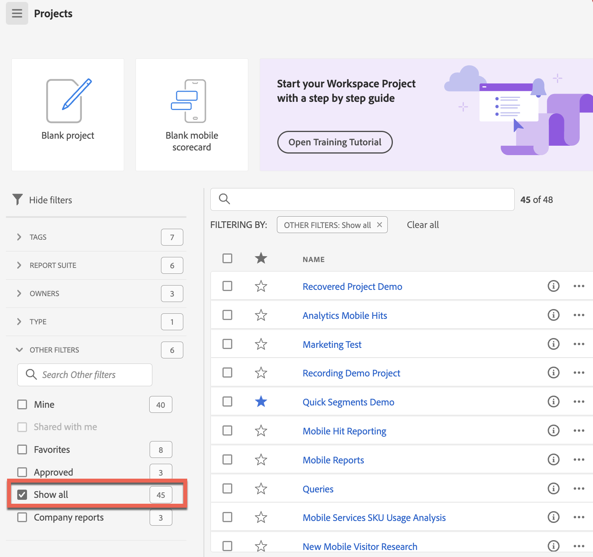

# Page de destination dʼAdobe Analytics

La page de destination dʼAdobe Analytics rassemble [!DNL Analysis Workspace] et [!DNL Reports & Analytics] en une seule interface et un point dʼaccès sous la bannière [!DNL Workspace]. Elle comprend une page dʼaccueil pour le gestionnaire de projet, un menu de rapports mis à jour, des rapports modernisés et une section dʼapprentissage pour faciliter votre prise en main. Voici une présentation vidéo :

>[!VIDEO](https://video.tv.adobe.com/v/334278/?quality=12)

## Fonctionnalités de la nouvelle page de destination {#new-features}

| Fonctionnalité | Description | Copie dʼécran |
| --- | --- | --- |
| Agrandir le tableau [!UICONTROL Projets] en plein écran | Pour agrandir le tableau, il vous suffit de cliquer sur l’icône de menu général. Cette action réduit les onglets situés sur le rail de gauche. |  |
| Personnaliser la largeur des colonnes | Dans les versions précédentes, la largeur des colonnes était fixe. Vous pouvez désormais la personnaliser en faisant glisser le séparateur de colonnes. |  |
| Réorganiser les éléments épinglés | Pour déplacer les éléments épinglés vers le haut et vers le bas, cliquez sur les points de suspension en regard de l’élément épinglé et sélectionnez **[!UICONTROL Déplacer vers le haut]** ou **[!UICONTROL Déplacer vers le bas]**. |  |
| Nouvelles colonnes de tableau | Cliquez sur l’icône [!UICONTROL Personnaliser le tableau] en haut à droite du tableau. Les nouvelles colonnes de tableau sont les suivantes : <ul><li>**[!UICONTROL Planifié]** : activez la case [!UICONTROL On] lorsqu’un projet est planifié ou [!UICONTROL Off] dans le cas contraire. Pour afficher des informations sur le projet planifié, cliquez sur le lien [!UICONTROL On]. Vous pouvez également [modifier le planning du projet](/help/analyze/analysis-workspace/curate-share/t-schedule-report.md) si vous êtes son propriétaire.</li><li>**[!UICONTROL ID de projet]** : utile à des fins de débogage.</li><li>**[!UICONTROL Période la plus longue]** : des périodes plus longues augmentent la complexité du projet ainsi que les temps de traitement et de chargement. </li><li>**[!UICONTROL Nombre de requêtes]** : nombre total de requêtes envoyées à Analytics lors du chargement du projet. Un nombre plus élevé de requêtes de projet augmente la complexité de celui-ci ainsi que ses temps de traitement et de chargement. Ces données ne sont disponibles qu’une fois qu’un projet a été chargé ou qu’un projet planifié a été envoyé. </li></ul> |  |
| Un seul clic pour ouvrir un rapport | Dans les versions précédentes, un double-clic était nécessaire. |  |
| Nouveaux liens vers les rapports **[!UICONTROL Reports &amp; Analytics]** | <ul><li>**[!UICONTROL Rapports]** > **[!UICONTROL Audience]** > **[!UICONTROL Robots]**</li><li>**[!UICONTROL Rapports]** > **[!UICONTROL Audience]** > **[!UICONTROL Pages Robots]**<li>**[!UICONTROL Rapports]** > **[!UICONTROL Engagement]** > **[!UICONTROL Temps réel]**</li></ul> |  |
| Nouveaux rapports prêts à l’emploi | <ul><li>**[!UICONTROL Rapports]** > **[!UICONTROL Les plus populaires]** > **[!UICONTROL Page suivante]**</li><li>**[!UICONTROL Rapports]** > **[!UICONTROL Les plus populaires]** > **[!UICONTROL Page précédente]**</li><li>**[!UICONTROL Rapports]** > **[!UICONTROL Engagement]** > **[!UICONTROL Analyse de la page]** > **[!UICONTROL Résumé de la page]**</li></ul>Notez que ces rapports sont au format [!UICONTROL Espace de travail] et doivent être configurés et générés. La sortie se compose d’un panneau de mesures de haut niveau, de données de tendances, d’une visualisation des [!UICONTROL Flux] et bien plus encore. Vous pouvez modifier ces rapports et changer de dimension, d’élément de dimension, etc. Ces rapports sont également disponibles sous forme de panneaux dans les panneaux de l’espace de travail. |  |
| Retour de la fenêtre modale **[!UICONTROL Créer un projet]** | Lorsque vous cliquez sur **[!UICONTROL Créer un projet]** dans Workspace, vous avez à nouveau le choix entre créer un [!UICONTROL Projet vierge] ou une [!UICONTROL Carte de performance mobile vierge]. Vous pouvez également choisir un modèle créé par votre société. |  |
| Également disponible dans Customer Journey Analytics | Cette landing page, sous une forme modifiée, est également disponible dans Customer Journey Analytics. |  |

{style="table-layout:auto"}

## Structure du menu supérieur {#top-menu}

* Menu supérieur dʼAnalytics : la plupart des rapports se trouvent désormais dans le menu [!UICONTROL Rapports] du rail de gauche.
* Le rail de gauche comporte trois onglets : [!UICONTROL Projets], [!UICONTROL Rapports] et [!UICONTROL Apprentissage].

### Terminologie

* Les **[!UICONTROL projets]** sont des conceptions personnalisées qui combinent les composants de données, les tableaux et les visualisations que vous avez créés ou que quelqu’un d’autre a créés et partagés avec vous. Les [!UICONTROL projets] font également référence aux projets vierges et aux fiches dʼévaluation mobiles vierges.
* Les **[!UICONTROL rapports]** font référence à tout élément préconfiguré par Adobe, tel que les rapports dans Reports &amp; Analytics et les modèles dans Espace de travail.
* Le terme **[!UICONTROL Modèles]** nʼest plus employé pour les projets d’espace de travail préconfigurés dʼAdobe. Les modèles se trouvent désormais sous [!UICONTROL Rapports]. Le terme [!UICONTROL Modèles] désigne toujours les modèles créés par votre entreprise.

## Accédez à lʼonglet [!UICONTROL Projets] {#navigate-projects}

Les [!UICONTROL projets] font office de page dʼaccueil de l’[!UICONTROL espace de travail]. L’onglet Projets affiche le dossier Société, les dossiers personnels que vous avez créés, vos projets et vos cartes de performance mobiles. Utilisez cette page pour afficher, créer et modifier des dossiers, des projets et des cartes de performance mobiles. Pour plus d’informations, consultez [À propos des dossiers dans Analytics](/help/analyze/analysis-workspace/build-workspace-project/workspace-folders/about-folders.md).

>[!NOTE]
>
>Plusieurs des paramètres suivants sont conservés pendant la session et entre les sessions. Par exemple, l’onglet que vous avez sélectionné, les filtres sélectionnés, les colonnes sélectionnées et l’ordre de tri des colonnes. Les résultats de recherche ne sont pas persistants.

| Élément de lʼinterface utilisateur | Définition |
| --- | --- |
| Modifier les préférences | Permet dʼ[!UICONTROL afficher les tutoriels] et de [Modifier les préférences utilisateur](/help/analyze/analysis-workspace/user-preferences.md). |
| [!UICONTROL Créer] | Ouvre la fenêtre modale du projet dans laquelle vous pouvez créer un projet Workspace ou une carte de performance mobile ou ouvrir un modèle d’entreprise. |
| [!UICONTROL Afficher moins  Afficher plus] | Active/désactive lʼaffichage de la bannière :  |
| [!UICONTROL Projet Espace de travail] | Crée un [projet Workspace](https://experienceleague.adobe.com/docs/analytics/analyze/analysis-workspace/home.html?lang=fr) vierge que vous pouvez concevoir et développer. |
| [!UICONTROL Carte de performance mobile] | Crée une [carte de performance mobile](https://experienceleague.adobe.com/docs/analytics/analyze/mobapp/curator.html?lang=fr) vierge que vous pouvez concevoir et développer. |
| [!UICONTROL Ouvrir le tutoriel de formation] | Ouvre le tutoriel de formation Workspace qui vous guide tout au long du processus de création d’un projet de démarrage dans un tutoriel détaillé. |
| [!UICONTROL Ouvrir les notes de mise à jour] | Affiche la section Adobe Analytics des dernières notes de mise à jour dʼAdobe Experience Cloud. |
| Icône Filtrer | Filtre par balises, suites de rapports, propriétaires, types et autres filtres (À moi, Partagés avec moi, Favoris et Approuvés). |
| Barre de recherche | Recherche toutes les colonnes du tableau. |
| Zone de sélection | Sélectionne un ou plusieurs projets pour afficher les actions de gestion de projet que vous pouvez effectuer : **Supprimer**, **Partager**, **Renommer**, **Copier**, **Désépingler**, **Déplacer vers le haut**, **Déplacer vers le bas**, **Balise**, **Approuver**, **Exporter au format CSV** et **Déplacer vers**. Vous ne disposez peut-être pas des autorisations nécessaires pour effectuer toutes les actions répertoriées. |
| [!UICONTROL Favoris] | Ajoute une étoile en regard d’un projet ou d’un dossier favori pouvant être utilisé comme filtre. |
| [!UICONTROL Nom] | Indique le nom du projet. |
| Icône Épingler | Épingle les éléments afin qu’ils apparaissent toujours en haut de la liste. Vous pouvez toutefois modifier l’ordre en les déplaçant vers le haut ou le bas de la liste. Utilisez le menu d’option représenté par des points de suspension et sélectionnez **Déplacer vers le haut** ou **Déplacer vers le bas** dans la liste. |
| Icône Infos (i) | Affiche les informations suivantes sur un projet : Type, Rôle de projet, Propriétaire, Description et avec qui il est partagé. Cette icône indique également qui peut [modifier ou dupliquer](https://experienceleague.adobe.com/docs/analytics/analyze/analysis-workspace/curate-share/share-projects.html?lang=fr) ce projet. |
| Points de suspension (…) | Affiche les actions de gestion de projet que vous pouvez effectuer : **Supprimer**, **Partager**, **Renommer**, **Copier**, **Désépingler**, **Déplacer vers le haut**, **Déplacer vers le bas**, **Balise**, **Approuver**, **Exporter au format CSV** et **Déplacer vers**. Vous ne disposez peut-être pas des autorisations nécessaires pour effectuer toutes les actions répertoriées. |
| [!UICONTROL Type] | Indique le type : un projet Workspace, une carte de performance mobile ou un dossier. |
| [!UICONTROL Balises] | Ajoute des balises aux projets pour les organiser en groupes. |
| [!UICONTROL Rôle de projet] | Indique les rôles de projet : si vous êtes le propriétaire du projet et si vous disposez des autorisations pour modifier ou dupliquer le projet. |
| [!UICONTROL Suite de rapports] | Indique les suites de rapports associées au projet. Les tableaux et les visualisations au sein d’un panneau obtiennent des données de la suite de rapports sélectionnée en haut à droite du panneau. La suite de rapports détermine également les composants disponibles dans le rail de gauche. Dans un projet, vous pouvez utiliser une ou plusieurs suites de rapports selon les cas pratiques de votre analyse. La liste des suites de rapports est triée selon la pertinence. Adobe définit la pertinence en fonction de la fréquence dʼutilisation récente de la suite par lʼutilisateur actuel et de la fréquence dʼutilisation de la suite au sein de lʼentreprise. |
| [!UICONTROL Propriétaire] | Indique la personne qui a créé le projet. |
| [!UICONTROL Dernière ouverture] | Indique la date de la dernière ouverture du projet. |
| Icône Personnaliser le tableau | Sélectionne les colonnes à afficher dans le tableau. Pour ajouter ou supprimer des colonnes de la liste des projets, cliquez sur l’icône de colonne () dans le coin supérieur droit, puis sélectionnez ou désélectionnez les titres des colonnes. |
| AFFICHER : Dossiers et projets ou Tous les projets | Modifie le paramètre d’affichage du tableau pour afficher les dossiers et les projets en fonction de l’organisation des dossiers **ou** affiche tous les projets dans une liste non organisée. |
| &lt; (bouton Précédent) | Vous renvoie à la configuration de page de destination la plus récente dans un projet Workspace ou un rapport. La configuration de page que vous aviez lorsque vous avez quitté la page de destination persiste à votre retour. |

### Abandon de la page Gestionnaire de projets {#deprecate-pm-page}

En raison de la publication de la nouvelle page de destination, nous avons abandonné la page Gestionnaire de projets répertoriée sous le Gestionnaire de composants. La nouvelle page de destination gère toutes les fonctionnalités de l’ancienne page Gestionnaire de projets et plus encore.

La page Gestionnaire de projets était souvent utilisée pour afficher tous vos projets.

Pour afficher tous les projets sur la nouvelle page de destination à l’aide du rail de filtre, sélectionnez **AUTRES FILTRES**, puis **Tout afficher**.

Si vous vous trouvez dans la vue « Dossiers et projets », une fenêtre modale s’ouvre pour vous demander si vous souhaitez passer à la vue « Tous les projets », qui facilite la consultation de tous les projets en dehors des dossiers dans lesquels ils sont organisés.   Sélectionnez **Passer à la vue « Tous les projets »** pour mieux visualiser tous les projets auxquels vous avez accès.

Un autre cas d’utilisation pour les administrateurs consiste à gérer les rapports d’entreprise afin de supprimer, renommer, baliser ou approuver les rapports. Pour plus d’informations sur la gestion des rapports, consultez [Gestion des rapports d’entreprise](#manage-company-reports).

## Parcourir lʼonglet [!UICONTROL Rapports] {#navigate-reports}

Lʼonglet [!UICONTROL Rapports] regroupe trois jeux de rapports :

* Les modèles [!UICONTROL Espace de travail] préconfigurés qui se trouvaient auparavant sous [!UICONTROL Espace de travail] > [!UICONTROL Projet] > [!UICONTROL Nouveau]. Adobe nʼutilise plus le terme « modèle » dans ce contexte.
* La plupart des rapports préconfigurés de lʼancien menu supérieur [!UICONTROL Rapports] Adobe Analytics. Ces rapports sʼaffichent désormais dans [Analysis Workspace](https://experienceleague.adobe.com/docs/analytics/analyze/analysis-workspace/home.html?lang=fr).

>[!IMPORTANT]
>
>Sous Rapports, un dossier Favoris sʼaffiche uniquement si vous marquez un nouveau rapport comme favori. Aucun favori Reports &amp; Analytics préexistant nʼest conservé.

Comme indiqué précédemment, seuls les rapports les plus couramment utilisés, qui étaient auparavant regroupés dans Reports &amp; Analytics, sont disponibles ici. Une minorité de rapports rarement utilisés ou qui ne sont plus pertinents nʼont pas été migrés. Consultez la FAQ ci-dessous pour plus de détails.

### Menus et sous-menus {#menus}

Découvrez les menus et leurs sous-menus ci-après. Si vous ne trouvez pas un rapport spécifique, effectuez une « Recherche sur la page » pour le localiser.

| Élément de menu | Rapports relevant de cet élément de menu |
| --- | --- |
| **[!UICONTROL Plus populaires]** | <ul><li>Tutoriel de formation (modèle d’espace de travail préexistant)</li><li>Pages (quelles sont mes pages les plus vues ?)</li><li>Vues de page (combien de vues de pages est-ce que je génère ?)</li><li>Visites (combien de visites est-ce que jʼobtiens ?)</li><li>Visiteurs (combien de visiteurs est-ce que jʼai ?)</li><li>Mesures clés (comment se portent mes mesures les plus importantes ?)</li><li>Sections du site (quelles sections de mon site ont généré le plus de vues de page ?)</li><li>Page suivante (quelles sont les pages suivantes consultées par mes visiteurs ?)</li><li>Page précédente (quelles sont les pages précédentes consultées par mes visiteurs ?)</li><li>Campagnes (quelles campagnes génèrent mes mesures clés ?)</li><li>Produits (quels produits génèrent mes mesures clés ?)</li><li>Canal Dernière touche (quel canal Dernière touche est le plus performant ?)</li><li>Détails du canal Dernière touche (quel canal Dernière touche spécifique est plus performant que les autres ?)</li><li>Chiffre dʼaffaires (comment se porte mon chiffre dʼaffaires ?)</li><li>Commandes (comment se portent mes commandes ?)</li><li>Unités (combien dʼunités est-ce que je vends ?)</li></ul> |
| **[!UICONTROL Engagement]** | <ul><li>Mesures clés (comment se portent mes mesures les plus importantes ?)</li><li>Vues de page (combien de vues de pages est-ce que je génère ?)</li><li>Pages (quelles sont mes pages les plus vues ?)</li><li>Visites (combien de visites est-ce que jʼobtiens ?)</li><li>Visiteurs (combien de visiteurs est-ce que jʼai ?)</li><li>Durée de la visite (combien de temps mes utilisateurs passent-ils par visite ?)</li><li>Durée avant événement (combien de temps mes utilisateurs passent-ils avant un événement de succès ?)</li><li>Sections du site (quelles sections de mon site ont généré le plus de vues de page ?)</li><li>Consommation de contenu web (quel contenu est le plus consommé et attire le plus dʼutilisateurs ?)</li><li>Consommation de contenu multimédia (quel contenu est le plus consommé et attire le plus dʼutilisateurs ?)</li><li>Flux de pages suivantes et précédentes (quels sont/étaient les chemins suivants/précédents empruntés par mes visiteurs ?)</li><li>Abandon (où puis-je voir lʼabandon dans mes propriétés numériques ?)</li><li>Analyse entre appareils (utilisation de lʼanalyse entre appareils dans Analysis Workspace)</li><li>Rétention web (qui sont mes utilisateurs fidèles et que font-ils ?)</li><li>Consommation de médias audio (quelles sont les tendances et les principales mesures de la consommation audio ?)</li><li>Récence de médias, fréquence, fidélité (qui sont mes lecteurs fidèles ?)</li><li>Analyse de page > Actualisations (quelles sont les pages les plus actualisées ?)</li><li>Analyse de page > Durée de consultation de page (combien de temps les utilisateurs passent-ils sur mes pages ?)</li><li>Entrées et sorties > Pages dʼaccès (quelles sont mes principales pages dʼaccès ?)</li><li>Entrées et sorties > Pages dʼaccès dʼorigine (à partir de quelle page mon visiteur est-il entré ?)</li><li>Entrées et sorties > Visites sur une seule page (quelles pages ont généré le plus de visites sur une seule page ?)</li><li>Entrées et sorties > Pages de sortie (quelles sont mes principales pages de sortie ?)</li></ul> |
| **[!UICONTROL Conversion]** | <ul><li>Produits > Produits (quels produits génèrent mes mesures clés ?)</li><li>Produits > Performances des produits (quels sont les produits qui ont les meilleures performances ?)</li><li>Produits > Catégories (quelles sont mes catégories de produits qui ont les meilleures performances ?)</li><li>Panier > Paniers (combien dʼutilisateurs ont ajouté un produit au panier ?)</li><li>Panier > Consultations du panier (combien de fois mes visiteurs ont-ils consulté leur panier ?)</li><li>Panier > Ajouts au panier (à quelle fréquence les utilisateurs ajoutent-ils un produit à leur panier ?)</li><li>Panier > Retraits du panier (à quelle fréquence les utilisateurs suppriment-ils un produit de leur panier ?)</li><li>Achats > Chiffre dʼaffaires (comment mon chiffre dʼaffaires se porte-t-il ?)</li><li>Achats > Commandes (comment mes commandes se portent-elles ?)</li><li>Achats > Unités (combien dʼunités est-ce que je vends ?)</li><li>[Magento : marketing et commerce](https://experienceleague.adobe.com/docs/analytics/analyze/analysis-workspace/build-workspace-project/starter-projects.html?lang=fr#commerce)</li></ul> |
| **[!UICONTROL Audience]** | <ul><li>Mesure relative aux personnes (combien de personnes interagissent avec ma marque ?)</li><li>Profil du visiteur > Aperçu de lʼemplacement (quels sont les emplacements qui génèrent le plus dʼutilisation parmi les utilisateurs ?)</li><li>Profil du visiteur > Segmentation géographique > Départements, états américains, régions, villes, DMA États-Unis (dʼoù mes utilisateurs viennent-ils ?)</li><li>Profil du visiteur > Langues (quelle langue mes utilisateurs préfèrent-ils ?)</li><li>Profil du visiteur > Fuseaux horaires (quels sont les fuseaux horaires de mes visiteurs ?)</li><li>Profil du visiteur > Domaines (quels FAI mes visiteurs utilisent-ils pour accéder à mon site ?)</li><li>Profil du visiteur > Domaines de niveau supérieur (quels domaines génèrent du trafic sur mon site ?)</li><li>Profil du visiteur > Technologie > Aperçu des technologies (quelles technologies mes visiteurs utilisent-ils pour accéder à mon site ?)</li><li>Profil du visiteur > Technologie > Navigateurs, type de navigateur, largeur du navigateur, hauteur du navigateur (quelles sont lʼentreprise propriétaire, la version, la largeur et la hauteur du navigateur utilisé par les personnes qui accèdent à mon site ?)</li><li>Profil du visiteur > Technologie > Système dʼexploitation, types de systèmes dʼexploitation (quel système dʼexploitation et quelle version les visiteurs utilisent-ils ?)</li><li>Profil du visiteur > Technologie > Opérateur de téléphonie mobile (quels opérateurs de téléphonie mobile les visiteurs utilisent-ils pour accéder à mon site ?)</li><li>Rétention des visiteurs > Fréquence des retours (combien de temps sʼécoule-t-il entre la visite actuelle de mon utilisateur et ses visites précédentes ?)</li><li>Rétention des visiteurs > Visites récurrentes (combien de mes visites concernent des utilisateurs ayant précédemment accédé à mon site ?)</li><li>Rétention des visiteurs > Nombre de visites (quel nombre de visites génère-t-il la plupart de mes mesures clés ?)</li><li>Rétention des visiteurs > Cycle de vente > Fidélisation des clients (à quel segment de fidélité appartiennent mes utilisateurs ?)</li><li>Rétention des visiteurs > Cycle de vente > Jours avant le premier achat (combien de jours se sont écoulés entre la première visite de mes utilisateurs et leur premier achat ?)</li><li>Rétention des visiteurs > Cycle de vente > Jours depuis le dernier achat (combien de jours se sont écoulés entre la visite actuelle de mes utilisateurs et leur dernier achat ?) )</li><li>Rétention des visiteurs > Mobile > Appareils et types dʼappareils (quels appareils et types dʼappareils mes visiteurs utilisent-ils ?)</li><li>Rétention des visiteurs > Mobile > Fabricant (quel fabricant dʼéquipement mobile mes visiteurs utilisent-ils ?)</li><li>Rétention des visiteurs > Mobile > Taille dʼécran, hauteur dʼécran, largeur dʼécran (quelle est la taille, la hauteur et la largeur de lʼécran mobile de mes visiteurs ?)</li><li>Rétention des visiteurs > Mobile > [Utilisation des applications mobiles](https://experienceleague.adobe.com/docs/analytics/analyze/analysis-workspace/build-workspace-project/starter-projects.html?lang=fr#mobile)</li><li>Rétention des visiteurs > Mobile > [Parcours sur les application mobiles](https://experienceleague.adobe.com/docs/analytics/analyze/analysis-workspace/build-workspace-project/starter-projects.html?lang=fr#mobile)</li><li>Rétention des visiteurs > Mobile > [Mesures dʼapplications mobiles](https://experienceleague.adobe.com/docs/analytics/analyze/analysis-workspace/build-workspace-project/starter-projects.html?lang=fr#mobile)</li><li>Rétention des visiteurs > Mobile > [Messages sur les applications mobiles](https://experienceleague.adobe.com/docs/analytics/analyze/analysis-workspace/build-workspace-project/starter-projects.html?lang=fr#mobile)</li><li>Rétention des visiteurs > Mobile > [Performances des applications mobiles](https://experienceleague.adobe.com/docs/analytics/analyze/analysis-workspace/build-workspace-project/starter-projects.html?lang=fr#mobile)</li><li>Rétention des visiteurs > Mobile > [Rétention des applications mobiles](https://experienceleague.adobe.com/docs/analytics/analyze/analysis-workspace/build-workspace-project/starter-projects.html?lang=fr#mobile)</li></ul> |
| **[!UICONTROL Acquisition]** | <ul><li>Canaux marketing > Canal Première touche, détails du canal Première touche (quel canal Première touche, et quel canal Première touche spécifique est le plus performant ?)</li><li>Canaux marketing > Canal Dernière touche, détails du canal Dernière touche (quel canal Dernière touche, et quel canal Dernière touche spécifique est le plus performant ?)</li><li>Campagnes > Campagnes (quelles campagnes génèrent mes mesures clés ?)</li><li>Campagnes > Performances de la campagne (quelles campagnes génèrent le plus de chiffre d’affaires ?)</li><li>Campagnes > Code de suivi (quels sont les codes de suivi de campagne les plus performants ?)</li><li>[Acquisition web](https://experienceleague.adobe.com/docs/analytics/analyze/analysis-workspace/build-workspace-project/starter-projects.html?lang=fr#web)</li><li>[Acquisition mobile](https://experienceleague.adobe.com/docs/analytics/analyze/analysis-workspace/build-workspace-project/starter-projects.html?lang=fr#mobile)</li><li>[Advertising Analytics : référencement payant](https://experienceleague.adobe.com/docs/analytics/analyze/analysis-workspace/build-workspace-project/starter-projects.html?lang=fr#advertising)</li><li>Mots-clés de recherche - tous, payants, naturels (quels mots-clés de recherche et mots-clés de référencement payant/naturel offrent les meilleures performances pour mes mesures clés ?)</li><li>Moteurs de recherche - tous, payants, naturels (quels sont les moteurs de recherche et les moteurs de référencement payant/naturel qui offrent les meilleures performances pour mes mesures clés ?)</li><li>Classement de toutes les pages de recherche (de quelle page de recherche mes utilisateurs proviennent-ils ?)</li><li>Domaines référents (quels domaines génèrent du trafic sur mon site ?)</li><li>Domaines référents d’origine (sur quel premier domaine les utilisateurs se trouvaient-ils avant de visiter mon site ?)</li><li>Référents (sur quelles URL mes visiteurs se trouvaient-ils avant de naviguer vers mon site ?)</li><li>Types de référents (à quelle catégorie mes URL de référence appartiennent-elles ?)</li></ul> |

### Emplacement des modèles (désormais appelés rapports) {#templates}

| Nom du rapport (modèle) | Emplacement du rapport |
| --- | --- |
| Tutoriel de formation | Les plus populaires > Tutoriel de formation |
| Consommation de contenu web | Engagement > Consommation de contenu web |
| Consommation de contenu multimédia | Engagement > Consommation de contenu multimédia |
| Analyse Cross-Device | Engagement > Analyse entre appareils |
| Rétention web | Engagement > Rétention web |
| Consommation audio multimédia | Engagement > Consommation audio multimédia |
| Récence, fréquence et fidélité par média | Engagement > Récence, fréquence et fidélité par média |
| Impact de l’ITP | Engagement > Impact de l’ITP |
| Performances du produit | Conversion > Produits > Performances du produit |
| Magento : marketing et commerce | Conversion > Magento : marketing et commerce |
| Mesure Personnes | Audience > Mesure Personnes |
| Présentation de l’emplacement | Audience > Profil du visiteur > Présentation de l’emplacement |
| Présentation de la technologie | Audience > Profil du visiteur > Technologie > Présentation de la technologie |
| Utilisation des applications mobiles | Audience > Mobile > Utilisation des applications mobiles |
| Parcours sur application mobile | Audience > Mobile > Parcours sur application mobile |
| Mesures sur application mobile | Audience > Mobile > Messages sur application mobile |
| Performances d’application mobile | Audience > Mobile > Performances d’application mobile |
| Rétention sur application mobile | Audience > Mobile > Rétention sur application mobile |
| Performances de la campagne | Acquisition > Campagnes > Performances de la campagne |
| Acquisition mobile | Acquisition > Acquisition mobile |
| Acquisition web | Acquisition > Acquisition web |
| Advertising Analytics : référencement payant | Acquisition > Advertising Analytics : référencement payant |

### Utilisation de l’onglet Rapports {#use-reports}

Pour les utilisateurs actuels de Reports &amp; Analytics, voici une brève introduction sur l’utilisation des rapports auxquels vous êtes habitué et qui s’affichent désormais dans Espace de travail. Les rapports se comportent comme des modèles existants. En ce sens, si vous y apportez des modifications, vous êtes invité à enregistrer/ignorer vos modifications lorsque vous quittez la page ou accédez à un autre rapport. Si vous souhaitez enregistrer les modifications, le rapport est enregistré en tant que nouveau projet.

1. Accédez à l’onglet [!UICONTROL Rapports]
1. Sélectionnez le rapport à afficher, par exemple sous [!UICONTROL Les plus populaires], puis sélectionnez le rapport [!UICONTROL Pages].
1. À droite, cliquez sur **[!UICONTROL Ouvrir le rapport]**.

   

1. Le rapport Pages, comme affiché dans Analysis Workspace, affiche deux [visualisations](/help/analyze/analysis-workspace/visualizations/freeform-analysis-visualizations.md) ([Graphique à barres](/help/analyze/analysis-workspace/visualizations/bar.md) et [Numéro de la synthèse](/help/analyze/analysis-workspace/visualizations/summary-number-change.md)) ainsi qu’un [Tableau à structure libre](/help/analyze/analysis-workspace/visualizations/freeform-table/freeform-table.md). La mesure utilisée est Occurrences.
1. À partir de là, plusieurs options s’offrent à vous. Voici certaines de ces options :

   * Vous pouvez utiliser le rapport tel quel.
   * Vous pouvez faire glisser un ou plusieurs segments dans la zone de dépôt de segments située en haut. Par exemple, faites glisser le segment [!UICONTROL Clients mobiles] et observez les modifications au niveau des résultats.
   * Vous pouvez modifier la période en accédant au calendrier en haut à droite.
   * Vous pouvez ajouter des répartitions de dimension, faire glisser d’autres mesures et, de manière générale, personnaliser le rapport comme vous le souhaitez.

### Créer un rapport d’entreprise personnalisé {#company-report}

Les rapports personnalisés créés et enregistrés pour être utilisés par d’autres membres de votre société de connexion sont appelés des rapports d’entreprise. Les rapports d’entreprise précédemment créés et les rapports d’entreprise nouvellement créés sont répertoriés dans la fenêtre modale Créer un projet, comme illustré ci-dessous.

Pour créer un rapport d’entreprise, procédez comme suit :

1. Générez l’espace de travail à l’état souhaité.
1. Ouvrez le menu [!UICONTROL Projet] et cliquez sur **[!UICONTROL Enregistrer en tant que rapport d’entreprise...]**

   

1. Ajoutez tous les champs souhaités à la fenêtre modale et enregistrez-les.

   Le rapport est ajouté à la liste Rapports d’entreprise dans la fenêtre modale Créer un projet. Il est alors disponible auprès des utilisateurs de votre société de connexion.

Autres options de formation :

* Veuillez noter que vous avez accès à une présentation vidéo de 20 minutes consacrée à Analysis Workspace dans le coin supérieur gauche de tout rapport ouvert.
* Nous recommandons aux nouveaux utilisateurs de regarder la vidéo [Tutoriel de formation](https://www.youtube.com/watch?v=lCH1Kl1q9Wk), qui vous guide tout au long de la création d’un projet.
* Voici un lien vers la [documentation complète d’Analysis Workspace](/help/analyze/analysis-workspace/home.md).
* Voici l’intégralité de la [liste de lecture YouTube pour Analysis Workspace](https://www.youtube.com/playlist?list=PL2tCx83mn7GuNnQdYGOtlyCu0V5mEZ8sS).

### Gestion des rapports d’entreprise {#manage-company-reports}

Les administrateurs peuvent filtrer la liste des projets pour afficher et gérer les rapports d’entreprise. Les éléments épinglés restent épinglés, suivis de la liste des rapports d’entreprise identifiés par l’icône de rapport . Dans cet affichage, vous pouvez supprimer, renommer, baliser ou approuver un ou plusieurs rapports.

Afficher et gérer les rapports d’entreprise

1. Dans le rail de filtre, sélectionnez **AUTRES FILTRES**, puis **Rapports d’entreprise**.
Une liste des rapports d’entreprise s’affiche. Tous les projets standard, à moins qu’ils ne soient épinglés, ne s’affichent pas.

   

   Lorsque les rapports d’entreprise sont affichés, les administrateurs peuvent supprimer, renommer, ajouter une balise ou approuver le rapport.

1. Dans la liste des rapports, sélectionnez un ou plusieurs rapports.

1. Cliquez sur l’icône des points de suspension **…** en regard d’un rapport pour afficher les options disponibles (Supprimer, Renommer, Baliser et Approuver).

   

1. Sélectionnez une option (Supprimer, Renommer, Baliser et Approuver).

1. Pour revenir à la vue normale une fois que vous avez terminé, désélectionnez à nouveau l’option Rapports d’entreprise dans le rail de filtre.

### Supprimer un rapport d’entreprise

Les administrateurs peuvent supprimer un rapport à l’aide de l’option de la liste Rapports d’entreprise (décrite ci-dessus) ou supprimer un rapport de la fenêtre modale Créer un projet.

## Navigation dans l’onglet Formation {#navigate-learning}

La page Formation contient des visites guidées vidéo et des tutoriels pratiques, ainsi que des liens vers la documentation.

* La visite guidée des [!UICONTROL Notions fondamentales de l’espace de travail] vous emmène directement dans l’espace de travail. Vous pouvez ainsi découvrir pas à pas la disposition de l’espace de travail et où trouver/exécuter les actions les plus courantes. Cette visite peut également être relancée à tout moment, et ce, directement dans l’espace de travail, via la fenêtre pop-over de l’infobulle qui se trouve dans l’en-tête du panneau.
* Cliquer sur une vidéo/visite ajoute une balise **[!UICONTROL Consulté]**. Cette balise vous permet de suivre votre progression au fil du contenu de formation. Vous pouvez cliquer sur la balise pour la faire disparaître si vous n’avez pas encore terminé le contenu.
* Le bouton **[!UICONTROL En savoir plus]** de la fenêtre modale de la vidéo permet dʼaccéder à une page de documentation Adobe Experience League présentant du contenu dʼaide supplémentaire en rapport avec la vidéo que vous venez de regarder.  **[!UICONTROL Voir plus de vidéos]** permet dʼaccéder à la liste de lecture complète dʼAnalysis Workspace sur YouTube.

## Définir la page de destination {#set-landing}

Les utilisateurs peuvent définir la page de destination de leur choix.

1. Accédez à Analytics > [!UICONTROL Composants] > [!UICONTROL Préférences] > [!UICONTROL Général].
1. Sélectionnez la page de destination souhaitée :

   

## Masquer l’onglet Rapport {#hide-reports}

Les administrateurs peuvent masquer l’onglet Rapports pour tous les utilisateurs de leur organisation.

1. Accédez à [!UICONTROL Analytics] > [!UICONTROL Composants] > [!UICONTROL Préférences] > [!UICONTROL Société].
1. Cochez la case **[!UICONTROL Masquer l’onglet Rapports]**.

## FAQ sur la page de destination {#landing-faq}

| Question | Réponse |
| --- | --- |
| Où sont les modèles que je suis habitué à voir dans l’[!UICONTROL espace de travail] ? | Ces modèles sont regroupés sous lʼonglet [!UICONTROL Rapports]. |
| Le travail effectué dans lʼinterface utilisateur du programme bêta est-il transposé dans lʼexpérience de production de l’[!UICONTROL espace de travail] ? | Oui, tout travail effectué dans le programme bêta est transposé dans lʼancienne/actuelle expérience de l’[!UICONTROL espace de travail]. |
| Mes favoris [!DNL Reports & Analytics] actuels sont-ils conservés ? | Non, ils ne sont PAS conservés. Toutefois, les favoris de projets de l’[!UICONTROL espace de travail] sont conservés. |
| Existe-t-il un nombre maximal de projets que je peux épingler ? | Non, il nʼy a pas de limite au nombre de projets que vous pouvez épingler. |
| Les administrateurs peuvent-ils désigner cette page de destination pour leurs utilisateurs ? | Non, les administrateurs ne peuvent pas désigner la page de destination au nom des utilisateurs. Les utilisateurs individuels doivent activer eux-mêmes le bouton bascule. |
| Tous les rapports qui existent actuellement dans [!DNL Reports & Analytics] sont-ils toujours disponibles ? | Non, les rapports suivants ont été rendu obsolètes, en fonction des données dʼutilisation globales : <ul><li>Tous les eVars, props, événements ou classifications personnalisés<li>Mes rapports recommandés</li><li>Visiteurs uniques par heure, par jour, par semaine, par mois, par trimestre et par an</li><li>Clients uniques par jour, par semaine, par mois, par trimestre et par an</li><li>Profondeur du nom de lʼaction</li><li>Résumé du nom de lʼaction</li><li>Ajouter tableau de bord</li><li>Âge</li><li>Prise en charge de lʼaudio</li><li>Informations de facturation</li><li>Clics vers la page</li><li>Profondeur de couleur</li><li>Prise en charge des cookies</li><li>Cookies</li><li>Types de connexion</li><li>Éléments créatifs</li><li>Type de carte de crédit</li><li>Vente croisée</li><li>Entonnoirs dʼévénement personnalisés</li><li>Liens personnalisés</li><li>Identifiant client</li><li>Jour de la semaine</li><li>Nom de lʼaction dʼentrée</li><li>Nom de lʼaction de sortie</li><li>Liens de sortie</li><li>Abandon</li><li>Téléchargements de fichiers</li><li>Trouver en magasin</li><li>Chemins complets</li><li>Genre</li><li>Règle VISTA de type dʼaccès</li><li>Prise en charge des images</li><li>Java</li><li>JavaScript</li><li>Version JavaScript</li><li>Gestion des signets</li><li>Gérer les tableaux de bord</li><li>Profondeur de couleur de lʼécran</li><li>Résolutions dʼécran</li><li>Abonnements à la newsletter</li><li>Nom de lʼaction suivante</li><li>Flux du nom de lʼaction suivante</li><li>Recherches nulles</li><li>Système d’exploitation</li><li>Révision des commandes</li><li>Page de jour</li><li>Pages introuvables</li><li>PathFinder</li><li>Longueur de chemin</li><li>Nom de lʼaction précédente</li><li>Flux du nom de lʼaction précédente</li><li>Activités liées au produit</li><li>Coût du produit</li><li>Rayon du produit</li><li>Catégorie dʼinventaire du produit</li><li>Nom du produit</li><li>Évaluations du produit</li><li>Saison du produit</li><li>Partages du produit</li><li>Zooms sur le produit</li><li>Recharge</li><li>Recherches</li><li>Serveurs</li><li>Visites de page unique</li><li>Informations dʼexpédition</li><li>Hiérarchie du site</li><li>Mentions sur les réseaux sociaux</li><li>Heure</li><li>Temps passé sur le nom de lʼaction</li><li>Prise en charge de la vidéo</li><li>État des visiteurs</li></ul> |
