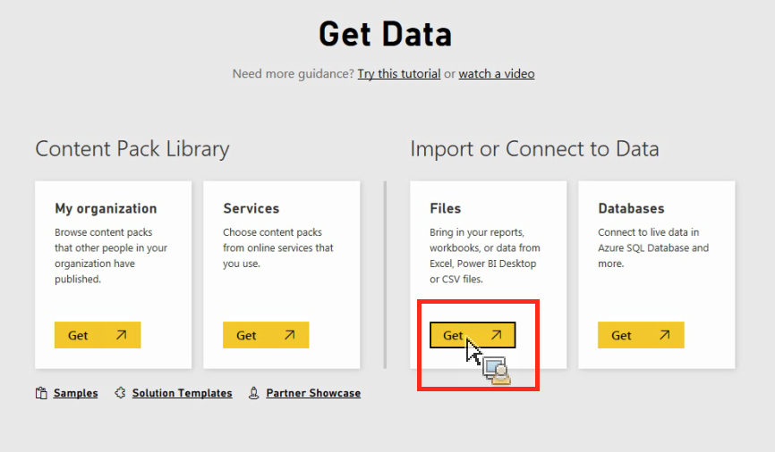

# Importation manuelle de données dans Power BI

{{legacy-arb}}

Si vous souhaitez importer des données Analytics manuellement via Power BI, suivez ces instructions.

1. Dans Power BI, cliquez sur **[!UICONTROL Obtenir des données]** dans l’écran inférieur gauche.
1. En dessous de l’option **[!UICONTROL Importer ou connecter à des données]** > **[!UICONTROL Fichiers]**, cliquez sur **[!UICONTROL Obtenir]**.

   

1. Cliquez sur Fichier local.

   

1. Sélectionnez le fichier à charger et cliquez sur **[!UICONTROL Ouvrir]**.
1. Cliquez sur **[!UICONTROL Télécharger]** en dessous de l’option **[!UICONTROL Charger votre fichier Excel dans Power BI]**.

   

1. Le message « Votre fichier a été chargé » doit s’afficher.
