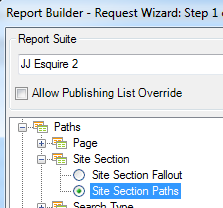

# Filtrage d’un rapport de cheminement à l’aide de l’Assistant Requête

{{legacy-arb}}

Décrit les étapes d’application de filtres à un rapport de cheminement.

Cet exemple utilise Chemins > Section Site.

1. Dans le Report Builder d’Adobe, cliquez sur **[!UICONTROL Créer]** pour ouvrir l’Assistant Requête.
1. Sélectionnez la suite de rapports appropriée.
1. Dans l’arborescence de gauche, sélectionnez **[!UICONTROL Chemins]** > **[!UICONTROL Section Site]** > **[!UICONTROL Section Site - Tracés]**.

   

1. Indiquez la ou les dates appropriée(s).

1. Cliquez sur **[!UICONTROL Suivant]**.

1. À l’étape 2 de l’Assistant, sous **[!UICONTROL Libellés de lignes]**, cliquez sur le lien **[!UICONTROL Premiers 1-10 (modèle appliqué)]**. Dans un rapport de cheminement, un modèle est appliqué par défaut.

   

1. Sélectionnez l’option **[!UICONTROL Filtrer]**.

   

1. Dans la boîte de dialogue **[!UICONTROL Définir le schéma de tracé de « Chemins > Section Site »]**, vous pouvez indiquer
   * Classement de départ du premier rapport.
   * Nombre d&#39;entrées à afficher dans ce rapport.
1. Cliquez sur **[!UICONTROL Modifier]** pour définir un modèle de chemin.

1. Si vous souhaitez un modèle personnalisé, faites glisser-déposer n’importe quel **[!UICONTROL Objet modèle]** dans la liste de gauche vers le **[!UICONTROL Canevas du Créateur de modèles (Pattern Build Canvas)]** à droite.

   

1. Vous pouvez également sélectionner un modèle prédéfini dans la liste déroulante **[!UICONTROL Sélectionner un modèle]** et le modifier. Vous trouverez ci-dessous les motifs disponibles :

   

   Certains de ces modèles sont spécifiques à Report Builder : Modèle d’élément suivant du chemin d’entrée, Modèle d’élément précédent du chemin de sortie, Modèle d’élément suivant.

## Pour modifier un modèle prédéfini

Vous pouvez modifier un modèle prédéfini après avoir sélectionné un modèle.

1. En suivant les étapes ci-dessus, sélectionnez le modèle. Par exemple, sélectionnez le **[!UICONTROL Modèle de site de sortie]** :

   

1. Définissez le chemin d’accès à la section du site que l’utilisateur doit suivre avant de quitter. Cliquez sur **[!UICONTROL Éléments(s) particulier(s) : 0 sélectionné(s)]**. Vous pouvez définir ce chemin d’accès en le sélectionnant dans une plage de cellules si vous modifiez une requête existante ou en le sélectionnant dans une liste de sections.

1. Pour effectuer une sélection depuis une plage de cellules d’une requête précédente, sélectionnez **[!UICONTROL À partir de la plage de cellules]** et cliquez sur l’icône de sélecteur de cellules. Puis, sélectionnez les cellules depuis le rapport.

   

1. Pour effectuer la sélection depuis une liste de sections de site, sélectionnez **[!UICONTROL À partir de la liste]** et cliquez sur **[!UICONTROL Ajouter]**.

1. Déplacez des éléments de la colonne **[!UICONTROL Éléments disponibles]** vers la colonne **[!UICONTROL Éléments sélectionnés]** en les sélectionnant et en cliquant sur la flèche orange. Puis, cliquez sur **[!UICONTROL OK]**.

   

1. Pour enregistrer le modèle que vous venez de définir, cliquez sur **[!UICONTROL Enregistrer]**.

1. Cliquez trois fois sur **[!UICONTROL OK]** puis sur **[!UICONTROL Terminer]** pour générer le chemin filtré.
