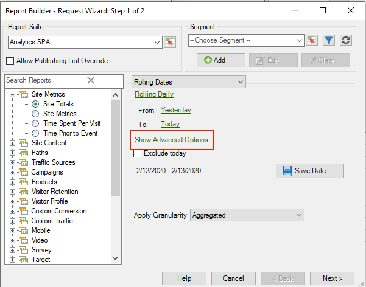

# Expressions de dates personnalisées

{{legacy-arb}}

Vous pouvez préciser une période complexe en créant une expression personnalisée.

Lorsque vous créez des expressions, reportez-vous à un calendrier pour spécifier correctement le nombre de semaines et de jours. Excel est doté de plusieurs fonctions intégrées qui permettent de calculer le nombre de jours, de jours ouvrables, de mois et d’années entre les dates. Vous pouvez appliquer ces fonctions dans des formules afin de calculer d’autres intervalles, tels que des semaines et des trimestres.

**Pour activer des expressions personnalisées**

L’exemple suivant montre comment activer une expression personnalisée pour les **[!UICONTROL Dates flottantes]**.

1. Dans l’[!UICONTROL Assistant Requête : étape 1], au lieu d’utiliser **[!UICONTROL Dates prédéfinies]**, sélectionnez **[!UICONTROL Dates roulantes]**.

   

1. Basculez sur hebdomadaire, mensuel, trimestriel ou annuel. Remarquez comment les options ci-dessous changent.
1. Pour plus d’options de personnalisation, cliquez sur **[!UICONTROL Afficher les options avancées]**.

   

1. Par exemple, si vous modifiez les dates ci-dessus en les faisant passer du premier jour du mois précédent, trois mois, au premier jour de ce mois, les dates de la partie options d’avance sont mises à jour afin de refléter cela :

   

1. Activez **[!UICONTROL Personnaliser l’expression]**. En sélectionnant des options sous **[!UICONTROL Dates flottantes]**, vous pouvez facilement voir la syntaxe des expressions de date personnalisées.

   

   Vous pouvez utiliser les options avancées pour mélanger et faire correspondre des expressions de date personnalisées. Par exemple, si vous souhaitez afficher les données du premier jour de l’année jusqu’à la fin du dernier mois complet, vous pouvez saisir ce qui suit : `From: cy` `To: cm-1d`. Dans l’assistant, ces dates apparaissent sous la forme 1/1/2020-1/31/2020.
