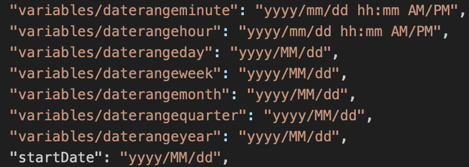

# Dates à partir d’une cellule

{{legacy-arb}}

Vous pouvez préciser une période en sélectionnant, dans une feuille de calcul, les cellules qui contiennent une requête. Le Créateur de rapports utilise, dans ces requêtes, les informations spécifiques à la période. Si vous sélectionnez la date du jour, vous obtenez des données partielles en fonction de l’heure d’exécution de la requête.

**Pour configurer les dates à partir d’une cellule**

1. Dans la fenêtre [!UICONTROL Assistant Requête : Étape 1], sélectionnez **[!UICONTROL Dates à partir d’une cellule]**.
1. Entrez les références de cellule dans les champs **[!UICONTROL De]** et **[!UICONTROL À]** ou cliquez sur le sélecteur et sélectionnez les cellules contenant les requêtes avec les dates de début et de fin.

   Par exemple, créez une demande du Report Builder en définissant la période sur « hier » et générez la date de la demande dans la même cellule que « aujourd’hui()-1 ».

Voici une liste des formats de date pris en charge :

