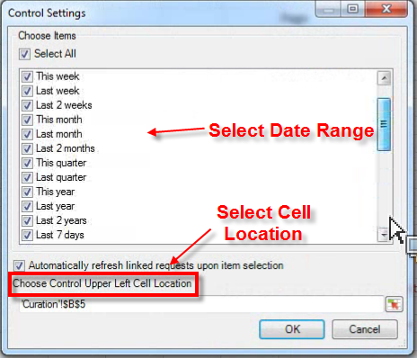
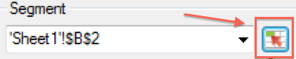
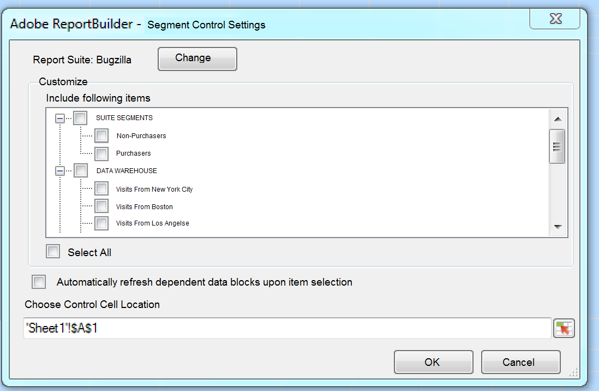
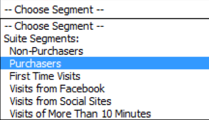

# Contrôles interactifs

{{legacy-arb}}

Les contrôles interactifs vous permettent de modifier des segments et des périodes pour une ou plusieurs requêtes directement depuis la feuille de calcul. Vous bénéficiez ainsi d’une plus grande flexibilité lors de la mise à jour des requêtes Report Builder.

Les contrôles interactifs ont été créés en réponse à un processus courant dans lequel les analystes créent des classeurs et partagent ces classeurs avec l’entité marketing. Les contrôles interactifs permettent aux spécialistes marketing de modifier et d’actualiser les requêtes sans avoir à connaître en profondeur le fonctionnement de Report Builder. (Notez que pour actualiser une demande, le destinataire du classeur doit être un utilisateur Report Builder.) Ces commandes fonctionnent dans les classeurs planifiés. Deux types de contrôles interactifs sont actuellement disponibles :

* Période variable
* Segments

>[!IMPORTANT]
>
>La version 5.0 du Report Builder doit être installée pour que les contrôles interactifs fonctionnent. >
>* Si vous exécutez Microsoft Excel sous Windows, mais que vous utilisez une version antérieure de Report Builder, ou si Report Builder n’est pas installé : vous pouvez modifier la valeur dans le contrôle interactif, mais cela n’actualisera pas la requête associée, ni ne mettra à jour les paramètres associés à la requête.
>* Si vous exécutez Excel sous Mac, la modification de la valeur dans le contrôle déclenche l’affichage du message suivant : « Macro ’Adobe.ReportBuilder.Bridge.FormControlClick.Event&#39;. »
>

>[!WARNING]
>
>Ne modifiez pas le nom du contrôle. (Pour afficher le nom, définissez la mise au point sur le contrôle et le nom du contrôle s’affiche juste au-dessus de la grille Excel, dans le coin supérieur gauche.)

## Implémenter le contrôle interactif des périodes {#section_39B228F2D2C44985863D31424C953280}

1. À la première étape de l’Assistant Requête, sélectionnez, par exemple, le rapport **[!UICONTROL Page]**.
1. En regard du menu déroulant **[!UICONTROL Dates courantes]**, cliquez sur l’icône **[!UICONTROL Paramètres de commande]** :

   

1. Dans la boîte de dialogue Paramètres de commande, sélectionnez tous les éléments de la période que vous souhaitez afficher dans le contrôle interactif. En outre, indiquez l’emplacement de la cellule supérieure gauche du contrôle.

   

1. Notez l’option permettant d’« Actualiser automatiquement les requêtes liées lors de la sélection ».

   * Si cette case est cochée, toutes les requêtes qui utilisent ce contrôle sont actualisées.
   * Si elle n’est pas cochée, les paramètres de requête associés sont mis à jour mais la requête n’est pas actualisée.

1. Cliquez sur **[!UICONTROL OK]**. Le contrôle s’affiche dans l’emplacement de la cellule que vous avez indiqué :

1. Vous pouvez à présent modifier la période et la requête s’actualise avec cette période.

   

1. Vous pouvez également copier la requête et cliquer avec le bouton droit afin d’utiliser une des deux options Coller la requête :

   * **[!UICONTROL Coller la requête]** > **[!UICONTROL Utiliser la cellule d’entrée absolue]**. Cela signifie que la requête copiée pointe vers le même contrôle interactif de périodes que la requête d’origine.

   * **[!UICONTROL Coller la requête]** > **[!UICONTROL Utiliser la cellule d’entrée relative]**. Cela signifie que la requête copiée pointe vers son propre contrôle.

     >[!NOTE]
     >
     >Vous pouvez utiliser la fonctionnalité de contrôle Couper/Copier/Coller native de Microsoft Excel. Le Créateur de rapports reconnaît automatiquement les contrôles nouvellement ajoutés.

## Implémenter le contrôle interactif des segments {#section_5003D3F724644280BF1BCD6E1B0CB784}

L’implémentation du contrôle interactif de segments est similaire à l’implémentation du contrôle de périodes.

1. À l’étape 1 de l’Assistant Requête, en regard de la liste déroulante **[!UICONTROL Segment]**, cliquez sur l’icône des paramètres de commande de segments :

   

1. Dans la boîte de dialogue Paramètres de commande, sélectionnez les segments que vous souhaitez inclure dans la liste déroulante. En outre, indiquez l’emplacement de la cellule supérieure gauche du contrôle.

   

1. Le nouveau contrôle interactif s’affiche à présent dans le classeur :

   
