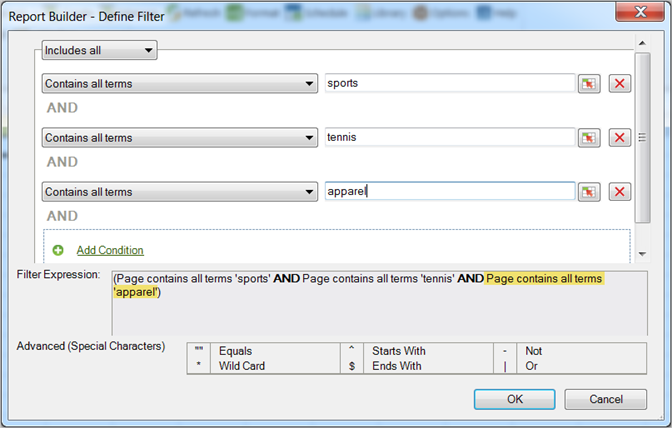

# Filtrage le plus apprécié

{{legacy-arb}}

Classement et filtres conditionnels pouvant être configurés à l’aide d’une logique booléenne et d’expressions de recherche ET/OU.

Les filtres de type « Le plus populaire » sont des filtres d’expression configurés à l’aide d’une logique booléenne avec des conditions ET/OU, tels que [!UICONTROL La page ne contient pas &#x200B;]*`<product name>`*, accompagnés de conditions ou de groupes de conditions comme [!UICONTROL Inclut tout], [!UICONTROL Inclut n’importe quel] ou [!UICONTROL Exclut tout]. Vous pouvez [enregistrer](/help/analyze/legacy-report-builder/layout/c-filter-dimensions/saved-filters.md) ces expressions pour une autre requête dans ce classeur ou dans d’autres classeurs.

**Pour créer un filtre de type « Le plus populaire »**

1. Créez ou modifiez une requête, puis passez au formulaire [!UICONTROL Assistant Requête : Étape 2].

1. Dans la fenêtre [!UICONTROL Assistant Requête : Étape 2], cliquez sur le lien en regard de la dimension dans la grille, puis sélectionnez **[!UICONTROL Filtrer]**.

   

1. Activez l’option [!UICONTROL Le plus populaire] dans le formulaire **[!UICONTROL Sélectionner les pages]**, puis configurez les options suivantes :

   **Classement de départ :** classement de départ d’une dimension. Un classement par défaut de 1 indique l’élément le plus élevé dans la liste des données signalées. Par exemple, pour la dimension [!UICONTROL Page], une marque de départ de 1 indique la page la plus demandée de votre site. Vous pouvez spécifier 10 ou une autre valeur comme cellule de classement de départ, ce qui génère un rapport commençant par 10 comme valeur la plus élevée. Les mesures sont organisées par ordre décroissant, de sorte que les éléments de ligne présentant la plus grande activité soient signalés en premier dans la liste. Si vous avez besoin de plus de 50 000 noms de page dans une requête, mais que vous avez des milliers de pages sur lesquelles générer des rapports, vous pouvez copier la requête et modifier le classement de départ pour récupérer les données appropriées en blocs de 50 000.

   **Nombre d’entrées** : ([!UICONTROL Disposition croisée dynamique] uniquement) définit le nombre d’éléments signalés dans le rapport pour une mesure donnée sur une période déterminée. Certaines mesures peuvent répertorier des centaines d’entrées pour une mesure, tandis que d’autres n’en affichent que quelques-unes. Par exemple, pour la dimension [!UICONTROL Section du site], un nombre d’entrées égal à 25 indique que le rapport affiche les 25 pages les plus visitées.

   Les flèches vous permettent de modifier le [!UICONTROL Classement de départ] et le [!UICONTROL Nombre d’entrées] du premier point de données de la feuille. Par défaut, le [!UICONTROL Classement de départ] est défini sur 1 et le [!UICONTROL Nombre d’entrées] sur 10. Ces valeurs sont ajustables d’un minimum à un maximum de 50 000 pour certaines mesures. Chaque mesure a son propre plafond sur [!UICONTROL Nombre d’entrées]. Aucune valeur négative ou nulle n’est autorisée dans ces champs. Si vous choisissez un [!UICONTROL Classement de départ] 15 et [!UICONTROL Nombre d’entrées] 10, les requêtes de données pour la mesure renvoient les 10 pages les plus visitées, où la première page la plus visitée est le numéro 15 dans la liste pour la période spécifique. Toutes les pages les plus demandées classées 15e à 25e sont répertoriées par ordre décroissant.

   >[!NOTE]
   >
   >L’application de filtres à des requêtes existantes entraîne la modification des données présentées. Supposons que vous ayez mappé les dix premières [!UICONTROL Pages] aux cellules $A$1 à $A$10, avec 1 pour [!UICONTROL Classement de départ] et 10 pour [!UICONTROL Nombre d’entrées]. Si vous modifiez ces valeurs pour afficher 1 pour [!UICONTROL Classement de départ] et seulement 3 pour [!UICONTROL Nombre d’entrées], les données qui remplissaient auparavant les cellules $A$4 à $A$10 n’apparaîtront plus.

1. Pour créer une expression de recherche, cliquez sur **[!UICONTROL Ajouter]**.

1. Dans le formulaire [!UICONTROL Définir un filtre], configurez les conditions adaptées à vos besoins.

   

   L’icône Sélectionner une cellule permet de localiser une condition définie dans la valeur d’une cellule. 

   Le lien **Ajouter une condition** permet d’ajouter une condition à l’expression. Le nombre de conditions qu’il est possible d’ajouter est illimité.

1. Cliquez sur **[!UICONTROL OK]**.

   

1. Dans le formulaire [!UICONTROL Sélectionner les pages], cliquez sur **[!UICONTROL Enregistrer]** pour enregistrer l’expression.
1. Cliquez sur **[!UICONTROL OK]**.
