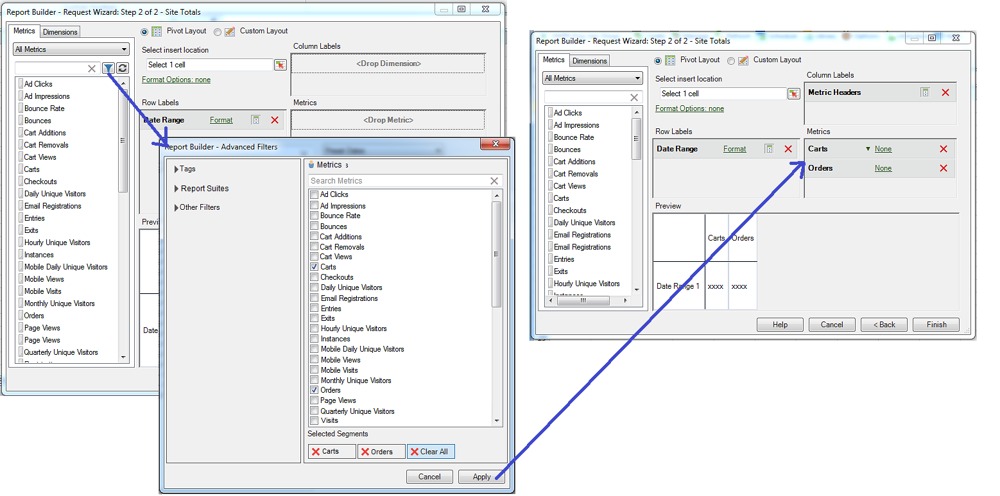

# Mesures calculées

Le Report Builder 5.2 prend en charge les mesures calculées unifiées Adobe Analytics. Entre autres innovations, toutes les mesures calculées sont désormais dotées d’un identifiant global ; elles ne sont plus limitées à une seule suite de rapports.

>[!NOTE]
>
>Il est possible que les classeurs existants pointent vers des demandes avec des identifiants de mesure hérités. Lorsque vous utilisez la version 5.2 du Report Builder, ces identifiants de mesure hérités sont convertis en nouvel identifiant global. Si vous partagez ce classeur avec un utilisateur de la version 5.1 ou antérieure du Report Builder, il ne verra pas les mesures calculées.

Pour en savoir plus sur la manière de créer et de gérer des mesures calculées à l’aide du nouveau créateur et gestionnaire de mesures calculées, reportez-vous au guide des [mesures calculées](https://experienceleague.adobe.com/docs/analytics/components/calculated-metrics/cm-overview.html?lang=fr).

À la deuxième étape de l’Assistant Requête, vous pouvez filtrer et appliquer les mesures calculées.

## Filtrer des mesures calculées {#section_376E986D3E684999A7CDB08E53854159}

**Filtrez** les mesures calculées en cliquant sur l’icône Filtrer : 

La boîte de dialogue Filtres avancés est renseignée avec les mesures standard et calculées.

Les filtres disponibles incluent :

| Nom du filtre | Description |
|---|---|
| Balises | Permet de filtrer les mesures calculées selon des balises spécifiques. Notez que les filtres de type balise utilisent l’opérateur AND. Si vous cochez deux balises, le panneau de droite répertorie les mesures qui ont été marquées avec **les deux** balises. |
| Suites de rapports | Si vous appliquez le filtre « Uniquement le *nom de la suite de rapports* » dans le Créateur de mesures calculées dans [!DNL Adobe Analytics], puis affichez le filtre avancé dans [!DNL Report Builder], le filtre avancé affiche uniquement les mesures calculées correspondant à la suite de rapports sélectionnée. |
| Propriétaires | Permet de filtrer les mesures par propriétaire. Notez que les filtres de type propriétaire utilisent l’opérateur OR. Si vous cochez deux propriétaires, le panneau de droite répertorie les mesures détenues par **n’importe quel** propriétaire. |
| Autres filtres > Approuvés | Affiche toutes les mesures officiellement approuvées. |
| Autres filtres > Favoris | Affiche toutes les mesures que vous avez marquées comme Favoris. |
| Autres filtres > À moi | Affiche toutes les mesures que vous possédez. |
| Autres filtres > Partagés avec moi | Affiche toutes les mesures que d’autres ont partagées avec vous. |

## Application de mesures calculées {#section_DF5CF349460A45FDA4B6E6BB8B52F18E}

Après avoir sélectionné les filtres, cliquez sur **[!UICONTROL Appliquer]** pour les appliquer à votre demande. Les mesures sélectionnées sont maintenant ajoutées à la disposition des rapports.

