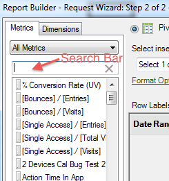

# Ajout de mesures et de dimensions

{{legacy-arb}}

Procédure d’ajout de mesures et de dimensions à une requête.

1. Utilisez le formulaire [!UICONTROL Assistant Requête : étape 1] pour [Créer la requête de données](/help/analyze/legacy-report-builder/data-requests/data-requests.md) puis cliquez sur **[!UICONTROL Suivant]**.
1. Dans le formulaire [!UICONTROL Assistant Requête : étape 2], double-cliquez sur les mesures ou faites-les glisser à l’emplacement souhaité.

   

   Les mesures que vous ajoutez ne sont pas supprimées de l’onglet [!UICONTROL Valeurs de mesure], car vous pouvez les afficher plusieurs fois dans une requête. Vous pouvez, par exemple, afficher le sous-total de la mesure en plus de chaque valeur. Cependant, la liste des mesures disponibles est modifiée chaque fois que vous ajoutez ou supprimez une dimension.

   Vous pouvez uniquement ajouter des mesures à la section de disposition [!UICONTROL Valeurs de mesure]. Les mesures sont ajoutées à la disposition [!UICONTROL Libellé de colonne] sous forme d’[!UICONTROL En-tête de mesure]. Si vous déplacez un [!UICONTROL En-tête de mesure] depuis la [!UICONTROL Disposition de colonne] vers la [!UICONTROL Disposition de ligne], elle est affichée à cet endroit et utilise la mesure sous la forme d’une répartition.

   Une barre de recherche s’affiche sur l’onglet Mesures, juste au-dessus de la liste Mesure.

   

## Instructions

Tenez compte des instructions suivantes lorsque vous ajoutez des mesures et des dimensions.

* Lorsque vous saisissez un terme de recherche, la liste est automatiquement mise à jour afin d’afficher les mesures dont les libellés correspondent au terme de recherche.
* La correspondance ne respecte pas la casse et équivaut à une recherche *contient*.
* Les recherches de mots entiers et d’autres indicateurs de recherche spéciaux (commence par, se termine par, ET, OU, etc.) ne sont pas pris en charge.

Le terme de recherche est effacé si vous quittez l’Assistant Requête lorsque vous cliquez sur [!UICONTROL Terminer] ou [!UICONTROL Annuler], revenez à l’étape 1 de l’Assistant Requête ou modifiez la catégorie de mesure.

Le terme de recherche n’est pas effacé :

* Lorsque vous faites glisser et déposez (ou double-cliquez) un élément de mesure de la liste afin qu’il soit ajouté au panneau Mesures de la disposition du tableau croisé dynamique/disposition personnalisée .
* Lorsque vous supprimez un ou plusieurs éléments de mesure du panneau de mesures Disposition du tableau croisé dynamique/Disposition personnalisée.
* Lorsque vous cliquez sur l’onglet Dimension , puis revenez à l’onglet Mesures .
* Lorsque vous appelez d’autres sous-formulaires (modaux ou non) qui, à la sortie, reviennent à l’étape 2 de l’Assistant Requête. Exemple de ces formulaires :

   * Formulaires de filtre de dimension
   * Formulaires de mise en forme de la plage de sortie
   * Formulaire d’options de format
   * Formulaire Ajouter un texte en préfixe/suffixe
   * Formulaire d’emplacement de la plage de sortie

## Trier une demande par mesure

Vous pouvez éventuellement trier une demande par mesure.

Pour trier une demande par mesure

1. Cliquez sur le libellé de la mesure.
1. Ajoutez des dimensions. Ajoutez des dimensions de la même manière que vous ajoutez des mesures. Voir les étapes 1 et 2 ci-dessus.

   Dans l’onglet [!UICONTROL Dimensions], le système affiche les dimensions qui répartissent ou constituent une classification de tout rapport de base que vous sélectionnez dans [!UICONTROL Assistant Requête : étape 1] et dans la configuration de la suite de rapports. Lorsque vous déposez une dimension dans les grilles de mise en page, elle est supprimée de l’arborescence et la liste des dimensions restantes est recalculée.

   La dimension [!UICONTROL Date] est ajoutée automatiquement. Les dimensions de date disponibles varient en fonction de la granularité sélectionnée dans le formulaire [!UICONTROL Assistant Requête : Étape 1]. Les valeurs valides sont :

   * Heure 
   * Jour
   * Semaine
   * Mois
   * Année
   * Période (si aucune granularité n’est spécifiée)

1. Modifiez les mesures et les dimensions en configurant les [options de format](/help/analyze/legacy-report-builder/layout/t-format-display-headers.md) et les filtres.
1. Cliquez sur **[!UICONTROL Terminer]**.
Dans l’exemple suivant, des dimensions sont en relation avec la mesure [!UICONTROL Page]. La dimension [!UICONTROL Domaine référent] crée un rapport de répartition entre [!UICONTROL Page] et [!UICONTROL Domaine référent]. L’onglet [!UICONTROL Dimension] est mis à jour avec les seules dimensions que vous pouvez ajouter à un rapport de répartition.

   
