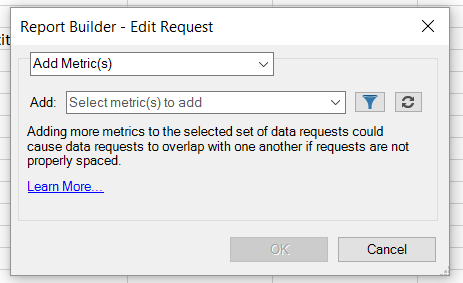

# Modification des mesures de plusieurs demandes

{{legacy-arb}}

Ajouter, supprimer ou remplacer des mesures dans une demande préexistante ou dans un groupe de demandes.

## Ajouter des mesures {#section_3FBDA9668039404895059618D70FCBCD}

Lorsque vous ajoutez des mesures, tenez compte des instructions suivantes :

* Les mesures ne peuvent être ajoutées qu’aux requêtes de disposition de tableau croisé dynamique.
Si certaines des demandes sélectionnées sont de type Disposition personnalisée, les mesures ne peuvent pas être ajoutées. Si la mise en page est personnalisée, Report Builder ne sait pas où placer la nouvelle mesure dans la feuille de calcul.
* Si vous sélectionnez uniquement des requêtes de mise en page personnalisée, l’option **[!UICONTROL Ajouter des mesures]** n’est pas disponible.
* L’ajout de mesures augmente la taille d’une requête et peut entraîner son chevauchement avec une autre requête. Assurez-vous que la demande dispose de suffisamment d’espace pour permettre l’ajout de mesures.
* Si la mesure ajoutée est déjà présente dans l’une des requêtes sélectionnées, elle ne sera pas ajoutée à cette requête.

Pour ajouter une ou plusieurs mesures

1. Sélectionnez une ou plusieurs demandes dans Excel et cliquez avec le bouton droit pour sélectionner **[!UICONTROL Modifier les mesures]**. (Ou cliquez sur **[!UICONTROL Gérer]** > **[!UICONTROL Modifier plusieurs]** > `<choose metric>` > **[!UICONTROL Modifier le groupe]** pour sélectionner le groupe de demandes à modifier.)
1. Sélectionnez **[!UICONTROL Ajouter des mesures]** et sélectionnez les mesures à ajouter.

   

1. Actualisez la demande pour afficher les données réelles. Les données hors ligne s’affichent jusqu’à ce que vous actualisiez les données.

## Remplacer les mesures

Lorsque vous remplacez des mesures, tenez compte des recommandations suivantes :

* Seules 1:1 substitutions sont autorisées. 1:many ou plusieurs:1 ne sont pas autorisés.
* Si la mesure sélectionnée n’est pas présente dans l’une des requêtes sélectionnées, la requête reste inchangée.
* La nouvelle mesure est placée au même emplacement que la mesure remplacée.

   * **Dans une disposition de pivot**, si une demande de disposition de pivot génère la date, la visite, les visiteurs, le chiffre unique quotidien et *visiteurs* est remplacé par *chiffre d&#39;affaires*, la mise à jour de la disposition de la demande sera : date, visite, chiffre d&#39;affaires et nombre unique quotidien.
   * **Dans une disposition personnalisée**, si la mesure *visiteurs* a été générée dans la cellule F11, la disposition de requête mise à jour affichera *revenu* dans la même cellule F11.

* Si une ou plusieurs opérations étaient appliquées à la mesure remplacée (moyenne, texte en préfixe, texte en suffixe, micrographique), celles-ci seront également appliquées à la nouvelle mesure.

Pour remplacer une mesure

1. Sélectionnez une ou plusieurs demandes dans Excel et cliquez avec le bouton droit pour sélectionner **[!UICONTROL Modifier les mesures]**. Vous pouvez également cliquer sur **[!UICONTROL Gérer]** > **[!UICONTROL Modifier le multiple]** > **`<choose metric>`** > **[!UICONTROL Modifier le groupe]** pour sélectionner le groupe de requêtes à modifier.

1. Sélectionnez **[!UICONTROL Remplacer la mesure]**.

   

1. Sélectionnez la mesure à remplacer et la mesure de remplacement.
1. Actualisez la demande. Les données hors ligne s’affichent jusqu’à ce que vous actualisiez les données.

## Supprimer des mesures {#section_D3CD5BAC7670416593B633B2B8423C60}

Lorsque vous supprimez des mesures, tenez compte des instructions suivantes :

* Si l’une des mesures que vous sélectionnez pour suppression n’est pas présente dans l’une des requêtes sélectionnées, la requête reste inchangée.
* Dans une disposition avec pivot, la suppression d’une mesure entraîne le déplacement de la disposition pour les mesures qui se trouvent après la mesure supprimée. Par exemple, si une demande de disposition pivot génère la date, les visites, les visiteurs et l’unicité quotidienne et que vous supprimez *visites*, la disposition mise à jour de la demande affiche : date, visiteurs et unicité quotidienne.

Pour supprimer des mesures

1. Sélectionnez une ou plusieurs demandes dans Excel et cliquez avec le bouton droit pour sélectionner **[!UICONTROL Modifier les mesures]**. Vous pouvez également cliquer sur **[!UICONTROL Gérer]** > **[!UICONTROL Modifier plusieurs]** > **`<choose metric>`** > **[!UICONTROL Modifier le groupe]** pour sélectionner le groupe de requêtes à modifier.

1. Sélectionnez **[!UICONTROL Supprimer des mesures]**.

   

1. Sélectionnez une ou plusieurs mesures à supprimer de la demande.
1. Actualisez la demande. Tant que vous n’avez pas actualisé, les données hors connexion s’affichent.
